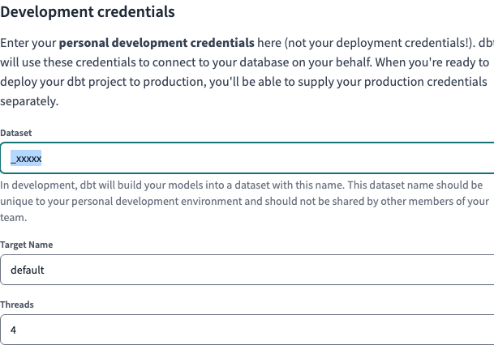
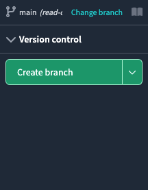

# Welcome to the Teamster contributing guide

Read our [Code of Conduct](CODE_OF_CONDUCT.md) to keep our community approachable and respectable.

In this guide you will get an overview of the contribution workflow from creating a branch, creating
a pull request, reviewing, and merging the pull request.

Here are some resources to help you get started with open source contributions:

- [GitHub flow](https://docs.github.com/en/get-started/quickstart/github-flow)
- [Collaborating with pull requests](https://docs.github.com/en/github/collaborating-with-pull-requests)

## Project structure

All of our source code is located under the `src/` directory.

`teamster/` contains all of our Dagster code, which powers our data orchestration, and `dbt/`
contains all of our dbt SQL, which is organized by
[project](https://docs.getdbt.com/docs/build/projects)

### dbt Projects

`kipptaf` is the home for all CMO-level reporting. This project contains views that aggregate
regional tables as well as data for CMO-specific systems. This is the only project that dbt Cloud is
configured to work with.

`kippnewark`, `kippcamden`, and `kippmiami` contain region-specific configurations that ensure data
is loaded into respective datasets

Miscellaneous projects, such as `powerschool`, `deanslist`, and `iready` contain code for systems
that are used across two or more regions. Keeping them as installable dependencies allows us to
maintain the core code in one place but use it across as many projects as we need.

### Naming conventions

Dig into how we structure the files, folders, and models for our three primary layers in the models
directory, which build on each other:

#### Staging

creating our atoms, our initial modular building blocks, from source data

##### Folder structure

Folder structure is extremely important in dbt. Not only do we need a consistent structure to find
our way around the codebase, as with any software project, but our folder structure is also one of
the key interfaces for understanding the knowledge graph encoded in our project (alongside the DAG
and the data output into our warehouse).

It should reflect how the data flows, step-by-step, from a wide variety of source-conformed models
into fewer, richer business-conformed models.

Subdirectories based on the source system. Our internal transactional database is one system, the
data we get from Stripe's API is another, and lastly the events from our Snowplow instrumentation.
We've found this to be the best grouping for most companies, as source systems tend to share similar
loading methods and properties between tables, and this allows us to operate on those similar sets
easily.

##### File names

Creating a consistent pattern of file naming is crucial in dbt.

File names must be unique and correspond to the name of the model when selected and created in the
warehouse.

We recommend putting as much clear information into the file name as possible, including a prefix
for the layer the model exists in, important grouping information, and specific information about
the entity or transformation in the model.

✅ stg\_[source]\_\_[entity]s.sql - the double underscore between source system and entity helps
visually distinguish the separate parts in the case of a source name having multiple words. Think of
it like an oxford comma, the extra clarity is very much worth the extra punctuation.

#### Intermediate

stacking layers of logic with clear and specific purposes to prepare our staging models to join into
the entities we want

##### Folders

✅ Subdirectories based on business groupings. Much like the staging layer, we’ll house this layer
of models inside their own intermediate subfolder. Unlike the staging layer, here we shift towards
being business-conformed, splitting our models up into subdirectories not by their source system,
but by their area of business concern.

##### File names

✅ int\_[source]\_\_[entity]s\_[verb]s.sql - the variety of transformations that can happen inside
of the intermediate layer makes it harder to dictate strictly how to name them. The best guiding
principle is to think about verbs (e.g. pivoted, aggregated_to_user, joined, fanned_out_by_quantity,
funnel_created, etc.) in the intermediate layer. In our example project, we use an intermediate
model to pivot payments out to the order grain, so we name our model int_payments_pivoted_to_orders.
It’s easy for anybody to quickly understand what’s happening in that model, even if they don’t know
SQL. That clarity is worth the long file name. It’s important to note that we’ve dropped the double
underscores at this layer. In moving towards business-conformed concepts, we no longer need to
separate a system and an entity and simply reference the unified entity if possible. In cases where
you need intermediate models to operate at the source system level (e.g. int_shopify**orders_summed,
int_core**orders_summed which you would later union), you’d preserve the double underscores. Some
people like to separate the entity and verbs with double underscores as well. That’s a matter of
preference, but in our experience, there is often an intrinsic connection between entities and verbs
in this layer that make that difficult to maintain.

#### Marts

bringing together our modular pieces into a wide, rich vision of the entities our organization cares
about

## Account setup

### GitHub

To contribute on GitHub, you must be a member of our
[Data Team](https://github.com/orgs/TEAMSchools/teams/data-team), and your ability to approve and
merge pull requests depends on your membership in one of these subgroups:

- [Analytics Engineers](https://github.com/orgs/TEAMSchools/teams/analytics-engineers)
- [Data Engineers](https://github.com/orgs/TEAMSchools/teams/data-engineers)
- [Admins](https://github.com/orgs/TEAMSchools/teams/admins)

### Google Workspace

To access our BigQuery project and its datasets, you must be a member of our **TEAMster Analysts
KTAF** Google security group.

### dbt Cloud

#### Dataset

When you first login to dbt Cloud, you will be asked to set up **Development credentials**.

dbt will create a development "branch" of the database for every user, and it will name datasets
using a prefix that is unique to you.

By default, this is your username, but please prefix it with an underscore ( `_` ) to avoid
cluttering up our BigQuery navigation. BigQuery will hide any datasets that begin with an underscore
from the left nav.

#### sqlfmt

<!-- adapted from https://docs.getdbt.com/docs/cloud/dbt-cloud-ide/lint-format#format-sql -->

To format our SQL code, we use [sqlfmt](https://sqlfmt.com/), an uncompromising SQL query formatter
that provides one way to format SQL and works with Jinja templating.

To confirm that dbt Cloud is set up to use sqlfmt:

1. Make sure you're on a development branch. Formatting isn't available on main or read-only
   branches.
2. Open a `.sql` file and click on the **Code Quality** tab.
3. Click on the <kbd>&lt;/&gt; Config</kbd> button on the right side of the console.
4. In the code quality tool config pop-up, you have the option to select **sqlfluff** or **sqlfmt**.
5. To format your code, select the `sqlfmt` radio button.
6. Once selected, go to the console section (located below the File editor) and select the
   <kbd>Format</kbd> button.
7. This button auto-formats your code in the File editor. Once you've auto-formatted, you'll see a
   message confirming the outcome.

## Make Changes

### Make changes in dbt Cloud

#### Create a branch

https://docs.getdbt.com/docs/collaborate/git/version-control-basics

#### Make your changes

...

#### Commit your changes

...

### Pull request

When you're finished with the changes, create a **Pull Request** ("PR").

1. On dbt Cloud, click "Create a pull request on GitHub"
2. On the GitHub page that pops up, click "Create pull request"

- Fill the "Ready for review" template so that we can review your PR. This template helps reviewers
  understand your changes as well as the purpose of your pull request.
- Asana
- We may ask for changes to be made before a PR can be merged, either using
  [suggested changes](https://docs.github.com/en/github/collaborating-with-issues-and-pull-requests/incorporating-feedback-in-your-pull-request)
  or pull request comments. You can apply suggested changes directly through the UI. You can make
  any other changes in your fork, then commit them to your branch.
- As you update your PR and apply changes, mark each conversation as
  [resolved](https://docs.github.com/en/github/collaborating-with-issues-and-pull-requests/commenting-on-a-pull-request#resolving-conversations).
- If you run into any merge issues, checkout this
  [git tutorial](https://github.com/skills/resolve-merge-conflicts) to help you resolve merge
  conflicts and other issues.

You should always review your own PR first. For content changes, make sure that you:

- [ ] Confirm that the changes meet the user experience and goals outlined in the content design
      plan (if there is one).
- [ ] Compare your pull request's source changes to staging to confirm that the output matches the
      source and that everything is rendering as expected. This helps spot issues like typos,
      content that doesn't follow the style guide, or content that isn't rendering due to versioning
      problems. Remember that lists and tables can be tricky.
- [ ] Review the content for technical accuracy.
- [ ] Copy-edit the changes for grammar, spelling, and adherence to the
      [style guide](https://github.com/github/docs/blob/main/contributing/content-style-guide.md).
- [ ] If there are any failing checks in your PR, troubleshoot them until they're all passing.

- dbt action
- trunk action, sqlfluff style guide

### Your PR is merged

Congratulations :tada::tada: The GitHub team thanks you :sparkles:.

Once your PR is merged, your contributions will...

- deploy to Dagster
- SQL updates will take effect whenever the next update is triggered. The lag can vary significantly
  depending on the source of the data.
- If you need changes to appear immediately, we can force an update via Dagster. [how to communicate
  that?]
