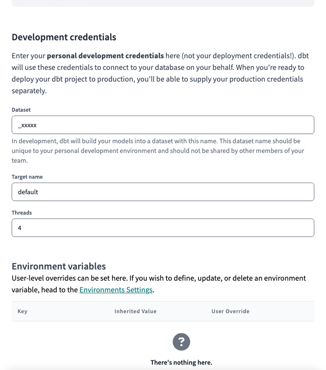
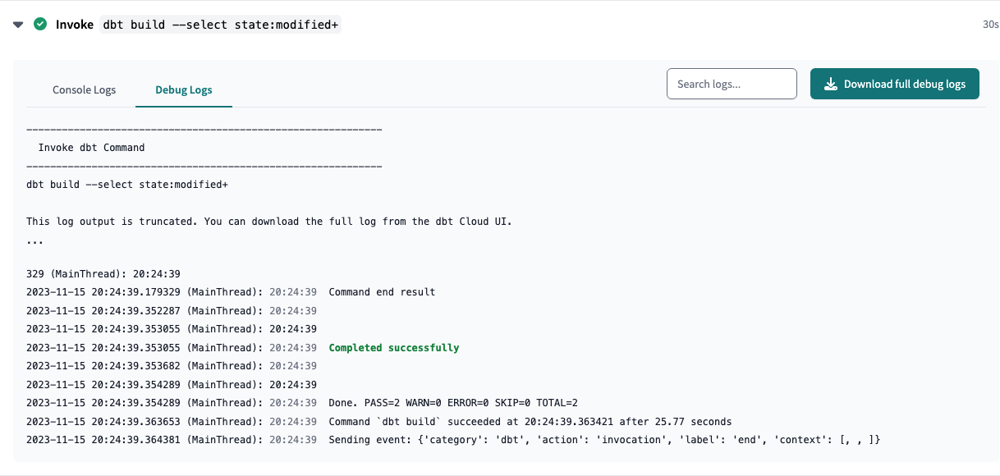

# Welcome to the Teamster contributing guide

Read our [Code of Conduct](CODE_OF_CONDUCT.md) to keep our community approachable and respectable.

In this guide you will get an overview of the contribution workflow from creating a branch, creating
a pull request, reviewing, and merging the pull request.

Here are some resources to help you get started with open source contributions:

- [GitHub flow](https://docs.github.com/en/get-started/quickstart/github-flow)
- [Collaborating with pull requests](https://docs.github.com/en/github/collaborating-with-pull-requests)

## Project structure

All of our source code is located under the `src/` directory.

`src/teamster/` contains all of our Dagster code, which powers our data orchestration.

`src/dbt/` contains all of our dbt SQL, which is organized by
[project](https://docs.getdbt.com/docs/build/projects).

### dbt Projects

`kipptaf` is the homebase for all CMO-level reporting. This project contains views that aggregate
regional tables as well as CMO-specific data. This is the **only** project that dbt Cloud is
configured to work with.

`kippnewark`, `kippcamden`, and `kippmiami` contain region-specific configurations that ensure their
data is loaded into their respective datasets.

Other projects (e.g. `powerschool`, `deanslist`, `iready`) contain code for systems that is used
across multiple regions. Keeping these projects as installable dependencies allows us to maintain
the code in one place and use it across as many projects as needed.

## Account setup

### GitHub

To contribute on GitHub, you must be a member of our
[Data Team](https://github.com/orgs/TEAMSchools/teams/data-team), and your ability to approve and
merge pull requests depends on your membership in one of these subgroups:

- [Analytics Engineers](https://github.com/orgs/TEAMSchools/teams/analytics-engineers)
- [Data Engineers](https://github.com/orgs/TEAMSchools/teams/data-engineers)
- [Admins](https://github.com/orgs/TEAMSchools/teams/admins)

### Google Workspace

To access our BigQuery project and its datasets, you must be a member of our **TEAMster Analysts
KTAF** Google security group.

### dbt Cloud

#### Dataset

When you first login to dbt Cloud, you will be asked to set up **Development credentials**.

dbt will create a development "branch" of the database for every user, and it will name datasets
using a prefix that is unique to you.

By default, this is your username, but please prefix it with an underscore ( `_` ) to avoid
cluttering up our BigQuery navigation. BigQuery will hide any datasets that begin with an underscore
from the left nav.

#### sqlfmt

<!-- adapted from https://docs.getdbt.com/docs/cloud/dbt-cloud-ide/lint-format#format-sql -->

To format our SQL code, we use [sqlfmt](https://sqlfmt.com/), an uncompromising SQL query formatter
that provides one way to format SQL and works with Jinja templating.

To confirm that dbt Cloud is set up to use sqlfmt:

1. Make sure you're on a development branch. Formatting isn't available on main or read-only
   branches.
2. Open a `.sql` file and click on the **Code Quality** tab.
3. Click on the <kbd>&lt;/&gt; Config</kbd> button on the right side of the console.
4. In the code quality tool config pop-up, you have the option to select **sqlfluff** or **sqlfmt**.
5. To format your code, select the `sqlfmt` radio button.
6. Once selected, go to the console section (located below the File editor) and select the
   <kbd>Format</kbd> button.
7. This button auto-formats your code in the File editor. Once you've auto-formatted, you'll see a
   message confirming the outcome.

## Make Changes

### Folder structure & file names

Folder structure is extremely important in dbt. It should reflect how the data flows, step-by-step,
from a wide variety of source-conformed models into fewer, richer business-conformed models.

Creating a consistent pattern of file naming is crucial in dbt. File names **must be unique** and
correspond to the name of the model when selected and created in the warehouse.

We recommend putting as much clear information into the file name as possible, including a prefix
for the layer the model exists in, important grouping information, and specific information about
the entity or transformation in the model.

#### Staging

Modular building blocks from source data

- Folder structure: ...
- File naming convention: `stg_{source}__{entity}.sql`

#### Intermediate

Layers of logic with clear and specific purposes, preparing our staging models to join into the
entities we want

- Folder structure: subdirectories by area of business concern
- File naming: `int_{business concern}__{entity}_{verb}.sql`
  - business concerns:
    - `assessments`
    - `surveys`
    - `people`
  - verbs:
    - `pivot`
    - `unpivot`
    - `rollup`

#### Marts

bringing together our modular pieces into a wide, rich vision of the entities our organization cares
about

### Create a branch

[Version control basics](https://docs.getdbt.com/docs/collaborate/git/version-control-basics)

### Make your changes

...

### Commit your changes

### Pull request

When you're finished making changes, create a
[Pull Request](https://docs.github.com/en/pull-requests) ("PR").

1. On dbt Cloud, click 
2. On the GitHub page that pops up, click "Create pull request"
   
3. Fill in the "Summary & Motivation" section of the pull request template and click "Create pull
   request".

### Resolving merge confilcts

If you run into any merge issues, checkout this
[git tutorial](https://github.com/skills/resolve-merge-conflicts) to help you resolve merge
conflicts and other issues.

## Code review

Once created, [Zapier](https://zapier.com/) will create a task for your pull request in our
[Teamster Asana Project](https://app.asana.com/0/1205971774138578/1205971926225838).

- [x] Find yours by the **title** or **number**
- [x] Update the **due date** and **assignee**
- [x] Ensure that you are a **follower** on the task

GitHub will automatically assign default reviewers based on the location of the code changes
submitted:

| Filepath                           | Default Approvers                                                                    |
| ---------------------------------- | ------------------------------------------------------------------------------------ |
| `src/dbt/kipptaf/models/extracts/` | [Analytics Engineers](https://github.com/orgs/TEAMSchools/teams/analytics-engineers) |
| `src/teamster/`                    | [Data Engineers](https://github.com/orgs/TEAMSchools/teams/data-engineers)           |
| `docs/`                            | [Data Team](https://github.com/orgs/TEAMSchools/teams/data-team)                     |
| All other directories              | [Admins](https://github.com/orgs/TEAMSchools/teams/admins)                           |

A series of automatic checks will then run on the code that you submitted.

### Trunk

[Trunk](https://trunk.io/) is a tool that runs multiple "linters" that check for common errors and
enforces style.

If there

| Language | Linter(s)                                                  |
| -------- | ---------------------------------------------------------- |
| SQL      | [SQLFluff](https://docs.sqlfluff.com/en/stable/rules.html) |
| Python   | [Ruff](https://docs.astral.sh/ruff/rules/)                 |

### dbt Cloud

dbt Cloud will create branch a dataset for your pull request on BigQuery and attempt to build the
modified files.

If there are any issues with your code, the check will fail, and you can find the reasons by:

1. Clicking on the `Details` link
2. Expanding the **Invoke `dbt build ...`** section
3. Selecting **Debug Logs**

- We may ask for changes to be made before a PR can be merged, either using
  [suggested changes](https://docs.github.com/en/github/collaborating-with-issues-and-pull-requests/incorporating-feedback-in-your-pull-request)
  or pull request comments. You can apply suggested changes directly through the UI. You can make
  any other changes in your fork, then commit them to your branch.
- As you update your PR and apply changes, mark each conversation as
  [resolved](https://docs.github.com/en/github/collaborating-with-issues-and-pull-requests/commenting-on-a-pull-request#resolving-conversations).

## Your PR is merged

Congratulations :tada::tada: The GitHub team thanks you :sparkles:.

Once your PR is merged, your contributions will...

- deploy to Dagster
- SQL updates will take effect whenever the next update is triggered. The lag can vary significantly
  depending on the source of the data.
