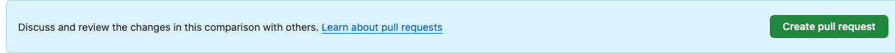
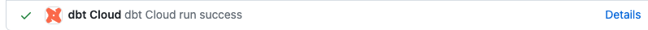
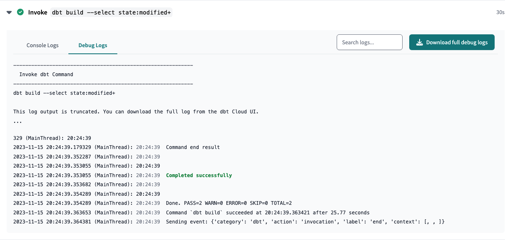

# Welcome to the TEAMster contributing guide

Read our [Code of Conduct](CODE_OF_CONDUCT.md) to keep our community
approachable and respectable.

In this guide you will get an overview of the contribution workflow from
creating a branch, creating a pull request, reviewing, and merging the pull
request.

Here are some resources to help you get started with open source contributions:

- [GitHub flow](https://docs.github.com/en/get-started/quickstart/github-flow)
- [Collaborating with pull requests](https://docs.github.com/en/github/collaborating-with-pull-requests)

## Make Changes

### Create a branch

[Version control basics](https://docs.getdbt.com/docs/collaborate/git/version-control-basics)


### Make your changes

...

### Commit your changes


### Open a pull request

When you're finished making changes, create a
[Pull Request](https://docs.github.com/en/pull-requests) ("PR").

1. On dbt Cloud, click
   
2. On the GitHub page that pops up, click "Create pull request"
   
3. Fill in the pull request template and click "Create pull request".

## Code review

Once created, [Zapier](https://zapier.com/) will create a task for your pull
request in our
[Teamster Asana Project](https://app.asana.com/0/1205971774138578/1205971926225838).

- [x] Find yours by the **title** or **number**
- [x] Update the **due date** and **assignee**
- [x] Ensure that you are a **follower** on the task

GitHub will automatically assign default reviewers based on the location of the
code changes submitted:

| Filepath                           | Default Approvers                                                                    |
| ---------------------------------- | ------------------------------------------------------------------------------------ |
| `src/dbt/kipptaf/models/extracts/` | [Analytics Engineers](https://github.com/orgs/TEAMSchools/teams/analytics-engineers) |
| `src/teamster/`                    | [Data Engineers](https://github.com/orgs/TEAMSchools/teams/data-engineers)           |
| `docs/`                            | [Data Team](https://github.com/orgs/TEAMSchools/teams/data-team)                     |
| All other directories              | [Admins](https://github.com/orgs/TEAMSchools/teams/admins)                           |

A series of automatic checks will then run on the submitted code.

### Resolving merge conflicts

If you run into merge issues, see this
[git tutorial](https://github.com/skills/resolve-merge-conflicts) to help you
resolve merge conflicts and other issues.

### Trunk

[Trunk](https://trunk.io/) runs multiple linters that check for common errors
and enforce style.

| Language | Linter(s)                                                                                   |
| -------- | ------------------------------------------------------------------------------------------- |
| SQL      | [SQLFluff](https://docs.sqlfluff.com/en/stable/rules.html), [sqlfmt](https://sqlfmt.com/)   |
| Python   | [Ruff](https://docs.astral.sh/ruff/rules/), [Pyright](https://github.com/microsoft/pyright) |

Run locally with:

```bash
trunk check
trunk fmt
```

### dbt Cloud

dbt Cloud will create a branch dataset for your pull request on BigQuery and
attempt to build modified files.

If there are any issues with your code, the check will fail, and you can find
the reasons by:

1. Clicking on the `Details` link
2. Expanding the **Invoke `dbt build ...`** section
3. Selecting **Debug Logs**





- We may ask for changes to be made before a PR can be merged, either using
  [suggested changes](https://docs.github.com/en/github/collaborating-with-pull-requests/incorporating-feedback-in-your-pull-request)
  or pull request comments. You can apply suggested changes directly through the
  UI, or make other changes in your branch and commit them.
- As you update your PR and apply changes, mark each conversation as
  [resolved](https://docs.github.com/en/github/collaborating-with-pull-requests/commenting-on-a-pull-request#resolving-conversations).

## Your PR is merged

Congratulations!

Once your PR is merged:

- GitHub triggers a Dagster deployment
- Dagster scans for code changes every 5 minutes
- Dagster launches a run to update all changed models
