# Topline Cascade Dashboard — Model Dependency Diagram

**Report model**: `rpt_tableau__topline_cascade_dashboard`
**dbt project**: `kipptaf`
**Consumer**: Tableau (Topline Cascade Dashboard)

The dashboard reports weekly progress-to-goal across student academic, student
behavior, staff effectiveness, and staffing metrics — aggregated by school,
region, and org — with goals sourced from Google Sheets.

---

## Full Dependency Diagram

```mermaid
flowchart TD
    %% =============================================
    %% SOURCE SYSTEMS
    %% =============================================

    subgraph SIS["Student Information System"]
        PS["PowerSchool\nNewark · Camden · Miami · Paterson"]
    end

    subgraph ASSESS_SRC["Assessment Platforms"]
        IREADY["i-Ready\nDiagnostics & Lessons"]
        ILLUM["Illuminate\nFormative Assessments"]
        STAR["Renaissance STAR\nReading — Miami K–2"]
        PEARSON["Pearson\nNJ State Tests"]
        FLDOE["FLDOE\nFL State Tests"]
    end

    subgraph COL_SRC["College Tracking"]
        ADB["KIPP ADB / Salesforce\nSAT · PSAT · ACT\nCollege Applications"]
    end

    subgraph BEH_SRC["Behavior System"]
        DL["Deanslist\nBehavior · Incentives · House Assignments"]
    end

    subgraph HR_SRC["HR & Staffing Systems"]
        ADP["ADP Workforce Now\nEmployee Records"]
        SMG["SchoolMint Grow\nCoaching & Microgoals"]
        SEAT["Seat Tracker\nStaffing Model"]
    end

    subgraph GS_SRC["Google Sheets"]
        GS_GOALS["Goals & Targets\nsrc_google_sheets__topline__aggregate_goals"]
        GS_ENR_T["Enrollment Targets\nsrc_google_sheets__topline__enrollment_targets"]
        GS_TERMS["Reporting Windows\nsrc_google_sheets__reporting__terms"]
        GS_SCD["SCD Survey Answer Key"]
    end

    subgraph SURVEY_SRC["Student Surveys"]
        SURVEYS["School Community Diagnostic\nStudent Survey"]
    end

    %% =============================================
    %% LAYER 1: Enrollment & Calendar Spine
    %% =============================================

    subgraph SPINE["Enrollment & Calendar Spine"]
        CAL_WK["School Calendar Weeks\nint_powerschool__calendar_week\n4 districts unified via dbt_utils.union_relations"]
        STU_ENR["Cross-District Student Enrollments\nbase_powerschool__student_enrollments\n+ int_deanslist__roster_assignments"]
        STU_ENR_WK["Students × Weeks\nint_extracts__student_enrollments_weeks"]
        STU_ENR_SUBJ_WK["Students × Subjects × Weeks\nint_extracts__student_enrollments_subjects_weeks"]
    end

    PS --> CAL_WK
    PS --> STU_ENR
    DL --> STU_ENR
    STU_ENR --> STU_ENR_WK
    CAL_WK --> STU_ENR_WK
    STU_ENR --> STU_ENR_SUBJ_WK
    CAL_WK --> STU_ENR_SUBJ_WK

    %% =============================================
    %% LAYER 1: Staff Roster Spine
    %% =============================================

    subgraph STAFF_SPINE["Staff Roster Spine"]
        STAFF_HIST["Staff Roster History\nint_people__staff_roster_history\npoint-in-time snapshots"]
        STAFF_ROSTER["Current Staff Roster\nint_people__staff_roster"]
        STAFF_ATTR["Staff Attrition Details\nint_people__staff_attrition_details"]
    end

    ADP --> STAFF_HIST
    PS --> STAFF_ROSTER
    ADP --> STAFF_ROSTER
    STAFF_HIST --> STAFF_ROSTER

    %% =============================================
    %% LAYER 2: Student Weekly Metrics
    %% (one row per student × school × week)
    %% =============================================

    subgraph STU_W["Student Weekly Metrics — int_topline__*_weekly"]
        W_FA["Formative Assessment\nMastery Rate\nIlluminate via int_assessments__response_rollup"]
        W_IR_DX["i-Ready Diagnostic\nProficiency & Stretch Growth"]
        W_DIBELS_PM["DIBELS Progress Monitor\nvia int_iready__diagnostic_results"]
        W_DIBELS_BM["DIBELS Benchmark\nvia int_iready__diagnostic_results"]
        W_IR_LES["i-Ready Lesson\nCompletion"]
        W_GPA_T["Term GPA\nsnapshot_powerschool__gpa_term"]
        W_GPA_C["Cumulative GPA\nsnapshot_powerschool__gpa_cumulative"]
        W_STAR["STAR Reading Benchmark\nstg_renlearn__star — Miami K–2 only"]
        W_STATE["State Test Proficiency\nPearson (NJ) + FLDOE (FL)"]
        W_SAT["SAT / PSAT / ACT Scores\nsnapshot_kippadb__standardized_test_rollup\nHS only"]
        W_SUSP["Year-to-Date Suspensions\nint_deanslist__incidents__penalties"]
        W_DL["Deanslist Incentive Earners\nint_deanslist__behavior_incentive_by_term"]
        W_SCD["School Community Diagnostic\nStudent survey average rating"]
        W_COL["College App & Matriculation\nsnapshot_kippadb__app_rollup\nGrade 12 only"]
    end

    STU_ENR_SUBJ_WK --> W_FA
    ILLUM --> W_FA
    GS_TERMS --> W_FA

    STU_ENR_SUBJ_WK --> W_IR_DX
    IREADY --> W_IR_DX
    GS_TERMS --> W_IR_DX

    STU_ENR_SUBJ_WK --> W_DIBELS_PM
    IREADY --> W_DIBELS_PM

    STU_ENR_SUBJ_WK --> W_DIBELS_BM
    IREADY --> W_DIBELS_BM

    STU_ENR_SUBJ_WK --> W_IR_LES
    IREADY --> W_IR_LES

    STU_ENR_WK --> W_GPA_T
    PS --> W_GPA_T

    STU_ENR_WK --> W_GPA_C
    PS --> W_GPA_C

    STU_ENR_SUBJ_WK --> W_STAR
    STAR --> W_STAR
    GS_TERMS --> W_STAR

    STU_ENR_SUBJ_WK --> W_STATE
    PEARSON --> W_STATE
    FLDOE --> W_STATE
    GS_TERMS --> W_STATE

    STU_ENR_WK --> W_SAT
    ADB --> W_SAT

    STU_ENR_WK --> W_SUSP
    DL --> W_SUSP

    STU_ENR_WK --> W_DL
    DL --> W_DL

    STU_ENR_WK --> W_SCD
    SURVEYS --> W_SCD
    GS_SCD --> W_SCD

    STU_ENR_WK --> W_COL
    ADB --> W_COL

    %% =============================================
    %% LAYER 2: Staff Weekly Metrics
    %% (one row per staff member × school × week)
    %% =============================================

    subgraph STAFF_W["Staff Weekly Metrics — int_topline__*"]
        W_MG["Microgoals Assigned\nint_topline__microgoals_assigned_weekly\nSchoolMint Grow assignments vs roster"]
        W_SR["Staff Retention\nint_topline__staff_retention\nAttrition vs. budgeted headcount"]
        W_SPINE["Staff Calendar Spine\nint_topline__people_spine\nstaff × school weeks"]
    end

    STAFF_HIST --> W_SPINE
    CAL_WK --> W_SPINE

    STAFF_HIST --> W_MG
    SMG --> W_MG
    CAL_WK --> W_MG

    STAFF_ATTR --> W_SR
    CAL_WK --> W_SR

    %% =============================================
    %% LAYER 3: Goals Lookup
    %% =============================================

    AGG_GOALS["Goals & Display Config\nint_google_sheets__topline_aggregate_goals\nstg_google_sheets__topline_aggregate_goals\n+ stg_powerschool__schools"]

    GS_GOALS --> AGG_GOALS
    PS --> AGG_GOALS

    %% =============================================
    %% LAYER 3: Domain Aggregations
    %% (one row per school/region/org × week × indicator)
    %% =============================================

    subgraph DOMAIN_AGG["Domain Aggregations — int_topline__*"]
        AGG_STU["Student Metrics Aggregate\nint_topline__student_metrics\nAll 14 weekly indicators unioned\nrolled up to school × region × org"]
        AGG_RET["Student Retention Aggregate\nint_topline__student_retention_weekly_aggregations\nretention rate vs. goals"]
        AGG_SEATS["Seats Staffed Aggregate\nint_topline__seats_staffed_weekly_aggregations\nSeat Tracker vs. budgeted positions"]
        AGG_STAFF["Staff Metrics Aggregate\nint_topline__staff_metrics\nmicrogoal completion + retention"]
    end

    STU_W --> AGG_STU
    STU_ENR_WK --> AGG_STU
    AGG_GOALS --> AGG_STU

    STU_ENR --> AGG_RET
    W_IR_DX --> AGG_RET
    AGG_GOALS --> AGG_RET

    CAL_WK --> AGG_SEATS
    SEAT --> AGG_SEATS
    AGG_GOALS --> AGG_SEATS

    W_SPINE --> AGG_STAFF
    W_MG --> AGG_STAFF
    W_SR --> AGG_STAFF

    %% =============================================
    %% LAYER 3: Leadership Crosswalk
    %% =============================================

    LEAD["Leadership Hierarchy\nint_people__leadership_crosswalk\nDSO · School Leader · HOS · MDO · MDSO\njoined by powerschool school id"]

    STAFF_ROSTER --> LEAD

    %% =============================================
    %% LAYER 4: Combined Aggregation
    %% =============================================

    DASH_AGG["All Metrics + Goals Combined\nint_topline__dashboard_aggregations\nUnions all domain aggregations\nApplies goal logic, calculates progress-to-goal\nand goal-met flag per indicator × week × school"]

    AGG_STU --> DASH_AGG
    AGG_RET --> DASH_AGG
    AGG_SEATS --> DASH_AGG
    AGG_STAFF --> DASH_AGG
    AGG_GOALS --> DASH_AGG
    GS_ENR_T --> DASH_AGG

    %% =============================================
    %% FINAL REPORT
    %% =============================================

    RPT["rpt_tableau__topline_cascade_dashboard\nTableau: Topline Cascade Dashboard\nAdds leadership names per school\nNormalizes region display names"]

    DASH_AGG --> RPT
    LEAD --> RPT

    %% =============================================
    %% STYLING
    %% =============================================

    classDef source fill:#1a365d,stroke:#2b6cb0,color:#fff
    classDef gsource fill:#7b341e,stroke:#c05621,color:#fff
    classDef spine fill:#1a4731,stroke:#2f855a,color:#fff
    classDef weekly fill:#44337a,stroke:#805ad5,color:#fff
    classDef agg fill:#2d3748,stroke:#718096,color:#fff
    classDef report fill:#742a2a,stroke:#fc8181,color:#fff,font-weight:bold

    class PS,IREADY,ILLUM,STAR,PEARSON,FLDOE,ADB,DL,ADP,SMG,SEAT,SURVEYS source
    class GS_GOALS,GS_ENR_T,GS_TERMS,GS_SCD gsource
    class CAL_WK,STU_ENR,STU_ENR_WK,STU_ENR_SUBJ_WK,STAFF_HIST,STAFF_ROSTER,STAFF_ATTR spine
    class W_FA,W_IR_DX,W_DIBELS_PM,W_DIBELS_BM,W_IR_LES,W_GPA_T,W_GPA_C,W_STAR,W_STATE,W_SAT,W_SUSP,W_DL,W_SCD,W_COL,W_MG,W_SR,W_SPINE weekly
    class AGG_GOALS,AGG_STU,AGG_RET,AGG_SEATS,AGG_STAFF,DASH_AGG,LEAD agg
    class RPT report
```

---

## Source Systems Summary

| System | Data Provided | Models |
|---|---|---|
| **PowerSchool** (4 districts) | Student enrollment, demographics, calendar weeks, GPA snapshots, school master, teacher grade levels | `base_powerschool__student_enrollments`, `int_powerschool__calendar_week`, `snapshot_powerschool__gpa_term/cumulative` |
| **i-Ready** | ELA & Math diagnostic proficiency, stretch growth, DIBELS reading progress, lesson completion | `int_iready__diagnostic_results` |
| **Illuminate** | Formative assessment response data | `int_illuminate__agg_student_responses` via `int_assessments__response_rollup` |
| **Renaissance STAR** | Reading benchmark proficiency (Miami K–2 only) | `stg_renlearn__star` |
| **Pearson** | NJ state test proficiency (NJSLA) | `int_pearson__all_assessments` |
| **FLDOE** | FL state test proficiency — FAST (Miami Gr 3+) | `int_fldoe__all_assessments` |
| **KIPP ADB / Salesforce** | SAT/PSAT/ACT scores, college application & matriculation status | `snapshot_kippadb__standardized_test_rollup`, `snapshot_kippadb__app_rollup` |
| **Deanslist** | Behavior incidents (suspensions), house/roster assignments, quarterly incentive earners | `int_deanslist__incidents__penalties`, `int_deanslist__behavior_incentive_by_term`, `int_deanslist__roster_assignments` |
| **ADP Workforce Now** | Staff HR records, employment history, attrition | `int_people__staff_roster_history`, `int_adp_workforce_now__employee_memberships_by_year` |
| **SchoolMint Grow** | Coaching observation assignments, microgoal assignments | `stg_schoolmint_grow__users`, `stg_schoolmint_grow__assignments` |
| **Seat Tracker** | Budgeted vs. filled teaching positions (staffing model) | `int_seat_tracker__snapshot` |
| **Student Surveys** | School Community Diagnostic student survey responses | `int_surveys__survey_responses` |
| **Google Sheets** | Indicator goals, goal direction, org-level aggregation config, enrollment targets, reporting window definitions | `stg_google_sheets__topline_aggregate_goals`, `stg_google_sheets__topline_enrollment_targets`, `stg_google_sheets__reporting__terms` |

---

## What's Happening Where

### Layer 1 — Enrollment & Calendar Spine
Student enrollment records from PowerSchool (all four districts) are merged
with Deanslist house assignments into a single cross-district enrollment table.
This is then joined to a unified school calendar (also unioned from all four
PowerSchool instances) to produce two week-level grids: one per student × week
(for most metrics) and one per student × subject × week (for assessment
metrics). All downstream weekly models join against these grids to ensure every
enrolled student appears in every week, even when a given metric has no data.

### Layer 2 — Weekly Metric Models
Fourteen student metrics and three staff metrics are calculated separately,
each joining the appropriate spine to an external data source. Each model
produces one row per student (or staff member) × school × week. Key logic:

- **Assessment models** (i-Ready, DIBELS, STAR, state tests, formative) join
  enrollment to the most recent test result that falls within the current
  reporting window (defined in the Google Sheets reporting terms).
- **GPA models** join enrollment to point-in-time GPA snapshots from
  PowerSchool using dbt snapshot validity windows.
- **College models** (SAT/PSAT, matriculation) join to KIPP ADB Salesforce
  snapshots using the same snapshot join pattern, filtered to HS / Grade 12.
- **Behavior models** (suspensions, incentives) join enrollment to Deanslist
  incident and incentive records.
- **Staff models** join a staff calendar spine (roster history × school weeks)
  to SchoolMint Grow coaching data or attrition records.

### Layer 3 — Domain Aggregations
Each metric type is aggregated to three org levels — school, region, and org —
with goals loaded from Google Sheets. Progress-to-goal percentage and a
goal-met flag are calculated for each indicator × week × org-level combination.
Student retention and seats staffed have their own dedicated aggregation models
that apply their own goal logic.

### Layer 4 — Dashboard Aggregation
All domain aggregations are unioned into a single wide table with a consistent
schema (metric type, indicator, org level, goal, actual, progress). Enrollment
targets from Google Sheets are joined in. Leadership names (DSO, HOS, MDO, MDSO)
are looked up from the staff roster by school and joined at the final report
layer.

### Final Report
`rpt_tableau__topline_cascade_dashboard` adds leadership names per school,
normalizes region display names (e.g. "TEAM Academy Charter School" → "Newark"),
and computes the `is_most_recent_complete_week` flag used by Tableau filters.
