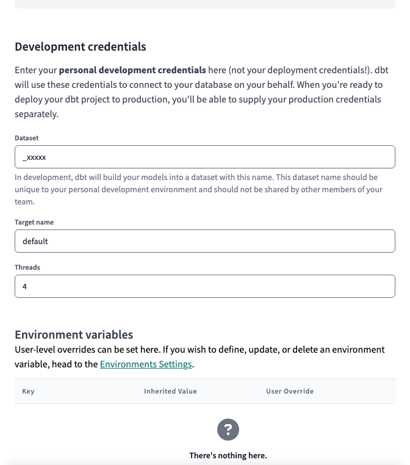

# Getting Started

## Tools

### Collaboration

- Asana
- 1Password
- GitHub

### Analytics Engineering

- dbt Cloud
- BigQuery
- Tableau

### Data Engineering

- Dagster
- dlt
- Airbyte
- VS Code (with
  [Dev Containers](https://code.visualstudio.com/docs/devcontainers/containers))

## Account Setup

### GitHub

To contribute on GitHub, you must be a member of our
[Data Team](https://github.com/orgs/TEAMSchools/teams/data-team), and your
ability to approve and merge pull requests depends on your membership in one of
these subgroups:

- [Analytics Engineers](https://github.com/orgs/TEAMSchools/teams/analytics-engineers)
- [Data Engineers](https://github.com/orgs/TEAMSchools/teams/data-engineers)
- [Admins](https://github.com/orgs/TEAMSchools/teams/admins)

### Google Workspace

To access our BigQuery project and its datasets, you must be a member of our
**TEAMster Analysts KTAF** Google security group.

### dbt Cloud

#### Development dataset

When you first login to dbt Cloud, you will be asked to set up **Development
credentials**.

dbt will create a development "branch" of the database for every user, and it
will name datasets using a prefix that is unique to you.

By default, this is your username, but please prefix it with an underscore (`_`)
to avoid cluttering up our BigQuery navigation. BigQuery will hide any datasets
that begin with an underscore from the left nav.



#### sqlfmt

<!-- adapted from https://docs.getdbt.com/docs/cloud/dbt-cloud-ide/lint-format#format-sql -->

To format SQL code, we use [sqlfmt](https://sqlfmt.com/), an uncompromising SQL
query formatter that works with Jinja templating.

To confirm that dbt Cloud is set up to use sqlfmt:

1. Make sure you're on a development branch. Formatting isn't available on main
   or read-only branches.
2. Open a `.sql` file and click on the **Code Quality** tab.
3. Click on the <kbd>&lt;/&gt; Config</kbd> button on the right side of the
   console.
4. In the code quality tool config pop-up, select the `sqlfmt` radio button.
5. Go to the console section (below the file editor) and click
   <kbd>Format</kbd>.
6. This auto-formats your code in the file editor.

## Local Development

### Prerequisites

Install [uv](https://docs.astral.sh/uv/) for Python package management.

### Setup

```bash
# Install dependencies
uv sync --frozen

# Run Dagster webserver locally
uv run dagster dev

# Validate definitions for a code location
uv run dagster definitions validate -m teamster.code_locations.kipptaf.definitions
```

### dbt

Before running dbt assets locally, prepare and package the dbt project:

```bash
uv run dagster-dbt project prepare-and-package \
  --file src/teamster/code_locations/kipptaf/__init__.py
```

### Linting

[Trunk](https://trunk.io/) is used for linting and formatting:

```bash
trunk check   # lint
trunk fmt     # format
```

| Language | Linter(s)                                                                                   |
| -------- | ------------------------------------------------------------------------------------------- |
| SQL      | [SQLFluff](https://docs.sqlfluff.com/en/stable/rules.html), [sqlfmt](https://sqlfmt.com/)   |
| Python   | [Ruff](https://docs.astral.sh/ruff/rules/), [Pyright](https://github.com/microsoft/pyright) |

### Testing

```bash
# Run all tests
uv run pytest

# Run a single test file
uv run pytest tests/test_dagster_definitions.py

# Run asset-specific tests (require env vars / external connections)
uv run pytest tests/assets/test_assets_dbt.py
```

## Helpful Tools

- [RegExr](https://regexr.com/)
