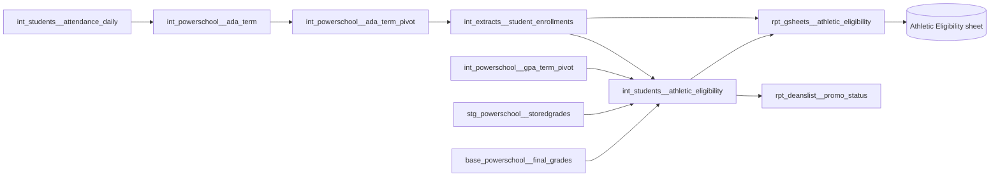

# Athletic Eligibility Tracker Data Model

## What it is

The athletic eligibility tracker is a Google Sheet that tells schools which
students can try out and play each season under the network's student athlete
eligibility policy. It covers students in grade 5 and above in Newark, Camden,
and Paterson. Athletic directors and coordinators use it before try-outs and
during each season, and Teaching and Learning owns the report.

The tracker has no dashboard. dbt computes a status for each student for each
quarter, and the sheet reads the result.

## How it fits together

## Terms

- **ADA** — average daily attendance: days present over days enrolled with
  recorded attendance, up to today.
- **Weighted ADA** — ADA where a tardy counts as 0.67 of a day present.
  Unweighted ADA counts a tardy as a full day.
- **Running ADA** — this year's ADA so far. The enrollment model's `ada` column
  holds it, weighted for high school and unweighted for middle school.
- **Y1 GPA** — the year-to-date GPA across all courses.
- **First-time 9th grader** — a 9th grader who was not in 9th grade last year,
  including a student new to the network.
- **Probation** — eligible to play, with a required intervention (office hours
  for GPA, an attendance contract for ADA).

## Where the data comes from

| Input                             | Source                                          | Owner                               |
| --------------------------------- | ----------------------------------------------- | ----------------------------------- |
| Enrollment, grade level, birthday | PowerSchool, each NJ region                     | School operations                   |
| Attendance                        | PowerSchool daily attendance                    | School operations                   |
| GPA                               | PowerSchool GPA by term                         | Schools, through report cards       |
| Credits                           | PowerSchool stored and Y1 grades                | Schools, through report cards       |
| The eligibility rules             | Student athlete eligibility policy (Google Doc) | Athletics and Teaching and Learning |

The policy doc has a Reporting tab that translates the policy into the statuses
the tracker shows. When the two tabs disagree, the tracker follows the Reporting
tab. Ask the data team for the link.

## What triggers it

Both tracker models are views, so every sheet refresh recomputes the statuses.
They read enrollment, attendance, and GPA tables that rebuild on their own
schedules, so the sheet reflects those tables' last build. Nothing freezes at
the start of a season.

## Inputs

For each student, `int_students__athletic_eligibility` gathers:

- this year's grade level and last year's grade level;
- date of birth, for the age rule;
- last year's credits and weighted Y1 GPA, both from every Y1 stored grade,
  summer school included;
- this year's Q1 term GPA, Y1 GPA at the end of semester 1, and current Y1 GPA;
- this year's running ADA, and Q1 and semester 1 ADA, weighted and unweighted;
- last year's whole-year ADA, weighted and unweighted;
- whether any current Y1 grade is failing as of Q2.

## Steps

Each quarter's status is one `case` statement that stops at the first rule that
matches. Every quarter checks age first: a student who turned 19 before
September 1 is **Ineligible - Age**.

After age, the cut points are the same everywhere:

| GPA         | ADA at or above 90% | ADA below 90%           |
| ----------- | ------------------- | ----------------------- |
| 2.5 or more | Eligible            | Probation - ADA         |
| 2.2 to 2.49 | Probation - GPA     | Probation - ADA and GPA |
| Below 2.2   | Ineligible - GPA    | Ineligible - GPA        |

What changes by quarter is which values are read:

| Quarter            | High school reads                                                                  | Middle school reads                                 |
| ------------------ | ---------------------------------------------------------------------------------- | --------------------------------------------------- |
| Q1 (fall)          | Last year's credits (30 needed), final Y1 GPA, weighted whole-year ADA             | Last year's final Y1 GPA, unweighted whole-year ADA |
| Q2 (winter)        | Last year's credits (30 needed), Q1 term GPA, Q1 weighted ADA                      | Current Y1 GPA, running ADA                         |
| Q3 and Q4 (spring) | No failing Y1 grade as of Q2, Y1 GPA at end of semester 1, semester 1 weighted ADA | Current Y1 GPA, running ADA                         |

Rules that cross those columns:

- In Q1, first-time 9th graders and grade 5 students are Eligible without the
  GPA, ADA, and credit checks.
- In Q2, first-time 9th graders skip the credit check.
- **Ineligible - Credits** means under 30 credits last year in Q1 and Q2, and a
  failing Y1 grade as of Q2 in Q3 and Q4.
- In Q2, any student with a Q1 term GPA below 2.2 is **Ineligible - GPA**,
  middle school included.
- In Q3 and Q4, any student with a current Y1 GPA below 2.2 is **Ineligible -
  GPA**, high school included, even when the semester 1 GPA passes.
- A student with no previous-year GPA or ADA gets no Q1 status. That is any
  student new to the network in grades 6 to 8 or 10 to 12, in every region.

## Outputs

`rpt_gsheets__athletic_eligibility` joins the statuses back to the enrollment
roster on `student_number`, academic year, and region, adds school, name,
cohort, and email, and excludes out-of-district placements. It is the table the
Google Sheet reads, one row per student. It does not carry the running ADA or
the current Y1 GPA, so the sheet cannot show the values behind a middle school
status.

`int_students__athletic_eligibility` is also read by
`rpt_deanslist__promo_status`, which unpivots the four statuses. Unpivot drops
blanks, so a blank status never reaches DeansList. A change to the statuses
changes that extract too.

## Who runs it and when

Nobody runs it by hand. The sheet reads the view through Connected Sheets on the
sheet's own refresh schedule. Teaching and Learning shares the sheet with
schools.

## Supporting models

- `int_extracts__student_enrollments` — the base roster: grade levels,
  birthdays, and every ADA figure.
- `int_powerschool__ada_term_pivot` — ADA by term, semester, and year, read by
  the enrollment model.
- `int_powerschool__gpa_term_pivot` — GPA by term for this year and last year,
  joined on `studentid`, `yearid`, and region.
- `stg_powerschool__storedgrades` — last year's Y1 stored grades, summed for
  credits.
- `base_powerschool__final_grades` — this year's Q2 grades, checked for any
  failing Y1 grade.

## Decisions

- **Miami is excluded.** Its athletics program is outside the tracker's scope.
- **Newark, Camden, and Paterson are included from grade 5 up.**
- **Statuses are live, not frozen at the start of a season.** See the open
  questions.
- **The tracker follows the policy doc's Reporting tab** where it is more
  specific than the policy text.

## Known issues, need to fix

- **The sheet does not follow the data team's two-tier sheet setup.** The
  Connected Sheets source sits directly in the Reports folder, and there is no
  separate IMPORTRANGE source sheet. Users work in the same file that refreshes.
  Fix: create the source sheet under IMPORTRANGE Sources, named after the model,
  point the exposure at it, and have the Reports copy pull from it with
  IMPORTRANGE.
- **High school ADA weighting after Q1 may need to differ by region.** One
  region asked to use unweighted ADA for high school from this year on. Q2
  through Q4 read weighted ADA for every region today. Fix: confirm the final
  answer with Teaching and Learning, then change the Q2 through Q4 high school
  rules for that region.
- **A high school student missing a high school input falls through to the
  middle school rules in Q2 through Q4.** A missing Q1 weighted ADA (Q2), or
  semester 1 ADA or Q2 grades (Q3 and Q4), skips every high school branch, so
  the status comes from the running ADA and current Y1 GPA instead. In Q1 a high
  school student with no credit record gets no status. Fix: end the high school
  branches with an explicit status for missing data.

## Open questions

- **What should a new student's fall status be?** The policy does not say.
- **Should middle school statuses freeze at the start of each season?** The
  policy says "at the start of the season"; the tracker shows live values. This
  has never been agreed as a change, so it stays live until Athletics decides.
- **Do transfer credits reach PowerSchool?** The policy counts credits
  "regardless if the student was in a different school". The tracker only sees
  credits stored as Y1 grades in PowerSchool.

## Yearly upkeep

- Each summer, compare the new policy doc (both tabs) against the rules in
  `int_students__athletic_eligibility`: the credit, GPA, and ADA cut points, the
  age cutoff, and the exemptions.
- The academic year rolls over with the dbt `current_academic_year` variable in
  July. The age cutoff moves with it.
- Confirm with Teaching and Learning which regions use weighted ADA for high
  school.
