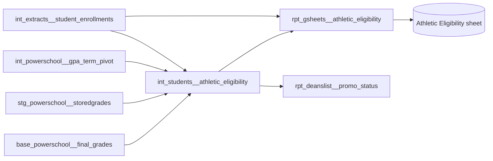

# Athletic Eligibility Tracker Data Model

## What it is

The athletic eligibility tracker is a Google Sheet that tells schools which
students can try out and play each season under the network's student athlete
eligibility policy. It covers students in grade 5 and above in Newark, Camden,
and Paterson. Athletic directors and coordinators use it before try-outs and
during each season, and Teaching and Learning owns the report.

The tracker has no dashboard. dbt computes a status for each student for each
quarter, and the sheet reads the result.

## How it fits together

## Terms

- **ADA** — average daily attendance, as a fraction of days enrolled.
- **Weighted ADA** — ADA where a tardy counts as 0.67 of a day present.
  Unweighted ADA counts a tardy as a full day.
- **Y1 GPA** — the year-to-date GPA across all courses.
- **First-time 9th grader** — a 9th grader who was not in 9th grade last year.
- **Probation** — eligible to play, with a required intervention (office hours
  for GPA, an attendance contract for ADA).

## Where the data comes from

| Input                             | Source                                          | Owner                               |
| --------------------------------- | ----------------------------------------------- | ----------------------------------- |
| Enrollment, grade level, birthday | PowerSchool, each NJ region                     | School operations                   |
| Attendance                        | PowerSchool daily attendance                    | School operations                   |
| GPA                               | PowerSchool GPA by term                         | Schools, through report cards       |
| Credits                           | PowerSchool stored and Y1 grades                | Schools, through report cards       |
| The eligibility rules             | Student athlete eligibility policy (Google Doc) | Athletics and Teaching and Learning |

The policy doc has a Reporting tab that translates the policy into the statuses
the tracker shows. When the two tabs disagree, the tracker follows the Reporting
tab. Ask the data team for the link.

## What triggers it

The tracker is a live view. Every time the sheet refreshes, it reads today's
enrollment, grades, and attendance. Nothing is frozen at the start of a season.

## Inputs

For each student, `int_students__athletic_eligibility` gathers:

- this year's grade level and last year's grade level;
- date of birth, for the age rule;
- last year's credits (from Y1 stored grades) and last year's final Y1 GPA;
- this year's Q1 term GPA, Y1 GPA at the end of semester 1, and current Y1 GPA;
- this year's running ADA, Q1 ADA, and semester 1 ADA, weighted and unweighted;
- last year's whole-year ADA, weighted and unweighted;
- whether any current Y1 grade is failing as of Q2.

## Steps

Each quarter's status is one `case` statement that stops at the first rule that
matches. Every quarter checks age first: a student who turned 19 before
September 1 is **Ineligible - Age**.

After age, the cut points are the same everywhere:

| GPA         | ADA at or above 90% | ADA below 90%           |
| ----------- | ------------------- | ----------------------- |
| 2.5 or more | Eligible            | Probation - ADA         |
| 2.2 to 2.49 | Probation - GPA     | Probation - ADA and GPA |
| Below 2.2   | Ineligible - GPA    | Ineligible - GPA        |

What changes by quarter is which GPA, ADA, and credit values are read:

| Quarter            | High school reads                                                                  | Middle school reads                      |
| ------------------ | ---------------------------------------------------------------------------------- | ---------------------------------------- |
| Q1 (fall)          | Last year's credits (30 needed), final Y1 GPA, whole-year ADA                      | Last year's final Y1 GPA, whole-year ADA |
| Q2 (winter)        | Last year's credits, Q1 term GPA, Q1 weighted ADA                                  | Current Y1 GPA, running ADA              |
| Q3 and Q4 (spring) | No failing Y1 grade as of Q2, Y1 GPA at end of semester 1, semester 1 weighted ADA | Current Y1 GPA, running ADA              |

Exemptions:

- In Q1, first-time 9th graders and grade 5 students are Eligible without the
  GPA, ADA, and credit checks.
- In Q2, first-time 9th graders skip the credit check.
- A high school student under 30 credits is **Ineligible - Credits**.
- In Q2, any student with a Q1 term GPA below 2.2 is **Ineligible - GPA**,
  middle school included, even though the other middle school Q2 rules read the
  current Y1 GPA.

## Outputs

`rpt_gsheets__athletic_eligibility` adds roster details (school, name, cohort,
email) to the statuses and is the table the Google Sheet reads. It holds one row
per student, and excludes out-of-district placements.

`int_students__athletic_eligibility` is also read by
`rpt_deanslist__promo_status`, which unpivots the four statuses. A change to the
statuses changes that extract too.

## Who runs it and when

Nobody runs it by hand. The dbt views update whenever their upstream tables
rebuild, and the sheet reads the view through Connected Sheets on the sheet's
own refresh schedule. Teaching and Learning shares the sheet with schools.

## Supporting models

- `int_extracts__student_enrollments` — the enrollment roster, grade levels,
  birthdays, and every ADA figure, joined on `student_number` and region.
- `int_powerschool__gpa_term_pivot` — GPA by term for this year and last year,
  joined on `studentid`, `yearid`, and region.
- `stg_powerschool__storedgrades` — last year's Y1 stored grades, summed for
  credits.
- `base_powerschool__final_grades` — this year's Q2 grades, checked for any
  failing Y1 grade.

## Decisions

- **Miami is excluded.** Its athletics program is outside the tracker's scope.
- **Paterson middle school is included.** Paterson students new to the network
  have no previous-year GPA or ADA, so they have no fall status; returning
  Paterson students are evaluated like everyone else.
- **Statuses are live.** The middle school policy says "at the start of the
  season", but the tracker has always shown current values, and no change has
  been agreed. See the open questions below.
- **The tracker follows the policy doc's Reporting tab** where it is more
  specific than the policy text.

## Known issues, need to fix

- **The sheet does not follow the data team's two-tier sheet setup.** The
  Connected Sheets source sits directly in the Reports folder, and there is no
  separate IMPORTRANGE source sheet. Users work in the same file that refreshes.
  Fix: create the source sheet under IMPORTRANGE Sources, named after the model,
  point the exposure at it, and have the Reports copy pull from it with
  IMPORTRANGE.
- **High school ADA weighting after Q1 may need to differ by region.** One
  region asked to use unweighted ADA for high school from this year on. Q2
  through Q4 read weighted ADA for every region today. Fix: confirm the final
  answer with Teaching and Learning, then change the Q2 through Q4 high school
  rules for that region.
- **A high school student missing a high school input falls through to the
  middle school rules.** If, for example, Q1 weighted ADA is missing, the Q2
  `case` reaches the middle school branches, which read the running ADA and the
  current Y1 GPA instead. Fix: end the high school branches with an explicit
  status for missing data.

## Open questions

- **What should a new student's fall status be?** A student with no
  previous-year GPA or ADA has a blank Q1 status. The policy does not say.
- **Should middle school statuses freeze at the start of each season?** The
  policy says "at the start of the season"; the tracker shows live values. This
  has never been agreed as a change, so it stays live until Athletics decides.
- **Do transfer credits reach PowerSchool?** The policy counts credits
  "regardless if the student was in a different school". The tracker only sees
  credits stored as Y1 grades in PowerSchool.

## Yearly upkeep

- Each summer, compare the new policy doc (both tabs) against the rules in
  `int_students__athletic_eligibility`: the credit, GPA, and ADA cut points, the
  age cutoff, and the exemptions.
- The academic year rolls over with the dbt `current_academic_year` variable in
  July. The age cutoff moves with it.
- Confirm with Teaching and Learning which regions use weighted ADA for high
  school.
