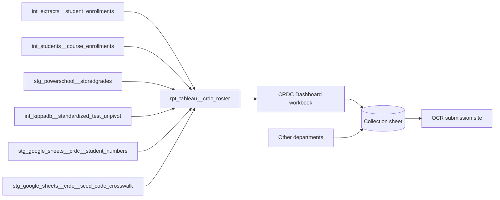

# CRDC Data Model

!!! tip "Claude Code skill available" The `crdc` skill in `.claude/skills/crdc/`
is the step-by-step runbook for each cycle: kickoff, the collection sheet,
running the model and workbook, entering data on the OCR site, and rolling the
code over. This page explains what the pieces are and why they work the way they
do.

## What it is

The Civil Rights Data Collection (CRDC) is a federal survey run by the U.S.
Department of Education's Office for Civil Rights (OCR). Every public school
district that receives federal funds must answer it. It runs every two years,
and each submission reports the previous school year: the submission that opens
in fall 2026 reports SY2025-26. The questions cover enrollment, course access,
test taking, retention, discipline, harassment or bullying, restraint and
seclusion, staffing, and internet access, broken down by race, sex, English
learner status, and disability.

All of this data becomes public record. OCR publishes it by school and district,
so every number we enter is a number anyone can look up.

The data team runs KTAF's submission. It collects answers from other
departments, computes the student counts from the warehouse, and types the final
numbers into OCR's submission website by hand. Owner: the data team, with
Anthony Walters as owner.

## How it fits together



The model produces student-level rows. The Tableau workbook counts them into the
same breakdowns the OCR form asks for. The counts go into the collection sheet
next to the answers other departments supply, and the data team enters the
sheet's numbers on the OCR site.

## Terms

- **CRDC cycle** — one submission, named for the school year it reports
  ("SY2025-26"). It runs in the fall and winter after that year ends.
- **Submission year** — the school year being reported. In dbt it is
  `current_academic_year - 1` (academic year 2025 for SY2025-26).
- **Reference period** — the window a question counts over. There are three:
  - **Fall snapshot**: one day in early October of the submission year.
  - **School year**: first day to last day of school.
  - **School year + summer**: first day of school up to the day before the next
    school year starts.
- **LEA form and school form** — OCR asks some questions once per district (the
  LEA form) and the rest once per school (the school form). The collection sheet
  marks these as `DF` (district form) and `SF` (school form) tabs.
- **Question section** — OCR's code for a question, such as `ENRL`, `COUR-7`, or
  `ARRS-1`. The model tags each row with one.
- **SCED code** — the federal course code (subject area plus course number) that
  PowerSchool stores on each course. The crosswalk maps it to OCR's course
  groups.
- **Quality flag** — a warning the OCR site raises when a value looks unlikely,
  for example "values are extremely high compared to LEAs with similar
  characteristics". Each flag needs either a correction or a written reason.
- **Collection sheet** — the internal Google Sheet, one per cycle, laid out like
  the OCR form, where every answer is gathered before entry.
- **Kickoff doc** — the internal Google Doc, one per cycle, that names owners,
  deadlines, and reference period dates.

## Where the data comes from

| Input                                                 | Source                                                    | Owner                                |
| ----------------------------------------------------- | --------------------------------------------------------- | ------------------------------------ |
| Enrollment, demographics, IEP, 504, EL, retention     | PowerSchool, through `int_extracts__student_enrollments`  | School operations                    |
| Course enrollments and SCED codes                     | PowerSchool, through `int_students__course_enrollments`   | Schools and the registrar function   |
| Y1 grades and credit recovery courses                 | PowerSchool stored grades                                 | Schools, through report cards        |
| SAT and ACT participation                             | KIPP Forward's Salesforce, through the test unpivot model | KIPP Forward                         |
| Students tagged for distance ed, athletics, arrests   | CRDC Google Sheet, `src_crdc__student_numbers` tab        | The data team, from department lists |
| SCED to OCR course group crosswalk                    | CRDC Google Sheet, `src_crdc__sced_code_crosswalk` tab    | The data team                        |
| Staffing, discipline, harassment, restraint, internet | Collection sheet, entered by each department (not in dbt) | See the owner table under Steps      |

Ask the data team for the sheet links.

## What triggers it

OCR announces each cycle on its community site and emails each district's CRDC
contact when the submission system opens. For SY2025-26, OMB approved the form
on 2026-07-20, and OCR expects the system to open in fall 2026, possibly as late
as December 2026. The data team starts the kickoff as soon as the form is final.

## Inputs

- OCR's list of data elements and its form for the cycle, from
  crdc.communities.ed.gov.
- The kickoff doc and collection sheet from the last cycle, kept in the CRDC
  folder on the shared drive, one subfolder per cycle.
- `rpt_tableau__crdc_roster` and the CRDC Dashboard workbook.
- Department answers entered into the collection sheet.

## Steps

### 1. Kickoff doc

The data team copies the last cycle's kickoff doc and updates it. It holds:

- what the CRDC is and that the data becomes public record;
- the reference period dates for each region (fall snapshot date, first and last
  day of school, the day before next year starts);
- the owner table, by team and domain;
- milestones: a date to flag data gaps, a "panic deadline" after which a missing
  answer is escalated, the internal deadline, and the official deadline;
- items that need extra review before entry: law enforcement referrals, arrests,
  physical restraint, and harassment or bullying data.

Owners for SY2025-26, by role:

| Domain                                         | Owner role                            |
| ---------------------------------------------- | ------------------------------------- |
| Academic data (enrollment, courses, tests)     | Data team lead                        |
| Distance education, dual enrollment, athletics | Teaching and Learning director        |
| Special education and English learners         | Special education managing director   |
| Staffing (teachers, FTE, security staff)       | Data team senior analyst for talent   |
| Internet access and devices                    | Technology managing director          |
| Paterson                                       | Operations managing director (likely) |
| Civil rights compliance                        | Open question                         |
| Student discipline                             | Open question                         |

### 2. Collection sheet

The data team copies the last cycle's collection sheet. It has a Home tab with
instructions and a percent-complete tracker per region, then one tab per OCR
section. Every tab has the same columns: section code, subsection, description,
OCR's wording of the question, reference period, one value column per region,
and the subject matter expert (SME) responsible. Tabs that drew quality flags
last cycle also have an audit reason column and a correction reason column.

| Form   | Tabs                                                                                           | Filled by                                    |
| ------ | ---------------------------------------------------------------------------------------------- | -------------------------------------------- |
| LEA    | SSPR (enrollment count), CRCO (civil rights coordinator), HIBD (harassment policy), DSED, HSEE | Data team, compliance, Teaching and Learning |
| School | SCHR and DIND (school characteristics), PENR, ENRL, COUR, APIB, SAT/ACT, RETN                  | Data team, from the workbook                 |
| School | ATHL (athletics)                                                                               | Teaching and Learning, plus the data team    |
| School | STAF (teachers), SECR (security staff)                                                         | Talent                                       |
| School | DISC (discipline), ARRS (referrals and arrests), OFFN (offenses), HIBS (harassment), RSTR      | Discipline and student support owners        |
| School | INET (internet access and devices)                                                             | Technology                                   |

A value cell holding several numbers separated by commas follows the OCR form's
order of breakdowns (for example seven race categories), so it can be typed
straight across. The ARRS raw-data tab lists the incidents behind the arrest
counts at student level, so the sheet is restricted to the people working the
collection.

### 3. Queries and workbook

When `current_academic_year` is the year after the submission year, the model
already points at the right year; no code change is needed for the year itself.
The data team:

1. tags students in the `src_crdc__student_numbers` tab for the sections the
   warehouse cannot derive (distance education, athletics, arrests);
2. checks the SCED crosswalk covers every course code offered that year;
3. refreshes the CRDC Dashboard workbook, which is laid out like the OCR form;
4. copies each count into the collection sheet.

### 4. Entry on the OCR site

The data team enters every value by hand, form by form and school by school. The
OCR site checks entries as they go and raises quality flags. For each flag the
team either fixes the value or records why it is correct; last cycle's answers
sit in the collection sheet's audit and correction columns. After every flag is
cleared, the district's CRDC contact certifies the submission.

## Outputs

- Numbers on OCR's site, certified by each district, published later by OCR.
- The filled collection sheet and kickoff doc, kept in the cycle's subfolder as
  the record of what was submitted and why.

## Who runs it and when

The data team, every two years, from the fall after the submission year until
the official deadline (for SY2023-24 the internal deadline was mid-February 2025
and the official deadline early March 2025). Other departments fill their tabs
between kickoff and the gap deadline.

### Regions

Camden, Newark, and Paterson each file as a separate district, and each reports
all of its schools as one school. Paterson files for the first time in the
SY2025-26 cycle; the model already includes it. Miami files its own CRDC
independently and is outside this process: every branch of the model excludes
it.

## The model: `rpt_tableau__crdc_roster`

!!! warning "Refresh only after this change is live" Until the computed fall
snapshot deploys, prod still runs the old hardcoded 2023 snapshot date. Sections
gated on the snapshot then read empty for the current submission year. Refresh
the workbook only after the change is live in prod.

One row per student per question section, and per course for the course
sections. It is a view in `kipptaf_tableau`. Every branch reads the submission
year (`current_academic_year - 1`) except retention, which is recorded in
PowerSchool the following year and so reads `current_academic_year`.

### Manual-entry tags

Students tagged on the student-numbers tab reach the output through their own
branch, joined on student number, so a student tagged to two sections appears
once per tag. `ENRL` and `EXAM-1` have one row per student. The course sections
have one row per qualifying course, so a student in two qualifying courses
appears twice in that section. Course-section counts in the workbook should
count distinct students.

### Fall snapshot rule

The model computes the fall snapshot date at the top: 1 October of the
submission year, moved to the following Monday when 1 October is a Saturday or
Sunday. For SY2025-26 that is 1 October 2025, a Wednesday. Course rows use it
for `is_oct_01_course` (the student was in the course on that day). Confirm the
rule against OCR's definition each cycle. For example, when 1 October is a
Sunday, the snapshot is Monday 2 October.

Student rows use `is_enrolled_oct01` from the enrollment model instead, which is
always the literal 1 October. See _Known issues_.

### What each branch computes

| Section                                  | Rows                                                                                                     | Reference period used                                  |
| ---------------------------------------- | -------------------------------------------------------------------------------------------------------- | ------------------------------------------------------ |
| `ENRL`                                   | Every student enrolled on 1 October, with demographics, IEP, 504, EL, and retention flags                | Fall snapshot                                          |
| `DSED-2`, `ATHL-3`, `ARRS-1` to `ARRS-6` | Students tagged in the student-numbers tab                                                               | Set by whoever tags them                               |
| `PENR-4`                                 | Grades 9-12 in a dual enrollment course (name ends `(DE)`, not AP) on the snapshot date                  | Fall snapshot                                          |
| `PENR-6`                                 | Grades 9-12 in a credit recovery course (name ends `(CR)`, taken at summer school)                       | School year + summer                                   |
| `COUR`                                   | Grades 7-8 in a middle school Algebra I course (SCED `52052` or `02052`), with pass or fail              | Any enrollment in the school year (no snapshot filter) |
| `COUR-7`                                 | Grades 9-12 in Algebra I, Geometry, Algebra II, advanced math, or calculus, excluding dual enrollment    | Any enrollment in the school year (no snapshot filter) |
| `COUR-14`, `COUR-18`, `COUR-20`          | Grades 9-12 enrolled on the snapshot date in biology, chemistry, physics; computer science; data science | Fall snapshot                                          |
| `APIB-4`                                 | Grades 9-12 enrolled on the snapshot date in an AP course that has an OCR AP group                       | Fall snapshot                                          |
| `EXAM-1`                                 | Grades 9-12 with an SAT total or ACT composite score in the submission year                              | School year + summer                                   |

Two derived values do most of the work:

- `crdc_gender` maps PowerSchool `F`, `M`, and `X` to Female, Male, and
  Nonbinary. `crdc_demographic` maps the ethnicity code to OCR's seven race and
  ethnicity categories.
- `iep_only`, `iep_and_c504`, and `c504_only` split disability status the way
  the OCR form does. `lep_parent_refusal` marks EL students whose families
  declined services.

AP courses are matched two ways: PowerSchool's AP flag and the crosswalk's
`ap_tag`. When they disagree (`ap_tag_mismatch`), the row still counts if the
crosswalk gives it an OCR AP group, so a course OCR does not recognize as AP
stays out.

## The 2025-26 changes

From OCR's "2025-26 CRDC General Overview, Changes, and List of Data Elements"
(version 1, 2026-07-20). Most 2023-24 elements continue.

New and optional:

- instruction type (in-person, remote, or both), remote instruction setting, and
  the share of students who received remote instruction;
- students served in non-LEA facilities, including restraint and seclusion of
  those students (LEA form);
- whether the school has a threat assessment team, and threat assessment
  referrals for preschool and K-12 students with and without disabilities;
- FTE teachers certified in bilingual education.

Removed:

- the nonbinary category from enrollment, IDEA, Section 504, EL, EL program, and
  every discipline count;
- COVID-related remote instruction items;
- harassment or bullying allegations on the basis of gender identity, and the
  LEA's gender identity harassment policy and its web link.

What it means here: the new optional items have no source in the warehouse and
would come through the collection sheet if KTAF answers them. The nonbinary
removal affects the model directly; see the open decision below. The collection
sheet's NBIN tab (does the LEA record any students as nonbinary) and the gender
identity rows on the harassment tabs should go away; confirm against the form.

## Supporting models

- `int_extracts__student_enrollments` — one row per student per year per
  enrollment; supplies demographics, program flags, `is_enrolled_oct01`, and
  retention. Shared with most student dashboards.
- `int_students__course_enrollments` — course sections with SCED subject area
  and course id. Shared.
- `stg_powerschool__storedgrades` — Y1 grades for passing, and the only source
  of summer credit recovery courses. Shared.
- `int_kippadb__standardized_test_unpivot` — SAT and ACT scores by Salesforce
  contact. Shared.
- `stg_google_sheets__crdc__student_numbers` and
  `stg_google_sheets__crdc__sced_code_crosswalk` — pass-throughs of the two
  sheet tabs below. Read only by this model.

## Inputs to maintain

- `src_crdc__student_numbers` — one row per student per question section the
  warehouse cannot derive. Rebuilt each cycle from department lists. Holds
  student numbers, so it is PII.
- `src_crdc__sced_code_crosswalk` — one row per SCED code, with the OCR course
  group, subject group, AP group, and AP tag. Add any new course code before
  running the workbook.

## Decisions

- Region counts, not school counts. Each region reports as one school, so the
  workbook sums across schools within a region.
- Previous year, computed in the SQL. Rolling `current_academic_year` each July
  is enough to point the model at the right year; there is no separate CRDC year
  variable.
- Student-level rows, counted in Tableau. The model keeps one row per student
  and section so a count that looks wrong can be traced to students before it is
  entered.
- Hand entry. The team types each value so it is checked against OCR's flags as
  it goes in. Whether a file upload would be faster has not been tested.

## Known issues, need to fix

Every query below returns aggregates only.

1. **The student-numbers tab has a duplicate key.** A student number and section
   pair appears more than once. The tab's uniqueness test on those two columns
   runs at warn. Remove the repeat in the sheet, then raise the test to error.

   ```sql
   select count(*) as duplicate_keys,
   from
       (
           select student_number, crdc_question_section,
           from
               `teamster-332318`.kipptaf_google_sheets.stg_google_sheets__crdc__student_numbers
           group by student_number, crdc_question_section
           having count(*) > 1
       )
   ```

2. **The roster has no uniqueness test.** The grain is student by section by
   course, and nothing in the output names the course except the nullable
   `sections_dcid`. The query below finds repeats in two branches. In `PENR-6`
   they are students with more than one credit recovery course, because that
   branch has no `sections_dcid`. In `COUR-7`, some students repeat within the
   same section; see issue 5 for the likely cause.

   ```sql
   select crdc_question_section, count(*) as repeated_keys,
   from
       (
           select student_number, crdc_question_section, sections_dcid,
           from `teamster-332318`.kipptaf_tableau.rpt_tableau__crdc_roster
           group by student_number, crdc_question_section, sections_dcid
           having count(*) > 1
       )
   group by crdc_question_section
   ```

3. **Two fall snapshot dates.** Course rows use the weekend-shifted date;
   student rows use `is_enrolled_oct01`, always 1 October. They agree for
   SY2025-26 (a Wednesday). In a cycle where 1 October falls on a weekend,
   `ENRL` and the course sections would count different days. The student flag
   is set in
   `src/dbt/powerschool/models/sis/intermediate/int_powerschool__student_enrollment_union.sql`
   as `date(academic_year, 10, 1) between entrydate and exitdate` (the kipptaf
   model of that name only unions the regions).
   `base_powerschool__student_enrollments` then takes the max over the year, so
   the flag means "any enrollment stint that year covered 1 October".
4. **Course branches disagree on filters and joins.** `COUR` (middle school
   Algebra I) and `COUR-7` (high school math) have no `is_enrolled_oct01` filter
   and no `is_oct_01_course` filter, so they count anyone enrolled in the course
   at any point in the year. `passed_course` is
   `if(grade like 'F%', false, true)`, which returns true when the grade is
   null, so a course with no Y1 grade counts as passed in every course branch.
   `PENR-6` joins on `studentid` and source project, while the other course
   branches join on `schoolid` and `student_number`. Check all of these against
   OCR's definitions at the next rollover.
5. **Dropped enrollments are never filtered.** The course branches select
   `is_dropped_course` and `is_dropped_section` but never filter on them, so a
   student who dropped a course still counts in it. The repo convention is to
   filter `is_dropped_section` first when reading course enrollments. This is
   the likely cause of the `COUR-7` repeats in issue 2: the repeated keys differ
   on `is_last_day_course`, which points to several course-enrollment rows for
   one section.

### Open questions

- **Who leads compliance?** The civil rights coordinator item, the harassment
  policy item, and sign-off on the discipline and restraint data need an owner.
  Question for the data team lead.
- **Who owns student discipline?** DISC, ARRS, OFFN, and HIBS had school-level
  experts last cycle; nobody is named for SY2025-26. Question for the data team
  lead.
- **How do we get access to the Paterson instance of the CRDC submission
  system?** Paterson is its own district in OCR's system and needs its own
  login. The model already includes Paterson.
- **How do we report nonbinary students?** OCR removed the nonbinary category
  for SY2025-26, and KTAF has students recorded as `X`. The model still labels
  them Nonbinary, and the OCR form has no column for them. Decision for the data
  team lead and compliance: how these students are counted, and then a change to
  `crdc_gender` to match.
- **Is there a published workbook?** The known copy of the CRDC Dashboard
  workbook is a `.twb` file in the CRDC folder on the shared drive. Nobody has
  confirmed whether a copy is published on Tableau Server.
- **Which summer do `PENR-6` rows cover?** The branch reads "KIPP Summer School"
  credit recovery grades stored under the submission year. Nobody has confirmed
  whether that is the summer before the submission year or the summer after it.
  The answer decides whether the "school year + summer" period is applied
  correctly.

## Good to implement next cycle

An unfinished proposal from an earlier cycle suggested collecting some sections
every year instead of scrambling every other fall: a yearly Google Form per
section, landing in BigQuery, feeding a Tableau view, with a dashboard tracking
which schools have answered. Compared with the SY2025-26 elements, these parts
still fit:

- **Harassment or bullying (HIBS).** Still collected, by sex, race, and
  disability. Drop the gender identity items from any form: OCR removed them.
- **Restraint and seclusion (RSTR).** Still collected for IDEA and non-IDEA
  students, and now also for students served in non-LEA facilities. A yearly
  form would catch the new items too.
- **Internet access and devices (INET).** Fiber connection, Wi-Fi in every
  classroom, and take-home and bring-your-own device policies continue. These
  change rarely, so a yearly confirmation is enough.
- **A completion tracker.** One view of which owner has filled which tab would
  replace the Home tab's manual percent-complete count.

The proposal's optional file upload to OCR is not worth building until the team
decides to stop entering by hand. The new optional threat assessment items would
fit the same yearly form if KTAF chooses to answer them.

## Yearly upkeep

Between cycles, nothing runs. At each cycle:

1. Read OCR's changes document and map each changed element to the model and the
   collection sheet.
2. Confirm the fall snapshot rule against OCR's definition.
3. Rebuild the student-numbers tab and extend the SCED crosswalk.
4. Copy the kickoff doc and collection sheet into a new cycle subfolder, and add
   a value column for every district that files (Paterson from SY2025-26).
