# DIBELS Dashboard Data Model

Reference document for `rpt_tableau__dibels_dashboard` — the Tableau extract
that powers the DIBELS benchmark and progress monitoring dashboard.

## What is DIBELS?

DIBELS 8 (Dynamic Indicators of Basic Early Literacy Skills) is a literacy
assessment created by the University of Oregon and administered through Amplify
mCLASS. KIPP TAF uses it to assess literacy knowledge and growth for students in
grades K–8.

Reference:
[DIBELS at the University of Oregon](https://dibels.uoregon.edu/about-dibels)

## Assessment types

### Benchmark (BM)

Three administrations per year: **BOY** (Beginning of Year), **MOY** (Middle of
Year), and **EOY** (End of Year). These are point-in-time snapshots that track
literacy growth across administrations within a year and across years.

### Progress Monitoring (PM)

Shorter, more frequent assessments administered during two windows:

- **BOY→MOY** — between the BOY and MOY benchmark administrations
- **MOY→EOY** — between the MOY and EOY benchmark administrations

PM is primarily administered to students who scored **Below Benchmark** or
**Well Below Benchmark** on the composite score of the preceding benchmark.
Other students may take PM, but only the probe-eligible population (Below/Well
Below composite) is tracked for growth reporting.

PM was first implemented in AY 2023–2024. The testing strategy and supporting
data model have evolved each year since.

## Current data model (AY 2023–2026)

Lineage diagram for `rpt_tableau__dibels_dashboard`:

```mermaid
flowchart TD
    %% ── Sources ───────────────────────────────────────────────────────────────
    subgraph SRC ["Sources"]
        direction TB
        src_amp["Amplify\ndds__data_farming_unpivot"]
        src_gs_exp["Google Sheets\ndibels__expected_assessments"]
        src_gs_bm["Google Sheets\ndibels__bm_goals"]
        src_gs_pm["Google Sheets\ndibels__pm_goals"]
        src_gs_long["Google Sheets\ndibels__goals_long"]
        src_gs_terms["Google Sheets\nreporting__terms"]
        src_gs_xwalk["Google Sheets\nassessments__course_subject_crosswalk"]
        src_ps_districts["PowerSchool\n(kippnewark / kippcamden\n/ kippmiami / kipppaterson)"]
        src_ps_spenroll["PowerSchool\nspenrollments"]
        src_ps_terms["PowerSchool\nterms"]
        src_ps_schools["PowerSchool\nschools"]
        src_ps_cal["PowerSchool\ncalendar_day"]
        src_ps_nj_crs["PowerSchool\ns_nj_crs_x"]
        src_ps_nj_stu["PowerSchool\ns_nj_stu_x"]
    end

    %% ── Staging ───────────────────────────────────────────────────────────────
    subgraph STG ["Staging"]
        direction TB
        stg_exp["stg_google_sheets__\ndibels_expected_assessments"]
        stg_bm["stg_google_sheets__\ndibels_bm_goals"]
        stg_pm["stg_google_sheets__\ndibels_pm_goals"]
        stg_long["stg_google_sheets__\ndibels_goals_long"]
        stg_terms["stg_google_sheets__\nreporting__terms"]
        stg_ps_terms["stg_powerschool__terms"]
        stg_schools["stg_powerschool__schools"]
        stg_cal["stg_powerschool__calendar_day"]
        stg_nj_crs["stg_powerschool__s_nj_crs_x"]
    end

    %% ── Base ──────────────────────────────────────────────────────────────────
    subgraph BASE ["Base"]
        base_ce["base_powerschool__\ncourse_enrollments"]
    end

    %% ── Intermediate — Amplify / mClass ──────────────────────────────────────
    subgraph INT_AMP ["Intermediate · Amplify"]
        direction TB
        int_bm_sum["int_amplify__mclass__\nbenchmark_student_summary"]
        int_bm_unpivot["int_amplify__mclass__\nbenchmark_student_summary_unpivot"]
        int_pm_sum["int_amplify__mclass__\npm_student_summary"]
        int_all["int_amplify__all_assessments"]
        int_pm_crit["int_amplify__pm_met_criteria"]
    end

    %% ── Intermediate — Google Sheets ─────────────────────────────────────────
    subgraph INT_GS ["Intermediate · Google Sheets"]
        int_gs_exp["int_google_sheets__\ndibels_expected_assessments"]
        int_gs_pm_exp["int_google_sheets__\ndibels_pm_expectations"]
    end

    %% ── Intermediate — Students / Enrollments ────────────────────────────────
    subgraph INT_STU ["Intermediate · Students"]
        direction TB
        int_spenroll["int_powerschool__spenrollments"]
        int_nj_stu["int_powerschool__\ns_nj_stu_x_unpivot"]
        int_enroll["int_extracts__\nstudent_enrollments"]
        int_enroll_subj["int_extracts__\nstudent_enrollments_subjects"]
        int_dibels_roster["int_students__\ndibels_participation_roster"]
        int_cal["int_students__\ncalendar_day"]
        int_focus_cal["int_focus__calendar_day"]
    end

    %% ── Intermediate — Other assessments (feed enrollment_subjects) ──────────
    subgraph INT_OTHER ["Intermediate · Other Assessments"]
        direction TB
        int_fast["int_assessments__\nfast_previous_year"]
        int_pearson["int_pearson__\nall_assessments"]
        int_fldoe["int_fldoe__\nall_assessments"]
        int_iready["int_iready__\ndiagnostic_results"]
        int_deanslist["int_deanslist__\nroster_assignments"]
    end

    %% ── Final report ─────────────────────────────────────────────────────────
    RPT(["rpt_tableau__dibels_dashboard"])

    %% ── Edges: Sources → Staging ─────────────────────────────────────────────
    src_gs_exp   --> stg_exp
    src_gs_bm    --> stg_bm
    src_gs_pm    --> stg_pm
    src_gs_long  --> stg_long
    src_gs_terms --> stg_terms
    src_ps_spenroll --> int_spenroll
    src_ps_terms --> stg_ps_terms
    src_ps_schools --> stg_schools
    src_ps_cal   --> stg_cal
    src_ps_nj_crs --> stg_nj_crs
    src_ps_nj_stu --> int_nj_stu

    %% ── Edges: Sources / Staging → Base ──────────────────────────────────────
    src_ps_districts --> base_ce
    src_gs_xwalk     --> base_ce
    stg_nj_crs       --> base_ce

    %% ── Edges: Sources → Amplify Intermediate ────────────────────────────────
    src_amp --> int_bm_sum
    src_amp --> int_bm_unpivot
    src_amp --> int_pm_sum

    %% ── Edges: Amplify Intermediate → int_amplify__all_assessments ───────────
    int_bm_sum    --> int_all
    int_bm_unpivot --> int_all
    int_pm_sum    --> int_all
    int_gs_exp    --> int_all

    %% ── Edges: Staging → Google Sheets Intermediate ──────────────────────────
    stg_exp   --> int_gs_exp
    stg_terms --> int_gs_exp

    stg_exp      --> int_gs_pm_exp
    stg_terms    --> int_gs_pm_exp
    stg_schools  --> int_gs_pm_exp
    stg_cal      --> int_cal
    int_focus_cal --> int_cal
    int_cal      --> int_gs_pm_exp
    stg_long     --> int_gs_pm_exp

    %% ── Edges: Student enrollment chain ──────────────────────────────────────
    int_spenroll --> int_enroll
    stg_ps_terms --> int_enroll

    int_enroll      --> int_enroll_subj
    base_ce         --> int_enroll_subj
    int_nj_stu      --> int_enroll_subj
    int_fast        --> int_enroll_subj
    int_pearson     --> int_enroll_subj
    int_fldoe       --> int_enroll_subj
    int_iready      --> int_enroll_subj
    int_deanslist   --> int_enroll_subj

    %% ── Edges: DIBELS participation roster ───────────────────────────────────
    int_enroll_subj --> int_dibels_roster
    int_gs_exp      --> int_dibels_roster
    int_all         --> int_dibels_roster

    %% ── Edges: PM met criteria ───────────────────────────────────────────────
    stg_pm          --> int_pm_crit
    int_all         --> int_pm_crit
    int_dibels_roster --> int_pm_crit

    %% ── Edges: → Final report ────────────────────────────────────────────────
    int_enroll_subj  --> RPT
    int_gs_exp       --> RPT
    stg_bm           --> RPT
    int_gs_pm_exp    --> RPT
    stg_pm           --> RPT
    base_ce          --> RPT
    int_all          --> RPT
    int_dibels_roster --> RPT
    int_pm_crit      --> RPT

    %% ── Styling ───────────────────────────────────────────────────────────────
    classDef source    fill:#e8f4f8,stroke:#5b9bd5,color:#000
    classDef staging   fill:#e2f0d9,stroke:#70ad47,color:#000
    classDef base      fill:#fff2cc,stroke:#ffc000,color:#000
    classDef intmodel  fill:#fce4d6,stroke:#ed7d31,color:#000
    classDef report    fill:#d9e1f2,stroke:#4472c4,color:#000,font-weight:bold

    class src_amp,src_gs_exp,src_gs_bm,src_gs_pm,src_gs_long,src_gs_terms,src_gs_xwalk,src_ps_districts,src_ps_spenroll,src_ps_terms,src_ps_schools,src_ps_cal,src_ps_nj_crs,src_ps_nj_stu source
    class stg_exp,stg_bm,stg_pm,stg_long,stg_terms,stg_ps_terms,stg_schools,stg_cal,stg_nj_crs staging
    class base_ce base
    class int_bm_sum,int_bm_unpivot,int_pm_sum,int_all,int_pm_crit,int_gs_exp,int_gs_pm_exp,int_spenroll,int_nj_stu,int_enroll,int_enroll_subj,int_dibels_roster,int_cal,int_focus_cal,int_fast,int_pearson,int_fldoe,int_iready,int_deanslist intmodel
    class RPT report
```



### Layer summary

| Layer        | Count | Purpose                                                                   |
| ------------ | ----- | ------------------------------------------------------------------------- |
| Sources      | 14    | Raw Google Sheets, Amplify DDS, and district PowerSchool tables           |
| Staging      | 9     | Light cleaning and type-casting of source data                            |
| Base         | 1     | Union of 4 district `course_enrollments` tables                           |
| Intermediate | 17    | Business logic — enrollment, DIBELS roster, assessment joins, PM criteria |
| Report       | 1     | Final Tableau extract with both Benchmark and PM branches                 |

### Key data flows

**Benchmark branch** — Amplify mClass benchmark summaries (BOY/MOY/EOY) are
joined to the student enrollment/subject roster and filtered against
`int_google_sheets__dibels_expected_assessments` to determine which students
were expected to test. School- and region-level goal aggregates come from
`stg_google_sheets__dibels_bm_goals`.

**PM branch** — Amplify PM summaries are joined to custom goal thresholds from
`stg_google_sheets__dibels_pm_goals` and evaluated in
`int_amplify__pm_met_criteria` to produce met/not-met flags per round. The
criteria logic is AND/OR per round: some rounds require all tracked measures to
be met; others require a specific combination (e.g., measure A OR measure B). PM
eligibility is determined by the preceding benchmark composite score (Below/Well
Below = probe-eligible).

Both the Benchmark and PM branches land in `rpt_tableau__dibels_dashboard` via a
`UNION ALL`.

### Configuration: `stg_google_sheets__dibels_expected_assessments`

This Google Sheet is the primary configuration table for the DIBELS model. It
defines which assessment rounds exist, which measures are expected per round,
and how PM goal logic should be applied. Three fields control behavior:

**`assessment_include`** — scaffold gate. A `NULL` value means the row is active
and will be used as a scaffold for student-level joins. `FALSE` excludes the
entire row from the model. Benchmark administrations (BOY, MOY, EOY) are never
excluded. PM rounds may be retroactively excluded — for example, if a round was
cancelled mid-year — by setting this field to `FALSE`.

**`pm_goal_include`** — goal display gate, independent of `assessment_include`.
A measure can be tested in a round (`assessment_include = NULL`) but excluded
from goal calculation (`pm_goal_include = FALSE`). This handles cases where a
measure was not administered consistently across all rounds of a PM season. For
goal trajectory to be calculated correctly, all rounds must exist in the data;
`pm_goal_include` suppresses the goal display for rounds where the measure
wasn't consistently given, without removing those rows from the scaffold.

Example: in the BOY→MOY season, a measure is tested in rounds 1–4, but another
measure is only given in rounds 2 and 4. The second measure still needs rows for
all four rounds to support the trajectory calculation, but only rounds 2 and 4
have `pm_goal_include = NULL` — rounds 1 and 3 are set to `FALSE` so no goal is
shown.

**`pm_goal_criteria`** — mastery logic for multi-measure PM rounds:

| Value                     | Meaning                                                                                                   |
| ------------------------- | --------------------------------------------------------------------------------------------------------- |
| `NULL`                    | BM rows — field is PM-only; BM rows (`BOY`/`MOY`/`EOY`) are always blank here                             |
| `OR`                      | Mastery on any one of the tested measures = round mastery                                                 |
| `AND`                     | Mastery on all tested measures = round mastery                                                            |
| Combined (e.g., `AND/OR`) | Two measures both met OR a third measure met — group-level logic applied at the `measure_name_code` grain |

In `int_amplify__pm_met_criteria`, this is implemented via `min()` (AND — all
must be 1) and `max()` (OR/NULL — any must be 1) window functions partitioned by
student / round.

!!! note "`pm_goal_include` scaffolding is K-2-only; SY26-27 is all `AND`" The
rounds-1-4-but-goal-only-2-and-4 example above is the K-2 in-house
collective-average pipeline specifically — confirmed against real AY2025 data
(Camden/Newark/Paterson grade K, `PSF`, `BOY→MOY`: rounds 1-3
`pm_goal_include = null`, round 4 not tested but still scaffolded,
`pm_goal_include = false`). **The scaffold belongs to the internal model, not to
a grade band.** Academics now runs the internal method across K-8, so every
internal grade is scaffolded. Through SY25-26 the scaffold was K-2-only, because
3-8 was the only band on aimline.

    **The aimline model has no use for the scaffold, but its source sheet
    carries it anyway.** Amplify supplies a goal per measure per round as
    actually tested, so there is no trajectory to keep continuous. That is a
    statement about what aimline *needs*, not about what the by-levels sheet
    *contains* — the SY25-26 by-levels rows were generated by duplicating the
    16-column sheet's PM rows per cohort, so they carry the internal model's
    `pm_goal_include = false` scaffold rows verbatim (roughly one row in five).
    An aimline model that drops the column without filtering on it therefore
    asserts an expectation for measures the round does not test. Filter
    `pm_goal_include is null`; do not assume it is null already. Separately,

`pm_goal_criteria = 'AND'` for every row this year, every grade — T&L confirmed
all K-8 rounds require every tested standard, not a mix of AND/OR.

!!! note "AY 2026–2027: two new sheet-authored columns" The source sheet gained
two columns ahead of the SY26-27 rollover, both inserted next to `subject_area`:

    - **`assessment_type`** (`Benchmark` / `PM`) — previously derived in the
      staging model from `admin_season`; now authored directly on the sheet so
      the classification doesn't depend on a rule only the SQL knows.
    - **`measure_standard_level`** (`Below` / `Well Below`) — the cohort a PM
      row applies to. Blank on every Benchmark row (Benchmark tests all
      students regardless of cohort). For SY25-26, used to validate the new
      model against real historical data: every existing PM row was split into
      a `Below` and a `Well Below` copy, since T&L's PM rounds document shows
      both cohorts tested on identical measures that year with no
      differentiation. See the `dibels-dashboard` skill for the generator
      scripts and the disambiguation gotchas hit while building them
      (a Benchmark-vs-PM-round code collision in years before grade-band
      tagging existed, and a network-wide `month_round` label that had quietly
      drifted from each region's real calendar).

    Both sheets are now live sources, side by side rather than one replacing
    the other. The original range ("Expected Assessments V1", 16 columns, single
    underscore) still backs
    `stg_google_sheets__dibels_expected_assessments` and feeds the internal
    method. The wider tab ("Expected Assessments", named range
    `src_google_sheets__dibels__expected_assessments_by_levels`, double
    underscore) backs
    `stg_google_sheets__dibels__expected_assessments_by_levels` and feeds
    aimline. Benchmark rows were stripped from the by-levels range — Benchmark
    will never be by levels, and emitting it from both sheets doubled every
    Benchmark row downstream.

### Source of truth: `int_amplify__all_assessments`

The single model any team member should use to pull DIBELS scores. It surfaces
only scores that T&L considers valid for reporting — no consumer needs to
understand historical assessment strategy to use it safely.

#### How validity filtering works

Every branch of the internal UNION inner-joins to
`int_google_sheets__dibels_expected_assessments` on
`academic_year + region + grade + admin_season + measure_standard` with two
additional filters:

- **`assessment_include is null`** — excludes any row the data team has
  explicitly cancelled (e.g., a mid-year PM round cancellation)
- **`pm_goal_include is null`** — for PM, excludes scaffold-only rows that exist
  for trajectory math but don't represent real tested rounds

If a score exists in Amplify but no matching row exists in the expected
assessments config, it is silently excluded. This is intentional — new measures
or grades only appear once the data team adds them to the config.

#### A whole region can be missing, and dbt is usually not the cause

When an entire region has no scores, check Amplify's export before tracing a
single join. On 2026-09-15 the SY2026-2027 file carried no Miami schools at all;
by 2026-09-22 Amplify had added them back. The file, not the pipeline, is where
that answer lives.

Check the source first, at the top of the hierarchy:

```sql
select
    school_year,
    district_name,
    school_name,
    count(*) as n_rows,
    count(distinct student_primary_id) as n_students,
    cast(max(sync_date) as string) as last_sync,
from `teamster-332318`.kippnewark_amplify.benchmark_student_summary
where school_year = '2026-2027'
group by school_year, district_name, school_name
order by school_name
```

As of 2026-09-22 that returns 20 schools: 16 under `district_name`
`Kipp New Jersey` (Newark, Camden and both Paterson Prep schools) and 4 under
`Kipp Florida` (Kipp Courage Academy, Kipp Royalty Academy, Kipp Legacy
Elementary, Kipp Legacy Middle). Miami Tech is still not in the account. For
SY2025-2026 the same query returns one district, `Kipp New Jersey And Miami`,
with Courage and Royalty only.

Three things make this class of question easy to get wrong:

- **One network account lands in `kippnewark`'s bucket.** Region is resolved
  from `int_people__location_crosswalk`, never from `_dbt_source_relation`, and
  `kippmiami_amplify` is deliberately not in the union — so Miami's absence from
  that union is by design and is not the defect.
- **Amplify renames schools between years, and adds schools the crosswalk has
  never seen.** `Kipp Hatch Middle` became `Kipp Hatch Academy` and
  `Kipp Sumner Elementary` became `Kipp Sumner Academy` for SY2026-2027, and
  both are absorbed by the crosswalk. `Kipp Legacy Elementary` and
  `Kipp Legacy Middle` are NOT in the crosswalk as of 2026-09-22, so their rows
  carry a **null region** and drop out of every region-filtered model. A name
  the crosswalk misses surfaces as a null region, not as missing rows, so check
  for null regions and compare row counts across layers before blaming the
  export.
- **Confirm by student number, not by school name.** Matching the file's student
  id against AY2026 enrollment rules out a rename entirely. On 2026-09-22, 8,581
  of 8,592 distinct SY2026-2027 ids matched an AY2026 `student_number`, Miami's
  10-digit ids included.

#### SY2026-2027 header rename: the id columns moved

Amplify dropped the parenthetical qualifiers from the id headers in the
SY2026-2027 BM and PM exports. `file_to_records` slugifies headers, so the
warehouse columns changed name:

| SY2025-2026 column                          | SY2026-2027 column            |
| ------------------------------------------- | ----------------------------- |
| `student_primary_id_studentnumber`          | `student_primary_id`          |
| `enrollment_teacher_staff_id_teachernumber` | `enrollment_teacher_staff_id` |
| `assessing_teacher_staff_id_teachernumber`  | `assessing_teacher_staff_id`  |
| `secondary_student_id_stateid`              | `secondary_student_id`        |
| `additional_student_id_primarysisid`        | `additional_student_id`       |

Each year populates only its own column; the other is null. The staging model
`stg_amplify__mclass__sftp__benchmark_student_summary` coalesces the two student
id columns into `student_primary_id`, so downstream models never see the split.
Until that fix landed (2026-09-22), every SY2026-2027 BM row had a null id and
the staging uniqueness test failed with one duplicate key per grade. The PM file
has the same rename; its staging model still reads the old column, and the Avro
schema only started carrying `student_primary_id` with the same fix, so the PM
coalesce follows once the SY2026-2027 PM partition is re-pulled.

#### Internal structure

**Restructured for SY26-27.** The Benchmark half moved out to
`int_amplify__benchmark_student_summary`, and the PM half became two branches,
one per data model. `model_type` (`BM` / `Internal` / `Aimline`) tells them
apart, and any consumer counting PM must filter it or it double-counts.

| Half          | Source                                                                     | Scope           |
| ------------- | -------------------------------------------------------------------------- | --------------- |
| Benchmark     | `int_amplify__benchmark_student_summary`                                   | all years       |
| PM - internal | `int_amplify__mclass__pm_student_summary` + the 16-column expectation gate | all PM years    |
| PM - aimline  | `int_amplify__mclass__pm_student_summary_aimline` + the by-levels gate     | SY25-26 forward |

The Benchmark half is now a plain select from its own model, which computes the
composites, both aggregated level columns, `benchmark_goal_season`,
`overall_probe_eligible` and `actual_row_count` itself. Only three columns are
added here: typed nulls for `probe_number`, `total_number_of_probes` and
`score_change`, which are PM-only. Verified identical to the pre-split output on
every column, every year.

Both PM branches start from eligibility rather than from scores. Each reads
`int_amplify__benchmark_student_summary` at `rn_pm_eligibility = 1` (one row per
benchmark administration), inner-joins its own expectation gate for the rounds
and measures the student is expected on, then inner-joins the scores.

**This model carries scored rows only, as it always has.** An expected round
with no score does not become a row here. An intermediate version LEFT joined
the scores so that "expected but not tested" was a row; that was reverted. Not
Tested is the participation roster's job, and the roster already answers it
without help: it reads the gate directly, counts the measures expected for a
(year, region, grade, season, round) as `expected_row_count`, and compares that
to `actual_row_count` from this model. The dashboard's PM branch does the same
thing at measure granularity, driving off the gate's `expected_measure_standard`
and LEFT joining this model, so an unscored measure still gets a named row
there. Two places already manufacture the absence; a third would only let them
disagree.

Two consequences worth knowing before reading any count:

- The PM branches do not match the pre-split PM row count, because they drop
  scores from students who were never PM-eligible. Measured on AY2025, the old
  model carried 8,253 such rows — 8,170 for 3,024 students whose composite was
  At/Above Benchmark, and 83 for 28 students with no benchmark row at all. Those
  students were already invisible downstream (the participation roster and the
  dashboard each re-derive eligibility, and both return zero rows for them), so
  the filter consolidates the gate from three places to one rather than changing
  a reported number.
- `max_score` partitions on
  `academic_year, student_number, model_type, round_number, expected_measure_standard`
  and orders by `measure_standard_score desc, client_date desc` — the best score
  for a measure in a round, later probe winning a same-day tie. `academic_year`
  is load-bearing: round numbers restart every year, so without it a student's
  AY2026 round 1 competes with their AY2025 round 1 for the same measure and one
  real score is dropped. `model_type` keeps the two methods from ranking against
  each other.

#### The bug the split fixed: one dedup step over a union of two grains

Worth reading before touching any `row_number()` in this chain, because the
defect was invisible for years and produced no error.

Before the split, `assessments_scores` unioned all three branches — mCLASS
Benchmark, DDS Benchmark, and PM — into one CTE. A single `max_score` then
ranked that whole union, and the final `SELECT` split it back apart by
`assessment_type`. One dedup step, two different kinds of row.

Its sort key was `measure_standard_level_int desc`. That is a sensible rule for
Benchmark, where the column holds 1-4 and "keep the highest level for this slot"
is what you want. **The PM branch writes `null as measure_standard_level_int`**
— PM has no level — so the same key arrived meaningless on every PM row and the
pick among a student's probes was whatever BigQuery reached first. The partition
had the same problem: `surrogate_key` means the benchmark summary's key on one
side and the PM model's key on the other.

It deduped PM at all only by accident.
`int_amplify__mclass__pm_student_summary`'s surrogate key omits `probe_number`
and `client_date`, so it collides across a student's probes — 67,984 AY2025 rows
against 33,917 distinct keys. Partitioning by a colliding key is what put
multiple probes in one partition for an arbitrary sort to choose from.

Measured consequences on AY2025, all in one direction:

| Effect                                             | Rows  |
| -------------------------------------------------- | ----- |
| Round-measure slots holding more than one probe    | 1,352 |
| Reported score lower than the student's best       | 634   |
| `met_measure_standard_goal` flipped not-met to met | 139   |
| `met_admin_benchmark_goal` flipped not-met to met  | 85    |

Average understatement was 10.25 points, and every single flip went not-met to
met — meaning students were told they missed a goal they had actually hit, and
that propagated up through `met_measure_name_code_goal` to the round-level
met/not-met on the dashboard.

#### And separately, prod's PM completion gate never fires

Every progress-monitoring row in the prod participation roster carries
`completed_test_round = false` — all 39,981 of them across `BOY->MOY` and
`MOY->EOY`, with not one `true`. Only the Benchmark seasons have true rows. So
in prod an `AND` round can never be credited, whatever the student scored:
`met_pm_round_overall_criteria` gates on a column that is false everywhere, and
the only 1s prod reports come through the null (OR) branch, which skips the
gate.

The refactored roster fixes it, producing 15,078 true Internal PM rows on the
same year. That makes the `AND` gate fire for the first time, so PM round
attainment will rise against prod — a corrected number, not a regression, and
worth telling T&L before they compare the two.

**The rule to take from it: a dedup step belongs to exactly one grain.** If a
CTE unions grains and then ranks, one side's sort key is meaningless on the
other and nothing fails. Dedup before the union, or split the model. Extracting
the Benchmark half is what gave PM its own `max_score` and made a PM-meaningful
sort key possible at all.

#### Miami's id offset applies to both PM models

`int_amplify__mclass__pm_student_summary` resolves the student id through the
`focus_student_number` macro, which adds 8,400,000,000 to a kippmiami id for
`academic_year <= 2025` — the Focus migration mapping.
`int_amplify__mclass__pm_student_summary_aimline` now applies it too. It did
not, and the table below is what that cost.
`int_amplify__benchmark_student_summary` keys on the network number, so every
Miami PM row fails that join in the aimline branch and Miami reports zero.

| Region   | Internal rows / students | Aimline rows / students |
| -------- | ------------------------ | ----------------------- |
| Camden   | 8,686 / 1,111            | 8,686 / 1,111           |
| Newark   | 23,502 / 2,983           | 23,502 / 2,983          |
| Paterson | 3,358 / 382              | 3,358 / 382             |
| Miami    | 961 / 420                | 0 / 0                   |

Measured on AY2025. The three NJ regions match exactly; Miami's 961 rows for 420
students are the whole of what was previously logged here as an unexplained gap
between the two methods.

The two sources are indistinguishable by counts — both carry 67,984 AY2025 rows,
7,861 students, 8 measures, and identical per-region totals including Miami's
5,503 rows for 978 students. Only comparing id SETS exposes it: the same 978
Miami students appear on one side of a full outer join and again on the other.

The macro is applied in the model's `enriched` CTE, reading the crosswalk's
`location_dagster_code_location` directly rather than the `_dbt_source_project`
alias derived in the same `SELECT`, since BigQuery has no lateral column
aliases. It cannot go earlier: the full outer join between the two SFTP files
matches on their shared raw id, so offsetting before that join breaks the merge.
With it in place all four regions match between the two methods, and Benchmark
is unchanged.

The macro is year-scoped and the call should stay regardless. It offsets only
`year <= 2025`, so from AY2026 Miami's raw id already is the network number and
the call is a no-op — unconfirmed, because AY2026 has no tested PM rows in
either method yet. Re-check once SY26-27 scores land rather than assuming, and
do not remove the call because the current year does not need it.

#### Every consumer must name its `model_type`

`int_amplify__all_assessments` changed grain: it emits one row per data method
(`BM` / `Internal` / `Aimline`). A consumer that does not filter `model_type`
either double-counts or is correct only by accident, and it fails silently — no
error, no failing test, just multiplied rows.

Three consumers needed fixing, measured on AY2025:

| Consumer                              | Had                       | Effect                                      |
| ------------------------------------- | ------------------------- | ------------------------------------------- |
| `rpt_tableau__dibels_dashboard` PM    | nothing                   | 4× — 2× on the score join, 2× on the roster |
| `int_amplify__pm_met_criteria`        | nothing                   | 72,970 rows from 17,004 distinct score keys |
| `rpt_gsheets__dibels_pm_goal_setting` | `period in ('BOY','MOY')` | none yet, one coincidence away              |

There is no partial version of the bug. The PM score attach has exactly two rows
per (year, season, round, measure, student) on **all** 36,507 groups, and the
roster two per (year, grade, season, round, student) on **all** 24,594 — so an
unscoped join doubles everywhere or not at all.

The remaining consumers are safe, but each for a reason it does not state: an
`assessment_type` filter (the marts, `bm_goals_calculations`), a
`measure_standard = 'Composite'` filter that PM rows never satisfy (`mtss_rti`,
`kippmiami_payout_roster`, `student_enrollments_subjects`,
`dibels_benchmark_weekly`), or benchmark seasons never equalling PM seasons
(`BOY` against `BOY->MOY`, which is what protects the dashboard's own BM
branch). None of that is careless — they all predate `model_type` — but when you
touch one, state the scope rather than trust the coincidence.

#### A student's two grade columns can disagree, and that is not fixable

On a PM row, `assessment_grade` comes from the score side (the grade the probe
was administered at) and `assessment_grade_int` comes from the benchmark side
(the grade the student was benchmarked at). A student who changes grade level
mid-year has both, and they differ. Measured on AY2025: one student, four rows,
`assessment_grade = '4'` against `assessment_grade_int = 3`.

**This is known, it is a property of the data, and neither column is wrong.**
The student really did sit their benchmark at one grade and their progress
monitoring at another. Do not "fix" it by sourcing both columns from one side:

- Both from the score side matches the pre-split model, but the row would then
  claim grade 4 while carrying the round windows and expected measures that came
  from grade 3's gate row.
- Both from the benchmark side keeps the row coherent with its expectations, but
  discards the grade the probe was actually sat at.

**The dashboard is unaffected. The participation roster is not.** These two
consumers join the grade differently, and an earlier version of this section
said the mismatch "settles at the reporting layer" without making the
distinction — that was too broad.

`rpt_tableau__dibels_dashboard`'s PM branch drives off the student's enrollment
record: it joins `int_extracts__student_enrollments_subjects` to
`int_google_sheets__dibels_pm_expectations` on `s.grade_level = e.grade`, so the
**enrolled** grade decides which expectations the student is held to. The score
is then attached with a LEFT JOIN on year, season, round, measure and student
number — with no grade predicate at all. So whichever grade the PM row carries,
the score still lands on the enrolled-grade expectation row, and the two grade
columns never reach the dashboard's grade logic.

`int_students__dibels_participation_roster` does put the grade in the score
join, as `s.grade_level = a.assessment_grade_int`. A PM row keyed to the
benchmark grade therefore fails to match a student enrolled at the probe grade,
and `actual_row_count` reads 0 where the pre-split model read the real count.
Measured on AY2025: one row, Newark grade 4, BOY→MOY round 2, prod 2 against 0.
`completed_test_round` is `false` on both sides there, so no reported outcome
moves — but the count is understated, and a round where every measure landed at
the other grade is the shape that produces it.

The remaining consequence is internal: these rows key to a different grade than
the pre-split model did, so a prod-versus-branch row comparison will always show
them as branch-only. That is expected. Confirm the count is still tiny before
treating it as a finding.

#### Computed fields

| Field                                               | Logic                                                                                                  |
| --------------------------------------------------- | ------------------------------------------------------------------------------------------------------ |
| `overall_probe_eligible`                            | `'Yes'` if composite at BOY (for BOY period) or MOY (for MOY period) was Below or Well Below Benchmark |
| `boy_composite` / `moy_composite` / `eoy_composite` | Pivoted composite levels — available on every row for cross-window lookups                             |
| `benchmark_goal_season`                             | Next BM season this score contributes goals toward (`BOY` → `MOY`, `MOY` → `EOY`)                      |
| `aggregated_measure_standard_level`                 | Two-bucket: `At/Above` vs `Below/Well Below` (used in Foundation goal reporting)                       |
| `foundation_measure_standard_level`                 | Three-bucket: `At/Above`, `Below`, `Well Below` (used in Foundation goal rate join)                    |

#### Measures by grade (AY 2024–2025)

Which measures appear in `int_amplify__all_assessments` is controlled by
`stg_google_sheets__dibels_expected_assessments`, not hardcoded in the model.
The configuration below reflects AY 2024–2025 and may change year-to-year.

**Benchmark** — consistent across BOY, MOY, and EOY for all grades:

- **K** — Composite, Letter Names (LNF), Phonemic Awareness (PSF), Letter Sounds
  (NWF-CLS), Decoding (NWF-WRC), Word Reading (WRF)
- **Grade 1** — Composite, Letter Names (LNF), Phonemic Awareness (PSF), Letter
  Sounds (NWF-CLS), Decoding (NWF-WRC), Word Reading (WRF), Reading Fluency
  (ORF), Reading Accuracy (ORF-Accu)
- **Grades 2–3** — Composite, Letter Sounds (NWF-CLS), Decoding (NWF-WRC), Word
  Reading (WRF), Reading Fluency (ORF), Reading Accuracy (ORF-Accu), Reading
  Comprehension (Maze)
- **Grades 4–8** — Composite, Reading Fluency (ORF), Reading Accuracy
  (ORF-Accu), Reading Comprehension (Maze)

Early literacy measures (LNF, PSF) exit after grade 1. NWF and WRF exit after
grade 3. ORF, ORF-Accu, and Maze run through grade 8.

**Progress Monitoring** — no Composite; varies by grade and season:

BOY→MOY:

- **K–1** — Letter Sounds (NWF-CLS), Decoding (NWF-WRC), Phonemic Awareness
  (PSF)
- **Grade 2** — Letter Sounds (NWF-CLS), Decoding (NWF-WRC), Reading Accuracy
  (ORF-Accu), Reading Comprehension (Maze), Word Reading (WRF)
- **Grade 3** — Letter Sounds (NWF-CLS), Decoding (NWF-WRC), Reading Accuracy
  (ORF-Accu), Reading Fluency (ORF), Reading Comprehension (Maze), Word Reading
  (WRF)
- **Grades 4–5** — Reading Accuracy (ORF-Accu), Reading Fluency (ORF), Reading
  Comprehension (Maze), Word Reading (WRF)
- **Grades 6–8** — Reading Accuracy (ORF-Accu), Reading Fluency (ORF), Reading
  Comprehension (Maze)

MOY→EOY:

- **K** — Letter Sounds (NWF-CLS), Decoding (NWF-WRC), Reading Accuracy
  (ORF-Accu), Word Reading (WRF)
- **Grade 1** — Letter Sounds (NWF-CLS), Decoding (NWF-WRC), Reading Accuracy
  (ORF-Accu), Reading Fluency (ORF), Word Reading (WRF)
- **Grades 2–3** — Letter Sounds (NWF-CLS), Decoding (NWF-WRC), Reading Accuracy
  (ORF-Accu), Reading Fluency (ORF), Reading Comprehension (Maze), Word Reading
  (WRF)
- **Grades 4–5** — Reading Accuracy (ORF-Accu), Reading Fluency (ORF), Reading
  Comprehension (Maze), Word Reading (WRF)
- **Grades 6–8** — Reading Accuracy (ORF-Accu), Reading Fluency (ORF), Reading
  Comprehension (Maze)

!!! note "AY 2026–2027: PM measures will change" With cohort-differentiated
testing (Well Below vs. Below may test different measures) and the aimline
migration, the PM measure set is expected to change. The schema now has a field
for this (`measure_standard_level`, see the note above) — for SY25-26 both
cohorts test identical measures, so this table's grade-by-grade breakdown still
applies to both `Below` and `Well Below` rows unchanged; a future year where
cohorts genuinely diverge would need this table split by cohort too. See
[#3834](https://github.com/TEAMSchools/teamster/issues/3834).

#### Assessment strategy history

**Benchmark**:

| Period       | Scope                                                                                        |
| ------------ | -------------------------------------------------------------------------------------------- |
| AY 2021–2023 | K–2 only (primary years of BM implementation)                                                |
| AY 2023–2024 | K–4 added; grades 3–4 coverage inconsistent across regions                                   |
| AY 2023–2024 | MS grades added but also inconsistent                                                        |
| AY 2024–2025 | K–8 implemented; grades 7–8 tested on Amplify DDS (separate platform — see DDS branch above) |
| AY 2025–2026 | First year all K–8 BM data on the same platform (mCLASS); DDS branch is SY24-only from here  |

**Progress Monitoring**:

| Period       | Scope                                                        |
| ------------ | ------------------------------------------------------------ |
| AY 2024–2025 | Camden and Newark only; K–2 only                             |
| AY 2025–2026 | K–8 for both NJ and FL; Paterson included for the first time |
| AY 2026–2027 | K–8 all regions; internal and aimline PM run in parallel     |

#### AY 2026–2027 changes

Aimline is **not** a cutover. Academics asked for both PM data models for the
year — the internal method applied to K-8, and aimline applied to K-8 — so the
two run side by side and are mixed downstream, rather than one replacing the
other.

**The two chains are separate end to end — they share no model.** Each reads its
own Google Sheets range through its own gate:

| Chain                | Range                          | Gate                                                        | PM expectations                             |
| -------------------- | ------------------------------ | ----------------------------------------------------------- | ------------------------------------------- |
| Internal + Benchmark | 16-column Expected Assessments | `int_google_sheets__dibels_expected_assessments`            | `int_google_sheets__dibels_pm_expectations` |
| Aimline              | 18-column by-levels            | `int_google_sheets__dibels__expected_assessments_by_levels` | none — the gate is the whole chain          |

An intermediate design unioned both ranges into one gate behind a `data_model`
discriminator (`internal` / `aimline` / `Benchmark`). It was abandoned. The
discriminator carried exactly the hazard it was meant to manage — a consumer
that forgot to filter it matched every score twice — and it changed the internal
gate's column set for no benefit to the internal chain. Splitting at the source
removes the column and the hazard together, and leaves the internal gate
byte-identical to what its consumers already expected. If you find a
`data_model` reference in an older note, it describes a design that never
shipped.

The calculations have little in common, which is why nothing is shared: internal
spreads a cohort's required growth across a round from school-day counts,
aimline compares a per-student aimline value supplied by Amplify.
`rpt_gsheets__dibels_pm_goal_setting` therefore needed no change at all — it
joins `pm_expectations`, which is internal by construction.

**Benchmark lives on the internal chain only.** The by-levels range carries no
Benchmark rows and never will. Benchmark tests every student against one set of
expectations, so it has no cohort split — and while it was briefly emitted from
both ranges, it doubled every dashboard Benchmark row and inflated participation
expected counts from 4-8 to 8-16, with CI catching none of it.

`int_amplify__all_assessments` retains both BM and PM output — it is the single
safe read point for all valid assessment scores and must stay that way. What
changed is its shape: three UNION branches became one Benchmark select plus two
PM branches, told apart by a new `model_type` column (`BM` / `Internal` /
`Aimline`). Any consumer that counts PM rows must filter `model_type`, or every
eligible student is counted once per method.

The Benchmark half now lives in its own model,
`int_amplify__benchmark_student_summary` — see the section below. Its output is
identical to what `all_assessments` produced for Benchmark rows before the
split, on all 38 columns, every year, including the DDS branch that preserves
SY24 7–8 grade benchmark history.

!!! note "Deprecation approach" Per team convention, deprecated models in this
refactor are **deactivated** (`config: enabled: false` in properties YAML)
rather than deleted. This preserves them as reference implementations for
similar future work.

### Benchmark half: `int_amplify__benchmark_student_summary`

New for SY26-27. Holds everything `int_amplify__all_assessments` used to compute
for Benchmark rows, so that both PM branches can read benchmark eligibility from
one place instead of each re-deriving it.

Pipeline:

| CTE                       | What it does                                                                                                                           |
| ------------------------- | -------------------------------------------------------------------------------------------------------------------------------------- |
| `data_farming`            | SY24 grades 7–8 from DDS, with `_dbt_source_project` synthesized from `region`                                                         |
| `assessments_scores`      | Two UNION branches (mCLASS + unpivot, and DDS), both inner-joined to the 16-column gate at `assessment_type = 'Benchmark'`             |
| `composite_only`          | Just the Composite rows                                                                                                                |
| `composite_by_window`     | Pivots Composite level to `boy` / `moy` / `eoy` per student-year                                                                       |
| `probe_eligible_tag`      | Joins those three back onto every row; `No data` where absent                                                                          |
| `custom_composite_labels` | The aggregated level columns, `benchmark_goal_season`, `overall_probe_eligible`, `overall_aimline_composite_level`, `actual_row_count` |

Two columns exist purely to serve the PM branches downstream:

- **`overall_probe_eligible`** — the internal method's gate. Resolves to this
  row's own window: `boy_probe_eligible` on a BOY row, `moy_probe_eligible` on
  MOY, null on EOY (EOY opens no PM season). `'Yes'` when that window's
  composite was Below or Well Below Benchmark.
- **`overall_aimline_composite_level`** — the aimline method's gate, and the
  reason a null is not acceptable here. It inner-joins to
  `measure_standard_level` on the by-levels gate, and a null joins to nothing,
  so a student with no benchmark row gets the literal `'No data'` rather than
  null. `'No data'` and `At/Above Benchmark` both match no by-levels row, which
  is the intended outcome: neither is aimline-eligible.

Then `rn_pm_eligibility`:

```sql
row_number() over (
    partition by academic_year, student_number, `period`, assessment_grade_int
    order by (measure_standard = 'Composite') desc, measure_standard
) as rn_pm_eligibility,
```

This is what the PM branches filter to `= 1` to get **one row per student per
benchmark administration** — the model's own grain is one row per measure, which
would fan every PM round out by the measure count.

`assessment_grade_int` is in the partition on purpose. A student can be assessed
at two grades inside one benchmark window (a mid-window grade change), and each
sitting is its own administration with its own expectations; the PM consumers
join assessed grade to enrolled grade, so both sittings must survive.

The `order by` prefers the Composite row when there is one, but does not require
it: `row_number()` always assigns 1 within a partition, so a student-period with
no Composite row still yields exactly one row (312 such student-periods in
AY2025, all retained).

### Benchmark goal pipeline: `stg_google_sheets__dibels_foundation_goals` → `stg_google_sheets__dibels_bm_goals`

#### What Foundation goals are

KIPP Foundation sets annual benchmark growth targets for MOY and EOY. The
targets are expressed as a **percentage of students who should be At/Above
Benchmark** by that administration, broken out by region, grade level, and
benchmark band (`At/Above` vs. `Well Below`). The T&L team receives these from
Foundation and shares them with the data team, who hand-enters them into the
Google Sheet that becomes `stg_google_sheets__dibels_foundation_goals`.

Grain: one row per
`academic_year × region × grade_level × period × grade_goal_type`.

The hand-entry step is error-prone. The source document from Foundation is not
in a machine-readable format, and transcription mistakes are difficult to catch
until the downstream calculations look wrong.

#### How the goals are calculated: `rpt_gsheets__dibels_bm_goals_calculations`

After each benchmark window (BOY or MOY),
`rpt_gsheets__dibels_bm_goals_calculations` joins the current year's benchmark
composite scores (`int_amplify__all_assessments`) to the Foundation goal rates
(`stg_google_sheets__dibels_foundation_goals`) and computes, per school and
region:

- **Actual counts** — students At/Above and Below/Well Below by grade and
  period, computed at both school and region granularity
- **Expected count** — `ceiling(total_enrolled × grade_goal_rate) + 5` — the
  number of At/Above students the school needs to meet the Foundation target
  plus the T&L planning buffer
- **Students to move** (gap) — `(expected − actual_at_above) × 1.5` — how many
  currently-Below/Well Below students need to reach At/Above to close the gap,
  inflated by 1.5× to build headroom for students who start PM but don't
  complete it. A negative value means the school already exceeds the Foundation
  target.

The `+ 5` and `× 1.5` values are **T&L-set planning buffers** — added at T&L's
request to build in margin above the Foundation floor. Neither is derived from
the Foundation targets themselves. Both should be reconfirmed with T&L at the
start of each academic year before the BOY goals calculation is run (see Annual
rollover procedure below).

**Academics calls both of them "pads".** "Pad" is their word for a planning
buffer, not for a mathematical operation — the `+ 5` and the `× 1.5` are two
pads, and a period with both applied is "double padded". Reading "pad" as
addition sends you looking for a second `+` that does not exist.

!!! note "Padding change, K-8, from SY26-27: MOY drops to single padding" T&L's
request reads: _double padded from BOY to MOY, which we should continue to do;
MOY to EOY should just be single padding across K-8, keep the 1.5 pad._
Implemented on `rpt_gsheets__dibels_bm_goals_calculations` as a period-dependent
`+ 5`:

    ```sql
    ceiling(n_admin_season_school_gl_all * grade_goal)
    + if(period = 'BOY', 5, 0) as n_admin_season_school_gl_at_above_expected,
    ```

    BOY keeps both pads. MOY keeps the `× 1.5` gap multiplier and loses the
    `+ 5`. **This lands on BM goals, not PM goals** — the request was
    misattributed to the PM pipeline at first, and the way to tell is to compare
    prod's `rpt_gsheets__` output against the manually-edited snapshot sheet:
    academics had already hand-edited the BM goals sheet to the new padding, so
    the sheet and the model disagreeing is the evidence of which pipeline the
    request touches. Verification is blocked until Foundation goals arrive
    (9/14) — the model returns zero rows without them, so the change is code-
    complete and data-pending, not verified.

!!! note "Population split: All / MLL / SPED as separate columns" Goals are now
compared against actuals **by student population**, so
`stg_google_sheets__dibels_bm_goals` gained per-population columns rather than
per-population rows — the grain is unchanged and a consumer reads the column for
the population it wants. `All` and `SPED` carry real values; `MLL` is null for
SY25-26 and populated from SY26-27, pending real values from academics. A new
sheet template was built to hold the wider shape, and AY2024 and AY2025 were
migrated into it from the frozen prod snapshot rather than recomputed — a
recompute drifted (41 keys missing, 67 rows with different gaps), because the
frozen sheet is the record of what the goals _were_, not what today's data would
produce.

!!! warning "Open question: `grade_goal_type` and `max(grade_goal)`"
`stg_google_sheets__dibels_foundation_goals` contains two goal types:
`'At/Above'` and `'Well Below'`, each with its own `grade_goal` rate. The model
collapses them via `max(grade_goal)`, but for some MS grades the Well Below rate
is _higher_ than the At/Above rate — meaning `max()` picks the Well Below rate
and uses it to compute the expected At/Above student count. Whether this is
intentional needs confirmation with T&L before the next BOY goals run. Tracked
in issue [#3834](https://github.com/TEAMSchools/teamster/issues/3834).

##### The `bl_wb` columns were silently null, non-deterministically

Fixed 2026-09-15. Worth reading before trusting any pre-fix paste.

The six `*_bl_wb` columns are not computed on the row that carries them. The
`n_admin_season_*_bl_wb` counts only evaluate on rows whose
`aggregated_measure_standard_level` is `Below/Well Below`, while the output row
is the `At/Above` one, so the final `SELECT` self-joins `needed_count_calcs` to
itself and pulls them from the sibling row on
`b.grade_goal_type = 'Well Below'`.

The `rn` dedup that feeds both sides partitioned on
`aggregated_measure_standard_level`, which has two values, and **had no
`ORDER BY`**. `grade_goal_type` comes from `foundation_measure_standard_level`,
which has three — `At/Above`, `Below`, `Well Below` — and only `At/Above` and
`Well Below` match a foundation goal row, so a `Below` student's
`grade_goal_type` is null. The `Below/Well Below` partition therefore mixed
students whose goal type was `Well Below` with students whose was null, and
`rn = 1` picked between them arbitrarily. Land on a `Below` student and the
self-join found nothing: all six `bl_wb` columns came back null for that school,
including the REGION-level ones, which cannot legitimately vary by school.

Three consequences, all observed:

- **It varied by region purely by luck.** The odds of a good pick track the Well
  Below share of the non-At/Above students. Newark's is high enough that it read
  correct everywhere; Camden and Paterson had blanks. Newark being "good" was
  never evidence of correctness.
- **It varied between builds.** The AY2026 paste is blank on Camden K, 1 and 4,
  while the model at the time of the fix was blank on 1, 6 and 8 — same code,
  different draw.
- **The region column disagreed with itself across schools** in the same region
  and grade, e.g. Camden grade 1 reading 82 for LSP and null for Sumner.

The fix partitions `rn` on `foundation_measure_standard_level` instead, which is
a strict refinement of the aggregated level, and adds `order by student_number`
so the pick is deterministic. One row now survives per goal type, so the
`Well Below` sibling always exists where any Well Below student does.

Verified on AY2026 after the fix: zero nulls in all three regions, the region
value identical across every school in a region, `at_above + bl_wb = all` exact
on all nine Camden grades, and the school counts summing exactly to the region
count.

**One narrower gap survives the fix**, raised in review on #5315 and confirmed.
The `rn` partition is still scoped by `e.school`, so a `Well Below` survivor row
exists only where that school actually has a Well Below student at that grade
and period. A school with `Below` students but none `Well Below` still finds no
sibling, and its six `bl_wb` columns still come back null — reproducing the
region-disagrees-with-itself symptom, from absent data rather than a bad draw.

It is far narrower than what was fixed: before, a bad draw could null any school
that HAD Well Below students, which is nearly all of them. Checking every year
the model has emitted, grouped by region, school, grade and period, exactly one
group in 429 hits it — AY2024 — and AY2026 is clean at zero, which is why the
fix shipped as-is.

The permanent fix is to drop `aggregated_measure_standard_level` from the six
`n_admin_season_*_bl_wb` window partitions. Those windows partition by the very
column their own `if()` filters on, which is what forces the value to zero on
the `At/Above` anchor row and creates the need for a sibling at all — the
`at_above` columns have no such problem. Widening the partition puts the
combined count directly on the anchor row and the self-join disappears, along
with this gap. Tracked as a follow-up, with a test asserting
`count(distinct n_admin_season_region_gl_bl_wb) = 1` per region, grade and
period, which is the invariant both failure modes break.

**Any paste taken before 2026-09-15 carries these nulls and should be
regenerated.**

#### The snapshot freeze: copy-paste → `stg_google_sheets__dibels_bm_goals`

The output of `rpt_gsheets__dibels_bm_goals_calculations` is **manually
copy-pasted** into a separate Google Sheet, which is the source for
`stg_google_sheets__dibels_bm_goals`. That staged table is what
`rpt_tableau__dibels_dashboard` joins in the Benchmark branch.

The manual step exists deliberately: enrollment corrections and score
adjustments continue after a benchmark window closes, and if the goals were
calculated live from `rpt_gsheets__dibels_bm_goals_calculations`, they would
shift retroactively every time the underlying data changed. The copy-paste
freezes the calculation as of the moment the goals were set, making them stable
for the remainder of the year.

!!! warning "Error risk at two points" The pipeline has two manual steps where
mistakes are hard to catch: (1) hand-entry of Foundation rate targets into
`stg_google_sheets__dibels_foundation_goals`, and (2) the copy-paste from the
calculations extract into the goals sheet. A wrong cell in step 1 silently
produces wrong expected counts; a missed row or column in step 2 produces NULL
goals on the dashboard with no error.

#### Process improvement opportunity

The copy-paste freeze could be replaced with a **Dagster-managed BigQuery
append**: after each benchmark window closes, a one-time asset run would
`INSERT INTO` a permanent BigQuery table the output of
`rpt_gsheets__dibels_bm_goals_calculations` for that year and period. The table
would be partitioned by `academic_year + period` and written once — never
updated. `stg_google_sheets__dibels_bm_goals` would then be replaced by a
`sources-bigquery.yml` entry pointing to that table, eliminating the Google
Sheet intermediary and the copy-paste risk entirely.

The hand-entry problem for Foundation goal rates could be reduced by requesting
the data from Foundation in a CSV or structured format and uploading directly,
rather than transcribing from a document.

### PM expectations scaffold: `int_google_sheets__dibels_pm_expectations`

This intermediate model auto-generates the PM goal calculation scaffold by
joining the three configuration sources together. It replaced an older model,
`stg_amplify__dibels_pm_expectations`, which was a manually-maintained Google
Sheet requiring the data team to enumerate every expected round × measure ×
region × grade combination by hand each year. The current model derives that
same grid automatically from two already-required inputs: the expected
assessments config and the reporting terms calendar.

**What it produces** (one row per
`academic_year × region × grade × admin_season × round_number × measure`):

- All round and measure metadata from
  `int_google_sheets__dibels_expected_assessments` (`round_number`,
  `min_pm_round`, `max_pm_round`, `pm_goal_include`, `pm_goal_criteria`,
  `expected_measure_standard`, etc.)
- Term window dates (`start_date`, `end_date`, `code`) from
  `stg_google_sheets__reporting__terms`
- School day counts (`pm_round_days`, `pm_days`) computed from
  `int_students__calendar_day` — counting in-session days within each
  `LIT`/`PLIT` window by region
- `benchmark_goal` (`grade_level_standard`) from
  `stg_google_sheets__dibels_goals_long`, joined on measure × grade × matching
  PM season

This enriched scaffold is what `rpt_gsheets__dibels_pm_goal_setting` joins to
when computing per-round growth targets — it provides everything needed for the
`pm_round_days / pm_days` proportioning math without any additional manual data
entry.

**Calendar source — Miami is Focus-only from AY 2026.** Day counting reads
`int_students__calendar_day` (PowerSchool for the NJ regions, Focus for Miami's
Focus-covered years), not `stg_powerschool__calendar_day`. The frozen
PowerSchool archive still serves a rolled-forward Miami calendar through
2027-06-29 with 48 phantom in-session days against Focus's real AY 2026 calendar
— 23 in July 2026, 7 on Aug 3–11 before Focus's real Aug 12 start, and 18 on Jun
4–29 after its real Jun 3 end. Because the Aug 3–11 block coincides with
`PLIT1`'s start anchor, the PowerSchool path yields Miami boundaries that are
wrong without looking wrong. The switch was verified as a no-op on current data
— the two sources are day-for-day identical for all three NJ regions in both SY
25-26 and SY 26-27, and `pm_round_days` changed for no region or year.

The **schools** side is now SIS-neutral too. It reads
`int_students__school_directory`, which carries region and a reportability gate
for both SIS branches, so all of Miami's schools are admitted rather than the 2
that `stg_powerschool__schools.state_excludefromreporting = 0` used to allow.
Two filters ride along: `school_level_alt != 'HS'` (DIBELS is K-8, and a high
school contributing in-session days inflates `pm_round_days`) and
`school_source != 'finalsite'` (a Finalsite row is next year's recruiting, not a
year students attended, so it has no calendar to count). The join is keyed on
`academic_year` as well as school, which is what keeps a school from
contributing days to a year it did not enroll students in — that, not a
hardcoded cutover year, is what handles Miami's PowerSchool-to-Focus boundary.

**The round window no longer comes from a second `reporting__terms` join.**
`start_date` / `end_date` / `code` pass through from
`int_google_sheets__dibels_expected_assessments`, which resolves the window
against each grade's own band. Re-joining `reporting__terms` here matched every
band at once, which both fanned each row out (measured at 9x for AY2025, 7,110
rows for 790 real keys) and let an arbitrary band's dates win. The round regex
is anchored `^P?LIT(\d+)$`; `right(code, 1)` collapsed Miami's `LIT10` and
`LIT11` onto rounds 0 and 1.

**AY 2026–2027 — the model is internal-only, and aimline gets a sibling.** The
earlier plan had this model serving K-2 while 3-8 moved to aimline, with
school-day counting and `PLIT` deprecated for 3-8. That is not what shipped.
Academics runs both methods across K-8, so `pm_round_days`, `pm_days`,
`benchmark_goal` and the `PLIT` rows feeding them apply to every grade the
internal method covers, which is all of them. `PLIT` is not K-2-scoped and never
became so.

The model reads the 16-column chain and nothing else — no discriminator, no
cohort column, the same column set it always had — so
`rpt_gsheets__dibels_pm_goal_setting` needed no edit.

#### The aimline chain: `int_google_sheets__dibels__expected_assessments_by_levels`

Aimline's gate over the 18-column by-levels range, the sibling of
`int_google_sheets__dibels_expected_assessments`. PM only; the by-levels range
carries no Benchmark rows.

It differs from the internal gate in two ways beyond the source. First,
`measure_standard_level` is in the grain **and** in the `min_pm_round` /
`max_pm_round` partition — when a round is expected of one cohort and not the
other, the two cohorts' round ranges differ, and a shared partition would give
both the wider range. Second, its terms unnest is a `cross join`, not a
`left join`: every row in this source is a PM round and every PM terms row
carries a grade band, so there is no null-band Benchmark row to preserve.

The aimline chain stops at the gate. It has **no `pm_expectations` sibling**,
because there is nothing for one to add. The internal method needs a second
model to spread a cohort's required growth across a round from school-day counts
— `pm_round_days`, `pm_days`, the school directory and the calendar. Amplify
supplies an aimline goal per student, so none of that applies, and academics
confirmed aimline needs no day count at all. Once the `dibels_goals_long` join
moved up into the gate, a downstream `pm_expectations_aimline` was a filtered
projection of its parent and nothing more; it was written, then deleted before
it shipped.

What the gate carries for aimline's benefit, and why:

- **`measure_standard_level`** is in the grain. The source declares an
  expectation per cohort and the two are allowed to differ, so a consumer must
  match a student to their own cohort or a `Below Benchmark` student is counted
  as failing to participate in a round they were correctly absent from. In
  SY25-26 the cohorts do not differ anywhere in the sheet (see the by-levels
  caveat above), so the column discriminates nothing yet — it is there so the
  day academics splits a round, nothing downstream needs restructuring.
- **`benchmark_goal`** is needed even though Amplify supplies the goal. The
  aimline answers "is the student on pace"; the Benchmark goal answers "are they
  at grade level yet". The two together are what separate _On Track and Meeting
  Aimline_ from _Meeting Aimline, Off-Track_.
- **The window** is needed because a score outside it is what makes a student
  Not Tested.
- **`assessment_include` and `pm_goal_include` pass through unfiltered**, as on
  the internal gate — consumers filter. `pm_goal_include` in particular is
  load-bearing for aimline: it marks the internal method's scaffold rows, and
  the by-levels sheet carries them because its rows were duplicated from the
  internal sheet. An aimline consumer must filter `pm_goal_include is null`
  rather than assume the column is already null. See the `pm_goal_include` note
  in the Configuration section.

### PM goal pipeline: `rpt_gsheets__dibels_pm_goal_setting` → `stg_google_sheets__dibels_pm_goals`

This pipeline is the PM equivalent of the BM goals pipeline described above —
same copy-paste freeze pattern, same motivation, different source calculation
and snapshot timing.

#### History

In AY 2024–2025, the Literacy Team leader hand-calculated per-round PM goals
using the same collective-average methodology. In AY 2025–2026 the data team
automated her process via `rpt_gsheets__dibels_pm_goal_setting`. The methodology
did not change — only the calculation moved into dbt.

#### How it works, in plain terms

A student is progress-monitored because their last benchmark composite said they
are behind. The internal method asks one question of every PM score: **is this
student closing the gap fast enough to reach grade level by the next
benchmark?**

**Nobody sets the goal — it is derived from the cohort.** Take the students who
scored Below or Well Below Benchmark on the previous composite, average their
benchmark scores per measure, and that average is where the cohort starts. The
distance from there to the padded grade-level target is the growth the cohort
owes, and each round takes a share of it proportional to its school days. So
every round carries a running level: "by round 3 you should be here."

**Who decides what** is worth being precise about, because a reader looking at a
goal will reasonably ask who chose it:

| Owner                           | Decides                                                                                       | Where it lives                                               |
| ------------------------------- | --------------------------------------------------------------------------------------------- | ------------------------------------------------------------ |
| Teaching & Learning (academics) | Which rounds exist, their dates, which measures each round tests, and which cohort tests them | Expected Assessments sheet, `reporting__terms`               |
| Data team                       | The numbers — starting point, growth owed, per-round targets                                  | `rpt_gsheets__dibels_pm_goal_setting`, frozen to a sheet     |
| Teaching & Learning (academics) | Any later change to a goal VALUE, entered by hand                                             | The Google Sheet behind `stg_google_sheets__dibels_pm_goals` |

Evaluation then asks three nested questions, each narrower than the last, and
one gate:

1. **Per measure** — did the score reach this round's running level?
2. **Per skill** — some skills are two measures. ORF is fluency _and_ accuracy;
   NWF is letter sounds _and_ decoding. The skill counts as met only if both
   are.
3. **Per round** — did the student meet every skill the round tested?
4. **Participation** — even with good scores, skipping a measure the round
   expected means the round does not count.

Running alongside all of that is a **separate verdict on a different question**:
`met_admin_benchmark_goal` asks not "on pace" but "already there" — did the
score reach the actual grade-level benchmark. It never feeds the round rollup.
So each measure carries two independent verdicts, and only the first is rolled
up.

**Why the goal is frozen.** Because it is derived from the cohort, it moves as
scores arrive and it differs year to year — a lower-scoring cohort produces a
lower starting average and therefore a lower bar. Copy-pasting the calculated
rows into a sheet is what stops the year's goals drifting once set, which is
also why the goal-setting model reads `current_academic_year` only and keeps no
history.

**Why aimline is structurally different, not just differently-sourced.** This is
one line per cohort: every Below or Well Below student at a grade and measure is
held to the same target. Amplify's aimline is one line per student, drawn from
that student's own starting score. A student can be on pace against the cohort
while off their own aimline, and neither number is wrong — they answer different
questions. Do not treat a gap between the two methods as a reconciliation
defect.

#### Where `benchmark_goal` comes from

`benchmark_goal` is not a KTAF number. It is Amplify's official DIBELS
grade-level standard for a (grade, measure standard, admin), and both PM chains
reach it from the same sheet:

```text
src_google_sheets__dibels__goals_long          Amplify's published standards
  └─ grade_level_standard, per grade / measure_standard / admin_season
stg_google_sheets__dibels_goals_long
  └─ adds matching_pm_season (MOY → BOY→MOY, EOY → MOY→EOY) and grade_level
int_google_sheets__dibels_pm_expectations      internal chain
  └─ g.grade_level_standard as benchmark_goal
rpt_gsheets__dibels_pm_goal_setting
  ├─ benchmark_goal              ← the published standard, reported unchanged
  └─ benchmark_goal + 3          ← as benchmark_goal_padded, the pad applied once
frozen sheet → stg_google_sheets__dibels_pm_goals
int_amplify__pm_met_criteria
  └─ met_admin_benchmark_goal = score ≥ benchmark_goal_padded
```

**The two figures are separate columns from SY26-27 on.** `benchmark_goal` is
Amplify's published standard; `benchmark_goal_padded` is that standard plus
academics' 3-word planning buffer, and it is what every calculation and the
at-grade-level verdict read. Both are reported through the goal-setting model,
the frozen sheet, both criteria models and the dashboard, so a reader can see
the real standard beside the bar a student is held to.

Until SY26-27 there was one column: the bare name held the padded figure and the
published standard was not reported anywhere. The sheet was backfilled when the
two split, so `benchmark_goal_padded` is populated on every year and consumers
need no fallback. It carries a `not_null` test at the staging model, because the
column is hand-pasted and `if(score >= null, 1, 0)` returns 0 — an omitted paste
would read as nobody meeting the standard rather than failing the build.

Padding is academics' planning buffer, not a property of the assessment. Naming
it in the column is what lets a reader tell the two apart.

The `matching_pm_season` mapping is what makes "on pace" mean anything: a
BOY→MOY round is measured against the **MOY** standard — the next benchmark's
bar, not the one the student just sat. A join that looks off by one season is
correct.

The aimline chain reaches the same sheet through
`int_google_sheets__dibels__expected_assessments_by_levels`, but joins the other
direction (`e.matching_bm_season = g.admin_season` rather than
`e.admin_season = g.matching_pm_season`). The two are equivalent on AY2025 — 378
combinations compared, zero disagreements, the 10 null cases coinciding — but
they are different expressions, so a hand-edit to `matching_bm_season` on the
by-levels sheet could make the two methods pull different goals for the same
student with nothing failing.

!!! warning "A null benchmark goal is correct data, and it reads as failing"
Amplify publishes no standard for a measure at a grade where that measure is not
given — NWF is not a grade-4 measure, WRF is not a grade-4/5 measure, ORF
Accuracy is not a Kinder measure. The blank is right, but the LEFT join turns it
into null and `if(score >= null, 1, 0)` returns **0**, so the student reads as
not at grade level rather than as having no standard. On AY2025 the live-round
cases are entirely Miami (G0 ORF Accuracy, G4–5 WRF) — 15 rows in the internal
gate, 30 in the by-levels gate once doubled across cohorts — plus 28 on grade-4
NWF scaffold rows that consumers filter out anyway. The frozen goals sheet
carries none, so the internal method never sees one; an aimline consumer reading
the by-levels gate directly would, and AY2026 is clean so this year's data would
not reveal it.

#### What the calculation produces

`rpt_gsheets__dibels_pm_goal_setting` averages each MEASURE's benchmark score —
not the composite, which only gates eligibility — across probe-eligible
(Below/Well Below) students, and works out, per region × grade × measure ×
round:

- **`pm_round_days`** — School days before plus during a round, used to
  proportion the round's share of total PM growth.
- **`pm_days`** — Total school days across the full PM admin season (BOY→MOY or
  MOY→EOY).
- **`benchmark_goal`** — Amplify's published word goal for the measure by end of
  admin, unpadded. Reported, not used in any calculation.
- **`benchmark_goal_padded`** — the same goal plus **+3 words**, rounded to the
  nearest tenth. This is the figure every calculation below reads.
- **`starting_words`** — Average score for Below/Well Below students on the
  given measure at the start of the PM season, rounded to the nearest integer.
  Named `starting_words` in the model, not `average_starting_words`.
- **`required_growth_words`** — `benchmark_goal_padded − starting_words`,
  rounded to the nearest integer. Total words a student must grow by end of
  admin to meet the padded Amplify goal.
- **`daily_growth_rate`** — `required_growth_words / pm_days`, rounded to 2
  decimal places. Words per school day a student must gain to reach the
  end-of-admin (EOA) goal.
- **`round_growth_words_goal`** — Round 1:
  `(pm_round_days × required_growth_words / pm_days) + starting_words`. Round
  2+: same formula without adding `starting_words` (the starting baseline is not
  re-added in subsequent rounds).
- **`cumulative_growth_words`** — Running cumulative target by round, and the
  actual threshold a score is compared against in
  `int_amplify__pm_met_criteria`. The season's LAST round is set to
  `benchmark_goal_padded` outright rather than an accumulated sum, so the
  trajectory lands exactly on the padded target every other round is built
  toward. It is the padded figure, not the bare standard — the bare
  `benchmark_goal` is reported and never used in a calculation.
- **`benchmark_goal`**, **`pm_goal_include`**, **`pm_goal_criteria`** — passed
  through from `int_google_sheets__dibels_pm_expectations`.

#### Worked example: how a trajectory is actually built

Newark, grade 1, Decoding (NWF-WRC), BOY→MOY on AY2025. The cohort's average BOY
benchmark score was 3, the padded grade-level standard is 17, so 14 words are
owed across 70 in-session school days:

| Round | `pm_round_days` | `round_growth_words_goal` | `cumulative_growth_words` | `pm_goal_include` |
| ----- | --------------- | ------------------------- | ------------------------- | ----------------- |
| 1     | 28              | **9**                     | 9                         | `false`           |
| 2     | 19              | 4                         | 13                        | `false`           |
| 3     | 6               | 1                         | 14                        | `null`            |
| 4     | 17              | 3                         | **17**                    | `null`            |

Three things to read off it.

**Round 1 is a level, every later round is an increment.** `28 / 70 × 14 ≈ 6`,
yet round 1 shows 9 — because the season's first round adds `starting_words` on
top of its share. That is deliberate: a score is an absolute number of words, so
the thing it is compared against has to be absolute too. Seeding round 1 with
"where they started plus what they grew" makes the first cumulative value a
level, and every later round adds its share, so **every** round's cumulative
stays a level a raw score can be held against. Without the seed the running
total would measure growth-since-the-benchmark and could never be compared to a
score.

**The last round lands exactly on the padded standard.** Round 4's cumulative is
17, not an accumulated approximation, because `cumulative_growth_words` sets the
season's final round to `benchmark_goal_padded` outright. Here the published
standard is 14 and the padded figure is 17; it is the padded one the trajectory
lands on.

**The scaffold rows carry the trajectory across untested rounds.** Decoding was
not tested in rounds 1 and 2 here — both are `pm_goal_include = false` — but
they still hold school days and growth, so the running sum reaches round 3
already at 14. Filter scaffold rows out of the _trajectory_ and the cumulative
restarts from nothing; filter them out when _evaluating a student_, which is
what `pm_goal_include is null` is for.

Note also that `round_growth_words_goal` is never compared against anything.
`met_measure_standard_goal` uses `cumulative_growth_words`. The per-round figure
exists to make a trajectory readable, so a dashboard showing "words needed this
round" is explaining, not scoring.

#### The snapshot freeze: copy-paste → `stg_google_sheets__dibels_pm_goals`

Just like the BM pipeline, the output is manually copy-pasted into a Google
Sheet to freeze it before downstream corrections can shift the numbers. The
freeze happens **twice per year**:

- **After BOY testing** (all regions complete) — for the BOY→MOY PM season
- **After MOY testing** (all regions complete) — for the MOY→EOY PM season

`int_amplify__pm_met_criteria` then uses `stg_google_sheets__dibels_pm_goals` as
its goal spine: inner-joining on
`academic_year + region + grade + admin_season + round_number + measure_standard`,
filtering to `pm_goal_include is null` (active goal rows), and comparing each
student's score to `cumulative_growth_words` to set `met_measure_standard_goal`.
The AND/OR round criteria logic runs on top of that.

!!! warning "Not deprecated — both methods run K-8 from AY 2026–2027" An earlier
version of this page said aimline replaced this pipeline. It does not. Academics
asked for both methods, each applied to K-8, so
`rpt_gsheets__dibels_pm_goal_setting`, `stg_google_sheets__dibels_pm_goals` and
`int_amplify__pm_met_criteria` are all live and were extended rather than
retired. Aimline is evaluated by its own sibling,
`int_amplify__pm_met_criteria_aimline`. See #3834.

#### "Setting goals" means querying the view, not running a model

Nobody runs anything by hand. `rpt_gsheets__dibels_pm_goal_setting` is a view
Dagster already maintains in `kipptaf_extracts`, and it recomputes off whatever
benchmark scores have landed at read time. Setting goals is therefore: query it
in BigQuery, filtered to the regions that are ready, and copy those rows into
the Google Sheet behind `stg_google_sheets__dibels_pm_goals`.

```sql
select *
from `teamster-332318`.kipptaf_extracts.rpt_gsheets__dibels_pm_goal_setting
where
    -- the model computes current_academic_year only; stated so the person can
    -- see which year they are pasting rather than assuming
    academic_year = 2026
    -- the season the finished benchmark OPENS, not both. BOY finishing opens
    -- BOY->MOY; MOY finishing opens MOY->EOY
    and admin_season = 'BOY->MOY'
    -- only the regions whose benchmark window has actually closed
    and region in ('Newark', 'Camden')
```

All three filters are safeguards, and all three live in that `WHERE`. The season
one matters as much as the region one: the freeze happens twice a year, and
pasting both seasons at once would set MOY->EOY goals off BOY scores.

#### Query it per region, not per network

**Regions never finish benchmark testing on the same day**, and `starting_words`
is an average of benchmark scores — so pulling a region's rows before its window
has closed freezes goals set on a partial cohort, and there is no second chance,
because goals are never recalculated.

So when someone asks for help setting goals, the first move is not to hand them
a query. It is to check the request date against
`stg_google_sheets__reporting__terms` for the benchmark administration in
question, and only then give them the query with the finished regions in it.
Tell them which regions are in it, which are not, and the date each remaining
window ends.

Then tell them to come back the day **after** each remaining administration
closes, and suggest they put a calendar reminder on that date. It is their
reminder to set, not ours to remember, and the alternative is a region silently
getting goals off an incomplete cohort.

#### Check the paste before anyone trusts it

The sheet is hand-pasted, so the failure modes are paste-shaped: a fanned-out
source, a shifted column, a partial selection. Four checks catch all of them,
and all four run against `stg_google_sheets__dibels_pm_goals` after a rebuild.

1. **Rows equal distinct rows** on `academic_year`, `region`, `admin_season`,
   `assessment_grade_int`, `measure_standard`, `round_number`. Catches a paste
   taken from a fanned-out read.
2. **Each season's last round equals `benchmark_goal_padded`.** The calculation
   pins it there deliberately, so any deviation is a paste problem rather than a
   rounding one.
3. **Every earlier round equals the running sum of `round_growth_words_goal`.**
   Catches a partial paste or a column shifted by one.
4. **`benchmark_goal` equals `goals_long.grade_level_standard`**, and
   `benchmark_goal_padded` that plus three. Confirms the row landed against the
   right measure and grade, not merely that the arithmetic is self-consistent.

Measured on the sheet as it stands: AY2025 satisfies all four but for a single
row whose last round sits 11 words under its target, and AY2024 has 24 rows off
on check 2 and 8 off on check 3. AY2024 predates the automation — the Literacy
Team leader hand-calculated that year — so the spread there is hand arithmetic
rather than a defect. The single AY2025 row is worth showing academics rather
than fixing, since the sheet's purpose is to record what the goals were.

#### Goals are frozen once, and never recalculated

Once a season's rows are pasted, that is the season. There is no re-run, no
re-paste and no partial correction, whatever changes downstream — that is the
entire point of the freeze.

Two consequences people ask about:

- **A round can be disabled after the fact.** Set `assessment_include` (whole
  round cancelled) or `pm_goal_include` (one measure) on Expected Assessments.
  What does not follow is recalculating the goals to match: the trajectory stays
  as frozen, and the disabled round simply stops being evaluated.
- **Changing a number is Academics' job, not a re-run.** If a goal value itself
  has to change, Academics edits it directly on the Google Sheet behind
  `stg_google_sheets__dibels_pm_goals`. We do not regenerate the sheet to get
  there.

### Reference table: `stg_google_sheets__dibels_goals_long`

A digitized version of the first page of the
[DIBELS 8 Official Goals document](https://dibels.uoregon.edu/sites/default/files/2021-06/DIBELS8thEditionGoals.pdf)
(University of Oregon, 2021). The source sheet maps each measure × grade ×
benchmark administration season to four score thresholds:

| Column                 | Meaning                                                     |
| ---------------------- | ----------------------------------------------------------- |
| `Grade_Level_Standard` | Minimum score to be classified as "At Benchmark" (the norm) |
| `Above`                | Threshold above which a student is "Above Benchmark"        |
| `Below`                | Upper boundary of the "Below Benchmark" band                |
| `Well_Below`           | Upper boundary of the "Well Below Benchmark" band           |

The staging model adds two computed columns:

- **`matching_pm_season`** — maps the BM admin season to the PM window that
  follows it (`MOY` → `BOY→MOY`, `EOY` → `MOY→EOY`). BOY produces NULL because
  there is no PM window before it.
- **`grade_level`** — integer grade; kindergarten mapped from `'K'` to `0`.

**Current use**: `int_google_sheets__dibels_pm_expectations` left joins to this
table on `measure_standard + grade + admin_season` to pull
`grade_level_standard` as `benchmark_goal`. That value was used to derive PM
goals from a collective average of probe-eligible students (Below/Well Below
composite).

**Likely deprecated in AY 2026–2027**: the Amplify aimline file provides a
per-student personalized goal, making the collective-average approach obsolete.
Once `int_amplify__mclass__pm_student_summary` is replaced by the aimline
source, `int_google_sheets__dibels_pm_expectations` will no longer need this
join, and this table can be retired.

### Assessment calendar: `stg_google_sheets__reporting__terms`

A multi-domain Google Sheet (one row per term × region × school) that defines
the date windows for all KIPP TAF reporting periods. The DIBELS model filters to
`type = 'LIT'` rows, which contain three kinds of entries:

- **Benchmark windows** (`code = BOY / MOY / EOY`) — administration start/end
  dates by region.
- **PM round windows** (`code = LIT1`, `LIT2`, … ) — start/end dates for each
  round within a PM season (`BOY→MOY`, `MOY→EOY`), by region.
- **Pre-round windows** (`code = PLIT1`, `PLIT2`, … ) — date ranges covering the
  days _before_ each PM round within the same season window. Added starting AY
  2025–2026.

The `PLIT` rows exist because the collective-average PM goal calculation in
`rpt_gsheets__dibels_pm_goal_setting` apportions each round's goal
proportionally to school days:
`round_goal = (pm_round_days / pm_days) × required_growth`. `pm_round_days` for
round N counts the school days in both the `LITN` window (during the round) and
the `PLITN` window (before the round), giving a longer "elapsed time"
denominator that produces a more accurate daily growth rate.

**How to generate `PLIT` start/end dates (derived and verified, SY26-27)**:
`PLITn.start` = the first in-session day strictly after round `n-1`'s end date
(or the season's own Benchmark start date, for `PLIT1` specifically — there's no
previous round to compute from); `PLITn.end` = the last in-session day strictly
before round `n`'s start date. Verified against 7 real AY2025 boundaries across
Camden, Newark, and Paterson before trusting it — see the `dibels-dashboard`
skill for the full derivation, the PD-day investigation that initially looked
relevant but turned out not to be (the real historical process doesn't reliably
exclude PD days either), and one open edge case: the season boundary (`BOY→MOY`
into `MOY→EOY`) shows an unexplained 1-day overlap in real data that isn't
replicated in new rows.

**`PLIT` is not deprecated in AY 2026–2027 — it is the internal model's
mechanism, and it now covers K-8.** `PLIT` feeds the in-house,
collective-average PM goal pipeline, so wherever the internal method runs,
`pm_round_days` / `pm_days` apply. Because academics runs internal across K-8
for AY 2026–2027, grades 3-8 need their own `PLIT` rows for the first time —
through SY25-26 `PLIT` was K-2-only, since 3-8 was on aimline alone. As of AY
2025-2026, `PLIT` rows also carry a `Grade Band` value (e.g. `0,1,2`) that
`stg_google_sheets__dibels_expected_assessments`' PM rows unnest against to
generate one row per grade. Grades 3-8 are getting the same `Grade Band`
treatment split into two bands (`3,4` and `5,6,7,8` in the common case) rather
than a new code prefix, since their round dates don't need K-2's separate
pre-round accounting — see _Annual rollover procedure_ below.

**Grade bands are region-specific — never assume a uniform K-8 split, and never
assume last year's split still holds.** SY25-26: Paterson had no grade 4 and no
grade 8, so its bands were `0,1,2` / `3` / `5,6,7`, not the `0,1,2` / `3,4` /
`5,6,7,8` the other three regions used. **That changed for SY26-27** — Paterson
enrolled 120 grade-4 and 60 grade-8 students, so it now uses the same `3,4` /
`5,6,7,8` bands as Newark and Camden, matching the T&L doc (which gives Newark
and Paterson one shared grid with no per-region split). Confirm actual
grade-level enrollment per region, every year, before generating rows — don't
copy one region's band definition onto another, or one year's band definition
onto the next.

These dates must be manually entered by the data team after receiving the
testing calendar from Teaching & Learning. Like
`stg_google_sheets__dibels_expected_assessments`, this sheet has two separate
update steps:

- **Benchmark dates** can be added at any time — the benchmark schedule is fixed
  and does not require T&L approval to enter.
- **PM round dates** must wait for T&L sign-off on the PM plan for the year,
  since round counts and timing can change.

`int_google_sheets__dibels_expected_assessments` joins to this table to attach
start/end dates to each expected assessment row.
`int_google_sheets__dibels_pm_expectations` uses it to compute the number of
school days in each PM round and season (`pm_round_days`, `pm_days`), which feed
the Tableau dashboard.

!!! warning "Missing LIT rows block date resolution" If
`stg_google_sheets__reporting__terms` does not yet have LIT rows for a new
academic year, downstream models that join to it will produce rows with NULL
dates — no error, just missing window information.

### Historical fixture: `stg_google_sheets__dibels_df_student_xwalk`

This table is a **one-time workaround for AY 2023–2024 (SY24) only** and must
not be removed.

**Background**: In SY24, grades 7–8 took the benchmark assessment for the first
time. At that point, Amplify operated two separate systems: mCLASS (used for
grades K–6) and Data Farming System / DDS (used for grades 7–8). The DDS export
file did not include enrollment region or testing season — information that
every other part of the DIBELS model requires.

**What the table provides**: A hand-maintained crosswalk that maps
`student_number + admin_season → region, grade_level` for the 7/8-grade cohort
in SY24. `int_amplify__dds__data_farming_unpivot` inner joins to it to supply
region and grade for those rows before they enter
`int_amplify__all_assessments`.

**Why it must stay**: Without it, the SY24 7/8-grade benchmark rows would be
missing from the dashboard. The DDS path has a code comment ("7/8 benchmark
scores SY24 only") that confirms the scope is limited. After SY24, grades 7–8
returned to the standard mCLASS system, so no new rows will ever be needed in
this sheet.

### Participation roster: `int_students__dibels_participation_roster`

This model builds a per-student × per-assessment-round participation record by
crossing the enrollment roster against the expected assessment schedule, then
left-joining to actual scores to determine whether each student completed each
round.

#### Structure: three-branch UNION ALL

**Branch 1 — Benchmark**: All enrolled ELA students (K–8, `enroll_status` in
0/2/3) whose enrollment window overlaps a scheduled Benchmark round (BOY/MOY/EOY
from `int_google_sheets__dibels_expected_assessments` where
`assessment_include is null`). Left-joined to `int_amplify__all_assessments` for
actual score rows. `completed_test_round` is `TRUE` under two conditions (either
is sufficient):

- All expected probe rows arrived: `expected_row_count = actual_row_count`
- A non-"No data" composite score exists for the season (fallback for students
  who tested but where not every individual probe row was captured)

**Branch 2 — BOY→MOY PM**: Students where the BOY composite was "Below
Benchmark" or "Well Below Benchmark" (`boy_probe_eligible = 'Yes'`), crossed
against active BOY→MOY rounds. `completed_test_round` is stricter here:
`expected_row_count = actual_row_count` only — there is no composite fallback
for PM.

**Branch 3 — MOY→EOY PM**: Same pattern using `moy_probe_eligible = 'Yes'`
against MOY→EOY rounds.

The final `where rn = 1` deduplicates students whose enrollment date ranges
produce multiple matches against the same assessment window.

#### Grain and purpose

One row per `academic_year + student_number + admin_season + round_number`. This
model is the "did they test" spine. `int_amplify__pm_met_criteria` inner-joins
to it to attach `completed_test_round` / `completed_test_round_int` to each
student-goal row, keeping goal-met and test-completed as separate trackable
fields downstream.

!!! note "Legacy grain: `completed_test_round` in uniqueness key"
`completed_test_round` is part of the uniqueness test grain because an earlier
version of this model also produced rows for assessment windows where the
student was **not enrolled** — which could yield both a TRUE and a FALSE row for
the same student × round combination. The current model filters enrollment dates
correctly, but the dual-row case may still occur at the edges. This is a
candidate for simplification in a future cleanup pass.

#### Testing state: the three states academics use, at two grains

Academics are specific about test completion, and their wording maps to three
states rather than a boolean:

- a student who did not sit a **measure** the round expected did not test that
  measure
- a student who sat **nothing** in a round is Not Tested for that round
- a student who sat **some but not all** of the round's expected measures is
  Round Incomplete for that round

They want two percentages out of this: **percent tested by measure** and
**percent fully tested by round**. Those are different grains, so they take two
columns.

`round_test_status` on this model carries the round half — Not Tested, Round
Incomplete, Fully Tested. `completed_test_round` alone cannot, because a false
value covers both nothing-sat and some-sat-not-all; the split comes from
`actual_row_count = 0`. Fully Tested keys on `completed_test_round` itself so
the two columns can never disagree.

`measure_test_status` on `rpt_tableau__dibels_dashboard` carries the measure
half — Tested or Not Tested, at row grain. It **cannot** live on this model or
on either PM criteria model:

- this model is at round grain and only COUNTS the expected measures
- `int_amplify__pm_met_criteria` and `_aimline` carry scored rows only —
  measured 2026-09-15, zero rows with a null `measure_standard_score` in either,
  so an untested measure has no row in them at all

The extract is the only relation with a row per expected measure, because it
drives from the expectation gate and left-joins the scores. So that is where the
measure-grain flag belongs. (An earlier version of the roster's
`completed_test_round` description claimed this model "turns an
expected-but-absent measure into a row". It does not, and that sentence was
corrected on 2026-09-15.)

The two agree by construction, verified on AY2025 aimline:

| `round_test_status` | Measure Tested | Measure Not Tested |
| ------------------- | -------------: | -----------------: |
| Fully Tested        |         33,640 |                  0 |
| Round Incomplete    |          1,842 |              1,456 |
| Not Tested          |              0 |              7,927 |

Zero leakage in either direction — every measure in a Not Tested round reads Not
Tested, every measure in a Fully Tested round reads Tested, and only Round
Incomplete mixes them.

##### Report the rate per measure per round, not pooled

A single network percent-tested figure is close to meaningless and should not be
put on a view. Pooling every measure and round in AY2025 aimline gives 79.1%
(35,482 of 44,865), while the actual per-measure per-round rates in the BOY→MOY
season alone run from **67.2% to 94.6%** — a 27-point spread the pooled number
erases. The reportable grain is measure × season × round, sliced by region or
school as needed.

##### Report participation at measure standard, not at name code

`expected_measure_name_code` groups sub-measures that come off one probe — `ORF`
covers Reading Accuracy and Reading Fluency, `NWF` covers Decoding and Letter
Sounds. It is tempting to report percent tested at that grain, reasoning that
one sitting produces both sub-scores. **Do not.** Academics mean the separate
measure standards, and the data agrees with them.

Two facts, measured on AY2025 aimline, settle it together.

**A pair is never split once both are expected.** Across 7,399 student-rounds
where both ORF measures were expected, zero had one tested and the other not;
same for NWF across 7,524. So a student cannot have Reading Accuracy done
without Reading Fluency. That half of the probe reasoning holds.

**But the two are not always both expected.** Reading Accuracy is a **BOY→MOY
measure only** — rounds 1 to 4, with zero expected rows in rounds 5 to 8, while
Reading Fluency runs all eight:

| Season  | Round |   ORF | ORF-Accu |  Maze | NWF-CLS | NWF-WRC |
| ------- | ----- | ----: | -------: | ----: | ------: | ------: |
| BOY→MOY | 1     | 2,945 |    2,945 |     — |     807 |     807 |
| BOY→MOY | 2     | 1,340 |    1,340 |     — |     800 |     800 |
| BOY→MOY | 3     | 2,916 |    2,916 | 2,916 |   1,181 |   1,181 |
| BOY→MOY | 4     |   201 |      201 |     — |   1,286 |   1,286 |
| MOY→EOY | 5     |   545 |        0 |     — |     951 |     951 |
| MOY→EOY | 6     | 1,903 |        0 | 1,240 |   1,279 |   1,279 |
| MOY→EOY | 7     | 1,358 |        0 |     — |     896 |     896 |
| MOY→EOY | 8     | 2,876 |        0 | 1,529 |     324 |     324 |

The two standards therefore have different denominators, and an `ORF` name-code
rate is a 50/50 blend in BOY→MOY but pure Reading Fluency in MOY→EOY — one label
meaning two different things across the year. Maze is rounds 3, 6 and 8 only,
the same trap in a different shape.

Reporting at measure standard costs nothing, since the paired standards read
identical rates wherever both are expected. It just also stays correct where
only one is.

Goal attainment is at measure standard for an independent reason: each standard
carries its own target.

`round_test_status` is round grain and repeats on every expected measure in the
round, which the BI layer's LOD / `COUNTD` default already handles. At roster
grain AY2025 aimline is 15,242 Fully Tested of 24,601 rounds — again, report it
per season and round rather than as one number.

#### AY 2026–2027 considerations

The BM branch is unaffected by the aimline migration. The PM branches require
redesign: the aimline file does not provide a reliable completion signal because
T&L picks which standards to test per cohort (Well Below vs. Below students may
be assigned different measures within the same round and grade). The current
`expected_row_count = actual_row_count` check assumes a fixed expected probe
count per student, which no longer holds when expected probes vary by cohort.
`int_google_sheets__dibels_pm_expectations` may be used to derive the correct
expected count per student based on their benchmark band, but the approach needs
design before the first PM round of AY 2026–2027.

---

### PM goal evaluation: `int_amplify__pm_met_criteria`

This model determines, for each probe-eligible student in each PM round, whether
they met their goal — evaluated at three levels of granularity — and produces a
single overall pass/fail flag per student per round.

#### Three-CTE pipeline

**`met_standard_goal`** — The base join layer. Joins the PM goals spine
(`stg_google_sheets__dibels_pm_goals`, filtered to `pm_goal_include is null`) to
actual PM scores from `int_amplify__all_assessments` (type `'PM'`,
`overall_probe_eligible = 'Yes'`), then to the participation roster for
completion status. Two binary goal flags per student × measure standard:

- `met_measure_standard_goal = 1` if score ≥ `cumulative_growth_words` (the
  per-round cumulative growth target)
- `met_admin_benchmark_goal = 1` if score ≥ `benchmark_goal` (the absolute
  benchmark threshold for the season, regardless of PM round)

The two answer different questions — on pace versus at grade level — so a
student can meet the growth goal for several rounds while still below the
standard. They converge in the season's LAST round by construction, because
`rpt_gsheets__dibels_pm_goal_setting` sets `cumulative_growth_words` to
`benchmark_goal` outright when `is_max_round`. Seeing the two flags agree in a
final round is expected, not a bug.

**`met_measure_code_goal`** — Collapses across measure standards within a
`measure_name_code` group. NWF (Nonsense Word Fluency), for example, has two
standards always tested together — `met_measure_name_code_goal = 1` only when
every standard under the code is met. This prevents partial NWF credit from
satisfying an OR gate at the round level.

**`met_round_criteria`** — Applies the AND/OR logic from `pm_goal_criteria`
across all measure codes for the student in that round:

- `AND`: `min(met_measure_name_code_goal)` — every code must be met
- else: `max(met_measure_name_code_goal)` — meeting any one code is enough

"else" means **null**, which is the only other value the column ever holds —
null _is_ the OR criteria. See `pm_goal_criteria` — AND/OR round logic below for
the counts by year.

#### Final flag: `met_pm_round_overall_criteria`

The most conservative overall flag:

| `pm_goal_criteria` | `met_pm_round_criteria` | `completed_test_round` | Result |
| ------------------ | ----------------------- | ---------------------- | ------ |
| `'AND'`            | 1                       | `TRUE`                 | 1      |
| `NULL`             | 1                       | any                    | 1      |
| either             | 0                       | any                    | 0      |

`'AND'` and `NULL` are the only values the column holds in any year, so those
two branches are exhaustive — the `case`'s `else` is unreachable rather than a
missing `'OR'` branch.

#### Labelled twins: the three `*_status` columns

`met_pm_round_overall_criteria` is a 0/1 flag whose 0 carries two meanings —
"did not meet" and "could not be evaluated" — so the model also emits
`pm_round_status`, which separates them into `Met`, `Not Met` and
`Round Incomplete`. Two sibling columns label the other two flags for symmetry:
`measure_standard_goal_status` (`Met` / `Not Met`) and
`admin_benchmark_goal_status` (`Met Benchmark` / `Did Not Meet Benchmark`). They
exist so the dashboard's goal-type selector can pick a column rather than
convert a flag, which keeps the judgment in SQL and out of a workbook
calculation.

`Round Incomplete` is narrower than "the round was unfinished", because a
missing measure only matters where it could still have changed the answer. Under
`AND` one failed measure settles the round however much is missing; under the
null (OR) criteria one passing measure does. So the label keys on
`met_pm_round_criteria`, not on `met_pm_round_overall_criteria` — keying on the
latter would sweep in every incomplete round that had already failed a measure
it did sit, and overstate `Round Incomplete` roughly fourfold. On AY2025 it is
375 rows of 35,524.

`Round Incomplete` applies only to the round-level column. A measure standard
that has a row was scored, so its own verdict is never indeterminate;
incompleteness is a property of a set of measures, which is why the two twins
have no third value. On all 374 `AND` `Round Incomplete` rows the standard twin
reads `Met` — necessarily, since a passing `min()` across codes forces every
standard to 1 — so the two views state different true things about the same row
rather than contradicting each other.

The fourth state, `Not Tested`, cannot come from this model: it holds scored
rows only, so a student expected to test and not tested has no row here at all.
`rpt_tableau__dibels_dashboard` drives from the expectation gate instead and
coalesces the resulting null to `Not Tested` — 26,352 PM rows on AY2025. That
leaves null on those three columns meaning one thing only: a Benchmark row.
Three of the 26,352 have a score but no evaluation, from an eligibility mismatch
between the score row and the composite row, and are labelled `Not Tested` along
with the rest.

#### Why completion gates AND but not OR

`completed_test_round` exists because a round's met/not-met cannot be computed
at all for a student who did not finish it — and whether that is true depends on
the criteria:

- **`AND` needs every measure.** A student who skipped one has an
  _indeterminate_ result: there is no way to know whether they would have met
  the missing measure, so the round cannot be credited.
- **NULL (OR) needs any measure.** One passing measure settles the round. What
  the student skipped cannot change the answer, so completeness is irrelevant.

Both cases occur, and the asymmetry is visible in the data. On AY2025, among
students whose round criteria passed but who did not complete the round: 374
`AND` rows score 0, and 222 NULL rows score 1.

Two things follow. The gate is a logical necessity under `AND`, not conservatism
bolted on — so do not "simplify" it away. And those 374 rows are not failures;
they are **unmeasurable**. `met_pm_round_overall_criteria` cannot say so,
because 0 means both "did not meet" and "could not be evaluated", which is why
`pm_round_status` exists alongside it and labels them `Round Incomplete`. With
`AND` network-wide from SY26-27 that population can only grow, which is also why
the aimline reporting categories keep _Not Tested_ separate from _Below_ rather
than folding one into the other.

The NULL case does **not** require `completed_test_round` — this is intentional.
`pm_goal_criteria` controls the AND/OR pass logic across measures that were
**expected** to be tested in a given round. When it is NULL, the round has no
formal multi-measure completion requirement: if a student scored on a valid
measure, that score counts without gating on whether they finished every probe.
This matters because `int_amplify__pm_met_criteria` only surfaces assessments
that appear in `stg_google_sheets__dibels_expected_assessments` — unexpected
probes are already excluded upstream — so NULL rounds are genuinely
criteria-free, not data-entry gaps.

#### The aimline sibling: `int_amplify__pm_met_criteria_aimline`

Built, not planned. The aimline method is evaluated by its own model rather than
a branch in the internal one, because `cumulative_growth_words` has no aimline
equivalent — and the split turned out to cost little, since only one stage of
the chain is actually method-specific.

What differs is the first stage alone. The internal method computes a cohort
target and compares a score to it; the aimline method reads Amplify's published
verdict, so `met_measure_standard_goal` translates `aimline_status` rather than
computing anything. `pm_goal_criteria` and `benchmark_goal` come from the
by-levels gate instead of the frozen goals sheet. Everything downstream — the
measure_name_code pairing, the AND/OR round rollup, the completion gate,
`pm_round_status` — mirrors the internal model line for line.

Two things the sibling needs that the internal model does not:

- **The cohort level as a join key.** The by-levels gate is split by
  `measure_standard_level`, and on an Aimline row `overall_probe_eligible`
  carries that level (Below Benchmark / Well Below Benchmark) rather than the
  `'Yes'` an Internal row carries. Join without it and the gate matches both
  cohorts, doubling every row.
- **A third truth value.** Amplify publishes no `aimline_status` on a share of
  probes even where a goal is present, so `met_measure_standard_goal` is
  nullable by design on this branch and the rollups treat null as unknown rather
  than as a miss. This generalises the completion asymmetry: under `AND` one
  miss settles the round however much is unknown, under the null (OR) criteria
  one pass does, and only where neither has happened is the round unresolved.

`aimline_category` carries T&L's reporting categories, taken from their PM
guidance document, plus two the model adds for rows their four do not cover. Six
values as of 2026-09-15, with AY2025 counts:

| Value                          | AY2025 rows | Source       |
| ------------------------------ | ----------: | ------------ |
| **Below Aimline**              |      16,813 | T&L          |
| **Meeting Aimline, Off-Track** |       7,070 | T&L          |
| **Meeting Aimline, On-Track**  |       6,844 | T&L          |
| **Round Incomplete**           |       2,554 | T&L, renamed |
| **No Aimline Data, Off-Track** |       1,688 | model        |
| **No Aimline Data, On-Track**  |       1,533 | model        |

The cascade tests in that order, and two things about it are T&L's decisions
rather than ours. `Round Incomplete` comes first and overrides the rest, because
they define it at the round and not the row — a student not tested on one or
more of the round's expected measures is incomplete for that round, including on
the measures they did sit. It is the same `completed_test_round` gate the
internal method applies, surfaced as a category. And `Meeting Aimline, On-Track`
fires on the benchmark ahead of the aimline verdict, per their written rule that
a student meeting benchmark but not aimline still belongs there, so the label
overstates what it checks — 696 of its 6,844 AY2025 rows are actually below the
aimline. That wording is theirs, recorded so nobody 'corrects' it.

##### Where the wording departs from T&L's document, deliberately

T&L's canonical definitions are the "Definitions Needed" table in _SY26 - KIPP
NJ - DIBELS PM Rounds + Goals_. The model matches it everywhere but two places,
both settled on 2026-09-19 after reading the two side by side. Neither is drift.

**`Meeting Aimline, On-Track`** — the doc calls it "On Track and Meeting
Aimline". Kept as is so it reads as a pair with `Meeting Aimline, Off-Track`;
matching the doc on one label would leave the two siblings phrased
inconsistently. The benchmark-wins carve-out is theirs verbatim: "If a student
meeting benchmark but not aimline by any chance, they should still be in this
category."

**`Not Tested` versus `Round Incomplete`** — the doc defines Not Tested as
"Student was not PM tested on **one or more** measures within the pre-identified
round dates", which is this model's Round Incomplete. Split deliberately, for
two reasons that hold up against the doc rather than overlooking it.
Cohort-level testing means Below Benchmark and Well Below Benchmark students sit
different rounds, so "why is this student untested" is already hard for a school
to read, and collapsing the two states makes it worse. And
percent-tested-over-time, requested by Alisha Fairfax, needs fully tested, not
started, and partially tested as distinct states — the operational point of the
view is to find the partially-tested students and push them to finish, which a
single Not Tested bucket hides.

`On Track to Benchmark`, which appears in some of T&L's screenshots but in no
definitions table, comes from a separate wishlist line — "Meeting Aimline, Below
Benchmark Trajectory … could be a swap view". That is the origin of
`aimline_trajectory_category`, so the two category columns answer two different
requests rather than duplicating one.

**`Round Incomplete` and `Not Tested` are different states, and the extract
carries both.** Round Incomplete means the student sat some of the round's
measures but not all. Not Tested means no row exists in this model at all,
because they sat nothing — the extract's `coalesce` names those. The category
read `Not Tested` for the incomplete case until 2026-09-15, which put the words
"Not Tested" on rows displaying a score.

The two `No Aimline Data` values exist because academics chose, when asked, to
show the score and flag the missing target rather than hide the row or call it
Not Tested. Those students were tested, so Not Tested would be false, and Below
Aimline would report a non-failure as a failure. They split by benchmark the
same way the Meeting values do, because a missing aimline verdict says nothing
about whether the student is on pace.

That split is also a fix. Until 2026-09-15 the benchmark branch fired before any
aimline check and swallowed the null case, so 1,533 AY2025 rows read
`Meeting Aimline, On-Track` with no aimline verdict behind the claim, while the
other 1,688 sat in a single undifferentiated `No Aimline Status`. Missing data
is deliberately NOT folded into T&L's benchmark-wins rule: that rule is about a
student who missed a known aimline, and these rows have no aimline to miss.

`missed_aimline_consecutive` is the two-rounds-in-a-row signal, per measure and
within one PM season. Consecutive means consecutive among the rounds the student
was SUPPOSED to sit — `previous_expected_round` comes from the expectation gate,
not from a lag over scored rows — so a measure the schedule tests in rounds 1
and 3 only streaks across round 2 correctly. Where the student was expected in a
round and missed it, the streak falls back to their last recorded verdict, so an
absence does not break a run either. T&L dropped the three-in-a-row variant.

**The labelled twins reached this model late.** The internal sibling has carried
`measure_standard_goal_status` and `admin_benchmark_goal_status` since the
`*_status` work; the aimline model did not, and the extract hardcoded both to
`null` on the Aimline branch, so a Tableau view had nothing to bind to on half
the PM rows. Added 2026-09-15, and `met_measure_standard_goal` is likewise
populated on the Aimline branch rather than null.

##### The switcher grid: three granularities × four lenses

Added 2026-09-19 so one Tableau selector pair drives every distribution view.
Granularity picks the row, comparison item picks the column:

| Grain             | Own goal                        | Benchmark                            | Aimline + benchmark                          | Trajectory                            |
| ----------------- | ------------------------------- | ------------------------------------ | -------------------------------------------- | ------------------------------------- |
| Measure standard  | `measure_standard_goal_status`  | `admin_benchmark_goal_status`        | `aimline_category`                           | `aimline_trajectory_category`         |
| Measure name code | `measure_name_code_goal_status` | `measure_name_code_benchmark_status` | `measure_name_code_aimline_benchmark_status` | `measure_name_code_trajectory_status` |
| Round             | `pm_round_status`               | `round_benchmark_status`             | `aimline_round_category`                     | `round_trajectory_status`             |

"Own goal" is the method's own target — cumulative growth on Internal, the
aimline on Aimline. The right two lenses are Aimline-only; they have no meaning
without an aimline.

The coarser grains are strictly stricter, never looser. Measured on AY2025
Aimline benchmark: 8,731 met at measure standard, 5,197 at name code, 3,004 at
round, with zero rows where a coarser grain reads met while a finer one does
not.

**The naming is deliberately inconsistent, and it is debt rather than design.**
The five columns added on 2026-09-19 use `<grain>_<lens>_status`. The four that
predate them use `_goal_status` or `_category`, with the grain in varying
positions. Aligning all nine was considered and deferred on the day: three of
the older names — `measure_standard_goal_status`, `admin_benchmark_goal_status`
and `pm_round_status` — are shared with the Internal method, so renaming them
would force a rebind of the internal Tableau tabs alongside the aimline ones,
and the build was mid-flight. Worth doing as a follow-up; nothing depends on the
inconsistency.

##### `expected_round_selection` and `expected_round_label`: regions are not in step

Regions do not run the same round at the same time, and the gap is larger than a
few days. AY2025 Miami sits a week to a month behind the NJ regions on every
round, and runs **three** rounds per season where NJ runs four.

`expected_round_selection` reads `Current` on the latest round whose window has
**opened**, per academic year, region and grade, and carries that round's label
on every other row. Latest-opened rather than currently-in-window: between
rounds nothing is in-window, so the in-window reading goes blank for most of the
year, while this keeps pointing at the round people are actually discussing.
Partitioned by year, region and grade — not season, which would give two current
rounds, and not school, since T&L set schedules at region and grade band.

A string rather than a boolean, so a single Tableau filter selection follows
each region to wherever it actually is. The trade is deliberate: once a round is
current for a region it is no longer selectable by number on this field.
Camden's round 3 reads `Current` while Newark's round 3 reads its label, so
"everyone's round 3" comes from `expected_round_number` or
`expected_round_label` instead — the three fields are companions. The benchmark
branch has no PM round, so it carries the administration season.

Verified by simulating two dates against the AY2025 expectation gate:

| As of      | Camden | Newark | Paterson | Miami           |
| ---------- | ------ | ------ | -------- | --------------- |
| 2025-12-01 | R3     | R3     | R3       | **R2**          |
| 2026-02-05 | R4     | R4     | R4       | **R4, MOY→EOY** |

The second row is the one that matters. All four regions read round 4, and
Miami's is in a different half of the year — so **`expected_round_label` is
load-bearing, not cosmetic.** A filter on the bare round number mixes NJ
students mid-first-half with Miami students in their second half, silently. The
label renders them as `BOY->MOY: R4` and `MOY->EOY: R4`.

That ambiguity is latent rather than live today, because Miami produces no rows
in this model at all. It becomes real the day Miami appears.

##### `measure_standard_round_verdicts`: the season on one row

A roster row shows one round. Asking "how has this student tracked all season"
otherwise means stacking four rows per measure standard, which is a lot of
screen for a question a reader answers at a glance.
`measure_standard_round_verdicts` puts the whole season on every row as one
hyphen-separated string in round order, e.g. `B-B-A`.

| Token | Meaning                                           |
| ----- | ------------------------------------------------- |
| `A`   | At or Above — Meeting Aimline, or Met on Internal |
| `B`   | Below — Below Aimline, or Not Met on Internal     |
| `?`   | No Aimline Data — Amplify published no value      |
| `.`   | Not Tested — the student did not sit that round   |

`A`/`B` is Amplify's own pair, the one school leaders already read on Amplify's
reports, so the column asks them to learn nothing new. One alphabet covers both
methods deliberately: the same letter means the same thing whichever half of the
dashboard a reader is on, which is the whole point of the internal/aimline
alignment. No token is the hyphen, so the string stays parseable when rounds are
missing — `B-B-.` is three rounds, not four.

Three properties worth knowing before binding it:

- **Scoped to the administration season.** It never runs BOY→MOY into MOY→EOY.
  The two seasons carry different goals, so a string spanning both would read as
  one trajectory when it is two.
- **Built over the expectation spine, not over scored rows.** A skipped round is
  a `.`, not a gap — the string's length is the number of rounds expected of
  that student in that season. Building it from scored rows would silently
  shorten it and hide the skip, the same trap as filtering on `period`.
- **It repeats across the partition.** It is a season-level value sitting on a
  round-level row, so counting students on it without a round filter multiplies
  by the round count.

Verified on AY2025 in dev: for all 89,730 PM rows across both methods, the
character at the row's own round position equals that row's own
`measure_standard_goal_status` — 44,865 Internal and 44,865 Aimline, zero
mismatches. Every partition holds exactly one distinct string whose token count
equals its row count. The exception is three partitions per method (14 rows)
where the pre-existing course-enrollment fan-out repeats a round, so their
string repeats a character; the fix for that belongs at the fan-out.

##### `pm_round_status` disagrees with itself on 40 round groups

Measured 2026-09-20 on AY2025. The internal method's `pm_round_status` is a
round-level column, so every row of one
`(academic_year, student_number, admin_season, round_number)` group should carry
the same value. On 40 groups it does not — 22 reading `Met,Not Met` and 18
reading `Not Met,Met` — and neither `pm_goal_criteria` nor
`completed_test_round` varies inside any of them, so the two obvious
explanations are ruled out.

**It is pre-existing, not a regression.** Prod returns the same 40 groups. The
aimline siblings are clean: `aimline_round_category`, `round_benchmark_status`
and `round_trajectory_status` are each single-valued across every group, zero
violations.

Recorded here rather than left in a PR thread because the next person to touch
`pm_round_status` would otherwise re-investigate it from scratch. The mechanism
is still unidentified; start from the `met_pm_round_criteria` window partitions
rather than from the CASE, since the CASE reads columns that are themselves
round-level.

##### Below Aimline outranks No Aimline Data — the one open decision

A student sits several measures in a round and can hold a different verdict on
each. The round-level columns collapse those into one answer, which needs a
precedence order. Almost all of that order was already fixed by the per-measure
column: `Round Incomplete` comes first because it is already a round-level
judgment, and the rest follows from the row-level cascade.

**One rung was a judgment call.** A student can be below the aimline on one
measure while Amplify published no aimline value at all on another. Two
defensible answers:

- **Below Aimline wins** — a real negative verdict outweighs a missing one, so
  say the thing we actually know.
- **No Aimline Data wins** — the picture is incomplete, so decline to render a
  verdict rather than report one built on partial evidence.

The model implements the first. That is a choice about what a school leader
should see, not a fact about the data, and **academics have not confirmed it.**

**What it costs if they reverse it.** On AY2025, 694 of the 10,046 round groups
now reading `Below Aimline` hold at least one no-data measure, so they would
read `No Aimline Data` instead — 6.9% of that bucket, 4.1% of all 17,011 round
groups. It is a one-line change to the precedence cascade, but it moves
published numbers, so it wants an answer before the dashboard is socialised
rather than after.

Affects `aimline_round_category` and, through the same cascade, the round-grain
columns built beside it.

##### The status vocabulary, settled 2026-09-19

Four goal grains, each with a flag and a labelled twin. Three of the twins speak
the method's own language; one deliberately does not.

| Grain             | Internal                                   | Aimline                                                                  |
| ----------------- | ------------------------------------------ | ------------------------------------------------------------------------ |
| Measure standard  | Met / Not Met                              | Meeting Aimline / Below Aimline / **No Aimline Data**                    |
| Measure name code | Met / Not Met                              | Meeting Aimline / Below Aimline / **No Aimline Data**                    |
| Round             | Met / Not Met / Round Incomplete           | Meeting Aimline / Below Aimline / **No Aimline Data** / Round Incomplete |
| Admin benchmark   | **Met Benchmark / Did Not Meet Benchmark** | **identical to Internal**                                                |

Every one of them also carries `Not Tested`, which the extract's `coalesce`
supplies where the student sat nothing.

Three rules produced that table:

- **Aimline columns say what the verdict is measured against.** A reader looking
  at an aimline view sees `Below Aimline`, not `Not Met` — and not Amplify's own
  `At or Above` / `Below` either, which stays on `aimline_status` upstream for
  anyone who needs the vendor's literal wording.
- **The benchmark grain reads the same on both methods**, because the benchmark
  standard is the one thing here that does not depend on method. Naming the
  benchmark in the value is what lets a reader tell `Met Benchmark` from
  `Meeting Aimline` at a glance when both appear in one view.
- **One spelling per concept.** `No Aimline Data` means the same thing at all
  three aimline grains. The round column read `No Aimline Status` until
  2026-09-19, which was two names for one condition.

The consequence for BI: a view can switch between the three aimline grains
without changing its colour legend, because the value sets are identical. A view
combining an aimline grain with an internal one cannot, since only `Not Tested`
is shared.

The measure-level status is independent of the round gate, which is what makes
the display coherent: a row can read `Round Incomplete` and `Meeting Aimline`
together — the round is unfinished, that measure passed.

On AY2025 the model produces 36,502 rows on an exact grain, and the six category
counts above sum to exactly that. `all_assessments` holds 36,514 aimline rows
for the year over 36,507 distinct keys, and 5 of those rows, for 3 Newark
students, do not survive the roster join — documented in the yml.

#### Aimline attainment: the three grains academics report

Academics asked on 2026-09-15 for "% not meeting aimline, overall and by
measure." That phrase covers three questions, not two, and they are the same
AND-gate shape as the testing states on the participation roster:

1. did the student meet the aimline on **this measure standard** this round
2. did they meet it on **every expected standard under one measure name code**
3. did they meet it on **every expected standard in the round**

All three already exist as columns — no modelling was needed, which is the main
thing to know before anyone builds them again:

| Question | Flag                                                      | Labelled twin                   |
| -------- | --------------------------------------------------------- | ------------------------------- |
| 1        | `met_measure_standard_goal`                               | `measure_standard_goal_status`  |
| 2        | `met_measure_name_code_goal`                              | `measure_name_code_goal_status` |
| 3        | `met_pm_round_criteria` / `met_pm_round_overall_criteria` | `pm_round_status`               |

"Not meeting" is the inverse of `met_measure_standard_goal = 1`, so it needs no
separate field. Take it from the verdict columns and **not** from
`aimline_category`: the category applies T&L's benchmark-wins rule, so 696
AY2025 rows read `Meeting Aimline, On-Track` while sitting below the aimline.
For a metric whose purpose is finding students who need intervention, the label
undercounts the problem set by exactly those rows.

Measured on AY2025 aimline, each grain at its own unit of analysis:

| Grain                      |  Units |    Met | Not met | No verdict | % not met |
| -------------------------- | -----: | -----: | ------: | ---------: | --------: |
| Measure standard           | 44,865 | 13,886 |  18,284 |     12,695 |     56.8% |
| Measure name code          | 29,935 |  7,362 |  13,742 |      8,831 |     65.1% |
| Round, verdicts only       | 20,250 |  3,993 |  10,757 |      5,500 |     72.9% |
| Round, participation-gated | 20,250 |  3,613 |  12,552 |      4,085 |     77.6% |

The percentage is over rows with a verdict. The rate climbs as the gate widens,
which is what an AND does — but it means 57% and 78% are both defensible answers
to "% not meeting aimline," so **every view must state its grain** or the two
get quoted interchangeably.

Two choices belong to academics, not to the model. Whether grain 3 uses the
participation gate — their wording, "all expected measure standards," says yes,
and it matches their rule that an untested required measure is a miss, but
`met_pm_round_overall_criteria` reports 0 for an unresolved round, so read the
rate off the flag and the label off `pm_round_status`. And whether the
no-verdict rows count as not met: at 12,695 of 44,865 at measure grain they are
not a rounding residual, and folding them in drops each rate by 10 to 20 points.

The gate is over **expected** standards, never all theoretically possible ones,
and that is load-bearing rather than incidental. Reading Accuracy has zero
expected rows in rounds 5 to 8, so `ORF` from round 5 onward requires Reading
Fluency alone; if the gate required both, every grade 3-8 student would fail ORF
for the back half of the year by definition. PSF (rounds 1 to 3), Comprehension
(3, 6 and 8) and WRF (round 8 only) have the same shape. The per-round
expectation counts are tabulated under
[Report participation at measure standard, not at name code](#report-participation-at-measure-standard-not-at-name-code).

#### `met_admin_benchmark_goal` is per round, not latched

Both models carry it, but **they do not mean the same thing**, and academics
chose that deliberately. The internal method compares against
`benchmark_goal_padded`, Amplify's standard plus their 3-word planning buffer,
taken from the frozen goals sheet. The aimline sibling compares against the
unpadded standard: the pad exists to make a cohort trajectory land slightly
above the bar, and the aimline method builds no trajectory, so they keep the pad
on the internal method and not on this one.

The consequence is that the same student at the same score can read at grade
level on the aimline method and not on the internal one, three words apart —
measured on AY2025, 9,117 aimline rows meet the unpadded standard against 5,758
that would meet the padded one at this model's grain.

**Measured at the extract, the disagreement is exactly one-directional.** Of the
35,496 AY2025 rows where the same student, standard, round and season is scored
on both methods, 32,334 agree, **3,162 read met on Aimline and not met on
Internal, and zero read the reverse.** One-directional is the signature of a
uniformly higher bar rather than a computation that differs; if the reverse
count is ever non-zero, something other than the pad has changed.

Confirmed a second way on 2026-09-19: `met_admin_benchmark_goal_unpadded` on the
Internal branch reproduces the Aimline column cell for cell — 8,731 met and
26,751 not met on each. The pad is the whole of the difference.

Intended, not a reconciliation defect, but the two columns must not be compared
or unioned as though they answered one question.

##### `met_admin_benchmark_goal_unpadded`, and why it exists unused

Reviewed on 2026-09-19 and the split was **kept**: internal stays padded,
aimline stays unpadded, and `met_admin_benchmark_goal` keeps its name on both.
The argument for aligning them is real — "is this student at grade level on this
standard" is the one question in the model that genuinely does not depend on
method, the standard is Amplify's and identical on both branches, and a planning
buffer is about goal-setting rather than about an at-grade-level verdict. It was
weighed against the fact that changing either side moves a number T&L already
read, and the recorded decision stood.

What shipped instead is `met_admin_benchmark_goal_unpadded` on the **Internal
branch only** — the same comparison against the bare published standard, null on
Benchmark and Aimline rows. Nothing consumes it. It is there so that if
academics later want an at-grade-level figure comparable across the two PM
methods, the column is ready without a model change.

Internal-only is deliberate: the aimline `met_admin_benchmark_goal` is already
unpadded, so an unpadded variant there would be a byte-identical second copy.

**Binding it to a view is a reporting change, not a wiring change.** It reads 1
on 3,162 AY2025 rows where `met_admin_benchmark_goal` reads 0, which raises
Internal at-grade-level attainment from 5,569 to 8,731. That needs T&L, not an
engineering decision.

The sibling also carries Amplify's per-student season-end target. It is
published as `aimline_season_student_goal`, renamed from the vendor's bare
`goal` at `int_amplify__mclass__pm_student_summary_aimline` and carried under
that name the rest of the way down — the vendor name says nothing about whose
goal or over what horizon, and on the extract `goal` already means the internal
method's `cumulative_growth_words`. Do not derive the aimline verdict from it:
Amplify evaluates a probe against its own trajectory, so comparing a score to
the season goal reproduces `aimline_status` on only about five rows in six.
`aimline_status` is the only aimline field the model uses. The goal itself
reaches the extract for display, beside `aimline_season_student_goal_gap` — the
measure-standard score minus that goal, negative while the student is short of
it, null on internal and benchmark rows and wherever either input is null. The
source's third aimline column, `aimline_value_by_date`, is the target a probe
was actually judged against and now publishes as the extract's `goal` on Aimline
rows — what it does, and what is still unknown about it, is set out under
[What `aimline_value_by_date` is](#what-aimline_value_by_date-is-and-what-is-still-open).

The **goal** is season-level: `benchmark_goal` is the same number in every round
of the season, unlike `cumulative_growth_words`, which climbs. The **flag** is
not — it is a plain row-level comparison recomputed each round, with no window
function and no `max()` across rounds, so it returns to 0 when a later score
dips back below the standard. On AY2025, 2,499 of 18,715 student × measure ×
seasons met the benchmark in some round and not in another, and 595 met it in an
earlier round and then not in a later one.

Per-round is the intended behavior, so read the column as "at grade level in
this round" rather than "has reached grade level yet". The phrase _north star_
invites the latched reading and the column does not carry it — a student
clearing the standard in round 2 says nothing about their round 3 row.

#### Both methods have a moving target, and both now reach the dashboard

Measured 2026-09-19 on AY2025. This section exists because the question "does
the aimline target climb the way `cumulative_growth_words` does?" is natural,
the answer is yes, and acting on it is nonetheless the wrong move.

The aimline file carries two different numbers, and only one of them moves:

| Column                        | What it is                                   | Moves within a season |
| ----------------------------- | -------------------------------------------- | --------------------- |
| `aimline_season_student_goal` | The fixed season-end target                  | No                    |
| `aimline_value_by_date`       | The aimline's value on the day of that probe | **Yes**               |

`aimline_value_by_date` is the true analogue of `cumulative_growth_words`, and
`aimline_status` is computed against it — not against the season goal. Of the
19,467 student × measure standard × season partitions holding more than one
probe, 14,732 (76%) have a changing `aimline_value_by_date`; the season goal
changes in 32 (0.2%). One Kinder PSF student, BOY→MOY, shows the shape: scores
10 / 30 / 57 / 59 against aimline values 9 / 15 / 19 / 26, with the season goal
fixed at 29 throughout.

##### What `aimline_value_by_date` is, and what is still open

**The hold is discharged.** Academics held the column pending a definition, and
Amplify's own report documentation supplies one — Aimline Value By Date is the
"score that is on the aimline on the day that the PM test is administered",
ranged 0–999 whole for most measures, 0–100 for ORF Accuracy, and 0–999 with
`.5` permitted for Maze. Our data conforms exactly: all 3,134 Maze decimals are
`.5`, and no measure violates its range. That was the missing piece, so the
column now publishes.

What the data establishes, measured on AY2025:

- **It is the target the verdict is actually computed against.** On the extract,
  `measure_standard_score >= goal` reproduces `measure_standard_goal_status` on
  **32,170 of 32,170** scored Aimline rows carrying a target — 13,886 Meeting
  Aimline, 18,284 Below Aimline, zero disagreements in either direction. The
  season endpoint does not: it agrees on only 7,850 of the 13,886 Meeting
  Aimline rows. This is the empirical confirmation of Amplify's definition, and
  the reason the column belongs in the shared moving-target slot rather than
  beside it.
- **It is a straight line in calendar days.** Fitting each student × measure
  standard × season to the line through its first and last probe leaves a mean
  absolute residual of **0.126 words** over 28,542 rows, with a maximum of 1.0
  and every row inside 1.5 — consistent with a linear interpolation rounded to
  an integer, and inconsistent with a school-day or piecewise construction.
- **It never decreases.** 29,051 of 29,051 consecutive probe pairs are
  non-decreasing; zero go backwards.
- **It never exceeds the season goal.** Zero rows of any kind, confirmed again
  on the extract: 0 Aimline rows where `goal` exceeds
  `aimline_season_student_goal`, and 1,819 where the two are equal. It reaches
  the season goal exactly on 2,960 of 27,214 final probes (10.9%), which is what
  a trajectory still short of the period end looks like.

**How Amplify anchors the line is not our question to answer.** Amplify
publishes the equation behind the starting point, it is more complex than is
worth reimplementing here, and there is no reason to: school leaders already
treat the per-student goal as Amplify's output and trust it as such. If someone
does ask how the line is drawn, that goes to Amplify, not to this repo. Do not
spend a session re-deriving it from the published columns — the fitting above is
already at the limit of what they can settle, and the answer would be redundant
with Amplify's own documentation.

The one thing worth knowing about the endpoint is that it is not a single shared
season-end date: extrapolating each fitted line forward to where it would reach
the season goal spreads Newark BOY→MOY across 52 distinct dates. That is a
property of the method, not a defect, and it does not affect any column we
publish — the verdict reconciles exactly whatever anchors the line.

How the two numbers land on the extract:

- **`goal` is the moving target, and it splits by method.**
  `cumulative_growth_words` on Internal rows, `aimline_value_by_date` on Aimline
  rows, null on Benchmark rows. Both climb across the season and both are what
  their method's verdict is computed against, so one column answers the same
  question for either method and a view needs no branch. On AY2025 it populates
  all 44,865 Internal rows and 32,170 of 44,865 Aimline rows; the 12,695 Aimline
  rows without one are exactly the rows reading `No Aimline Data` or
  `Not Tested` — zero rows carry a verdict without a target, and zero carry a
  target without a verdict.
- **`aimline_season_student_goal` is the season endpoint**, in its own column,
  with `aimline_season_student_goal_gap` beside it. It is a different quantity
  from the moving target and is deliberately not merged into `goal`.

So the asymmetry this section used to describe is closed: an internal PM view
and an aimline view both read "scored 30 against a target of 21" off the same
column.

#### Amplify's `goal` is a growth target for one student, not the grade's bar

**This is a difference in kind before it is a difference in number.**
`benchmark_goal` is a grade-level standard: one published figure that every
student in a grade, region and measure is held to, and the same number whoever
is looking at it. Amplify's `goal` is written from the individual student's
point of view — where _this_ student should reasonably get to by the end of the
period, given where they started. Two students in the same class on the same
measure can correctly have different goals, and neither is the grade's bar.

That is also what makes the aimline coherent: a per-student endpoint is what a
per-student trajectory has to run to. The internal method builds one cohort
trajectory to a shared padded standard; the aimline method builds a separate
trajectory per student to a separate endpoint.

So the two are not interchangeable even where they happen to agree. A view
showing `goal` and labelling it "grade-level goal" is wrong about what it is
displaying, no matter what the number is that day.

The numbers bear this out. Joined on region × grade × season × measure standard
against `int_google_sheets__dibels_pm_expectations.benchmark_goal`, AY2025:

| Amplify `goal` vs our `benchmark_goal` | Probe rows |     % |
| -------------------------------------- | ---------: | ----: |
| Below it                               |     20,683 | 39.8% |
| Exactly equal                          |     18,986 | 36.6% |
| Above by 1–10                          |      9,188 | 17.7% |
| Above by 11+                           |      3,063 |  5.9% |

The modal value in nearly every cell **is** our published standard, which is why
the guess feels right. But Amplify sets the endpoint per student: it lowers the
goal for students far behind and raises it for students already past the bar,
and which direction dominates varies by cell. Grade 3 Reading Fluency, BOY→MOY:
our standard is 105, Amplify's goals run 33 to 189, with 932 rows below the
standard against 286 on it. Kinder PSF, BOY→MOY: standard 29, zero rows below
it, 1,743 exactly on it and a tail to 57.

The 3-word pad is a separate difference again — we add it, Amplify never does.
The 2,717 rows landing on exactly `benchmark_goal + 3` are coincidence.

The 36.6% that match exactly are the students for whom the individual target and
the grade standard happen to coincide — not evidence that `goal` is the
standard. Reading the agreement that way is how the substitution gets proposed.

So `benchmark_goal` cannot be substituted for `goal` in either direction: wrong
in value for roughly two rows in three, and wrong in meaning on all of them.
When a view needs both — "where should this student be, and where is the grade
bar" — show them as two separate fields with two separate labels.

#### Null rates on the three aimline fields, and how they nest

AY2025 source file, 67,972 rows:

| Field                   | Null rows |     % |
| ----------------------- | --------: | ----: |
| `goal`                  |     2,974 |  4.4% |
| `aimline_value_by_date` |    11,707 | 17.2% |
| `aimline_status`        |    11,707 | 17.2% |

They nest rather than overlap. `aimline_value_by_date` and `aimline_status` are
null on **exactly the same rows**, never one without the other. Every row with a
null `goal` also has a null status; there are zero rows carrying a status with
no goal. Three tiers, not three independent gaps:

| Tier                            |   Rows |     % | Meaning                                                      |
| ------------------------------- | -----: | ----: | ------------------------------------------------------------ |
| All three present               | 56,265 | 82.8% | Fully usable                                                 |
| `goal` only, no value or status |  8,733 | 12.8% | Amplify has an endpoint but will not place the student on it |
| All three null                  |  2,974 |  4.4% | No aimline at all                                            |

The middle tier is the bulk of the missingness, and it is not "no goal for this
student" — it is a goal with no trajectory attached.

`int_amplify__mclass__pm_student_summary_aimline` coalesces `aimline_status` and
`aimline_value_by_date` against the base PM file, because Amplify has moved
those columns between files without notice. On AY2025 that fallback fires on
**zero rows** — the intermediate comes out at the same 4.4% / 17.2%. Working as
intended, simply inert this year; do not read its presence as evidence it is
recovering anything.

By the time the gate has run, 3,312 of the 35,482 Aimline extract rows where the
student actually sat (9.3%) have no status. Those are the `No Aimline Data`
rows. The rate falls from 17.2% because the expected-assessments gate drops a
disproportionate share of the null rows, not because anything repaired them.

Concentrations worth knowing before reading a rate: `aimline_status` nulls skew
hard to Reading Accuracy (35.2%, against 8.4% for Reading Fluency on an
identical row count) and to the upper grades (grade 7 at 35.5%, grade 5 at
30.5%, grade 1 at 7.4%).

The file also carries a single row of measure `Irregular Words (DEC-IW)`, all
three fields null — outside the five measures the gates know about. One row, so
harmless, but the source's measure domain is not closed to what we gate on.

#### Missing `goal` is a school-grade condition, not insufficient data

Grades 5 and 7 carry `goal` null rates of 15.9% and 14.6% against 1.7–3.4%
everywhere else. The intuitive reading — those grades cancelled PM testing, so
Amplify had too little data to set a goal — was tested on 2026-09-19 and does
not hold.

Three findings against it:

- **The students sat the probes.** Every goal-null row carries a score. Newark
  Purpose grade 7: 335 probe rows, 335 scored, 335 with no goal.
- **They have the benchmark the goal is derived from.** 281 of 282 goal-null
  students in grades 5 and 7 (99.6%) have a BOY composite — indistinguishable
  from the goal-present group at 99.9%. The aimline goal comes from the current
  year's BOY benchmark, so prior-year PM cancellations are not an input to it
  regardless.
- **It is binary per student, not graded.** Of 759 grade-5 students in BOY→MOY,
  exactly **one** had a mix of goal-present and goal-null rows. A student has
  goals on every measure or on none.

And it concentrates in two school-grade cells:

| Region | School      | Grade | Students | No goal |     % |
| ------ | ----------- | ----- | -------: | ------: | ----: |
| Newark | **Purpose** | 7     |      105 |     105 |  100% |
| Newark | **Rise**    | 5     |      110 |      97 | 88.2% |
| Miami  | Courage     | 5     |       89 |      14 | 15.7% |
| Newark | Justice     | 7     |      112 |      10 |  8.9% |

Newark TEAM grade 7 and Paterson PPMS grade 5 are at zero. Those top two cells
are 202 of the 282 goal-null students in grades 5 and 7 BOY→MOY — 72% of the
problem in two places.

A data-sufficiency effect would be graded and spread across students and
measures. This is binary, student-level, and concentrated where an entire grade
at one school has no goals at all, which reads as an mClass setup or rostering
condition — those classes on a different PM plan, a goal type not configured, or
an import that did not attach goals.

**Open, and worth closing:** nobody has asked Amplify what suppresses a `goal`.
Until someone does, the above is inference from the pattern. The separate
`aimline_status` gaps in the same grades (30.5% and 35.5%) are a superset of the
goal gaps and may have a different cause again; that has not been investigated.

---

### Final extract: `rpt_tableau__dibels_dashboard`

The model is a three-branch `UNION ALL` — one row per enrolled student ×
expected measure standard per administration round. All three share the same
enrollment spine and the same output column list (fields not applicable to a
branch are set to `null`).

**`model_type` tells them apart** — `BM`, `Internal`, `Aimline`. Both PM methods
run K-8 in parallel, so any view that counts PM rows must filter it or every
eligible student is counted once per method. This is the same hazard
`int_amplify__all_assessments` carries, and for the same reason.

`assessment_type` and `model_type` partition the extract identically, so
filtering on either is equivalent and neither narrows the other. Measured on
AY2025: `PM`/`Aimline` 44,865 rows, `PM`/`Internal` 44,865, `Benchmark`/`BM`
111,892. No PM row carries `model_type = 'BM'` and no Benchmark row carries
either PM method. Use `model_type` in a view, since it is the column that
distinguishes the two PM methods from each other, and treat
`assessment_type = 'PM'` as a readability alias for the pair.

#### Measure grain versus measure-standard grain: a 15-point difference

Two of the five measure name codes carry more than one standard — `NWF` covers
Letter Sounds and Decoding, `ORF` covers Reading Fluency and Reading Accuracy.
For those two, "met the measure" and "met a standard of the measure" are
different questions with materially different answers, and the extract now
carries a column for each.

How often the two standards under one code disagree, AY2025, counting student ×
round × code groups where both standards were scored:

| Method   | Code    | Both scored | One met, one not | Split rate |
| -------- | ------- | ----------: | ---------------: | ---------: |
| Internal | **ORF** |       5,768 |            2,365 |  **41.0%** |
| Internal | NWF     |       6,698 |              582 |       8.7% |
| Aimline  | ORF     |       4,317 |            1,479 |      34.3% |
| Aimline  | NWF     |       6,251 |            1,044 |      16.7% |

What that does to a reported rate:

| Method   | Code    | % meeting at standard | % meeting at code | Gap       |
| -------- | ------- | --------------------: | ----------------: | --------- |
| Internal | **ORF** |                 35.3% |         **20.5%** | −14.8 pts |
| Internal | NWF     |                 28.4% |             24.1% | −4.3 pts  |
| Aimline  | ORF     |                 43.0% |             28.8% | −14.2 pts |
| Aimline  | NWF     |                 43.3% |             34.9% | −8.4 pts  |

PSF, WRF and Comprehension are single-standard, so the two columns are identical
there by construction.

ORF is the case that matters. Reading Fluency is words per minute and Reading
Accuracy is percent correct — genuinely independent, so a student can clear one
and miss the other, and four times in ten they do. NWF's pair come off a single
probe and track each other more closely.

**The BI consequence.** A view whose measure selector is labelled "Measure"
while bound to `expected_measure_standard` answers the standard-grain question
under a measure-grain label, and for ORF that reads 35% where the answer to the
question being asked is 20%. Bind a measure-labelled view to
`expected_measure_name_code` and `met_measure_name_code_goal` /
`measure_name_code_goal_status`; keep the standard-grain columns for a view
labelled by standard.

##### The rollup assumes the pair is sat together, and a test guards it

Within a multi-standard code a student sits **every** standard under it or
**none**. The pair comes off one probe administration — NWF-CLS and NWF-WRC are
two scores from a single NWF sitting, ORF and ORF-Accu from one passage — so a
half-sat code group is not something the assessment can produce. AY2025: zero
partial groups on either method, against 12,466 fully-scored on Internal and
10,568 on Aimline.

That is load-bearing rather than incidental. `met_measure_name_code_goal` rolls
the standard verdicts up with an `avg()` over the code partition, and the rollup
sees only rows that carry a verdict. Sit one standard and skip its partner, and
the flag reports the sat standard's verdict as the whole measure's — a student
who met Decoding and never sat Letter Sounds would read as having met NWF.
Wrong, and nothing would say so.

Aimline's apparent partials are a different thing and are already handled: on
1,030 AY2025 code groups the student sat both standards and Amplify published an
aimline for only one, and on 868 more it published neither. Those resolve to
`No Aimline Data`, correctly — the student is not un-tested, the vendor is
un-decided. `n_sat` is never 1 on either method.

`rpt_tableau__dibels_dashboard__measure_code_sat_all_or_none` asserts it, at
`severity: warn`.

###### If the measure-code pairing test fires

It means the source stopped pairing the two standards — Amplify split a code
into separately-administered probes, or a new code gained a second standard from
a different sitting. The extract keeps building; the code-grain numbers quietly
start overstating attainment for the affected students.

First, see which code broke and how far it spread:

```sql
select
    model_type,
    expected_measure_name_code,
    count(*) as partial_groups,
    countif(n_standards_sat = 1) as sat_exactly_one,
from `teamster-332318`.kipptaf_dbt_test__audit
    .rpt_tableau__dibels_dashboard__measure_code_sat_all_or_none
group by model_type, expected_measure_name_code
order by partial_groups desc
```

Then fix the rollup so a partial group is unknown rather than a pass. In
`int_amplify__pm_met_criteria`, the internal rollup currently reads:

```sql
if(
    avg(met_measure_standard_goal) over (
        partition by
            academic_year, admin_season, round_number, measure_name_code,
            student_number
    )
    = 1,
    1,
    0
) as met_measure_name_code_goal,
```

It needs the count of standards actually verdicted against the count the gate
expected, which the internal model does not carry today — the model holds scored
rows only, so it cannot see a standard the student skipped. Bring the expected
count in from `int_google_sheets__dibels_pm_expectations` as a window over the
same partition, then gate the rollup on it:

```sql
case
    when n_standards_verdicted < n_standards_expected
    then null
    when
        avg(met_measure_standard_goal) over (
            partition by
                academic_year, admin_season, round_number, measure_name_code,
                student_number
        )
        = 1
    then 1
    else 0
end as met_measure_name_code_goal,
```

The aimline sibling already has the right shape — it uses `countif`-plus-`min`
rather than `avg` precisely so an absent verdict stays unknown — so copy its
`n_code_unpublished` / `code_min_met` pattern rather than inventing a third one.
Its null then needs splitting at the status column, because `No Aimline Data`
and a genuine participation gap would no longer mean the same thing: that is the
point at which the `Incomplete Measure` value considered on 2026-09-19 becomes
real, and it was left out then only because the state could not occur.

Finally, re-measure the two rates in the table above. If the split rate moves,
the reference figures here are stale and the BI guidance above needs restating
with the new ones.

#### Slice on the `expected_*` spine, never on a scores-side column

The extract carries two parallel sets of dimensions, and which one a view binds
to decides whether untested students are in the denominator or silently gone.

The `expected_*` family comes from the enrollment spine crossed with the
expectation gate, so it is populated on every PM row whether or not a probe
happened. The scores-side columns come through the LEFT join to
`int_amplify__all_assessments` and are null on exactly the rows where no probe
happened. Measured on AY2025, 89,730 PM rows:

| Always populated (safe to filter or slice)  | Null on 18,766 rows (drops untested) |
| ------------------------------------------- | ------------------------------------ |
| `expected_test`                             | `period`                             |
| `expected_round_number`                     | —                                    |
| `expected_measure_name_code`                | `measure_name_code`                  |
| `expected_measure_name`                     | `measure_name`                       |
| `expected_measure_standard`                 | `measure_standard`                   |
| `expected_grade_level_int`                  | `assessment_grade`                   |
| `expected_start_date` / `expected_end_date` | `start_date` / `client_date`         |
| `expected_month_round`                      | —                                    |
| `region`, `school`, `student_number`        | `mclass_student_number`              |
| `grade_level_int`                           | `measure_standard_level`             |
| `round_test_status`, `measure_test_status`  | —                                    |

The split is exact: every scores-side column is null on the same 18,766 rows —
9,383 per PM method — and every spine column on none of them.

Three pairs are easy to confuse because the names are close and the values agree
wherever both exist:

- **`grade_level_int` is safe; `assessment_grade` is not.** One is enrolled
  grade off the spine, the other is the grade Amplify recorded on the probe.
- **`expected_measure_name_code` is safe; `measure_name_code` is not.** This one
  matters for a measure-grain view, where the scores-side column sits beside the
  right one in the field list under a near-identical name.
- **`expected_test` is safe; `period` is not.** Both read `BOY->MOY`.

The failure is silent in the worst way: the view still renders, every percentage
still sums to 100, and the rate rises because the denominator quietly lost the
students who did not test. A grey Not Tested slice disappearing after a field
swap is the symptom.

#### `met_measure_standard_goal` means two different things by branch

Same column name, different measuring stick, and — the part that bites — a
different null contract. On the Internal branch it is
`score >= cumulative_growth_words`, a plain `if`, so it is **never null on a row
the student sat**. On the Aimline branch the same column is a `case` over
`aimline_status` with no `else`, so it is null wherever Amplify published no
status.

AY2025, per method, 44,865 rows each:

| Rows                          | Internal |   Aimline |
| ----------------------------- | -------: | --------: |
| Student did not sit           |    9,383 |     9,383 |
| Sat, and the flag is 1        |   11,096 |    13,886 |
| Sat, and the flag is 0        |   24,386 |    18,284 |
| Sat, and the flag is **null** |    **0** | **3,312** |

The 9,383 are structural and identical on both methods: the extract drives off
the expected-assessments gate and LEFT joins the criteria model, so a measure
the student skipped has no row to join. The 3,312 are aimline-only and are the
`No Aimline Data` population.

The consequence for BI is that `AVG([Met Measure Standard Goal])` is not
comparable across the two methods — on the Internal side a null means "did not
test", on the Aimline side it means "did not test **or** had no aimline". Count
`COUNTD([Student Number])` over an explicit state instead of averaging the flag.

**Prefer the labelled twin.** `measure_standard_goal_status` names every state
the numeric flag leaves as null, and is never itself null on either branch:

| Internal value |   Rows | Aimline value     |   Rows |
| -------------- | -----: | ----------------- | -----: |
| `Met`          | 11,096 | `Meeting Aimline` | 13,886 |
| `Not Met`      | 24,386 | `Below Aimline`   | 18,284 |
| `Not Tested`   |  9,383 | `Not Tested`      |  9,383 |
| —              |      — | `No Aimline Data` |  3,312 |

Four values on the Aimline branch, three on the Internal one, and **the two
vocabularies deliberately differ** — see the sibling model section above. The
nulls are **not** folded into the not-met value on either side; the two
unmeasurable states are named separately, which is what makes this the safe
column to bind a view to. A view that combines both methods needs its own colour
legend, since only `Not Tested` is shared.

#### Enrollment spine

All three branches start from `int_extracts__student_enrollments_subjects`
filtered to:

- `iready_subject = 'Reading'` — Reading ELA students only
- `enroll_status in (0, 2, 3)` — active enrollment
- `not is_self_contained`, `not is_out_of_district`

#### BM branch

| Join                | Model                                            | Type  | Effect if no match                                     |
| ------------------- | ------------------------------------------------ | ----- | ------------------------------------------------------ |
| Expected schedule   | `int_google_sheets__dibels_expected_assessments` | INNER | Student × measure must be in the active BM schedule    |
| Foundation goals    | `stg_google_sheets__dibels_bm_goals`             | LEFT  | All goal count columns are NULL (goals not yet frozen) |
| ELA course schedule | `base_powerschool__course_enrollments`           | LEFT  | Teacher / section columns are NULL                     |
| Actual scores       | `int_amplify__all_assessments`                   | LEFT  | Score columns are NULL (student did not test)          |
| Completion flags    | `int_students__dibels_participation_roster`      | LEFT  | Completion columns are NULL                            |

All PM goal fields (`average_starting_words`, `pm_round_days`, `benchmark_goal`,
etc.) and all `met_*` flags are hardcoded `null` in BM rows.

#### PM branch, Internal method

| Join                 | Model                                               | Type  | Effect if no match                                                                          |
| -------------------- | --------------------------------------------------- | ----- | ------------------------------------------------------------------------------------------- |
| Expected PM schedule | `int_google_sheets__dibels_pm_expectations`         | INNER | Student × measure × round must be in the active PM schedule                                 |
| PM goals spine       | `stg_google_sheets__dibels_pm_goals`                | INNER | Student is **excluded** — no goals row means no PM row                                      |
| Probe eligibility    | `int_amplify__all_assessments` (composite)          | INNER | Student is **excluded** — must have a composite score with `overall_probe_eligible = 'Yes'` |
| ELA course schedule  | `base_powerschool__course_enrollments`              | LEFT  | Teacher / section columns are NULL                                                          |
| Actual PM scores     | `int_amplify__all_assessments` (by round + measure) | LEFT  | Score columns are NULL (student did not test that round)                                    |
| Completion flags     | `int_students__dibels_participation_roster`         | LEFT  | Completion columns are NULL                                                                 |
| Met-goal flags       | `int_amplify__pm_met_criteria`                      | LEFT  | Met-goal flags are NULL                                                                     |

All Foundation BM goal count columns (`n_admin_season_*`) and
`aggregated_measure_standard_level` / `foundation_measure_standard_level` are
`null` in PM rows.

The two INNER joins on the PM branch mean a student only appears in PM rows if
they are (a) probe-eligible with a composite benchmark score **and** (b) have a
corresponding row in the frozen PM goals sheet. This is stricter than the BM
branch, where the Foundation goals join is LEFT and does not filter students
out.

#### PM branch, Aimline method

| Join                 | Model                                                       | Type  | Effect if no match                                              |
| -------------------- | ----------------------------------------------------------- | ----- | --------------------------------------------------------------- |
| Eligibility + cohort | `int_amplify__benchmark_student_summary`                    | INNER | Student is **excluded** — needs `rn_pm_eligibility = 1`         |
| Expected PM schedule | `int_google_sheets__dibels__expected_assessments_by_levels` | INNER | Must be in the schedule for the student's own cohort level      |
| ELA course schedule  | `base_powerschool__course_enrollments`                      | LEFT  | Teacher / section columns are NULL                              |
| Actual PM scores     | `int_amplify__all_assessments` (`model_type = 'Aimline'`)   | LEFT  | Score columns are NULL (student did not test that round)        |
| Completion flags     | `int_students__dibels_participation_roster` (Aimline)       | LEFT  | Completion columns are NULL                                     |
| Met-goal flags       | `int_amplify__pm_met_criteria_aimline`                      | LEFT  | Aimline flags are NULL, and `aimline_category` reads Not Tested |

`int_amplify__benchmark_student_summary` does two jobs here. It is the
eligibility gate, replacing the internal branch's composite join, and it
supplies `overall_aimline_composite_level` — the cohort key the by-levels gate
is split on. Join the gate without that predicate and it matches Below and Well
Below alike, doubling every row.

The internal method's own goal columns are `null` on this branch. Aimline builds
no cohort trajectory, so it carries no day counts, no `starting_words` and no
growth target, and its `benchmark_goal` comes from the gate unpadded. The three
aimline-only columns — `aimline_cohort_level`, `missed_aimline_consecutive`,
`aimline_category` — are `null` on the other two branches in turn.

`aimline_status` is **not** among them: Amplify's own `At or Above` / `Below`
wording stops at `int_amplify__pm_met_criteria_aimline` and is not published to
the extract, because `measure_standard_goal_status` already carries the same
verdict in the vocabulary academics report in. Read it upstream when you need
the vendor's literal wording.

**The measure-standard verdict is not one of them.** It ships as
`met_measure_standard_goal` on both PM branches — one column, one name, so a
view can read the verdict across both methods without branching on `model_type`.

**AY2026 resolves here and not on the internal branch.** The internal branch
inner-joins the frozen PM goals sheet, which has no SY26-27 rows yet, so it
produces nothing for the current year; aimline needs no frozen sheet and
produces 30,363 rows. On AY2025 the two methods produce the same 44,860 rows
over the same 4,706 students — correct rather than duplicated, because the
by-levels sheet is a per-cohort copy of the internal sheet that year, so
filtering to a student's own cohort reproduces the internal row set.

Known and not fixed: 7 exact-duplicate AY2026 aimline rows, from the enrollment
stint date predicate matching two overlapping stints. The Internal branch has
the same defect on 2 rows, so fixing it means changing the shared predicate on
both.

---

## Annual rollover procedure

Two Google Sheets must be updated at the start of each academic year before the
data model will produce rows for that year:

- **`stg_google_sheets__dibels_expected_assessments`** — defines which
  assessment rounds exist, which measures are expected, and PM goal logic
- **`stg_google_sheets__reporting__terms`** — defines the date windows (start /
  end) for each benchmark administration and each PM round

Both sheets have a BM step that can be done immediately and a PM step that
requires T&L sign-off. These steps have different dependencies and can be done
at different times.

### Step 1 — Replicate Benchmark rows (no approval required)

**In `stg_google_sheets__dibels_expected_assessments`**: copy all BM rows (admin
seasons `BOY`, `MOY`, `EOY`) from the prior year and update the `academic_year`
field. The benchmark schedule and measures do not change year-over-year.

**In `stg_google_sheets__reporting__terms`**: add `LIT`-type rows for the BOY,
MOY, and EOY windows with the new academic year's dates. Benchmark dates are
typically known early and do not require T&L input.

### Step 1b — Confirm planning buffer values with T&L (before BOY calculation)

Before running the BOY goals calculation, confirm with Teaching & Learning
whether the two planning buffer values in
`rpt_gsheets__dibels_bm_goals_calculations` should remain the same or change for
the new year:

- **`+ 5`** — added to `ceiling(total × grade_goal)` to produce the expected
  At/Above student count; builds margin above the Foundation floor
- **`× 1.5`** — multiplies the raw gap to produce the intervention target; adds
  headroom for students who start PM but don't complete it

These values are hardcoded in the SQL. If T&L wants different values, the model
must be updated before the BOY snapshot is copy-pasted into
`stg_google_sheets__dibels_bm_goals`.

!!! note "AY 2026–2027: confirm PM buffer equivalents" The aimline migration
introduces per-student goals from Amplify, but T&L may still want planning
buffers applied to PM goal counts or intervention targets. Confirm with T&L what
(if any) padding should be applied in the new PM model before the first PM round
of AY 2026–2027 begins.

### Step 2 — Add PM rows (requires Teaching & Learning sign-off)

These cannot be added until the Teaching & Learning team confirms the PM plan
for the year. T&L delivers **one document per state** (NJ and FL), each
containing:

- Round numbers by PM season (`BOY→MOY`, `MOY→EOY`)
- Date range for each round
- Which measures are expected per region and grade level
- **Starting AY 2026–2027**: which student cohort tests which measures — "Well
  Below Benchmark" students may be assigned different measures than "Below
  Benchmark" students within the same round and grade

Once received, the data team enters the information in both sheets:

- **`stg_google_sheets__dibels_expected_assessments`**: add PM rows with the
  confirmed round numbers, measures, test codes, `pm_goal_include`, and
  `pm_goal_criteria` for each round.
- **`stg_google_sheets__reporting__terms`**: add `LIT`-type rows for each PM
  round with the confirmed start/end dates, by region.

This step must wait for Teaching & Learning guidance regardless of how early in
the year it is attempted. Plan for this dependency when scheduling the rollover.

!!! warning "PM rows block the PM data model" Until Step 2 is complete in both
sheets, the PM data model will produce no rows for the new year — no error, just
missing data.

### Step 2b — Add `PLIT` rows for every band the internal model covers

`PLIT` rows are what the in-house PM goal calculation counts school days against
(the collective-average growth-rate math — see _Assessment calendar_ above).
Roll them over alongside the `LIT` rows from Step 2, using the boundary rule
documented there, **for every grade band running the internal method**.

For AY 2026–2027 that is K-8, so grades 3-8 need `PLIT` rows too. Through
SY25-26 only K-2 did, because 3-8 was on aimline, which supplies goals per
student and needs no day count. A band running aimline alone needs only `LIT`
rows for round dates.

Copying an existing band's `PLIT` rows to the other bands is how this was done
for AY2026, and works while every band shares a calendar.

`PLIT` date-range generation is now documented, derived, and scripted — see
_Assessment calendar_ above and the `dibels-dashboard` skill's "`PLIT` boundary
rule" section for the rule, its verification, and the one open edge case (the
`BOY→MOY`-into-`MOY→EOY` season boundary shows an unexplained 1-day overlap in
real AY2025 data that new rows don't replicate).

### Mid-year round cancellations

If a PM round is cancelled after the academic year has started, set
`assessment_include = FALSE` on every row for that round in
`stg_google_sheets__dibels_expected_assessments`. This removes the round from
all downstream scaffolds without deleting the rows — preserving the record that
the round was planned. The change takes effect on the next dbt run after the
sheet is updated.

Benchmark rows (BOY, MOY, EOY) should never be cancelled via this field.

#### Current two-step problem (AY 2023–2026)

Under the collective-average PM goal pipeline, cancelling a round requires a
**second manual step**: the Google Sheet that backs
`stg_google_sheets__dibels_pm_goals` must also be edited to remove or suppress
the cancelled round's goal rows. If only `dibels_expected_assessments` is
updated, the frozen goals sheet still contains goal rows for that round, and
`int_amplify__pm_met_criteria` will continue to use them (because it inner-joins
on `pm_goal_include is null` from the goals sheet, not from the expected
assessments sheet).

These two sheets must therefore stay in sync manually after any mid-year
cancellation — a coordination burden with real risk of inconsistency.

#### AY 2026–2027: partial improvement via aimline

The aimline migration eliminates `stg_google_sheets__dibels_pm_goals` entirely.
After that change, cancelling a round only requires setting
`assessment_include = FALSE` in `stg_google_sheets__dibels_expected_assessments`
— a single-step operation. The `int_amplify__pm_met_criteria` refactor will
source round metadata exclusively from
`int_google_sheets__dibels_expected_assessments`, making the expected
assessments sheet the sole cancellation control.

If PM goals are eventually migrated to a BigQuery-append model (see process
improvements in issue
[#3834](https://github.com/TEAMSchools/teamster/issues/3834)), any
already-frozen goal rows for a cancelled round would need to be suppressed via a
separate override table or a targeted BQ write — not yet designed.

!!! note "Cohort-differentiated measures: schema gap closed, routing still open"
The schema gap is closed — `measure_standard_level` (`Below` / `Well Below`) now
exists on the Expected Assessments sheet (see the note earlier in this doc), and
SY25-26 rows are backfilled with it. What's still open: the PM intermediate
model does not yet route a student to their cohort's specific measures using
this field — that model-side work is required before the first PM round of AY
2026–2027 that actually differentiates measures by cohort (SY25-26 itself
doesn't, so this hasn't blocked anything yet).

## Upcoming changes: AY 2026–2027 PM migration

Starting AY 2026–2027 the **Amplify aimline file**
(`stg_amplify__mclass__sftp__pm_student_summary_aimline`) becomes a second PM
data model. It does **not** replace the custom goal calculation. Academics asked
for both this year, each applied to K-8, and results mix downstream. Read this
section as "what aimline adds", not "what aimline replaces" — the deprecation
table below was written when a cutover was expected and is now a statement about
a later year, not this one.

### What the aimline file provides

| Field                                               | Replaces                                                        |
| --------------------------------------------------- | --------------------------------------------------------------- |
| `goal` (published as `aimline_season_student_goal`) | Per-student end-of-period goal (was: PM goals sheet)            |
| `aimline_status` (`'At or Above'` / `'Below'`)      | Score-vs-goal comparison in `int_amplify__pm_met_criteria`      |
| `aimline_value_by_date`                             | The target the verdict is computed against; publishes as `goal` |
| `measure_standard_score_change`                     | Manual score delta calculation (was: `score_change`)            |

The file covers all regions via the location crosswalk join in the kipptaf
staging model. It provides probe-level detail (one row per student / measure /
probe attempt within a PM period).

The table above says what the file **carries**, not what the dashboard serves.
**Two of the four reach the extract, and neither under the vendor's name.**
`aimline_status` drives the verdict but stops at
`int_amplify__pm_met_criteria_aimline`, which publishes it as
`measure_standard_goal_status` in academics' vocabulary instead; `goal` is
renamed `aimline_season_student_goal` at the mClass summary and reaches the
extract under that name, with a derived gap column beside it;
`aimline_value_by_date` reaches the extract as the Aimline half of the shared
`goal` column, opposite the internal method's `cumulative_growth_words`; and
`measure_standard_score_change` is not projected at all. Null rates, how the
three aimline fields nest, and how the two targets split across columns are
under
[Both methods have a moving target](#both-methods-have-a-moving-target-and-both-now-reach-the-dashboard).

`measure_standard_score_change` is on the raw file but is **not** projected by
`int_amplify__mclass__pm_student_summary_aimline`, so the aimline PM branch of
`int_amplify__all_assessments` emits `cast(null as numeric) as score_change`.
The cast is required, not cosmetic: a bare `null` infers as `INT64` in BigQuery
and collides with the internal branch's `NUMERIC` at the same position.

Two things about that model are easy to get wrong:

- **It must emit `region` in the city form** — `Newark`, `Camden`, `Miami`,
  `Paterson` — derived as
  `initcap(regexp_extract(location_dagster_code_location, r'kipp(\w+)'))`. The
  crosswalk's `location_region` is the long-form entity name
  (`TEAM Academy Charter School`), which joins to nothing downstream. Emitting
  it produced 35,546 aimline rows where every single one was untested, with no
  error: the gate join simply never matched.
- **It has no grade floor.** An earlier version filtered
  `assessment_grade_int >= 3`, back when aimline was expected to be a 3-8 pilot.
  Aimline runs K-8.

### What stays the same

- **PM eligibility** is not provided by Amplify — still derived from benchmark
  composite (Below/Well Below) on our side
- **Round assignment** (`round_number`) still driven by
  `stg_google_sheets__dibels_expected_assessments`; `probe_number` from the
  aimline file is not used for reporting
- **`int_amplify__pm_met_criteria`** stays but is refactored:
  `met_measure_standard_goal` is derived from `aimline_status` instead of score
  comparisons; the AND/OR round criteria logic across measures is retained
- **Testing seasons** (BOY→MOY, MOY→EOY) remain the same; only the testing
  cadence within each season changes
- **`matching_season`** is emitted by both PM intermediate models as
  `if(pm_period = 'BOY->MOY', 'MOY', 'EOY')` — the benchmark season the round
  aims at. Distinct from `period`, which on a PM row is the PM season itself
  (`BOY->MOY`), because that is what the participation roster joins
  `admin_season` to.

### Models once slated for deprecation — none of them this year

Nothing in the internal chain is deprecated for AY 2026–2027. Every model below
is live and required, because the internal method runs K-8 alongside aimline.
The table is kept as a record of what becomes deprecatable **if and when**
academics retires the internal method, which they have not.

| Model                                     | Would be replaced by                                                | Status for AY 2026–2027                                        |
| ----------------------------------------- | ------------------------------------------------------------------- | -------------------------------------------------------------- |
| `stg_google_sheets__dibels_pm_goals`      | Per-student goals and status from aimline                           | Live. Internal PM goals still freeze through this snapshot.    |
| `int_amplify__mclass__pm_student_summary` | The aimline source                                                  | Live.                                                          |
| `rpt_gsheets__dibels_pm_goal_setting`     | Per-student aimline in place of the collective-average calculation  | Live, and unchanged by the split.                              |
| `PLIT` rows in `reporting__terms`         | Nothing — pre-round day counting is the internal method's mechanism | Live for **every** grade band, K-8, not K-2 only. See Step 2b. |

### `pm_goal_criteria` — AND/OR round logic

`pm_goal_criteria` is a column in the source Google Sheet
(`src_google_sheets__dibels__expected_assessments`), passes through
`stg_google_sheets__dibels_expected_assessments` via `select *`, and is
explicitly selected in `int_google_sheets__dibels_expected_assessments`. The
refactored `int_amplify__pm_met_criteria` will source it from there, making
`stg_google_sheets__dibels_pm_goals` fully deprecatable.

**The OR criteria is spelled NULL.** The column never holds the string `'OR'` in
any year — null is the OR, and
`case pm_goal_criteria when 'AND' then min() else max() end` routes it to
`max()`. So the `else` branch is not dead legacy; it is what more than half of
AY2025 does.

| Year | `AND` | null | Live rows                                               |
| ---- | ----- | ---- | ------------------------------------------------------- |
| 2024 | 20    | 142  | 0 — every AY2024 PM row is off via `assessment_include` |
| 2025 | 254   | 536  | 222 `AND`, 367 null                                     |
| 2026 | 883   | 0    | 883 — the first fully-`AND` year                        |

Academics used the OR to let a student pass a round by meeting one complete
_set_ of measures, or a single measure, rather than all of them. The code says
exactly that: `max()` runs over `met_measure_name_code_goal`, which is already
the AND-within-a-code — both NWF standards, both ORF standards. A set had to be
complete; only one set had to pass. From SY26-27 a student must meet every
measure, which is why every row is `AND` and none is null.

That also makes `met_pm_round_overall_criteria`'s `case` complete rather than
missing a branch: `'AND'` and null are the only two values that exist.

### PM status system — Bright Spots (AY 2026–2027)

T&L has defined a **5-tier PM status** to replace the binary `aimline_status`
provided by Amplify. Status is computed per student per round and varies across
three dimensions:

| Dimension       | Values               |
| --------------- | -------------------- |
| PM period       | MOY, EOY             |
| Grade band      | GK–5, G6–8           |
| Benchmark group | At/Above, Well Below |

The five tiers from best to worst:

| Tier        | Meaning                                 |
| ----------- | --------------------------------------- |
| Bright Spot | Score significantly exceeds the PM goal |
| On Track    | Score at or near the PM goal            |
| In Range    | Score slightly below the PM goal        |
| Off Track   | Score significantly below the PM goal   |
| Not Tested  | No score recorded for the round         |

#### Status thresholds

Status is computed from `gap_to_goal = score - goal` (goal from the aimline
file).

**GK–5 — At/Above students:**

| Tier        | `gap_to_goal`          |
| ----------- | ---------------------- |
| Bright Spot | ≥ +5                   |
| On Track    | +1 to +4               |
| In Range    | −1 to −5               |
| Off Track   | more than 5 below goal |

**G6–8 — At/Above students** (tighter bands; exact thresholds pending T&L
confirmation — see [Open questions](#open-questions-as-of-may-2026)):

| Tier        | `gap_to_goal`          |
| ----------- | ---------------------- |
| Bright Spot | ≥ +5                   |
| On Track    | +1 to +3               |
| In Range    | −1 to −4               |
| Off Track   | more than 5 below goal |

!!! note "Well Below thresholds — direction needs clarification" T&L's document
defines Well Below students with status bands that appear directionally inverted
relative to At/Above: "On Track" is 1–4 points _below_ the goal; "Off Track" is
more than 5 points _above_ the goal. The intended interpretation must be
confirmed with T&L before implementation. See
[Open questions](#open-questions-as-of-may-2026).

#### Data model requirements

| New field         | Derivation                                                            | Model                          |
| ----------------- | --------------------------------------------------------------------- | ------------------------------ |
| `gap_to_goal`     | `score - goal` (goal from aimline file)                               | `int_amplify__pm_met_criteria` |
| `grade_band`      | `CASE WHEN assessment_grade_int <= 5 THEN 'GK-5' ELSE 'G6-8' END`     | Same                           |
| `pm_cohort_group` | Derived from prior BM composite band — not provided by Amplify        | Same                           |
| `pm_status`       | 5-tier CASE on `gap_to_goal`, `grade_band`, `pm_cohort_group`         | Same                           |
| `is_sped`         | Student join (PowerSchool) — only if SPED goals branch is implemented | TBD                            |

All five fields must be surfaced in `rpt_tableau__dibels_dashboard`.

#### SPED goals (nice to have)

T&L's document includes a separate SPED goals branch with the same 4-tier status
structure. Implementing requires: (a) a SPED-specific PM goals data source
(currently unknown), (b) a staging model for that source, and (c) an `is_sped`
flag derived from PowerSchool. This is **not in scope** for the initial AY
2026–2027 migration.

### Open questions (as of May 2026)

- **PM measure routing by cohort — now live, not just theoretical.**
  `measure_standard_level` exists on the sheet and is backfilled, and SY26-27's
  real Expected Assessments rows (NJ regions, built and verified) genuinely
  differentiate measures by cohort round to round — but
  `int_google_sheets__dibels_pm_expectations` / the PM intermediate model still
  don't route a student to their cohort's specific measures using this field.
  This is now a real gap blocking correct SY26-27 reporting, not a future-year
  hypothetical
- **Miami's SY26-27 rows not built** — NJ (Newark, Paterson, Camden) is done in
  both `reporting__terms` and Expected Assessments; Miami's `PLIT` boundary
  rule, PD days, and cohort mechanics are all unverified against real data (see
  the `dibels-dashboard` skill)
- **`PLIT` season-boundary overlap, still unexplained** — real AY2025 data shows
  the `MOY→EOY` season's first `PLIT` row starting one day before the prior
  season's last round officially ends, across all three NJ regions; ruled out a
  PD-day cause and a since-changed-date cause (checked Sheets edit history —
  none exists), but never got a real explanation
- **PM completion signal redesign** — the
  `expected_row_count = actual_row_count` check in
  `int_students__dibels_participation_roster` needs a new approach for
  cohort-differentiated testing; `int_google_sheets__ dibels_pm_expectations` is
  a candidate for deriving the correct expected probe count per student by
  benchmark band
- **`probe_eligible_tag` deduplication** — `int_amplify__all_assessments` uses
  `select distinct` with a `-- TODO` comment noting the original row-number
  deduplication approach failed; needs a correct fix before the aimline
  migration adds new PM rows that may hit the same edge cases
- **`grade_goal_type` / `max(grade_goal)`** — Foundation provides both
  `'At/Above'` and `'Well Below'` goal rates; `max(grade_goal)` picks the wrong
  rate for MS grades where Well Below > At/Above; confirm intended behavior with
  T&L before next BOY goals run
- **Well Below PM status direction** — T&L's Bright Spots document shows Well
  Below student status tiers with direction inverted relative to At/Above: "On
  Track" is 1–4 points _below_ the goal; "Off Track" is more than 5 points
  _above_ the goal; intended interpretation must be confirmed with T&L before
  implementing the `pm_status` CASE logic in `int_amplify__pm_met_criteria`
- **SPED PM goals data source** — T&L's Bright Spots document includes a
  SPED-specific status branch (marked "nice to have"); implementing requires a
  SPED PM goals source not currently in the model — confirm whether one exists
  and what format it takes
- **G6–8 Bright Spots exact thresholds** — T&L's document shows different On
  Track / In Range thresholds for G6–8 (approximately On Track: +1 to +3, In
  Range: −1 to −4); exact values need T&L confirmation before implementing the
  `pm_status` CASE logic

### Planned improvements

- **BM historical goals** — `rpt_gsheets__dibels_bm_goals_calculations` is
  current-year-only; prior-year goal counts exist only in the frozen
  `stg_google_sheets__dibels_bm_goals` snapshot. A Dagster-managed BigQuery
  append will replace the copy-paste freeze and build historical data going
  forward (tracked in
  [#3834](https://github.com/TEAMSchools/teamster/issues/3834))

Tracking issue: [#3834](https://github.com/TEAMSchools/teamster/issues/3834)
