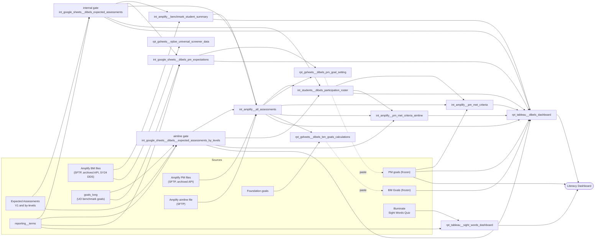

# DIBELS Dashboard Data Model

## What it is

DIBELS 8 is a K-8 literacy assessment from the University of Oregon, given
through Amplify mCLASS. KTAF gives it three times a year to every student
(Benchmark) and in shorter rounds between those administrations to students who
scored below grade level (progress monitoring, PM). This family of models turns
Amplify's files and a handful of hand-maintained Google Sheets into the Tableau
Literacy Dashboard, the goal sheets academics set targets from, and the NJDOE
universal screener extract. School and regional leaders use the dashboard to see
who tested, who is on track, and who needs intervention.

The Data Team owns the models, with Anthony Walters as owner. Teaching and
Learning (T&L), through Marya Tambawala, decides the definitions and labels. For
the procedures behind anything on this page, see the `dibels-dashboard` skill in
`.claude/skills/dibels-dashboard/`.

## How it fits together


```mermaid
flowchart LR
    subgraph SRC ["Sources"]
        amp_bm["Amplify BM files\n(SFTP, archived API, SY24 DDS)"]
        amp_pm["Amplify PM files\n(SFTP, archived API)"]
        amp_aim["Amplify aimline file\n(SFTP)"]
        gs_exp["Expected Assessments\nV1 and by-levels"]
        gs_terms["reporting__terms"]
        gs_long["goals_long\n(UO benchmark goals)"]
        gs_found["Foundation goals"]
        gs_bmg["BM Goals (frozen)"]
        gs_pmg["PM goals (frozen)"]
        ill["Illuminate\nSight Words Quiz"]
    end

    bss["int_amplify__benchmark_student_summary"]
    all["int_amplify__all_assessments"]
    gate_i["internal gate\nint_google_sheets__dibels_expected_assessments"]
    gate_a["aimline gate\nint_google_sheets__dibels__expected_assessments_by_levels"]
    pmexp["int_google_sheets__dibels_pm_expectations"]
    roster["int_students__dibels_participation_roster"]
    crit_i["int_amplify__pm_met_criteria"]
    crit_a["int_amplify__pm_met_criteria_aimline"]

    rpt["rpt_tableau__dibels_dashboard"]
    sw["rpt_tableau__sight_words_dashboard"]
    pmset["rpt_gsheets__dibels_pm_goal_setting"]
    bmcalc["rpt_gsheets__dibels_bm_goals_calculations"]
    njdoe["rpt_gsheets__njdoe_universal_screener_data"]
    tab(["Literacy Dashboard"])

    amp_bm --> bss
    gs_exp --> gate_i
    gs_exp --> gate_a
    gs_terms --> gate_i
    gs_terms --> gate_a
    gs_long --> gate_a
    gs_long --> pmexp
    gs_terms --> pmexp
    gate_i --> bss
    gate_i --> pmexp
    bss --> all
    amp_pm --> all
    amp_aim --> all
    gate_i --> all
    gate_a --> all
    all --> roster
    gate_i --> roster
    gate_a --> roster
    all --> pmset
    pmexp --> pmset
    pmset -. "paste" .-> gs_pmg
    gs_pmg --> crit_i
    all --> crit_i
    roster --> crit_i
    all --> crit_a
    gate_a --> crit_a
    roster --> crit_a
    gs_found --> bmcalc
    all --> bmcalc
    bmcalc -. "paste" .-> gs_bmg
    amp_bm --> njdoe

    bss --> rpt
    all --> rpt
    gate_i --> rpt
    gate_a --> rpt
    pmexp --> rpt
    gs_pmg --> rpt
    gs_bmg --> rpt
    roster --> rpt
    crit_i --> rpt
    crit_a --> rpt
    ill --> sw
    gs_terms --> sw
    rpt --> tab
    sw --> tab
    gs_pmg --> tab
```

Dotted arrows are people copying rows from a calculation into a sheet. Those
pastes are deliberate: they freeze a goal once it is set.

Most models in the family are views. The tables are the Google Sheets staging
models and the four Amplify mCLASS intermediates
(`int_amplify__mclass__benchmark_student_summary` and its `_unpivot`,
`int_amplify__mclass__pm_student_summary` and its `_aimline`). A view is only as
fresh as the tables under it, so a new paste into a sheet reaches the dashboard
only after its staging table rebuilds.

The diagram leaves out two shared models every branch uses: the enrollment spine
(`int_extracts__student_enrollments_subjects`), which drives the dashboard's
three branches and the participation roster, and the school calendar
(`int_students__calendar_day`), which
`int_google_sheets__dibels_pm_expectations` counts school days from together
with `reporting__terms`. Dagster refreshes the Literacy Dashboard extract each
morning.

## Terms

### Assessments and seasons

- Benchmark (BM): the three administrations every student sits, BOY, MOY and EOY
  (beginning, middle and end of year).
- Progress monitoring (PM): short probes between benchmarks, in two PM seasons,
  `BOY->MOY` and `MOY->EOY`. EOY opens no PM season.
- Composite: the overall benchmark score and level (At/Above, Below or Well
  Below Benchmark). PM has no composite.
- Measure name code and measure standard: a measure name code is the skill
  (`NWF`, `ORF`, `PSF`, `WRF`, `Maze`); a measure standard is one score under
  it. `NWF` has two standards (Letter Sounds and Decoding) and `ORF` has two
  (Reading Fluency and Reading Accuracy). The rest have one.
- Academic year: labelled by the fall, so SY26-27 is `academic_year = 2026`.
  Academics label documents by the spring, so their "SY27" document describes
  `academic_year = 2026`.

### The two PM methods

Academics run both methods across K-8. They are not a primary and a fallback,
and results from both sit side by side in the dashboard.

- Internal method: our own goal. Each cohort (a region, grade, measure and
  season) gets one target line from its average benchmark score up to the grade
  level standard plus a pad, spread across the season by school days.
- Aimline method: Amplify's goal. Each student gets their own aimline from their
  own starting score, and Amplify publishes whether each probe is at or above
  it.
- `model_type`: which method a row belongs to, `BM`, `Internal` or `Aimline`.
  Every PM student appears once per method, so any PM count must filter
  `model_type`. `assessment_type = 'PM'` covers both methods.
- Probe-eligible: a student whose composite on the benchmark that opens the
  season was Below or Well Below Benchmark. Only probe-eligible students are
  held to PM goals.
- Cohort (`measure_standard_level`): on the aimline method, Below Benchmark and
  Well Below Benchmark students are separate cohorts, and each round can test a
  different set of measures for each. Benchmark has no cohorts, because
  Benchmark is what assigns students to them.

### Expectations and rounds

- Expected Assessments: the Google Sheet that says which measures each region
  and grade is expected to sit in each administration and round. It has two
  ranges: V1, which feeds Benchmark and the internal method, and by-levels,
  which feeds the aimline method and adds the cohort column.
- Gate: the intermediate model over each range. Every downstream model joins a
  gate to decide what a student owed.
- `assessment_include`: blank means live. Any value switches the row off, for
  example a round cancelled mid-year. Consumers filter
  `assessment_include is null`.
- `pm_goal_include`: blank means the measure is tested that round. `false` marks
  a scaffold row: a round where the measure was not tested but which still holds
  school days, so the internal method's target line stays continuous across the
  season.
- `pm_goal_criteria`: `AND` means a student must meet every measure the round
  tested. Blank means the older OR rule, where meeting any one complete measure
  was enough. The column never holds the string `OR`. From SY26-27 every row is
  `AND`.
- `LIT` and `PLIT`: codes on the `type = 'LIT'` rows of `reporting__terms`. A
  Benchmark window is named `BOY`, `MOY` or `EOY` with code `LIT1`, `LIT2` or
  `LIT3`. A PM round is named by its season with code `LITn` for round n, so the
  name is what tells a Benchmark window from a PM round with the same code.
  `PLITn` covers the school days between round n-1 and round n. The internal
  method counts school days in both, so every grade band on the internal method
  needs `PLIT` rows.
- Round number: one continuous sequence per region and year across both PM
  seasons (for example 1-4 then 5-8). Regions run different numbers of rounds on
  different dates, so round 4 can be in different seasons in different regions.
- `expected_round_label`: the season plus the round (`BOY->MOY: R4`). Use it,
  not the bare number, when comparing regions.
- `expected_round_selection`: reads `Current` on the latest round whose window
  has opened for that region and grade, and the round label everywhere else, so
  one filter follows each region to where it actually is. A PM round stays
  `Current` until the next round opens. A benchmark window is `Current` only
  while it is open, so after BOY closes, `Current` shows the PM round alone and
  a school that has not tested in that round reads 0%. A region with no opened
  round yet (Miami before its first PM round) has no `Current` rows at all.
- The `expected_*` columns: dimensions taken from the gate, filled on every row
  whether or not the student tested. The score-side columns (`period`,
  `measure_standard`, `assessment_grade` and so on) are null when nothing was
  sat.

### Testing states

- Fully Tested: the student sat every measure the round expected. A Benchmark
  round also counts as complete when the student has a composite score, even
  with a measure missing.
- Round Incomplete: the student sat some but not all of the round's expected
  measures.
- Not Tested: the student sat nothing in the round, or, at measure grain, did
  not sit that measure.
- `round_test_status` carries the round states; `measure_test_status` carries
  Tested or Not Tested per measure.
- `participation_group`: `Combo` marks the blend academics asked to see, every
  Benchmark row, the internal method for K-2, and the aimline method for grades
  3-8. Filter to `Combo` for one network participation rate without counting a
  student under both methods. The K-2 and 3-8 split is fixed in SQL.

### Goals and verdicts

- `benchmark_goal`: the University of Oregon's grade-level standard for a
  measure, grade and season. It is the same for every student and is taken from
  the `goals_long` sheet. A PM round is measured against the next benchmark's
  standard, so a `BOY->MOY` round uses the MOY standard.
- `benchmark_goal_padded`: `benchmark_goal` plus 3 words, academics' planning
  pad for the internal method. The internal method's at-grade-level verdict uses
  the padded figure; the aimline method uses the unpadded one.
- `starting_words`: a cohort's average benchmark score on a measure, the start
  of the internal target line.
- `cumulative_growth_words`: the internal target a score is compared against in
  each round. It climbs across the season and lands on `benchmark_goal_padded`
  in the season's last round.
- `aimline_value_by_date`: the point on the student's aimline on the day of the
  probe. Amplify judges the probe against this value. It climbs across the
  season.
- `aimline_season_student_goal`: Amplify's per-student target for the end of the
  season. It is not the grade-level standard and not what the verdict is judged
  against.
- `goal` (dashboard column): the moving target for either method,
  `cumulative_growth_words` on Internal rows and `aimline_value_by_date` on
  Aimline rows.
- `aimline_status`: Amplify's own verdict, `At or Above` or `Below`. It stops at
  the aimline criteria model; the dashboard shows the same verdict in academics'
  words.
- Meeting Aimline: Amplify says the student is at or above their aimline as of
  this round, that is, on pace. It does not mean they have reached their
  end-of-season goal.
- No Aimline Data: the student sat the probe but Amplify published no aimline
  verdict.
- Aimline categories: `Meeting Aimline, Meeting Benchmark`,
  `Meeting Aimline, Not Yet at Benchmark`, `Below Aimline`,
  `No Aimline Data, Meeting Benchmark`, `No Aimline Data, Not Yet at Benchmark`,
  `Round Incomplete`, plus `Not Tested` on the dashboard. At or above benchmark
  wins outright, so a student at benchmark but below their aimline still reads
  `Meeting Aimline, Meeting Benchmark`.
- Trajectory: a comparison item (`aimline_trajectory_category` and two round and
  code columns) that academics' rules made identical to Aimline and Benchmark.
  It is being dropped.
- Grains: each verdict exists at measure standard, measure name code and round.
  Coarser grains are stricter, because a code needs every standard under it met
  and a round every code.
- Aimline history (`measure_standard_round_verdicts`): the season on one row,
  one character per round, `A` at or above (or Met on Internal), `B` below (or
  Not Met), `?` no aimline data, `.` not tested. For example `B-B-A`.
- Foundation goals: the percentage of students academics want At/Above (and the
  most they want Well Below) by MOY and EOY, per region, grade and population.
- BM goals: the counts of students each school and region must move to meet the
  foundation goals, frozen in the BM Goals sheet.
- Pads: `+3` words on the internal PM target; `+5` students on the expected
  At/Above count at BOY only; `x1.5` on the BM goal gap every season.
- `matching_season`: points the other way depending on the model. On
  `int_amplify__benchmark_student_summary` it is the PM season a benchmark opens
  (BOY gives `BOY->MOY`). On a PM row of `int_amplify__all_assessments` it is
  the benchmark season the round aims at (`BOY->MOY` gives `MOY`).

## Where the data comes from

| Source                                          | Owner                                         | Reaches                                                                                                                                                   |
| ----------------------------------------------- | --------------------------------------------- | --------------------------------------------------------------------------------------------------------------------------------------------------------- |
| Amplify mCLASS BM file, SFTP (Newark account)   | Amplify; landed by Dagster                    | `int_amplify__mclass__benchmark_student_summary` → `int_amplify__benchmark_student_summary` → `int_amplify__all_assessments` → every view below           |
| Amplify mCLASS BM and PM, archived API tables   | Data Team (frozen history)                    | Same chains as the SFTP files for earlier years, except PM: the aimline model reads only the SFTP PM file, so archived PM reaches the internal chain only |
| Amplify DDS, SY24 grades 7-8 benchmark          | Data Team (frozen history)                    | `int_amplify__benchmark_student_summary` only                                                                                                             |
| Amplify mCLASS PM file, SFTP                    | Amplify; landed by Dagster                    | `int_amplify__mclass__pm_student_summary` (internal) and `int_amplify__mclass__pm_student_summary_aimline` → `int_amplify__all_assessments`               |
| Amplify aimline file, SFTP                      | Amplify; landed by Dagster                    | `int_amplify__mclass__pm_student_summary_aimline` → Aimline rows                                                                                          |
| Expected Assessments V1 and by-levels           | Data Team enters; T&L decides the content     | The two gates → all three dashboard branches, the roster, goal setting                                                                                    |
| `reporting__terms`                              | Data Team enters; T&L sets PM dates           | Both gates (round windows) and `int_google_sheets__dibels_pm_expectations` (school days); the sight words term names                                      |
| `goals_long`                                    | Data Team (copy of UO's published goals)      | `benchmark_goal` on both methods                                                                                                                          |
| Foundation goals                                | T&L provides; Data Team enters                | `rpt_gsheets__dibels_bm_goals_calculations` only                                                                                                          |
| BM Goals (frozen)                               | Data Team pastes                              | Dashboard BM branch goal columns                                                                                                                          |
| PM goals (frozen)                               | Data Team pastes; T&L edits values            | `int_amplify__pm_met_criteria` and the dashboard Internal branch; the workbook also reads it directly                                                     |
| Illuminate Sight Words Quiz repositories        | Schools enter in Illuminate                   | `rpt_tableau__sight_words_dashboard` only                                                                                                                 |
| Enrollment, school calendar, location crosswalk | SIS (PowerSchool, Focus for Miami); Ops sheet | See _Supporting models_                                                                                                                                   |

Amplify exports one network account, and its files land in the Newark district's
bucket (the SFTP models also union Paterson's copy). Region comes from matching
the file's school name to `int_people__location_crosswalk`, not from which
bucket a file landed in. A school the crosswalk does not know reads as a null
region rather than as missing rows; Ops fixes it by adding the school to the
locations sheet.

The aimline file is only unioned from the Newark account. The aimline model also
reads `aimline_status` and `aimline_value_by_date` from the base PM file and
takes whichever file carries them, because Amplify has moved those columns
between files before.

## Dashboard: Literacy Dashboard

The Tableau workbook is the `literacy_dashboard` exposure in
`src/dbt/kipptaf/models/exposures/tableau.yml`. It reads two extracts,
`rpt_tableau__dibels_dashboard` and `rpt_tableau__sight_words_dashboard`, and
`stg_google_sheets__dibels_pm_goals` directly.

### `rpt_tableau__dibels_dashboard`

- What it shows: for every enrolled student, each DIBELS measure they were
  expected to sit in each Benchmark administration and PM round, the score if
  they sat it, whether they tested, and their verdicts against each goal.
- Grain: one row per student, expected measure standard, administration or
  round, and method (`model_type`). Rows are not guaranteed unique: the ELA
  course join can match more than one section, and overlapping enrollment stints
  can repeat a row.
- Reads: the enrollment spine (`int_extracts__student_enrollments_subjects`,
  Reading only, enrolled statuses 0, 2 and 3, not self-contained, not out of
  district), then one `UNION ALL` branch per method, below. All three branches
  also left join `int_students__course_enrollments` for the ELA teacher, course
  and section: each student's primary ELA section (`core_subject = 'ELA'`,
  `rn_core_subject_year = 1`, section number not like `%SC%`), for both
  PowerSchool and Focus (Miami). `course_name` is the course-subject crosswalk
  sheet's standard label, and the Florida course codes live on that sheet, not
  in SQL. Miami's schedule comes from Focus from AY2026 and from the frozen
  PowerSchool archive before that. Do not swap the crosswalk join for a
  course-title search: ACCESS course titles shorten Language Arts to `LA`, so
  `LIKE '%LANG%'` misses them.
- Worth knowing:
  - Filter every PM view on `model_type`. Both PM methods emit a row for the
    same student.
  - Slice and filter on the `expected_*` columns, `region`, `school`,
    `grade_level_int` and the testing states. A score-side column (`period`,
    `measure_name_code`, `assessment_grade`) is null for untested students, so
    using it silently drops them and raises every rate.
  - Bind views to the `*_status` and `*_category` strings, not the numeric
    `met_*` flags. The flags are null for different reasons on each method; the
    strings name every state and are never null on a PM row.
  - The `*_status` and `*_category` columns form a grid: three grains (measure
    standard, measure name code, round) by four lenses (the method's own goal,
    benchmark, aimline and benchmark, trajectory). The last two lenses exist on
    Aimline rows only. Move the view's dimension with the grain, or a
    round-grain value repeats across measures and looks like a difference.
  - State the grain on every rate. "% not meeting aimline" at measure standard,
    at measure name code and at round are different numbers, and `ORF` at code
    grain runs well below `ORF` at standard grain because its two standards
    often disagree.
  - Report percent tested per measure standard per round, not pooled across the
    year. Reading Accuracy is only tested in `BOY->MOY` and Maze only in a few
    rounds, so a pooled or code-grain rate mixes different denominators.
  - Round-grain columns hold one value per student and round, forced by a window
    over the round and checked by the warn test
    `rpt_tableau__dibels_dashboard__round_columns_single_valued`.
  - The spine filter is `is_self_contained is not true`, not
    `not is_self_contained`. Focus records no self-contained placement, so the
    flag is null for every Miami student, and `not` would drop all of them.
    Consequence: NJ self-contained students are excluded, Miami's are not.
  - Round numbers are not unique across regions: Miami runs a different number
    of rounds per season, so filter on `expected_round_label`, not the bare
    round number.
  - On the Aimline dashboards the BAN tiles always count `aimline_category`,
    while the bars and the Category Status Over Time line follow the Comparison
    Item. The default is `Aimline and Benchmark`, which reads the same column as
    the BANs. Under `Aimline` the bars read `measure_standard_goal_status`,
    which has no Round Incomplete, so they show a higher below-aimline rate than
    the BAN on the same page.
  - The Category Status Over Time line shows every round of one season, chosen
    by its own Trend Window control, not by the Admin Window filter.
  - The workbook filters `enroll_status = 0`, the student's status today, so a
    completed year shows only students who are still enrolled; see _Known
    issues_.

#### BM branch

- What it shows: each Benchmark measure a student was expected to sit, their
  score and level, whether they completed the administration, and the school and
  region benchmark goal counts.
- Grain: student, expected measure standard, administration (BOY, MOY, EOY).
- Reads: the internal gate (`assessment_type = 'Benchmark'`, live rows, a window
  that overlaps the student's enrollment); `stg_google_sheets__dibels_bm_goals`
  by school, grade and season (left join, so goal columns are null until the BM
  Goals paste lands); `int_amplify__all_assessments` for the score (left join);
  the participation roster for completion (left join).
- Worth knowing: PM columns are null here. The goal columns come only from the
  frozen BM Goals sheet; nothing on the dashboard reads the foundation goals
  sheet, which is why the BM goals process has two pastes.

#### Internal branch

- What it shows: each measure a probe-eligible student was expected to sit in
  each internal PM round, the score, the round's target (`goal`), and the
  verdicts from `int_amplify__pm_met_criteria`.
- Grain: student, expected measure standard, PM season, round.
- Reads: `int_google_sheets__dibels_pm_expectations` (tested rounds only);
  `stg_google_sheets__dibels_pm_goals` (inner join, so a region and season with
  no pasted goals has no Internal rows); the student's composite row in
  `int_amplify__all_assessments` with `overall_probe_eligible = 'Yes'` (inner
  join); then left joins to the Internal scores, the roster's Internal rows and
  `int_amplify__pm_met_criteria`.
- Worth knowing: `goal` is `cumulative_growth_words`. `benchmark_goal_gap` is
  the score minus the unpadded standard, so its sign follows
  `met_admin_benchmark_goal_unpadded`, not the padded `met_admin_benchmark_goal`
  the Internal verdicts use. `met_admin_benchmark_goal_unpadded` is not bound to
  any view on purpose. A cancelled round still appears here; see _Known issues_.

#### Aimline branch

- What it shows: each measure an eligible student's cohort was expected to sit
  in each aimline PM round, the score, the aimline target, and the verdicts and
  categories from `int_amplify__pm_met_criteria_aimline`.
- Grain: student, expected measure standard, PM season, round.
- Reads: `int_amplify__benchmark_student_summary` (one row per measure, filtered
  to `rn_pm_eligibility = 1` for one row per student per benchmark
  administration) for eligibility and cohort;
  `int_google_sheets__dibels__expected_assessments_by_levels` matched on the
  student's own cohort (inner join); then left joins to the Aimline scores, the
  roster's Aimline rows and `int_amplify__pm_met_criteria_aimline`.
- Worth knowing: `goal` is `aimline_value_by_date`. The season goal and its gap
  (`aimline_season_student_goal`, `aimline_season_student_goal_gap`) stay in the
  extract but academics asked that they not be shown anywhere; the roster view
  shows `benchmark_goal` and `benchmark_goal_gap` instead.
  `aimline_cohort_level` names the student's cohort. `aimline_round_category`
  takes Not Tested and Round Incomplete from the roster, so a student who
  skipped a measure still gets a round state on that row.
  `aimline_trajectory_category` is computed in this branch and is being dropped
  with Trajectory.

### `rpt_tableau__sight_words_dashboard`

- What it shows: Sight Words Quiz results from Illuminate, each sight word on
  each quiz, for the students in the quiz's grade.
- Grain: one row per quiz, sight word and student. Students in the quiz's grade
  get a row whether or not they took it (`value` is null if not). A second set
  of rows, `is_replacement = true`, carries students who took a quiz written for
  a different grade than their own.
- Reads: `int_illuminate__repositories` (scope `Sight Words Quiz`) with its
  fields, grade levels and `int_illuminate__repository_data`;
  `stg_google_sheets__reporting__terms` (network `RT` terms) for the term name;
  `int_extracts__student_enrollments_subjects` (Reading, one row per student per
  year).
- Worth knowing: it is not DIBELS data; it shares the workbook. Paterson is
  excluded. Its data flows automatically from Illuminate, so upkeep is only
  asking the Managing Director of Teaching & Learning (Sabine Vilsaint) at
  rollover whether it is still used, then moving the dashboard's academic year
  to the current year in the workbook. It has no year filter in SQL.

## Process: PM goal setting

Sets the internal method's per-round targets for one PM season, and freezes
them. `rpt_gsheets__dibels_pm_goal_setting` (the
`google_sheets__dibels_pm_goals` exposure in `google-sheets.yml`) computes them;
`stg_google_sheets__dibels_pm_goals` holds the frozen copy.

### What triggers it

A region's BOY Benchmark window closes (for the `BOY->MOY` season) or its MOY
window closes (for `MOY->EOY`). The window dates are in `reporting__terms`.
Regions close on different days, so each region is set separately. The season's
PM rows must already be in Expected Assessments V1 and `reporting__terms`, or
the view returns nothing.

### Inputs

- Benchmark scores for the current academic year from
  `int_amplify__all_assessments`: Benchmark rows only, measures only (not the
  composite), probe-eligible students only.
- `int_google_sheets__dibels_pm_expectations`: each round's measures, school
  days (`pm_round_days`, counted from `LIT` and `PLIT` windows on the
  SIS-neutral school calendar), the season's total days (`pm_days`), and
  `benchmark_goal` from `goals_long`.

### Steps

1. Check the date against `reporting__terms`. Include only regions whose window
   has closed, and tell the requester which regions are left and when each
   closes.
2. Query the view in BigQuery, filtered to the current year, the season the
   finished benchmark opens, and the ready regions. It is a view, so nothing
   needs running first.
3. Confirm the result has one row per region, season, grade, measure and round.
4. Paste the rows into the PM goals sheet, appending. Never regenerate a region
   and season already there.
5. After the staging table rebuilds, run the paste checks in the skill's
   `references/diagnosing.md`: rows equal distinct rows, each season's last
   round equals `benchmark_goal_padded`, earlier rounds equal the running sum,
   and `benchmark_goal` matches `goals_long`.

The calculation, per region, grade, measure and round:

- `starting_words` = the average benchmark score of probe-eligible students.
- `required_growth_words` = `benchmark_goal_padded` minus `starting_words`.
- `round_growth_words_goal` = the round's share of the growth, in proportion to
  its school days out of the season's; the season's first round also adds
  `starting_words`, so every running total is a level a raw score can be held
  against.
- `cumulative_growth_words` = the running total, with the season's last round
  set to `benchmark_goal_padded` exactly.

A worked example, grade 1 Decoding in one region: the cohort averaged 3 words at
BOY, the padded standard is 17, so 14 words are owed across 70 school days.
Round 1 (28 days) gets about 6 words of growth plus the starting 3, so a target
of 9; rounds 2 and 3 add 4 and 1; round 4 lands on 17. Decoding was not tested
in rounds 1 and 2 (`pm_goal_include = false`), but those rows still carry their
days, which is why round 3, the first round it was tested, already sits at 14.

### Outputs

`stg_google_sheets__dibels_pm_goals`, read by `int_amplify__pm_met_criteria`
(which compares each score to `cumulative_growth_words`), by the dashboard's
Internal branch, and by the workbook directly.

### Who runs it and when

The Data Team, twice a year per region, the day after that region's BOY and MOY
windows close. Once pasted, a season's goals are never recalculated, even if a
round is later cancelled. If a goal value has to change, academics edit it on
the sheet. The procedure, including the query to hand over, is in the skill's
`references/goal-setting.md`.

## Process: BM goals

Turns academics' foundation goals into the counts of students each school and
region must move, and freezes them for the dashboard. The loop passes through a
person twice.

```text
Foundation goals sheet            <- first paste, once a year
  -> stg_google_sheets__dibels_foundation_goals
    -> rpt_gsheets__dibels_bm_goals_calculations
      -> BM Goals sheet           <- second paste, per region, BOY and MOY
        -> stg_google_sheets__dibels_bm_goals
          -> rpt_tableau__dibels_dashboard (BM branch)
```

`rpt_gsheets__dibels_bm_goals_calculations` is the
`google_sheets__dibels_bm_goals` exposure in `google-sheets.yml`.

### What triggers it

T&L shares the year's foundation goals (the first paste). Then each region's BOY
and MOY Benchmark windows closing (the second paste, per region).

### Inputs

- Foundation goals: T&L's goal sheet gives each goal as a range. The At/Above
  goal takes the low end and the Well Below goal the high end. A generator
  script in the skill turns T&L's sheet into rows.
- Composite scores for the current year from `int_amplify__all_assessments`, BOY
  and MOY only.
- `int_extracts__student_enrollments` for school, IEP status and MLL status.

### Steps

1. Generate foundation goal rows from T&L's sheet with the skill's script,
   resolve every warning, and paste them into the foundation goals sheet.
2. Rebuild and check the staging table by year, region and population.
3. For each region whose window has closed, query
   `rpt_gsheets__dibels_bm_goals_calculations` (current year only) and check
   which regions the BM Goals sheet already holds for the year.
4. Paste only the missing regions into the BM Goals sheet. A region already
   there stays frozen.
5. Check the dashboard by year: a year with Benchmark rows and no `admin_goal`
   is a missing second paste.

The calculation, per school and per region, grade and season, for All students,
students with IEPs and MLL students:

- Counts of students At/Above and Below or Well Below, from the composite.
- Expected At/Above = `ceiling(students x foundation goal)`, plus 5 at BOY.
- Gap = (expected minus actual At/Above) x 1.5. A negative gap means the school
  already meets the goal.
- A BOY row is measured against the MOY goal and an MOY row against EOY. Grades
  6-8 have EOY goals only, so the model reuses the EOY goal at BOY for them.

### Outputs

`stg_google_sheets__dibels_bm_goals`, joined into the dashboard's BM branch as
`admin_goal`, `admin_goal_grade_range`, `admin_goal_season` and the
`n_admin_season_*` counts.

### Who runs it and when

The Data Team: foundation goals once a year when T&L sends them, BM Goals per
region after its BOY and MOY windows close. The headcounts come from live data,
so regenerating a region later silently replaces figures already reported
against. Replace a whole year only when the calculation itself was wrong. Miami
has foundation goals from AY2026 and follows the same process; its earlier BM
goals rows were entered by hand. The procedure is in the skill's
`references/goal-setting.md`.

## Process: NJDOE universal screener extract

`rpt_gsheets__njdoe_universal_screener_data` reshapes the current year's NJ K-3
benchmark results into the layout NJDOE's universal screener collection asks
for, with each region's district and school codes. It belongs to this family
until the Data Team has a data-sharing agreement with NJDOE that lets the state
pull directly from Amplify. It has its own reference page,
[NJDOE universal screener](njdoe-universal-screener-data-model.md).

## Supporting models

### Family models

| Model                                                                                                         | Role                                                                                   |
| ------------------------------------------------------------------------------------------------------------- | -------------------------------------------------------------------------------------- |
| `stg_amplify__mclass__{api,sftp}__benchmark_student_summary`                                                  | Amplify BM files, one union per feed                                                   |
| `stg_amplify__mclass__{api,sftp}__pm_student_summary`, `..._sftp__pm_student_summary_aimline`                 | Amplify PM and aimline files                                                           |
| `int_amplify__mclass__benchmark_student_summary`, `..._unpivot`                                               | BM wide and one row per measure, with region from the crosswalk                        |
| `int_amplify__benchmark_student_summary`                                                                      | Benchmark scores through the internal gate, composites, eligibility, cohort            |
| `int_amplify__mclass__pm_student_summary`, `..._aimline`                                                      | PM probes for each method, with region and Miami's id mapping                          |
| `int_amplify__all_assessments`                                                                                | The one place to read valid DIBELS scores: Benchmark plus both PM methods, scored rows |
| `stg_google_sheets__dibels_expected_assessments`, `stg_google_sheets__dibels__expected_assessments_by_levels` | The two Expected Assessments ranges                                                    |
| `int_google_sheets__dibels_expected_assessments`, `int_google_sheets__dibels__expected_assessments_by_levels` | The two gates, with round windows from `reporting__terms`                              |
| `int_google_sheets__dibels_pm_expectations`                                                                   | Internal PM rounds with school days and `benchmark_goal`                               |
| `stg_google_sheets__dibels_goals_long`, `_foundation_goals`, `_bm_goals`, `_pm_goals`                         | The goal sheets                                                                        |
| `int_students__dibels_participation_roster`                                                                   | Did each student sit what they owed, per round and method                              |
| `int_amplify__pm_met_criteria`, `int_amplify__pm_met_criteria_aimline`                                        | The verdicts and labels for each PM method                                             |

`int_amplify__all_assessments` carries scored rows only. An expected round with
no score does not become a row there; the roster and the dashboard, which drive
off the gates, supply Not Tested.

### Shared upstreams

- `int_extracts__student_enrollments_subjects`: the enrollment spine for the
  dashboard, the roster and sight words; also carries each student's DIBELS
  composites and eligibility.
- `stg_google_sheets__reporting__terms`: Benchmark and PM round windows, and
  sight words term names.
- `int_students__calendar_day`: in-session days, from PowerSchool for NJ and
  Focus for Miami, for the internal method's day counts.
- `int_people__location_crosswalk`: maps Amplify school names to school and
  region.
- `int_students__school_directory`: which schools count toward a region's day
  counts (K-8, not recruiting-only rows).

### Also read by

- `int_amplify__all_assessments` is also read by
  `dim_assessment_administrations`, `dim_assessments`,
  `fct_assessment_scores_enrollment_scoped`, `rpt_tableau__mtss_rti`,
  `rpt_gsheets__mtss_rti`, `rpt_gsheets__kippmiami_payout_roster`,
  `rpt_gsheets__assessment_roster`,
  `int_extracts__student_enrollments_subjects`,
  `int_reporting__promotional_status`, `rpt_deanslist__reading_levels`, and
  `int_assessments__score_anchors`. Most are safe from the one-row-per-method
  change only because they filter Benchmark or the composite; when touching one,
  state its `model_type` scope.
- `int_amplify__benchmark_student_summary` is also read by
  `int_extracts__student_enrollments_subjects`.
- `int_amplify__mclass__benchmark_student_summary` is also read by
  `rpt_gsheets__njdoe_universal_screener_data`.

## Inputs

All of these are Google Sheets. For access or a link, ask the data team. Every
staging model over them is a table, so a change shows up after it rebuilds. When
changing existing rows, hand over the whole corrected tab rather than a list of
edits; adding a new year's rows can be an append.

- Foundation goals: one row per year, region, grade, period (MOY or EOY),
  population (All, IEP, MLL) and goal type (At/Above or Well Below), with the
  range T&L gave and the single goal taken from it. Newark, Camden and Paterson
  only. Grades 6-8 carry EOY only.
- BM Goals: the frozen output of `rpt_gsheets__dibels_bm_goals_calculations`,
  one row per year, region, school, grade and period, with columns for All, IEP
  and MLL. Earlier years were hand-filled, so treat them as a record, not a
  specification.
- Expected Assessments V1: 16 columns, one row per year, region, grade,
  administration or round, and measure. Carries Benchmark rows and the internal
  method's PM rows, including scaffold rows.
- Expected Assessments by-levels: 18 columns, PM rows only, one per cohort, with
  `assessment_type` and `measure_standard_level` written on the sheet. No
  Benchmark rows, ever.
- `reporting__terms`: shared with other domains. DIBELS reads `type = 'LIT'`
  rows: Benchmark windows and PM rounds (`LIT` codes) and pre-round day windows
  (`PLIT`), per region and grade band. Sight words reads the network `RT` rows.
- PM goals: the frozen output of `rpt_gsheets__dibels_pm_goal_setting`, one row
  per year, region, season, grade, measure and round. Academics may edit goal
  values here.
- `goals_long`: the University of Oregon's DIBELS 8 benchmark goals by measure,
  grade and season. It carries no year and has not changed since 2020. A missing
  goal means UO sets none for that measure at that grade.

## Decisions

### How the model is built

- Both PM methods run in parallel across K-8, at academics' request. Neither is
  a fallback, and neither chain may be folded into the other.
- The two methods' chains share no gate. An earlier design put both ranges
  behind one gate with a flag, and every consumer that forgot the flag counted
  twice. Splitting at the source removed the hazard.
- Benchmark lives on the internal chain only. It has no cohorts, and emitting it
  from both ranges doubled every Benchmark row.
- `int_amplify__all_assessments` carries scored rows only. Not Tested is the
  roster's and the dashboard's job, because they already drive off the gates.
- The dashboard drives off the expectation gate so untested students keep their
  row. That is the owner's design, so a view that binds a score-side dimension
  is a mistake to correct.
- `assessment_include` and `pm_goal_include` are filtered by consumers, never in
  the gates. Filtering in the gate would change the season's first and last
  round.
- A PM round is measured against the next benchmark's standard. The join that
  looks one season off is the point.
- A student who changes grade mid-year keeps both grades: `assessment_grade` is
  where they sat the probe, `assessment_grade_int` where they sat the benchmark.
  Neither is wrong.
- Retired models are disabled, not deleted.

### Goals and padding

- The internal PM target is derived from the cohort; nobody chooses the numbers.
  T&L decides which rounds exist, their dates, the measures and the cohort that
  tests them; the data team computes every number.
- Goals are frozen by pasting, per region and season, because a cohort-derived
  goal moves as scores arrive. Frozen goals are never recalculated.
- The internal at-grade-level verdict uses `benchmark_goal_padded` (+3); the
  aimline verdict uses the unpadded standard. Academics chose this and re-review
  kept it on 2026-09-19. The two methods' at-grade-level columns must not be
  compared or unioned.
- BM goals: BOY is double padded (+5 and x1.5); from SY26-27 MOY keeps only the
  x1.5, per T&L. Confirm both pads with T&L before each year's BOY run.
- Grades 6-8 are goal-set at EOY only, by academics. The BM calculation reuses
  that EOY goal at BOY.
- `pm_goal_criteria` is `AND` on every row from SY26-27, per T&L. Blank rows in
  earlier years are the OR rule and still apply to that history.
- A round cancelled after goals are set keeps its frozen goals. Whether a
  cancelled round should still count toward the season's days is an open
  question for academics.

### Labels and reporting

- T&L (Marya Tambawala) decides definitions and labels. The model follows T&L's
  "Definitions Needed" table except in two places, both deliberate:
  `Meeting Aimline, Meeting Benchmark` (the document says "On Track and Meeting
  Aimline"), and splitting Not Tested from Round Incomplete (the document
  defines Not Tested as missing one or more measures). The split lets schools
  find and finish partial rounds, which the percent-tested reporting Alisha
  Fairfax asked for needs.
- Meeting Aimline keeps Amplify's definition: judged against
  `aimline_value_by_date`, not the season goal. Academics reviewed the
  difference and accepted it on 2026-09-24. A student can read Meeting Aimline
  every round and still finish below their season goal. A season-goal reading
  would be a second measure, not a correction.
- At benchmark wins in the aimline categories, per T&L's rule, so the label can
  overstate what it checks.
- Below Aimline outranks No Aimline Data at the round and code grains. Academics
  confirmed on 2026-09-22.
- On the aimline method any unfinished round reads `Round Incomplete`, even if a
  measure the student sat was below, so schools finish testing first (academics,
  2026-09-24). The internal method still settles a round when the missing
  measures could not change the answer.
- The status column names are inconsistent (`<grain>_<lens>_status` on the newer
  five). Aligning all nine was deferred because three are shared with the
  internal tabs.
- `met_admin_benchmark_goal_unpadded` exists on Internal rows and is unused.
  Binding it to a view raises Internal attainment and is T&L's call.

### Academics' answers on labels and the roster, 2026-09-24

Returned in the label crosswalk workbook. Blank answers were read as keep
today's label.

| Item                                    | Decision                                                                                                                                                                                                                                                       | Status                                                                                                                                                                                                     |
| --------------------------------------- | -------------------------------------------------------------------------------------------------------------------------------------------------------------------------------------------------------------------------------------------------------------- | ---------------------------------------------------------------------------------------------------------------------------------------------------------------------------------------------------------- |
| Aimline and Benchmark labels            | `Meeting Aimline, On-Track` becomes `Meeting Aimline, Meeting Benchmark`; `Meeting Aimline, Off-Track` becomes `Meeting Aimline, Not Yet at Benchmark`; the two `No Aimline Data` labels change the same way; `Below Aimline` and `Round Incomplete` unchanged | Built at all three grains                                                                                                                                                                                  |
| Trajectory comparison item              | Dropped by the dashboard owner, to be confirmed with academics. Under academics' rules it sorts every student exactly as Aimline and Benchmark does, and without the aimline a round-to-round rule could not judge about half of below-benchmark rows          | Removal from the workbook pending. `aimline_trajectory_category`, `measure_name_code_trajectory_status` and `round_trajectory_status` stay in the extract until the workbook stops using them, then retire |
| Students below aimline but at benchmark | Leave as is                                                                                                                                                                                                                                                    | Built. Several hundred students read `Meeting Aimline, Meeting Benchmark`, which is false for them; academics chose that knowingly                                                                         |
| Partial rounds                          | Hold them out as `Round Incomplete` at Round granularity on every comparison item. At Measure Standard and Measure, keep scoring each measure the student sat, except on Aimline and Benchmark, which keeps `Round Incomplete` at every grain                  | Built on the aimline method. `round_trajectory_status` still scores them and goes with Trajectory. Internal round columns unchanged                                                                        |
| Uncoloured No Aimline Data categories   | Existing grey                                                                                                                                                                                                                                                  | Workbook                                                                                                                                                                                                   |
| Aimline comparison item labels          | No change                                                                                                                                                                                                                                                      | Keep all four, plus `Round Incomplete` at Round granularity                                                                                                                                                |
| What "Meeting Aimline" measures         | Keep Amplify's definition: judged against the aimline value by date (the round target), not the student's season goal                                                                                                                                          | Decided                                                                                                                                                                                                    |
| Roster                                  | Season Verdicts renamed Aimline History; Benchmark Goal and Benchmark Gap added                                                                                                                                                                                | Built; `benchmark_goal_gap` supplies Benchmark Gap                                                                                                                                                         |
| Season goal and season gap              | Not shown anywhere on the dashboard, including the roster                                                                                                                                                                                                      | Decided. The columns stay in the extract, unbound                                                                                                                                                          |

## Known issues, need to fix

Each query returns aggregates only. Datasets are in the `teamster-332318`
project. Some results break down to a school or grade with only a few students;
do not paste raw output anywhere public.

### The `%SC%` section exclusion over-matches on Miami's PowerSchool archive

The ELA join drops sections whose number contains `SC`, a rule inherited from NJ
self-contained sections. A Miami section in the frozen PowerSchool archive whose
name contains those letters for another reason (a homeroom named after a college
such as USC) reads unscheduled too, which is why Miami AY2024 shows a lower
`scheduled` rate than other years.

### Cancelled PM rounds still count in the internal method

`int_google_sheets__dibels_pm_expectations` does not carry `assessment_include`,
so a cancelled round keeps its school days in goal setting and still appears in
the dashboard's Internal branch. Fixing it changes whether a cancelled round
bounds the season, which is academics' decision.

```sql
select academic_year, region, admin_season, count(*) as switched_off_pm_rows,
from `teamster-332318`.kipptaf_google_sheets.int_google_sheets__dibels_expected_assessments
where assessment_type = 'PM' and assessment_include is not null
group by academic_year, region, admin_season
```

### Duplicate dashboard rows

Two overlapping enrollment stints repeat a row, and more than one matching ELA
section repeats a row on every branch. The Benchmark branch has the most
repeated keys; it uses the same `between` check on enrollment stints as the PM
branches. The fix is one shared enrollment date predicate, applied to all three
branches together.

```sql
with
    keyed as (
        select
            model_type,
            academic_year,
            student_number,
            expected_test,
            expected_round_number,
            expected_measure_standard,
            count(*) as n,
        from `teamster-332318`.kipptaf_tableau.rpt_tableau__dibels_dashboard
        group by
            model_type,
            academic_year,
            student_number,
            expected_test,
            expected_round_number,
            expected_measure_standard
    )

select model_type, count(*) as duplicated_keys,
from keyed
where n > 1
group by model_type
```

### Duplicate sight words rows

A few thousand quiz, student and sight word keys repeat in
`rpt_tableau__sight_words_dashboard`, even with the replacement flag and grade
in the key. The uniqueness test warns on it. Start from the replacement branch,
which joins on `grade_level != co.grade_level`, and the enrollment join.

```sql
with
    keyed as (
        select repository_id, student_number, sight_word, count(*) as n,
        from `teamster-332318`.kipptaf_tableau.rpt_tableau__sight_words_dashboard
        group by repository_id, student_number, sight_word
    )

select count(*) as duplicated_keys,
from keyed
where n > 1
```

### A student benchmarked at two grades gets blended composite levels

In `int_amplify__benchmark_student_summary` the composite pivot is keyed on year
and student with no grade, so a student with two sittings in one period carries
both sittings' levels mixed together. Rare: a handful of student-periods a year.

```sql
with
    grades as (
        select
            academic_year,
            student_number,
            `period`,
            count(distinct assessment_grade_int) as n_grades,
        from `teamster-332318`.kipptaf_amplify.int_amplify__benchmark_student_summary
        group by academic_year, student_number, `period`
    )

select academic_year, countif(n_grades > 1) as two_grade_student_periods,
from grades
group by academic_year
```

### The archived API staging models have no uniqueness test

`stg_amplify__mclass__api__benchmark_student_summary` and
`stg_amplify__mclass__api__pm_student_summary` are frozen history, and their
only candidate key (`surrogate_key`) is dropped in the SQL. A test needs a
natural key agreed first.

### Internal `pm_round_status` varies within a round

In `int_amplify__pm_met_criteria` a few dozen AY2025 student-rounds carry both
`Met` and `Not Met`. The dashboard hides it by taking one value per round. The
cause is not yet found; start from the `met_pm_round_criteria` window
partitions, which omit region and grade.

```sql
with
    per_round as (
        select
            academic_year,
            student_number,
            admin_season,
            round_number,
            count(distinct pm_round_status) as n,
        from `teamster-332318`.kipptaf_amplify.int_amplify__pm_met_criteria
        group by academic_year, student_number, admin_season, round_number
    )

select academic_year, count(*) as split_rounds,
from per_round
where n > 1
group by academic_year
```

### The roster undercounts a round sat at another grade

The roster joins scores on the benchmark grade, so a student whose probes were
sat at a different grade reads 0 actual measures for that round. Rare, and no
reported verdict moves.

```sql
select academic_year, model_type, count(*) as mismatched_rows,
from `teamster-332318`.kipptaf_amplify.int_amplify__all_assessments
where
    assessment_type = 'PM'
    and safe_cast(assessment_grade as int64) != assessment_grade_int
group by academic_year, model_type
```

### Aimline goals missing for whole school-grade cells

Amplify published no aimline goal for nearly every student in a couple of
school-grade cells in AY2025, though the students sat the probes. It looks like
an mCLASS setup condition. Nobody has asked Amplify yet.

```sql
select
    region,
    school,
    grade_level_int,
    countif(measure_standard_score is not null) as scored,
    countif(
        goal is null and measure_standard_score is not null
    ) as scored_no_goal,
from `teamster-332318`.kipptaf_tableau.rpt_tableau__dibels_dashboard
where model_type = 'Aimline' and academic_year = 2025
group by region, school, grade_level_int
```

### A measure assigned outside its grade range has no standard

UO sets no `benchmark_goal` where a measure is not given at a grade (Word
Reading above grade 3, Reading Accuracy in kindergarten). A row like that on
Expected Assessments makes the at-grade-level verdict unevaluable. The aimline
model returns null for it; raise it with academics as an assignment error.

```sql
select academic_year, region, count(*) as rows_without_standard,
from `teamster-332318`.kipptaf_google_sheets.int_google_sheets__dibels__expected_assessments_by_levels
where
    benchmark_goal is null
    and assessment_include is null
    and pm_goal_include is null
group by academic_year, region
```

### IEP and MLL foundation goals are missing or placeholders

AY2026 foundation goals cover the All population only, so the IEP and MLL
columns of the BM goals calculation are null this year. The AY2025 MLL values
were entered as a stopgap, not from T&L. Ask T&L for both populations' goals
before anyone reports on them.

```sql
select academic_year, population, count(*) as goal_rows,
from `teamster-332318`.kipptaf_google_sheets.stg_google_sheets__dibels_foundation_goals
group by academic_year, population
```

### A completed year shows only students who are still enrolled

`enroll_status` is the student's status today, copied onto every year's row, in
every region. For Miami that holds since
[#5607](https://github.com/TEAMSchools/teamster/pull/5607); before it, Focus
drop codes put almost every Miami student at 2 on past years. The workbook
filters `enroll_status = 0`, so a completed year keeps only students still
enrolled today and drops everyone who has left since, in NJ and Miami alike. The
current year is unaffected. Filtering past years on `is_enrolled_recent` instead
is the follow-up #5607 names.

```sql
select region, enroll_status, count(distinct student_number) as students,
from `teamster-332318`.kipptaf_tableau.rpt_tableau__dibels_dashboard
where academic_year = 2025 and model_type = 'Aimline'
group by region, enroll_status
```

### Camden's last AY2025 round has no grade 3-8 scores

Camden's `MOY->EOY` R8 (27 April to 1 May 2026) is expected for grades 3-8, but
no student in those grades has a score on any measure, while K-2 tested. It
reads as a round that was not given and was not switched off with
`assessment_include`, the same shape as _Cancelled PM rounds_ above. Confirm
with academics before switching it off; until then the last point of the
`MOY->EOY` trend line reads Not Tested for every Camden grade 3-8 student.

```sql
select
    grade_level_int,
    count(distinct student_number) as expected,
    count(
        distinct if(aimline_category != 'Not Tested', student_number, null)
    ) as tested,
from `teamster-332318`.kipptaf_tableau.rpt_tableau__dibels_dashboard
where
    academic_year = 2025
    and model_type = 'Aimline'
    and region = 'Camden'
    and expected_test = 'MOY->EOY'
    and expected_round_number = '8'
group by grade_level_int
```

### Outside the warehouse: the workbook

Tracked in the skill's `references/aimline-method.md`. Every PM view in the
Literacy Dashboard must filter `model_type`, and the `PM - Met Goal Selector`
calc should return the `*_status` strings, with its No Data alias moved from
null to `Not Tested`. The Trajectory item left the workbook on 2026-09-28; its
three columns are still in the extract. The workbook's datasource is embedded,
so these checks need Tableau Desktop.

## Yearly upkeep

The procedures, scripts and checks are in the `dibels-dashboard` skill:
`references/rollover.md` for the calendar and expectations,
`references/goal-setting.md` for goals, and `references/sheets-and-sources.md`
for editing the sheets safely.

1. After July 1, confirm `current_academic_year` has rolled. The goal-setting
   views, the BM goals calculation and the NJDOE extract read the current year
   only.
2. `reporting__terms`, Benchmark: add each region's `LIT1`, `LIT2` and `LIT3`
   windows. No T&L sign-off needed.
3. Get T&L's PM rounds document for the year. Check its dates against
   `reporting__terms`, since its title names the spring year.
4. `reporting__terms`, PM: add each region's round (`LIT`) and pre-round
   (`PLIT`) rows for every grade band on the internal method, which is K-8.
   Check each region's grade bands against current enrollment; they change.
5. Expected Assessments V1: roll the Benchmark rows forward with `month_round`
   set from each region's `reporting__terms` start date, and add the PM rows
   with scaffold rows, `pm_goal_criteria = 'AND'`.
6. Expected Assessments by-levels: add the PM rows per cohort from the same
   rounds document. No Benchmark rows.
7. Rebuild the staging tables and confirm row counts per region.
8. Confirm the BM pads (+5 at BOY, x1.5) with T&L, then paste the year's
   foundation goals, including real MLL values.
9. After each region's BOY window: set PM goals for `BOY->MOY` and paste BM
   goals for that region. Repeat after MOY for `MOY->EOY`, and republish the
   workbook with the Aimline dashboards' Trend Window on `MOY->EOY`.
10. Mid-year cancellations: switch rows off with `assessment_include` (whole
    round) or `pm_goal_include` (one measure), and keep `pm_goal_include`
    matching between Expected Assessments and the PM goals sheet.
11. Sight words: ask the Managing Director of Teaching & Learning (Sabine
    Vilsaint) whether the dashboard is still used, then move its academic year
    to the current year in the workbook.
12. NJDOE screener: see its own page,
    [NJDOE universal screener](njdoe-universal-screener-data-model.md).

## Pending work

- Bright Spots tracker: on hold, not in prod
  ([#4952](https://github.com/TEAMSchools/teamster/issues/4952),
  [PR #4964](https://github.com/TEAMSchools/teamster/pull/4964)).
- Camden benchmark completion tracking: pending
  ([#4896](https://github.com/TEAMSchools/teamster/issues/4896),
  [PR #4902](https://github.com/TEAMSchools/teamster/pull/4902)).

## Owner

The Data Team, with Anthony Walters as owner. T&L (Marya Tambawala) decides
definitions and labels.
