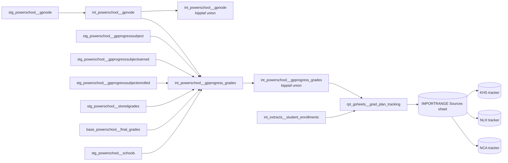

# Grad Plan Tracking Data Model

!!! tip "Claude Code skill available" The `grad-plan-tracking` skill in
`.claude/skills/grad-plan-tracking/` covers the procedure side of this family:
running PowerSchool's Data Capture routine and the sheet refresh before a
master-scheduling push, and checking a tracker tab's row cap against its source
tab. This page is the model reference; the skill is the runbook.

## What it is

Grad Plan Tracking tells high schools which course a student is still missing to
stay on track to graduate. Teaching and Learning uses it a few times each
semester, when schools build master schedules and need to know each student's
remaining gaps against their graduation plan.

It covers high school students (grades 9-12) in Newark and Camden only.
Paterson's PowerSchool instance does not populate grad-plan tables at all, so
Paterson has no data anywhere in this pipeline. Miami never had PowerSchool grad
plans.

The report has no dashboard. It is a Google Sheet, refreshed from a dbt view,
that three region trackers read from.

## How it fits together



`stg_powerschool__gpnode` and the three `stg_powerschool__gpprogresssubject*`
staging models are BigQuery tables in each region (Newark, Camden) in the
`powerschool` source-system package. At the kipptaf level, a union wrapper sits
on top of each so the rest of the chain can read one relation instead of two —
that wrapper is also a table, except for
`stg_powerschool__gpprogresssubjectearned`, whose kipptaf wrapper is a view. The
next layer flips: `int_powerschool__gpnode` and
`int_powerschool__gpprogress_grades` are tables per region, but their
kipptaf-level unions are views.

## How the plan tree is stored

PowerSchool stores every grad plan as one table of nodes (`gpnode`). Each node
has an `id`, a `parentid` pointing at the node above it, a `name`, and a credit
capacity. A plan is four levels deep. Part of the HS Distinction Diploma:

| Level           | id    | parentid | name                                  |
| --------------- | ----- | -------- | ------------------------------------- |
| Plan            | 15159 | (none)   | HS Distinction Diploma                |
| Overall credits | 15160 | 15159    | Overall credits                       |
| Discipline      | 15161 | 15160    | English                               |
| Subject         | 15162 | 15161    | English 9                             |
| Subject         | 15163 | 15161    | English 10                            |
| Subject         | 15164 | 15161    | English 11                            |
| Subject         | 15165 | 15161    | English 12                            |
| Discipline      | 15176 | 15160    | World Language (no subjects under it) |
| Discipline      | 15182 | 15160    | Elective (no subjects under it)       |

`int_powerschool__gpnode` flattens the tree with four joins:

1. Plan to overall credits: the plan (`parentid` is null) joins to the node
   whose `parentid` is the plan's `id`.
2. Overall credits to discipline: the same, one level down.
3. Discipline to subject: the same again, as a left join, for disciplines that
   split into subjects (English 9 to 12).
4. A discipline with no subjects (World Language, Elective): the left join finds
   nothing, so the discipline stands in as its own subject. In effect it joins
   to itself, `id` to `id`, through `coalesce(subject, discipline)`.

The ids above are from one plan version; every region and plan version has its
own. Newark and Camden both follow this shape.

## Terms

- **Grad plan** — PowerSchool's configured hierarchy of plan, discipline, and
  subject slots, each with a credit capacity a student must meet
  (`int_powerschool__gpnode`). A discipline with no subjects under it re-uses
  itself as its own subject. See _How the plan tree is stored_ above.
- **Earned vs. Enrolled** — every row in the progress data is one or the other.
  Earned means a completed course, matched against the student's Y1 stored grade
  history. Enrolled means a course the student is currently taking this year,
  matched against this year's current-term grades; it counts its credits as
  earned right away, and drops to zero only while the student's current Y1 grade
  is an F or blank.
- **Data Capture** — PowerSchool's Graduation Plan Progress Report Data Capture
  routine. It is what recalculates a student's progress against their grad plan;
  PowerSchool does not do this automatically as students earn credits. See "What
  triggers it" below.
- **IMPORTRANGE Sources / Reports** — the data team's two-tier sheet layout (see
  "Outputs").

## Where the data comes from

| Input                                                                                  | Source                                                                                        | Owner                                          |
| -------------------------------------------------------------------------------------- | --------------------------------------------------------------------------------------------- | ---------------------------------------------- |
| Grad plan structure (plan, discipline, and subject slots, and their credit capacities) | PowerSchool grad plan configuration, each NJ region                                           | School operations / PowerSchool administration |
| Student progress against the plan (earned, enrolled, required, and waived credits)     | The Graduation Plan Progress Report Data Capture routine, re-run by hand per school and grade | School staff, following the steps below        |
| Completed course grades                                                                | PowerSchool stored (Y1) grades                                                                | Schools, through report cards                  |
| Current-year enrolled courses and grades                                               | PowerSchool current-term grades                                                               | Schools, through report cards                  |
| Enrollment, grade level, and roster details                                            | PowerSchool, each NJ region                                                                   | School operations                              |

## What triggers it

Nothing recomputes this automatically. PowerSchool's grad plan tables do not
update as students earn credits, so before anyone uses the report, someone has
to re-run PowerSchool's own routine, then refresh the sheet:

1. Log in to each region's PowerSchool instance (one per region: Newark and
   Camden).
2. Switch to the high school you want. Do not run it from District Office.
3. From the school's Start Page, click a grade level to select that grade's
   students.
4. Open the student-selection action menu (bottom of the page, the dropdown next
   to "Select By Hand") and choose **Graduation Plan Progress Report Data
   Capture**.
5. Click **Submit** on the page that opens.
6. Repeat for every grade level, at every high school.
7. Check back often. Some grade levels take several minutes; plan on most of a
   day.
8. Refresh the source sheet's extract tabs. This step comes from inspecting the
   sheet, not from a confirmed procedure — ask the data team before relying on
   it.

Once PowerSchool has fresh progress data, the chain still has two more hops
before the sheet is current. PowerSchool's own dlt sync lands the raw
PowerSchool source tables (grad plan nodes and progress, stored grades, and
current-term grades) on its own schedule. From there, Dagster rebuilds the
BigQuery tables: the per-region `stg_powerschool__gp*` and
`int_powerschool__gpprogress_grades` / `int_powerschool__gpnode` models, and
their kipptaf-level table wrappers (`stg_powerschool__gpnode`,
`…gpprogresssubject`, `…gpprogresssubjectenrolled`). Each rebuilds automatically
once its upstream table materializes new data (Dagster's table automation
condition) — there's no fixed schedule for this hop, so "give it time to land"
means the next Dagster rebuild, not a set number of minutes. Only once those
tables have rebuilt does the last hop read fresh:
`rpt_gsheets__grad_plan_tracking`, the kipptaf
`int_powerschool__gpprogress_grades` / `int_powerschool__gpnode` unions, and the
kipptaf `stg_powerschool__gpprogresssubjectearned` wrapper are views, so they
recompute on every read. "Before you use it" really means: run the Data Capture
routine, then give the sync and the next Dagster rebuild time to land before
trusting the sheet.

## Inputs

For each student, `int_powerschool__gpprogress_grades` gathers, per grad-plan
subject slot:

- the plan, discipline, and subject names and their configured credit
  capacities, from the grad plan structure;
- one row per completed (Earned) course, with the letter grade, credit type, and
  credits earned, joined from the student's Y1 stored grades;
- one row per currently enrolled (Enrolled) course this year, with its credits
  counted as earned unless the current Y1 grade is an F or blank, joined from
  current-term grades;
- required, enrolled, requested, earned, and waived credit totals at the plan,
  discipline, and subject level.

`rpt_gsheets__grad_plan_tracking` then joins that to the enrollment roster and
keeps only students who are grade 9-12, currently enrolled, and on either the NJ
State Diploma or HS Distinction Diploma plan.

## Steps

`int_powerschool__gpprogress_grades` (the powerschool package model) builds two
branches and combines them:

- **Earned**: grad plan nodes joined to `gpprogresssubject`, then to
  `gpprogresssubjectearned`, then to the student's Y1 stored grade. Earned
  credits default to the stored grade's own credit hours.
- **Enrolled**: the same node-to-subject join, but to
  `gpprogresssubjectenrolled`, then to the student's current-year, current-term
  course record. Earned credits are the enrolled credits PowerSchool's Data
  Capture recorded for the student's subject slot
  (`gpprogresssubject.enrolledcredits`) when the current Y1 letter grade does
  not start with F, otherwise zero. A blank grade also gives zero.

A row is flagged as a transfer grade when its stored grade's school name has no
match among the district's own schools — meaning it was earned somewhere outside
the district. Enrolled rows are never transfer grades, since they always come
from the district's own current-year course records.

The kipptaf-level union view combines Newark and Camden, then
`rpt_gsheets__grad_plan_tracking` joins the union to the enrollment roster on
student and region, filters to the two tracked diploma plans, and adds
enrollment, demographic, and roster columns for the sheet to display alongside
the credit figures.

## Outputs

The data team keeps this sheet in a two-tier layout:

- **IMPORTRANGE Sources** holds one Connected Sheets tab wired directly to
  `rpt_gsheets__grad_plan_tracking`, plus a set of extract tabs, one per school
  and diploma type, that split the data source tab into blocks a report sheet
  can pull from.
- **Reports** holds one tracker sheet per high school. Each tracker has eight
  tabs — grades 9-12 crossed with NJ Diploma and Distinction Diploma — and each
  tab is a `QUERY(IMPORTRANGE(...))` formula reading a fixed row range from the
  matching source-sheet tab. Because the range is fixed, a source tab that grows
  past it silently truncates instead of erroring (see "Known issues" below).

Schools work in the Reports trackers; nobody but the data team edits the
IMPORTRANGE Sources sheet.

## Who runs it and when

Nobody runs the dbt models by hand; they read as-is whenever the sheet
refreshes. The PowerSchool Data Capture step, and the sheet extract refresh
after it, are run by hand — by school staff for the PowerSchool step, and by the
data team for the sheet — a few times each semester, whenever Teaching and
Learning needs current numbers for a master-scheduling push.

Teaching and Learning, with Ashley Leonardi, uses the report and owns the policy
questions. The data team owns the models and the sheet, with Anthony Walters as
owner.

## Supporting models

- `int_extracts__student_enrollments` — the base roster: grade level, enrollment
  status, region, and demographic and roster columns the extract displays
  alongside grad-plan progress.
- `base_powerschool__final_grades` — this year's current-term grades and course
  records, read for the Enrolled branch.
- `stg_powerschool__storedgrades` — completed Y1 grade history, read for the
  Earned branch.
- `stg_powerschool__schools` — the district's own school list, used only to
  detect a transfer grade (a stored grade whose school isn't one of these).

## Decisions

- **Newark and Camden only.** Paterson disables every grad-plan model
  (`int_powerschool__gpnode`, `int_powerschool__gpprogress_grades`, and the
  `gpprogresssubject*` staging models) because Paterson's PowerSchool instance
  has empty grad-plan tables. Miami never ran PowerSchool grad plans at all.
- **Only two diploma plans are tracked.** PowerSchool also configures a
  Collegiate Diploma and a State Requirements plan in both regions, but the
  extract and the Reports trackers only ever cover NJ State Diploma and HS
  Distinction Diploma. A student enrolled solely in one of the other plans will
  not appear on any tab.
- **The sheet layout separates the live data source from what schools edit and
  view**, so a school working in its own Reports tracker never touches the tab
  wired to BigQuery.

## Known issues, need to fix

- **A large share of enrolled high school students have no row in the tracker at
  all — not a blank row, no row.** Checked against prod: of currently enrolled
  9th-12th graders, Camden had under half with any row in
  `int_powerschool__gpprogress_grades`, and Newark had about two-thirds. The gap
  is the same whether or not the two-diploma filter is applied, so it isn't
  about which plan a student is on — those students simply have no grad-plan
  progress record in PowerSchool yet, most likely because Data Capture has not
  been run for their grade since they were assigned a plan. Query:

  ```sql
  select
    e._dbt_source_project,
    count(distinct e.students_dcid) as n_hs_enrolled,
    count(distinct g.studentsdcid) as n_in_tracker
  from `teamster-332318.kipptaf_extracts.int_extracts__student_enrollments` as e
  left join
    `teamster-332318.kipptaf_powerschool.int_powerschool__gpprogress_grades` as g
    on e.students_dcid = g.studentsdcid
    and e._dbt_source_project = g._dbt_source_project
  where e.academic_year = <current academic year>
    and e.rn_year = 1
    and e.enroll_status = 0
    and e.grade_level >= 9
    and e._dbt_source_project in ('kippnewark', 'kippcamden')
  group by 1
  ```

- **A report tab's row range is a fixed cap, so a source tab that outgrows it
  truncates silently instead of erroring.** All four NCA NJ Diploma tabs read up
  to a 15,500-row cap as of 2026-09-28, wide enough for their current source
  tabs (9,379 and 2,873 rows). The 11th/12th pair had previously been capped at
  3,000 rows against roughly 9,400 source rows, so most upperclassmen were
  missing from those tabs until the cap was widened. Worth re-checking after any
  large enrollment push, since the same silent truncation can recur on any tab
  whose source outgrows its cap.
- **The transfer-grade flag matches on school name.** A stored grade is flagged
  as a transfer when its school name has no match in `stg_powerschool__schools`,
  so a stored grade with a blank school name, or one from a district school that
  has since been renamed, is also flagged as a transfer.
- **Enrolled rows repeat the subject slot's total, so summing them double
  counts.** An Enrolled row's `potential_credits` and `earned_credits` come from
  the student's subject-slot progress row (`gpprogresssubject.enrolledcredits`),
  not from the course. A student enrolled in two courses in one slot gets two
  Enrolled rows, each carrying the slot's full total. As of 2026-09-29, about
  one in ten Enrolled slots had more than one course row (up to four) in both
  Newark and Camden. The school trackers are not affected: the Sources sheet's
  extract tabs never pull `earned_credits` or `potential_credits`, only the
  plan, discipline and subject totals, which are correct. It matters only when
  you query the model directly. Read one Enrolled row per slot, or use
  `subject_enrolled_credits`, rather than adding rows up. The fix (read the
  per-course `gpprogresssubjectenrolled.enrolledcredits` instead) is tracked on
  #5606. Query:

  ```sql
  with
      slots as (
          select _dbt_source_project, studentsdcid, subject_id, count(*) as n_rows,
          from
              `teamster-332318.kipptaf_powerschool.int_powerschool__gpprogress_grades`
          where credit_status = 'Enrolled'
          group by _dbt_source_project, studentsdcid, subject_id
      )

  select
      _dbt_source_project,
      count(*) as n_slots,
      countif(n_rows > 1) as n_multi_course_slots,
  from slots
  group by _dbt_source_project
  ```

## Yearly upkeep

- The academic year rolls over with the dbt `current_academic_year` variable in
  July, which the Enrolled branch and `rpt_gsheets__grad_plan_tracking`'s year
  filter both key off.
- The Data Capture routine has to be re-run every time this report is needed,
  not on a fixed schedule — confirm with Teaching and Learning before assuming a
  set of tracker numbers is current.
