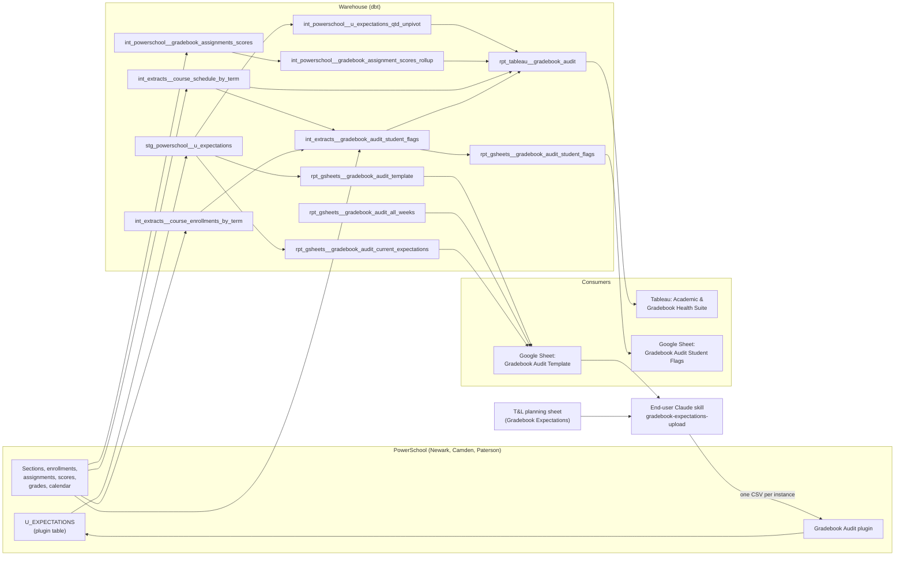

# Gradebook Audit Data Model

The manual for the gradebook audit: what it checks, how the data gets there, who
runs which part, and what to do each year. Read it end to end before you take
the project over.

!!! tip "Claude Code skills" Two skills sit beside this page. The data-team
skill, `gradebook-audit` (`.claude/skills/gradebook-audit/`), holds the
step-by-step procedures: changing a flag, adding a region, debugging a flag, the
summer toggle, and where the PowerSchool plugin work lives. The end-user skill,
`gradebook-expectations-upload`, lives with the plugin in the private
`TEAMSchools/ps-plugins` repo, and is what Teaching & Learning run to turn their
planning sheet into upload files for PowerSchool. This page explains the system;
the skills hold the procedures.

## What it is

KTAF teachers keep their gradebooks in PowerSchool, and the network's grading
policy sets how many assignments each category should have by each week of the
quarter, and how those assignments must be scored. The gradebook audit checks
every middle and high school section in Newark, Camden and Paterson against that
policy each week, so school leaders and coaches can fix problems before the
quarter closes.

It produces two things from one pipeline:

- A Tableau dashboard for school leaders, managers and teachers, reading
  `rpt_tableau__gradebook_audit`. It is teacher- and section-facing and carries
  no student data.
- A Google Sheet of flagged students for operations follow-up, reading
  `rpt_gsheets__gradebook_audit_student_flags`. It carries student names and
  numbers.

It also depends on a loop that runs the other way. Teaching & Learning decide
the expected assignment counts each year and load them into PowerSchool through
a custom plugin, and the audit reads them back. A second Google Sheet, fed by
three more models, supports that upload.

### Coverage

| Region   | School level | Covered by                                                  |
| -------- | ------------ | ----------------------------------------------------------- |
| Newark   | MS, HS       | Full audit                                                  |
| Camden   | MS, HS       | Full audit                                                  |
| Paterson | MS           | Full audit                                                  |
| All NJ   | ES           | Not audited here; ES keeps assignments outside PowerSchool  |
| Miami    | n/a          | Not audited; Miami's gradebook is in Focus, not PowerSchool |

KIPP Sumner Academy is an elementary school in PowerSchool, but its grades 5 and
6 are treated as middle school, so those sections are audited as MS.

## How it fits together



Read it in two directions:

- **The audit (left to right).** PowerSchool gradebook data and the expected
  counts in `U_EXPECTATIONS` flow through the models into the Tableau workbook
  and the flagged-students sheet.
- **The upload loop (right to left).** Teaching & Learning fill in their
  planning sheet. The end-user skill reads it alongside the template sheet,
  matches each week to PowerSchool's calendar, and produces one CSV per
  PowerSchool instance. A person uploads each CSV through the plugin into
  `U_EXPECTATIONS`, which the audit reads on its next refresh.

## Terms

- **Expectations**: The number of assignments a teacher is expected to have
  entered in each category by a given week of the quarter. Teaching & Learning
  decide them; they live in PowerSchool's `U_EXPECTATIONS` table, one row per
  school level, quarter and week, with one count column per category (`cnt_w`,
  `cnt_h`, `cnt_f`, `cnt_s`).
- **Counts are cumulative**: Each week's count is the running total for the
  quarter so far, not that week's new assignments. A count that falls from one
  week to the next is an error in the planning sheet.
- **Categories (W, H, F, S)**: The four PowerSchool gradebook categories the
  audit checks: Work Habits, Homework, Formative Mastery and Summative Mastery.
  `assignment_category_term` combines the code with the quarter number, so `W3`
  is Work Habits in Q3.
- **Quarter week number (`week_number_quarter`)**: PowerSchool numbers school
  weeks from 1 within each quarter, and restarts at 1 every quarter. Teaching &
  Learning's planning sheet numbers weeks straight through the year, so their
  week 14 is somebody's week 4. `U_EXPECTATIONS` stores the quarter week number,
  and the upload must translate every sheet row by its dates. Passing the
  sheet's own number through shifts every count onto the wrong week with no
  error.
- **Most recently completed week**: The audit always reads the week before the
  current one, so teachers are not judged on a week still in progress. A quarter
  that has ended is read at its last week. In mid-year the dashboard shows two
  kinds of "current" at once: closed quarters frozen at their last week, and the
  running quarter on last week.
- **Region and instance**: Newark, Camden and Paterson each run their own
  PowerSchool instance, and the plugin is installed on each one.
  `U_EXPECTATIONS` has no region column; the region is known only from which
  instance a row came from, which is why the upload is one file per instance. In
  the warehouse the instance appears as `_dbt_source_project` (`kippnewark`,
  `kippcamden`, `kipppaterson`).
- **No academic year in `U_EXPECTATIONS`**: The table holds whatever is live
  now. The warehouse stamps the current academic year onto its rows. An upload
  in the plugin's Replace mode swaps the whole instance, so two years cannot sit
  side by side. Add mode only warns on a duplicate week, and a duplicate would
  double the counts; the unpivot's uniqueness test, at warn severity, is the one
  guard.
- **`category_summary` row**: One row per section, quarter and category in
  `rpt_tableau__gradebook_audit`, present whether or not anything is wrong. It
  carries the expectation, the counts entered, `not_enough_assignments` and
  `flag_reasons`.
- **`assignment_detail` row**: One extra row per assignment that fails an
  assignment check, so the dashboard can list the bad assignments under their
  category. The category-level columns are empty on these rows; the assignment
  columns are empty on `category_summary` rows. `row_type` says which is which.
- **The 4-row floor**: Every section and quarter in the dashboard has exactly
  four `category_summary` rows, one per category. A teacher with nothing flagged
  has exactly four rows per section per quarter. Fewer than four means an
  expectation is missing for that region, school level and quarter. Every change
  to the pipeline must keep this floor.
- **Assignment checks**: Four checks on each assignment, rolled into
  `assignment_has_flags`. An assignment that fails any of them does not count
  toward the category's expectation. See _Assignment checks_ under the dashboard
  section.
- **Student flags**: Two checks on each student's quarter grade in each course:
  a grade above 100 (`qt_percent_grade_greater_100`), and a grade below 70 with
  no end-of-quarter comment (`qt_grade_70_comment_missing`). The
  flagged-students sheet lists them by student; the dashboard only shows whether
  any student in a section was flagged (`has_grade_above_100`,
  `has_grade_below_70_no_comment`).
- **Health columns**: Two teacher-level booleans, computed across all of a
  teacher's sections for the quarter and copied onto every row.
  `is_healthy_gradebook_all_flags` is false if any of `not_enough_assignments`,
  `has_grade_above_100` or `has_grade_below_70_no_comment` fired anywhere.
  `is_healthy_gradebook_excl_comments` is the same but ignores the below-70
  comment check, which is an end-of-quarter item. A Tableau parameter picks
  which one the dashboard reads.
- **Broadcast**: A section-level or teacher-level fact copied onto every row it
  applies to. The two student-flag booleans are the same on all of a section's
  rows; the two health columns are the same on all of a teacher's rows for the
  quarter.
- **Summer toggle**: A temporary data-team change that points the audit models
  at the previous academic year. It keeps the dashboard populated in summer,
  after the warehouse rolls over to the new year but before PowerSchool has any
  new-year data. It is marked `summer toggle: see skill` in the SQL and must be
  reverted once school starts. See _Yearly upkeep_.
- **Add and Replace**: The plugin's two upload modes. Add appends the file's
  rows. Replace deletes every row on the instance, all quarters, and loads the
  file in their place, so the file must hold everything the instance should end
  up with. Replacing a quarter that already has rows is done with a
  whole-instance file: the new quarter plus every current row of the other
  quarters, copied across. Replace with a one-quarter file silently deletes the
  other three quarters.
- **IMPORTRANGE Sources and Reports**: Each published Google Sheet is a pair.
  The Sources copy holds the Connected Sheets extracts from the warehouse, with
  short internal tab names. The Reports copy is what people open; each tab pulls
  from the Sources copy with `IMPORTRANGE` and has a friendly name. A change to
  either copy has to be made in both. The procedure is in
  [the Google Sheets guide](../guides/google-sheets.md).

## Where the data comes from

| Source                                         | Owner                                   | Reaches                                                                                                                              |
| ---------------------------------------------- | --------------------------------------- | ------------------------------------------------------------------------------------------------------------------------------------ |
| PowerSchool sections, courses, terms, calendar | School operations, per region           | `int_students__course_sections`, `int_students__terms`, `int_students__calendar_week` → schedule and enrollment models               |
| PowerSchool course enrollments                 | School operations, per region           | `base_powerschool__course_enrollments` → `int_extracts__course_enrollments_by_term`, `int_powerschool__gradebook_assignments_scores` |
| PowerSchool assignments and scores             | Teachers                                | `int_powerschool__gradebook_assignments`, `stg_powerschool__assignmentscore` → assignment scores → rollup                            |
| PowerSchool quarter grades and comments        | Teachers                                | `base_powerschool__final_grades` (current year), `stg_powerschool__storedgrades` (prior year) → student flags                        |
| PowerSchool `U_EXPECTATIONS` (plugin table)    | Teaching & Learning, through the plugin | `stg_powerschool__u_expectations` → expectations model, template, current-expectations                                               |
| Staff roster (ADP) and leadership crosswalk    | People team                             | `int_people__staff_roster`, `int_people__leadership_crosswalk` → teacher, manager and school-leader columns                          |

All PowerSchool data arrives through dlt, one pipeline per region.
`U_EXPECTATIONS` loads intraday, on a `whenmodified` cursor, so an upload
reaches BigQuery the same day. The three regions are unioned at the kipptaf
level by `stg_powerschool__u_expectations` and
`int_powerschool__gradebook_assignments_scores`, which add
`_dbt_source_project`.

Staff names and Tableau usernames come from the roster, matched on the
PowerSchool teacher number. A teacher missing from the roster still appears,
with empty manager and username columns, so Tableau's username-based row
filtering cannot match them to their own rows.

Nothing about Miami reaches the audit. Its gradebook is in Focus, and the
PowerSchool unions above list only the three NJ regions. The audit models also
filter `_dbt_source_project != 'kippmiami'` explicitly.

## Dashboard: Academic & Gradebook Health Suite

The Tableau workbook **Academic & Gradebook Health Suite** (exposure
`academic_gradebook_health_suite` in
`src/dbt/kipptaf/models/exposures/tableau.yml`) is the live dashboard. Anthony
Walters built it and owns it. Dagster refreshes its extract daily at 4 AM, from
the exposure's `cron_schedule`.

Its two gradebook views are **Gradebook School Rollup** and **Gradebook Teacher
View**. Both read `rpt_tableau__gradebook_audit`, documented below. A third view
checks elementary end-of-quarter comments and reads
`rpt_tableau__gradebook_es_comments`, which sits outside the audit (see
_Supporting models_). The workbook's GPA views read four other models and are
documented on the Academic Health data model page
(`docs/models/academic-health-data-model.md`); this page does not describe them.
View-by-view documentation of the gradebook views is for Walters to add.

Two disabled exposures, `gradebook_audit` and `gradebook_audit_teacher_report`,
also name `rpt_tableau__gradebook_audit`. They point at retired workbooks; do
not read either as this model's consumer.

### `rpt_tableau__gradebook_audit`

#### What it shows

For every audited section and quarter, and each of the four categories: how many
assignments the teacher was expected to have by last week, how many they
entered, how many of those pass every assignment check, and whether that is
enough (`not_enough_assignments`). Beside it, `flag_reasons` names in plain
language which assignment checks tripped, and one `assignment_detail` row per
failing assignment lets the dashboard list them. Every row also carries the two
section-level student-flag booleans and the two teacher-level health columns. It
carries no student data.

#### Grain

At least four rows per section per quarter: one `category_summary` row per
category, present even when nothing is wrong. Add one `assignment_detail` row
per assignment in that category that fails any assignment check. The uniqueness
test is on `_dbt_source_project`, `academic_year`, `sectionid`, `quarter`,
`assignment_category_code` and `assignmentid` (null on `category_summary` rows).

Only quarters that have at least one completed week and a matching
`U_EXPECTATIONS` row appear. A quarter that has not started has no rows, and
neither does the running quarter during its first week.

#### Reads

- `int_extracts__course_schedule_by_term`: one row per section per quarter, with
  teacher, manager and school-leader names and Tableau usernames.
- `int_powerschool__u_expectations_qtd_unpivot`: the expectation per region,
  school level, quarter and category, as of the most recently completed week.
  Inner join on region, school level, academic year and quarter, so a section
  with no matching expectation drops out entirely.
- `int_powerschool__gradebook_assignment_scores_rollup`: one row per assignment,
  with the assignment checks. Left join on region, section, category, a due date
  inside the quarter, and score type `POINTS` or `PERCENT`.
- `int_extracts__gradebook_audit_student_flags`: grouped to section and quarter,
  keeping only whether any student tripped each flag.

The model is a view. The Tableau extract it feeds refreshes at 4 AM, after the
two table-materialized upstreams have rebuilt:
`int_extracts__course_enrollments_by_term` at 2 AM and
`int_extracts__gradebook_audit_student_flags` at 3 AM. So the student-flag
booleans are as of 3 AM; everything else reflects the underlying PowerSchool
tables as of the refresh.

#### Scope filters

These filters apply here and, matching, in
`int_extracts__gradebook_audit_student_flags`:

- the current academic year (the summer toggle changes this);
- `school_level_alt != 'ES'`;
- `_dbt_source_project != 'kippmiami'`;
- `exclude_from_gpa = 0`, which drops Lunch, Early Dismissal and Study Hall
  because PowerSchool marks them excluded from GPA;
- `course_number != 'SEM22106G1'`, KIPP Newark Lab's Advisory (see _Course-level
  scope_ under _Decisions_).

Upstream, `int_extracts__course_schedule_by_term` also drops sections with no
enrolled students and sections whose PowerSchool term covers only one quarter
(`section_quarter_count >= 2`). See _Known issues_.

The exclusion predicates above use `!=`, which also drops rows where the column
is null. None of these columns has a `not_null` test. If rows go missing with no
obvious cause, check those columns for nulls before suspecting the flag logic.

#### How the counts work

The expectation is the cumulative count for the most recently completed week of
the quarter (for a closed quarter, its last week). The model counts assignments
with a due date on or before that week's Sunday (`week_end_sunday`):

- `assignments_entered_count`: every assignment in the category.
- `assignments_entered_count_no_flags`: only assignments that pass every
  assignment check. This is the number the flag uses, so the dashboard shows a
  count that agrees with the flag beside it.
- `not_enough_assignments`: true when `assignments_entered_count_no_flags` is
  below `expectation`.

These are window functions over section, quarter and category, so the
per-assignment rows survive to build the `assignment_detail` rows. A
`SELECT DISTINCT` then collapses them to the `category_summary` grain; every
projected column is fixed by that grain, so the distinct masks nothing.

#### Assignment checks

Computed in `int_powerschool__gradebook_assignment_scores_rollup`, one row per
assignment. An assignment fails (`assignment_has_flags`) if any of these hold.
The label is what `flag_reasons` prints, always in this order:

| Label                    | Check                        | Fires when                                                                                        |
| ------------------------ | ---------------------------- | ------------------------------------------------------------------------------------------------- |
| `Under 90% graded`       | `percent_graded_min_not_met` | Fewer than 90% of expected students have a score                                                  |
| `Invalid scores entered` | `flags_sum > 0`              | At least one expected student has a blank score or a score that breaks the scoring policy (below) |
| `Not out of 10 points`   | `assign_max_score_not_10`    | A Work Habits, Homework or Formative assignment is not worth 10 points                            |
| `Half the class exempt`  | `overly_exempt_assignment`   | Half or more of the students on the assignment are exempt                                         |

An "expected" student is one who is not exempt, on an assignment that counts
toward the final grade. Only students enrolled in the section on the due date
count; PowerSchool attaches every assignment to a student who joins a section
late, including ones due before they arrived.

The per-student score checks behind "Invalid scores entered":

| Check                                | Fires when                                                            |
| ------------------------------------ | --------------------------------------------------------------------- |
| blank score                          | expected, and no score entered                                        |
| `assign_score_above_max`             | expected, and the score is above the assignment's point value         |
| `assign_mh_hwf_score_less_5`         | W, H or F; expected; not marked missing; score below 5                |
| `assign_ms_hwf_missing_score_not_5`  | W, H or F; MS; expected and marked missing; score is not 5            |
| `assign_hs_hwfs_missing_score_not_0` | H, W, F or S; HS; expected and marked missing; score is not 0         |
| `assign_ms_s_score_less_50p`         | S; MS; expected; score below half the point value                     |
| `assign_hs_s_score_less_50p`         | S; HS; expected; not marked missing; score below half the point value |

Together these encode the grading policy the audit enforces: W, H and F
assignments are out of 10 with a floor of 5; a missing assignment scores 5 in MS
and 0 in HS; a Summative scores at least half its points in MS, and in HS unless
it is marked missing.

`Under 90% graded` never appears alone. Grading below 90% leaves expected
students with blank scores, which trips `Invalid scores entered` too.

`flag_reasons` populates whenever a check tripped, even when
`not_enough_assignments` is false: a category can hold flawed assignments and
still clear its expectation.

#### Worth knowing

- **The section label must be unique.** The workbook groups section rows on
  `section_or_period`, not `sectionid`, so that label must be unique per section
  within a teacher, course and quarter, or Tableau adds two sections together.
  MS uses the section number, a cohort name that is already unique. HS combines
  the period expression with the section number, because two HS sections of one
  course can meet in the same period with the same teacher (a specials rotation,
  or an AP course split by grade). The label is derived in
  `int_extracts__course_schedule_by_term`, and a uniqueness test there on
  `_dbt_source_project, academic_year, schoolid, teacher_number, course_number, quarter, section_or_period`
  fails at `error` if the property is lost. The same expression is copied into
  `int_extracts__course_enrollments_by_term`; see _Known issues_.
- **Health is per teacher per school.** `health_calc` groups by region, academic
  year, school, teacher number and quarter. A teacher with sections at two
  schools gets a separate health result at each.
- **The student-flag booleans are section facts.** They are identical on all
  four category rows and every assignment row for the section. A section with no
  student-flag rows at all reads `false`, not null.
- **The `flag_reasons` strings are load-bearing.** Tableau groups and filters on
  them. Appending a new label is safe; reordering or rewording changes existing
  values and breaks the workbook's filters.
- **No student data.** Student-level detail stays in
  `int_extracts__gradebook_audit_student_flags` and the flagged-students sheet.
  Keep it that way; a change that brings student columns into this model breaks
  the design.
- **`school_name` is a display label.** It comes from PowerSchool's school name,
  which PowerSchool has renamed before. Join and filter on `schoolid` or
  `school` (the abbreviation).

## Processes

### Flagged-students sheet

The **Gradebook Audit Student Flags** Google Sheet lists every student whose
quarter grade breaks one of the two student-flag rules, with the teacher and
section, for operations follow-up.

#### What triggers it

Nothing manual. The sheet refreshes from the warehouse on its Connected Sheets
schedule, set in the Sources copy.

#### Inputs

- `int_extracts__course_enrollments_by_term`: one row per student, course and
  quarter.
- `int_extracts__course_schedule_by_term`: inner-joined on section, quarter and
  year, so a student is only flagged for a section the teacher side of the audit
  also knows about.
- Quarter grades and comments: `base_powerschool__final_grades` for the current
  year, or `stg_powerschool__storedgrades` for the prior year when the summer
  toggle is on.

#### Steps

1. `int_extracts__gradebook_audit_student_flags` (a table, built at 3 AM) takes
   every enrolled student in every audited section and quarter that has started,
   applies the same scope filters as the dashboard, plus active enrollment only
   (`enroll_status = 0`, not out of district, the student's primary school
   enrollment for the year), and computes the two flags:
   - `qt_percent_grade_greater_100`: quarter percent grade above 100.
   - `qt_grade_70_comment_missing`: quarter percent grade below 70 and no
     comment. It is unfiltered: every scoped row appears, flagged or not.
2. `rpt_gsheets__gradebook_audit_student_flags` keeps only rows where at least
   one flag is true.
3. The dashboard reads the same intermediate, grouped to section, but it also
   needs a completed week and a matching `U_EXPECTATIONS` row. So in a quarter's
   first week, or where expectations are missing, the sheet lists students the
   dashboard does not show: the dashboard is a subset of the sheet.

#### Outputs

One row per flagged student, section and quarter, with student name and number,
grade level, teacher name and employee number, the grade, the comment, and
`is_current_quarter` so the sheet can filter to the running quarter. It carries
student data; share it only with staff who need it.

#### Who runs it and when

It runs itself. Operations staff at the schools work from the Reports copy.
Neither flag carries a "reason" column: they stay plain booleans on purpose.

### New-year expectations upload

Every year, and whenever a quarter's counts change, Teaching & Learning load the
expected assignment counts into PowerSchool. Without it, the audit keeps
comparing teachers against last year's numbers.

#### What triggers it

- **Start of year:** Teaching & Learning finish the new year's planning sheet,
  normally all four quarters before school starts, and the warehouse has rolled
  over to the new academic year.
- **Mid-year:** a quarter is newly decided or its counts change. Some years only
  Q1 is ready when school starts; the rest follow as they are decided.

#### Inputs

- **The planning sheet**, `Gradebook Expectations | SY__`, maintained by
  Teaching & Learning: one tab per region and school level, one row per week,
  with the four category counts. Its tabs are renamed each year, it carries
  hidden draft tabs, and one tab can serve two instances (Newark and Paterson MS
  share one; Camden MS and HS share one). Ask the data team for the link.
- **The Gradebook Audit Template sheet**, fed from the warehouse. Its Reports
  copy has four tabs:

  | Reports tab                  | Model                                               | What it holds                                                                                                                                         |
  | ---------------------------- | --------------------------------------------------- | ----------------------------------------------------------------------------------------------------------------------------------------------------- |
  | `PS Full Calendar`           | `rpt_gsheets__gradebook_audit_all_weeks`            | Every school week of the current academic year, with PowerSchool's quarter and quarter week number and the week's dates. Runs to the end of the year. |
  | `Plugin Data Raw`            | `rpt_gsheets__gradebook_audit_current_expectations` | Every row live in `U_EXPECTATIONS`, per instance, with who created or last changed it and when.                                                       |
  | `Template QW-Date Crosswalk` | `rpt_gsheets__gradebook_audit_template`             | Loaded expectations joined to the calendar, one row per week with W, H, F, S as columns. Stops at the last completed week.                            |
  | `PS Plugin CSV Template`     | none                                                | The literal CSV header row the plugin accepts, typed by hand.                                                                                         |

  The Sources tab names are short internal names (`ps_all_weeks`,
  `ps_plugin_raw`, `ps_plugin_data`), not the model names. Do not rename them to
  match; every `IMPORTRANGE` on the Reports copy would break.

- **The end-user skill**, `gradebook-expectations-upload`, run in Claude with
  the Google Drive connector.
- **The PowerSchool plugin**, KIPP NJ Gradebook Audit, installed on each of the
  three instances.

#### Steps

The end-user skill, in TEAMSchools/ps-plugins, holds the procedure; follow it
rather than any copy here. Its playbooks are `rollover.md` (start of year),
`refresh.md` (a quarter mid-year) and `troubleshoot.md` (the dashboard looks
wrong), and `references/powerschool-navigation.md` is the screen-by-screen
plugin guide. In outline:

1. Confirm `PS Full Calendar` shows the year being loaded. If it shows last
   year, the warehouse has not rolled over yet (or the summer toggle is still
   on), and the data team must fix that first.
2. Read the planning sheet, find which quarters are decided, and match each row
   to a PowerSchool week by its dates, never by the sheet's own week number.
3. Fill every blank: zero in a quarter's first week, the previous week's count
   after that. A `---` means no new expectation and takes the same rule.
4. Build one CSV per instance and run the skill's checks.
5. Upload each file through the plugin: Add for a quarter with no rows yet,
   Replace with a whole-instance file otherwise.
6. The next day, check `Plugin Data Raw` shows the new rows, and tell the data
   team.

#### Outputs

New rows in `U_EXPECTATIONS` on each instance. dlt picks them up the same day,
and the next dashboard refresh audits against them. `Plugin Data Raw` shows them
after the sheet's next overnight refresh.

#### Who runs it and when

Teaching & Learning run it, at the start of each year and whenever a quarter's
counts change. The data team runs the verification query below after each load,
owns the template sheet and the plugin, and is the escalation point when a check
fails. If Teaching & Learning are blocked, a data-team member can build the
files from the same sheets, but should follow the end-user skill's rules and
hand the upload back.

#### The rule that binds: replace each quarter before it starts

`U_EXPECTATIONS` has no academic year, so last year's rows stay live until
replaced. An unreplaced future quarter is harmless until the Monday it opens,
and then it does not go blank: it serves last year's counts, which look
plausible, and the audit quietly misreports that whole quarter. Nothing fails.

So when only some quarters are loaded, say which quarters still carry last
year's numbers and the date each opens. That date is the `week_start_monday` of
the quarter's week 1 in `PS Full Calendar`, which holds the whole year even
before any rows are loaded.

#### Verify after a load

Once the `u_expectations` dlt asset has re-ingested and dbt has run:

```sql
select
    _dbt_source_project,
    school_level,
    `quarter`,
    count(*) as weeks,
    countif(
        cnt_w is null or cnt_h is null or cnt_f is null or cnt_s is null
    ) as null_rows,
from `teamster-332318`.kipptaf_powerschool.stg_powerschool__u_expectations
group by _dbt_source_project, school_level, `quarter`
```

`null_rows` must be zero everywhere, and `weeks` must match that region and
school level's quarter length in `PS Full Calendar`. Then confirm
`int_powerschool__u_expectations_qtd_unpivot` returns four rows per region and
school level for the current quarter, and that every section and quarter in
`rpt_tableau__gradebook_audit` still has four `category_summary` rows (see the
floor check under _Known issues_).

#### Why the fill rules matter to the audit

`int_powerschool__u_expectations_qtd_unpivot` reads exactly one week per
quarter, the most recently completed one, and does not look back:

- If that week has no row in `U_EXPECTATIONS`, the model emits nothing for the
  quarter. Every section in that region and school level drops out of the
  dashboard until a week with a row comes around.
- If that week's row has some categories blank, `UNPIVOT` drops them, the
  section gets fewer than four `category_summary` rows, and the floor breaks.

Neither case is guarded in the model. Both are prevented at upload, by filling
every week and every category.

## Supporting models

In the family:

- `stg_powerschool__u_expectations`: kipptaf union of the three regions'
  `U_EXPECTATIONS` staging tables, adding `_dbt_source_project`. The per-region
  staging model (dlt) casts the counts and week number to integers. Read by the
  expectations model, the template and the current-expectations tab.
- `int_powerschool__u_expectations_qtd_unpivot`: one row per region, school
  level, quarter and category, from the most recently completed week of each
  quarter. Picks that week from `int_students__calendar_week`, inner-joins
  `U_EXPECTATIONS` on school level, quarter, week number and
  `_dbt_source_project` (the dashboard then joins this model on `region`), and
  unpivots the four count columns. Stamps `academic_year` as a literal.
- `int_powerschool__gradebook_assignments_scores`: kipptaf union of the three
  regions' package models. One row per assignment per student enrolled in the
  section on the due date, with the score and the per-student score checks. Also
  read by `rpt_deanslist__missing_assignments`, by
  `int_students__gradebook_assignments_scores` (the SIS-neutral spine that adds
  Miami's Focus grades), and by the disabled pre-AY 2026-2027 audit cluster
  (`int_tableau__gradebook_audit_assignments_student`, `_assignments_teacher`,
  `_categories_teacher`).
- `int_powerschool__gradebook_assignment_scores_rollup`: one row per assignment,
  with the counts and the four assignment checks. The 90% threshold is a literal
  in its `invalid_assign_check` CTE.
- `int_extracts__course_schedule_by_term`: one row per section per quarter, all
  years and regions, with teacher, manager and school-leader columns and
  `section_or_period`.
- `int_extracts__course_enrollments_by_term`: one row per student, course and
  quarter, all years and regions, deduplicated to one section per student,
  course and quarter. A table, built at 2 AM. Also read by
  `rpt_tableau__gradebook_es_comments`.
- `int_extracts__gradebook_audit_student_flags`: the two student flags, one row
  per student, section and quarter, unfiltered. A table in the `extracts`
  schema, built at 3 AM.
- `rpt_tableau__gradebook_es_comments`: the elementary end-of-quarter comment
  check behind the Health Suite's elementary comments view. Elementary schools
  do not enter gradebook assignments, so this is their only gradebook signal. It
  is not part of this audit and carries none of its flags.

Shared upstreams, maintained elsewhere:

- `int_students__calendar_week`: school weeks per school, with quarter week
  numbers and week dates.
- `int_students__terms`: PowerSchool quarter dates.
- `int_students__course_sections`: sections with course, teacher and school
  level (including the Sumner override).
- `int_students__school_directory`: school level per school and year; the
  template and all-weeks models use it to resolve Sumner.
- `base_powerschool__course_enrollments`: course enrollments.
- `int_extracts__student_enrollments`: school enrollments, with status and
  `rn_year`.
- `base_powerschool__final_grades` and `stg_powerschool__storedgrades`: quarter
  grades and comments.
- `int_people__staff_roster` and `int_people__leadership_crosswalk`: staff
  names, managers, school leaders and Tableau usernames.

## Inputs

- **Teaching & Learning's planning sheet** (`Gradebook Expectations | SY__`).
  Where the year's counts are decided. One tab per region and school level; tabs
  are renamed each year, and hidden "under construction" tabs are drafts. Miami
  tabs are not for PowerSchool. The warehouse never reads it; only the end-user
  skill does. Ask the data team for the link.
- **`U_EXPECTATIONS` in PowerSchool.** Hand-entered through the plugin, on each
  instance. The table must exist on an instance before the plugin is enabled
  there; the plugin's deployment guide covers creating it.
- **The Gradebook Audit Template sheet pair.** Warehouse-fed, except the
  `PS Plugin CSV Template` tab, which is typed by hand and must match the
  plugin's accepted header exactly:
  `School Level,Quarter,Week Number,W,H,F,S,Notes`. If the plugin's header ever
  changes, update that tab by hand.
- **The Gradebook Audit Student Flags sheet pair.** Warehouse-fed, one tab.

Ask the data team for links to any of these sheets.

## Decisions

- **Expectations live in PowerSchool, not a Google Sheet.** The plugin lets
  Teaching & Learning manage the counts themselves, without a data-team request
  for every change. It replaced the earlier expectations Google Sheet.
- **The audit is quarter-to-date, read at last week.** One expectation per
  category per quarter, compared against assignments due by the end of the most
  recently completed week, so a week in progress never counts against a teacher.
- **Student data stays off the dashboard.** Student-level flags live in one
  intermediate that both outputs read. The dashboard gets only a per-section
  "any student flagged" boolean, and the ops sheet gets the names. The shared
  intermediate also keeps one report from reading another.
- **Student flags are booleans; assignment checks carry reasons.** Student flags
  fan out per student and carry student data, so they stay aggregated.
  Assignment checks are section-grain, carry no student data, and come from a
  fixed set of four, so naming them in `flag_reasons` adds no rows and exposes
  nothing.
- **Two health columns on one row set.** The Tableau parameter switches between
  two columns rather than two duplicated branches, which would double the row
  count for a one-column difference.
- **Flags are hardcoded.** There is no flags configuration sheet. Each flag is a
  boolean column in the model that matches its grain; the data-team skill's
  `change-a-flag.md` says where each kind goes.
- **One CSV per instance.** `U_EXPECTATIONS` has no region column, so a file can
  only describe one instance.
- **The template is wide.** W, H, F and S are columns, so a category with no
  count shows as a blank cell to fill instead of vanishing as a missing row.
- **`week_end_friday` is the last in-session day, not always a Friday.** A week
  shortened by a holiday or PD day ends earlier, so whoever sets per-week counts
  can see it is short. `int_students__calendar_week` is per school, and schools
  in one region can lose different days, so the template and all-weeks models
  take the latest end date in the region rather than a `DISTINCT`, which would
  fan out to one row per end date.
- **Replacing a quarter uses a whole-instance file.** The plugin has no safe
  per-quarter delete: its Quarter filter stops applying after a delete or import
  (see _Known issues_). So a quarter that already has rows is replaced with
  Replace and a file holding the whole instance.

### Course-level scope

Non-academic courses leave the audit two ways:

- **Incidentally, through `exclude_from_gpa = 0`.** Lunch, Early Dismissal and
  Study Hall carry PowerSchool's exclude-from-GPA flag, so they never enter
  scope. No rule names them.
- **Explicitly, through `course_number != 'SEM22106G1'`.** KIPP Newark Lab's
  Advisory is graded but should not be held to the standard bar; it carries
  about one grade a week. Expectations have no course-level grain, so advisory
  would inherit the Newark HS bar and fail nearly every category. Excluding it
  is the cheap fix; a per-course expectation would be a grain change through
  every downstream join.

Excluding advisory also removes teachers who teach only advisory, so it moves
any teacher-level denominator, not just the numerator.

Two sibling models, `int_powerschool__student_course_grades_spine` and
`rpt_tableau__gradebook_gpa`, filter non-academic courses with a shared
`cc_course_number not in (...)` list. The audit deliberately does not reuse it:
its lunch and study-hall entries are already covered by `exclude_from_gpa`. If
advisory needs excluding at another school, add that course number explicitly.
Do not widen to `credit_type = 'STUDY'`, which would also drop College and
Career, Life Skills and Student Government courses that are audited today.

## Known issues, need to fix

- **Security defects in the PowerSchool plugin.** Known security defects exist
  in the plugin and are tracked privately with the data team. Anyone changing
  the plugin should ask the data team first.
- **The week-grid logic is duplicated.** `rpt_gsheets__gradebook_audit_template`
  and `rpt_gsheets__gradebook_audit_all_weeks` open with near-copies of the same
  `school_levels` and `week_school_levels` CTEs (the template also keeps only
  completed weeks; all-weeks also drops Miami). Both copies carry the Sumner
  handling and the summer toggle, so a change to one silently skews the other.
  They also drop Sumner's ES row by different mechanisms: all-weeks filters it
  explicitly, the template only through its inner join to `U_EXPECTATIONS`.
  Tracked in [#5526](https://github.com/TEAMSchools/teamster/issues/5526).
- **`section_or_period` is derived twice.** Once in
  `int_extracts__course_schedule_by_term` (the dashboard) and once in
  `int_extracts__course_enrollments_by_term` (the flagged-students sheet). They
  are not joined, so an edit to one silently diverges from the other. Change
  both until this is fixed. Tracked in
  [#5383](https://github.com/TEAMSchools/teamster/issues/5383).
- **Which section a student counts in can be arbitrary.**
  `int_extracts__course_enrollments_by_term` keeps one section per student,
  course and quarter, ordered by school exit date and section exit date. When
  PowerSchool holds two overlapping course enrollments for the same student and
  course (a section change where the old section was never closed out, the root
  cause in [#3900](https://github.com/TEAMSchools/teamster/issues/3900)), both
  dates are often identical and the pick is arbitrary, and not stable across
  rebuilds. The student's flag can then land on either teacher. Fix it with a
  deterministic tiebreak or by cleaning up the double-writes. This counts
  overlapping pairs with identical exit dates in the current year:

  ```sql
  select count(*) as tied_pairs,
  from `teamster-332318`.kipptaf_powerschool.base_powerschool__course_enrollments as a
  inner join
      `teamster-332318`.kipptaf_powerschool.base_powerschool__course_enrollments as b
      on a._dbt_source_project = b._dbt_source_project
      and a.cc_academic_year = b.cc_academic_year
      and a.students_student_number = b.students_student_number
      and a.cc_course_number = b.cc_course_number
      and a.cc_sectionid < b.cc_sectionid
      and a.cc_dateenrolled < b.exit_date
      and b.cc_dateenrolled < a.exit_date
      and a.exit_date = b.exit_date
  where
      a.cc_academic_year = 2026
      and not a.is_dropped_section
      and not b.is_dropped_section
  ```

- **Single-quarter sections are never audited, for no recorded reason.**
  `int_extracts__course_schedule_by_term` keeps only sections whose PowerSchool
  term spans at least two quarters (`section_quarter_count >= 2`), which drops
  trimester specials and short-term sections. No rationale is recorded for it.
  Confirm with Teaching & Learning whether these sections should be audited; if
  so, drop the filter. The student-flags model inner-joins the schedule model,
  so the same sections leave the flagged-students sheet too. This counts
  audited-scope sections with enrolled students that the schedule model lacks,
  which includes this filter and the zero-student-count filter:

  ```sql
  select
      count(
          distinct concat(e._dbt_source_project, '-', cast(e.sectionid as string))
      ) as sections_missing,
  from `teamster-332318`.kipptaf_extracts.int_extracts__course_enrollments_by_term as e
  left join
      (
          select distinct _dbt_source_project, sectionid,
          from `teamster-332318`.kipptaf_extracts.int_extracts__course_schedule_by_term
      ) as s
      on e._dbt_source_project = s._dbt_source_project
      and e.sectionid = s.sectionid
  where
      e.academic_year = 2026
      and e._dbt_source_project != 'kippmiami'
      and e.school_level_alt != 'ES'
      and e.exclude_from_gpa = 0
      and s.sectionid is null
  ```

  The count mixes both causes; break it down by cause before deciding.

- **A missing or partial week would blank the dashboard, with no guard.** A risk
  rather than a current failure. See _Why the fill rules matter to the audit_.
  This returns every section and quarter that breaks the 4-row floor; it should
  return nothing:

  ```sql
  select _dbt_source_project, sectionid, `quarter`, count(*) as category_rows,
  from `teamster-332318`.kipptaf_tableau.rpt_tableau__gradebook_audit
  where row_type = 'category_summary'
  group by _dbt_source_project, sectionid, `quarter`
  having count(*) != 4
  ```

- **The plugin's Quarter filter stops applying after a delete or an import.**
  The table re-renders without re-applying the filter, so every row shows again
  while the dropdown still shows the quarter, and the header checkbox then
  selects the whole instance. Deleting one quarter's rows twice in a session can
  remove all four. Not fixed; the end-user skill works around it with
  whole-instance Replace. Outside the warehouse, so no test covers it.

## Yearly upkeep

### Summer toggle, and its revert

Each July the data team bumps `current_academic_year`. PowerSchool then has no
sections, enrollments or grades for the new year, so the audit models return
nothing. To keep working on the dashboard over the summer, the data team points
the models back one year: the year filters to `current_academic_year - 1` and
the student-flag grade lookup to `'last_year'` (stored grades). The toggle
points are marked `summer toggle: see skill` across six models:
`rpt_tableau__gradebook_audit`, `int_extracts__gradebook_audit_student_flags`,
`int_powerschool__u_expectations_qtd_unpivot`,
`rpt_tableau__gradebook_es_comments`, `rpt_gsheets__gradebook_audit_template`
and `rpt_gsheets__gradebook_audit_all_weeks`. They must all move together:
toggling the audit but not the expectations model, for example, breaks the join
on academic year and drops every row. The exact edits are in the data-team
skill's `references/summer-toggle.md`.

While toggled, `PS Full Calendar` and the template show last year's weeks. Do
not let Teaching & Learning build the new year's upload from them until the
toggle is reverted.

Revert every toggle point once the new year's PowerSchool data exists and
teachers start entering grades, normally early in Q1.

### Expectations rollover

Before each quarter opens, its new-year counts must be in `U_EXPECTATIONS` (see
_New-year expectations upload_). Normally all four quarters load in one sitting
before school starts. Check the warehouse has rolled over and the toggle is
reverted first, then run the verification query after each load.

### Grading-policy review

Teaching & Learning usually send a grading-policy Google Doc for the next year.
It decides whether the audit needs code changes: new or retired flags, changed
thresholds (the 90% graded bar, the 10-point maximum, the scoring floors), or a
change in which schools and levels are audited. Compare it against _Assignment
checks_ and the scope filters, and plan any change through the data-team skill's
`plan-a-change.md`. For AY 2026-2027 the rules are in the
[SY 27 Gradebook Health Checklists](https://docs.google.com/document/d/1j_D9uJki4AuJP0yijuVVYaJkvgCJB8tgINgLcF-YEJ8/edit)
doc, one tab each for MS and HS, and they match _Assignment checks_ rule for
rule.

## Owner

The Data Team owns the audit, with Anthony Walters as owner. He built the
Academic & Gradebook Health Suite workbook.

Teaching & Learning own the expectations and run the upload.
