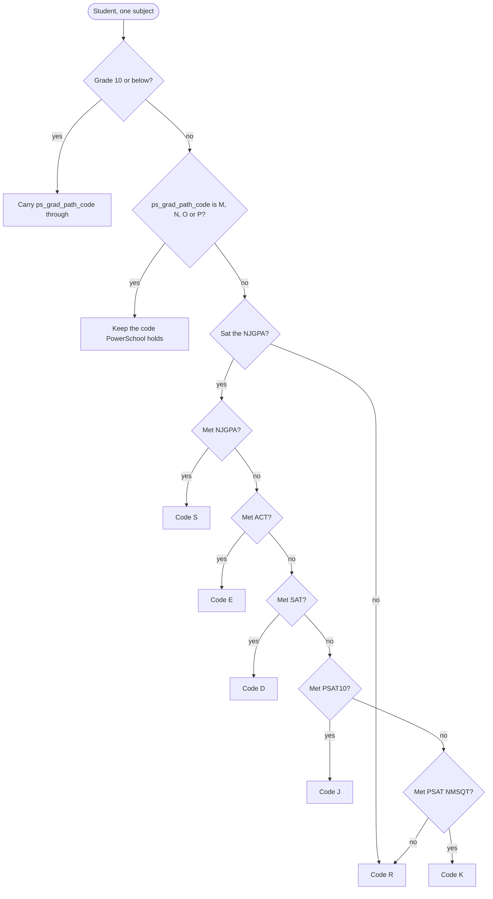
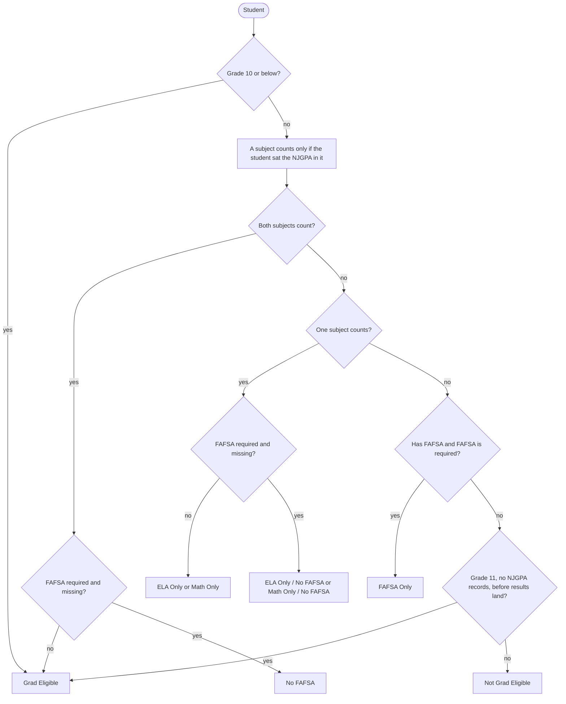

# High School Early Warning Data Model

The **High School Early Warning Dashboard** is a Tableau dashboard owned by the
Data Team. It answers whether a high school student is on track to graduate,
combining three independent feeds — course performance, community service, and
New Jersey graduation pathway status.

Exposure: `high_school_early_warning_dashboard` in
`src/dbt/kipptaf/models/exposures/tableau.yml`. Tableau LSID
`6333e047-e7a9-4d8f-a740-3df30f179d11`, refreshed by Dagster at `0 6 * * *`.

!!! note "Where the business rules live"

    Every threshold on this dashboard is a Tableau calculation, not dbt logic.
    They are written out below because they are otherwise invisible to anyone
    without workbook access, and they were recovered by reading the calculations
    and checking them against the extracts.

## Dashboard tabs

| Tab                    | Purpose                                  | Views to date |
| ---------------------- | ---------------------------------------- | ------------- |
| Landing Page           | Pathway mix by subject and NJGPA attempt | 387           |
| On Track 9th           | Ninth grade promotion status by school   | 516           |
| Early Warning          | Five per-student risk flags              | 1,876         |
| Graduation Eligibility | Progress toward a graduation pathway     | 1,452         |
| Community Service      | Progress toward the 50 hour service goal | 242           |

Confirmed against the Tableau server rather than the older design doc, which
also listed a Graduation Planner Tracker and an Athletic Eligibility tab.
Neither exists; an athletic eligibility spec was written but never built.

The workbook has exactly three embedded datasources, one per `rpt_` model below,
so every threshold on it is a Tableau calculation over those three extracts.

## The three feeds

| Feed                                      | Answers                                   | Upstreams                                                                                                                                                                 |
| ----------------------------------------- | ----------------------------------------- | ------------------------------------------------------------------------------------------------------------------------------------------------------------------------- |
| `rpt_tableau__graduation_requirements`    | Has the student met a graduation pathway? | `int_students__graduation_path_codes`, `int_extracts__student_enrollments_subjects`, `base_powerschool__course_enrollments`                                               |
| `rpt_tableau__community_service`          | Are service hours on track?               | `int_deanslist__students__custom_fields__pivot`, `stg_deanslist__behavior`, `int_extracts__student_enrollments`                                                           |
| `rpt_tableau__hs_early_warning_dashboard` | Grades, GPA, and discipline flags         | `base_powerschool__final_grades`, `base_powerschool__sections`, `int_powerschool__gpa_term`, `int_deanslist__incidents__penalties`, `stg_google_sheets__reporting__terms` |

Miami is out of scope throughout. NJ graduation pathways do not apply in
Florida, and `int_students__graduation_path_codes` filters
`where e.region != 'Miami'`.

## Course performance and discipline

`rpt_tableau__hs_early_warning_dashboard` is the widest of the three feeds. One
row per **student, reporting term and course**, currently around 52,000 rows
over 1,851 students.

Scope: the current academic year, high schools only, one enrollment row per
student (`rn_year = 1`), recently enrolled. Reporting terms come from the terms
sheet with `type = 'RT'`, excluding Summer School and Y1.

What it carries, per row:

- **Attendance** — `ada`, from the enrollment extract.
- **Grades** — the term and Y1 percent and letter grade, adjusted, plus the
  course, credit type and teacher. Grades excluded from GPA are dropped.
- **GPA** — cumulative Y1, projected Y1, and the term GPA.
- **Credits** — earned cumulative, projected, and potential.
- **Discipline** — suspension count and total days for the year, aggregated from
  DeansList incident penalties where the penalty is a suspension.

!!! note "`need_65` was renamed to `need_60`"

    The extract used to alias `gr.need_60` to `need_65`. The calculation was
    always the 0.600 one — the percentage a student needs on remaining work to
    finish the year at 60 — and only the label was wrong.

    60 is correct, because it is the lowest passing grade on both scales the high
    schools actually use: `KIPP NJ 2019 (5-12) Unweighted`, where D- starts at 60,
    and `NCA 2011`, where D starts at 60. The `A, B, C, D` scale does put D at 65,
    but no high school grade rows use it — check which scale is in play before
    reasoning about a cutoff.

    `rpt_tableau__gradebook_dashboard` carries the same mislabel in two places. It
    is deprecated and was deliberately left alone.

### The five early warning flags

This extract carries raw measures; every flag is a Tableau calculation.
Percentages are as of Q1 across all schools, and the last column says whether
the rule was reproduced from the extract.

| Flag                   | Rule                                                                                          | Checked              |
| ---------------------- | --------------------------------------------------------------------------------------------- | -------------------- |
| On track for promotion | `earned_credits_cum_projected` at or above **25 / 50 / 85 / 120** for grades 9 / 10 / 11 / 12 | From the calculation |
| Chronically absent     | `ada` below **90%**                                                                           | 53.8% against 54.2%  |
| Below 2.0 GPA          | `cumulative_y1_gpa_projected` below **2.0**                                                   | 10.4%, exact         |
| Core Fs                | any Y1 grade of F in credit type **MATH, ENG, SCI or SOC**                                    | 75.2% against 75.3%  |
| Over age               | derived from `dob` against grade level                                                        | **Not reproduced**   |

**Both the GPA and the credits flags read projected values on purpose.** A
first-year 9th grader has no real Y1 GPA until the year ends, so scoring them on
`gpa_y1` would either exclude them or mark them at zero for most of the year —
which is exactly when an early warning is worth having. The projection carries
them until a real Y1 figure exists.

So do not "correct" these to the earned or actual columns. Swapping
`cumulative_y1_gpa_projected` for `gpa_y1` gives 8.9% rather than the 10.4% the
dashboard shows, and it breaks the flag hardest for the students it exists for.

The over-age rule resisted reproduction: age beyond grade plus six flags 5.4% of
students and grade plus seven flags 0.5%, against the 2.3% shown, so the real
rule is date-precise in a way the extract alone does not reveal.

!!! warning "The On Track headline depends on a parameter"

    `On Track Indicator` is a switch, not a rule. It resolves to `On Track - All`,
    `On Track - Credits` or `On Track - Core Fs` depending on the viewer's
    parameter selection.

    Credits alone is the loosest. At Newark Collegiate it puts 214 ninth graders
    on track where Overall puts 153. Anyone quoting an on-track percentage needs
    to say which setting produced it.

## Community service

`rpt_tableau__community_service` tracks service hours toward graduation. One row
per student per DeansList community service entry, with students who have logged
nothing appearing once with nulls.

Scope: the current academic year, grade 9 and up, actively enrolled. Service
entries are matched to the enrollment stint they fall inside.

Two different measures of hours travel together, from two different places:

| Column                             | Source                                    | Grain                  |
| ---------------------------------- | ----------------------------------------- | ---------------------- |
| `cs_hours`                         | Parsed out of the DeansList behavior name | Per entry              |
| `grade_9_hours` … `grade_12_hours` | DeansList student custom fields           | Per student, per grade |

**Both are used, and the requirement is 50 cumulative hours.** Tableau adds
them:

```text
Total (Prev Years)             = {FIXED [Student Number] : MAX(g9 + g10 + g11 + g12)}
LOD Student Hours Current Year = {FIXED [Student Number] : SUM([Cs Hours])}
LOD Total All Years            = current year + previous years
```

Grad Goal Met is that total at or above **50**. Checked against the workbook
filtered to Newark Collegiate, where 50 reproduces both grade 11 at 23 students
and grade 12 at 38 exactly, and no other threshold does.

The custom fields are last year and earlier; the behavior log is this year.
Early in the year the total is almost entirely prior years, which makes
`cs_hours` look irrelevant if you only inspect current data — it is not.

!!! warning "Hours are parsed out of a text label"

    `cs_hours` comes from stripping the last five characters off the behavior
    name and casting what remains. It works on today's three values — `1 hour`,
    `5 hours`, `10 hours` — but only by luck: five characters happens to remove
    `" hour"` from one and `"hours"` from the others.

    A new label like `Half hour` or `Community Service - 5 hours` parses to null
    and the `coalesce` turns it into **0**. A student's hours quietly go missing
    and nothing fails. Anyone adding a behavior name in DeansList needs to match
    the existing pattern.

Repeated rows for the same student, date and behavior are **expected**, not a
join fan-out — a student can log the same activity more than once in a day, and
the source holds thousands of such pairs.

!!! warning "If last year's hours stop showing, ask Jabari"

    Community service depends on a step somebody performs in DeansList, and the
    specific action is not recorded anywhere. The symptom to watch for is a prior
    year's hours disappearing from the dashboard.

    If that happens, flag Jabari before investigating the models — this is not a
    pipeline failure and there is nothing in dbt to fix. Whoever learns what the
    step actually is should write it down here.

## Graduation pathways

`int_students__graduation_path_codes` computes `final_grad_path_code` — the
letter New Jersey uses to report which pathway a student met. It is not only a
dashboard input: it also flows through `rpt_powerschool__autocomm_students` into
the PowerSchool fields `s_nj_stu_x__graduation_pathway_ela` and
`s_nj_stu_x__graduation_pathway_math`, dropped daily for AutoComm import. **A
wrong code here becomes a wrong state submission.** The same fields are the
model's own input, read back through `stg_powerschool__s_nj_stu_x` as
`ps_grad_path_code`, so a code PowerSchool already holds is never overridden.
The write-back is no longer restricted to 12th grade.

For the working rules, cut score maintenance, and the failure modes, use the
`graduation-pathways` skill. The essentials:

- NJGPA is **dual-vendor**. `stg_pearson__njgpa` carries the retired form on a
  cut of 725 and scores observed from 650 to 850, through the Fall 2025
  administration. `stg_cambium__njgpa` carries the adaptive **NJGPA-A** with a
  cut of 450 and scores observed from 300 to 562, from Spring 2026 onward. Those
  ranges are what our rows contain, not published scale bounds -- NJDOE
  publishes only the cut score, per graduating class. Both report the same
  `assessment_name` and the same `testcode`.
- `assessment_version` is what tells them apart, set as a literal in each
  vendor's staging model and carried up through `int_pearson__all_assessments`.
- Cut scores live in a hand-maintained Google Sheet
  (`stg_google_sheets__student_graduation_path_cutoffs`), keyed on `cohort` +
  `discipline` + `score_type` + `assessment_version`.
- `cohort` is frozen at high school entry, which is correct for NJ's 4-year
  adjusted cohort graduation rate but means a retained or accelerated student
  sits the assessment with a different class than their cohort.

### Which pathway code a student gets

Produces `final_grad_path_code`, the letter written back to the state. FAFSA
plays no part in it — a student with no FAFSA who passed the NJGPA still gets
`S`.



There is no retry loop in the model. A student re-sitting an assessment simply
has a new score the next time it builds, and the chain runs again from the top.

The landing page charts exactly this column, under the display labels in
`final_grad_path_name`:

| Code | Label      | Code | Label               |
| ---- | ---------- | ---- | ------------------- |
| `S`  | NJGPA      | `M`  | DLM                 |
| `E`  | ACT        | `N`  | Portfolio           |
| `D`  | SAT        | `O`  | Met No Requirements |
| `J`  | PSAT10     | `P`  | Incomplete Credits  |
| `K`  | PSAT NMSQT | `R`  | Default             |

The label is decoded in `int_students__graduation_path_codes` rather than in the
workbook, so the dashboard and any other consumer read the same string.
`No Data` on the dashboard is not a label -- it is a student with no row at all.
`E`, `O` and `P` are mapped but have never appeared in our data.

For a student coded straight from PowerSchool, the same label is produced twice
in two different models -- once as `pathway_option` in
`int_students__graduation_pathway_scores`, which `test_type` passes through, and
once here. The lists have to stay identical, so
`int_students__graduation_path_codes__labels_agree` fails the build if they
drift. Code `O` had already drifted before that test existed, reading
`No Pathway` in dbt and `Met No Requirements` in the workbook.

That makes the landing page the fastest check on this model's health. NJGPA is
the pathway nearly every student is supposed to meet, so the `S` band should be
the largest one. When it is a sliver and `Default` is enormous, scores are not
reaching their cut scores -- which is what a cut score sheet missing a cohort or
an `assessment_version` looks like from the outside. Before the adaptive cut
scores landed, the whole network showed 2 students on `S` and 217 on `D`, and
that shape on the landing page is what to look for if it happens again.

### Which eligibility label a student gets

Produces `grad_eligibility`, which is what the dashboard shows. This is where
FAFSA enters. "FAFSA required" means grade 12 and on or after the January
deadline of their senior year; FAFSA never gates an 11th grader.



Every `M` and `N` on the dashboard is `ps_grad_path_code` carried straight
through -- the model never assigns them. It does guarantee those students a row
per subject even though they have no score, because the extract filters on
`scale_score is not null` and they would otherwise vanish from the dashboard
entirely rather than show as IEP or portfolio.

The FAFSA branches produce nothing between July and December. `fafsa_required`
is grade 12 AND on or after the January deadline, so for half the year every
FAFSA label is unreachable by construction. Finding zero of them in a summer
build is correct, not a bug.

#### The eligibility combinations sheet, retired

This label used to come from a hand-maintained Google Sheet that enumerated
every combination of the boolean inputs and named the label for each. Any
combination nobody had thought to add fell through to the literal string
`New category. Need new logic.`, which rendered on the dashboard as its own
colour and meant a student's status was simply unknown until someone edited the
sheet. It was showing on 4 students at the point the sheet was retired.

The `CASE` above replaces it. There is no combination it cannot label, so that
category no longer exists and the sheet is gone. If a new rule arrives from the
state, it is a branch in the model, not a row in a spreadsheet.

### How the model is put together

Two models, split by grain:

- `int_students__graduation_pathway_scores` pairs every student with every
  pathway their cohort has a cut score for, and decides whether their score
  cleared it. One row per student, subject, score type, assessment version and
  sitting. Nothing is filtered out, so the dashboard can show near misses.
- `int_students__graduation_path_codes` rolls that up into a per-student
  standing and produces `final_grad_path_code` and `grad_eligibility`.

`grad_eligibility` is derived, not looked up. It used to come from a
hand-maintained sheet joined on eight boolean columns, which is now retired.
Three rules drive it:

1. A subject only counts if the student sat the NJGPA in it.
2. FAFSA is required to graduate, but is not counted against a student until the
   January deadline of their senior year, and never gates an 11th grader.
3. An 11th grader holding NJGPA records is treated as a 12th grader, minus
   FAFSA. Testing ahead of their peers usually means they are behind on credits.
   The grace period is only for 11th graders with no records yet, and it ends
   once results land in late June.

### Picking a student's best score

A student can hold scores on both NJGPA versions — eight do today, and two of
them failed the retired test by a few points and then passed the adaptive one.
The two scales are not comparable, so `rn_highest` ranks by **whether the score
passed, then by how far it cleared its own cut score**, not by the raw score.

This matters because consumers filter `rn_highest = 1` to get one row per score
type. Ranking on the raw score would put a failing 700 on the retired scale
above a passing 500 on the adaptive one, and the dashboard would show the
failure while hiding the pass. A test asserts a passing score is never ranked
behind a failing one.

The roll-up is separate and already handles this: `met_njgpa` is a maximum
across both versions, so passing either one counts.

### Portfolio appeals

A portfolio appeal is pathway code `N`, granted by NJDOE and imported into each
region's PowerSchool by hand from PDFs the C3 team sends. There is no pipeline;
the model only reads the resulting `ps_grad_path_code`. The full procedure,
including the Excel workbook that must never be opened in Google Sheets, is in
the `graduation-pathways` skill.

### Transfer scores are entered by hand in PowerSchool

Transfer students' NJGPA scores do not arrive in a vendor file. School staff
enter them per instance at **District Management > Tests > Standardized Tests**,
then **Edit Scores**.

Both forms share one holder named `NJGPA/NJGPA-A`, type State, with four score
fields. `int_powerschool__state_assessments_transfer_scores` reads the version
off the `-A` suffix, then strips the suffix so the code still joins to the
sheet:

| Score field | `assessment_version` | `testcode` |
| ----------- | -------------------- | ---------- |
| `ELAGP`     | `NJGPA`              | `ELAGP`    |
| `MATGP`     | `NJGPA`              | `MATGP`    |
| `ELAGP-A`   | `NJGPA-A`            | `ELAGP`    |
| `MATGP-A`   | `NJGPA-A`            | `MATGP`    |

User guide, which **must be updated whenever transfer-score entry changes**:
[Adding NJGPA Scores to PowerSchool for Transfer Students](https://teamschools.zendesk.com/hc/en-us/articles/20823542157463--User-Guide-Adding-NJGPA-Scores-to-PowerSchool-for-Transfer-Students)

!!! warning "Paterson needs this configured first"

    Only the Newark and Camden PowerSchool instances have the `NJGPA/NJGPA-A`
    holder. Paterson has no NJGPA data at all today, so it contributes no rows —
    which is correct, not a defect.

    When Paterson first receives an NJGPA transfer score, its instance needs the
    same setup first: a standardized test named exactly `NJGPA/NJGPA-A`, type
    State, with all four score fields above. A score entered before the holder
    exists cannot be captured, and there is no error to notice — the model
    filters on the holder name, so a missing or differently-named holder simply
    yields zero rows.

    The score field names matter as much as the holder name. Anything outside
    `ELAGP` / `MATGP` / `ELAGP-A` / `MATGP-A` produces a testcode that matches no
    cut score row; the `accepted_values` test on `testcode` turns that into a
    build failure rather than a silently dropped score.
