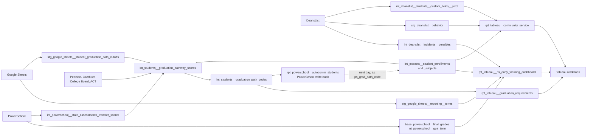
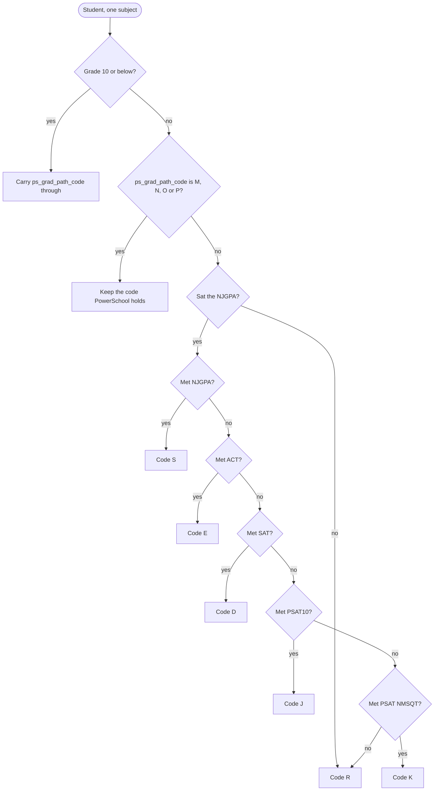
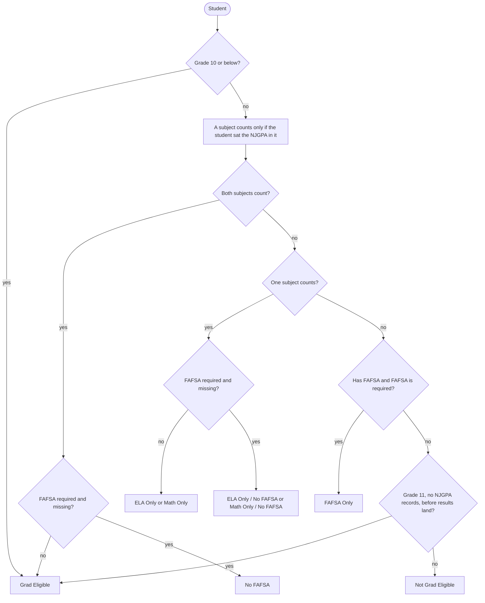

# High School Early Warning Data Model

The **High School Early Warning Dashboard** is a Tableau dashboard owned by the
Data Team; Walters owns the family from 2026-09-30. It answers whether a high
school student is on track to graduate, combining three independent feeds —
course performance, community service, and New Jersey graduation pathway status.
School leaders and the high school teams use it to find students who need
support before the end of the year.

Claude sessions working on this family use the `hs-early-warning` skill, which
routes graduation pathway work to the `graduation-pathways` skill.

Exposure: `high_school_early_warning_dashboard` in
`src/dbt/kipptaf/models/exposures/tableau.yml`. Tableau LSID
`6333e047-e7a9-4d8f-a740-3df30f179d11`, refreshed by Dagster at `0 6 * * *`.

!!! note "Where the business rules live"

    Every threshold on this dashboard is a Tableau calculation, not dbt logic.
    They are written out below because they are otherwise invisible to anyone
    without workbook access.

## How it fits together


```mermaid
flowchart LR
    ps[PowerSchool] --> grades[base_powerschool__final_grades<br/>int_powerschool__gpa_term]
    dl[DeansList] --> pen[int_deanslist__incidents__penalties]
    dl --> beh[stg_deanslist__behavior]
    dl --> cf[int_deanslist__students__custom_fields__pivot]
    sheets[Google Sheets] --> terms[stg_google_sheets__reporting__terms]
    sheets --> cut[stg_google_sheets__student_graduation_path_cutoffs]
    enr[int_extracts__student_enrollments<br/>and _subjects] --> ew
    enr --> cs
    enr --> scores
    vendors[Pearson, Cambium,<br/>College Board, ACT] --> scores[int_students__graduation_pathway_scores]
    ps --> ts[int_powerschool__state_assessments_transfer_scores] --> scores
    cut --> scores
    scores --> codes[int_students__graduation_path_codes]
    grades --> ew[rpt_tableau__hs_early_warning_dashboard]
    pen --> ew
    terms --> ew
    beh --> cs[rpt_tableau__community_service]
    cf --> cs
    codes --> gr[rpt_tableau__graduation_requirements]
    codes --> ac[rpt_powerschool__autocomm_students<br/>PowerSchool write-back]
    ac -. next day, as ps_grad_path_code .-> enr
    ew --> tab[Tableau workbook]
    cs --> tab
    gr --> tab
```

## Dashboard tabs

| Tab                    | Purpose                                  | Extract                                   |
| ---------------------- | ---------------------------------------- | ----------------------------------------- |
| Landing Page           | Pathway mix by subject and NJGPA attempt | `rpt_tableau__graduation_requirements`    |
| On Track 9th           | Ninth grade promotion status by school   | `rpt_tableau__hs_early_warning_dashboard` |
| Early Warning          | Five per-student risk flags              | `rpt_tableau__hs_early_warning_dashboard` |
| Graduation Eligibility | Progress toward a graduation pathway     | `rpt_tableau__graduation_requirements`    |
| Community Service      | Progress toward the 50 hour service goal | `rpt_tableau__community_service`          |

The workbook has exactly three embedded datasources, one per `rpt_` model below,
so every threshold on it is a Tableau calculation over those three extracts.
Athletic eligibility, once planned as a tab here, is its own tracker with its
own skill.

## The three feeds

| Feed                                      | Answers                                   | Upstreams                                                                                                                                                                                                      |
| ----------------------------------------- | ----------------------------------------- | -------------------------------------------------------------------------------------------------------------------------------------------------------------------------------------------------------------- |
| `rpt_tableau__graduation_requirements`    | Has the student met a graduation pathway? | `int_extracts__student_enrollments_subjects`, `int_students__graduation_path_codes`, `base_powerschool__course_enrollments`                                                                                    |
| `rpt_tableau__community_service`          | Are service hours on track?               | `int_deanslist__students__custom_fields__pivot`, `stg_deanslist__behavior`, `int_extracts__student_enrollments`                                                                                                |
| `rpt_tableau__hs_early_warning_dashboard` | Grades, GPA, and discipline flags         | `int_extracts__student_enrollments`, `stg_google_sheets__reporting__terms`, `base_powerschool__final_grades`, `base_powerschool__sections`, `int_powerschool__gpa_term`, `int_deanslist__incidents__penalties` |

Miami is out of scope for graduation pathways: NJ pathways do not apply in
Florida, and both `int_students__graduation_pathway_scores` and
`rpt_tableau__graduation_requirements` filter `region != 'Miami'`. The other two
feeds have no region filter. Miami Tech appears on the Community Service tab,
but not on Early Warning: it has no reporting term rows, and its grades live in
Focus, which the grades models do not read (see Known issues).

The two graduation feeds are scoped differently on purpose, which looks like an
inconsistency and is not. `rpt_tableau__graduation_requirements` filters cohort
to a window of `current_academic_year - 1` through `current_academic_year + 5`
and excludes Miami; `rpt_tableau__hs_early_warning_dashboard` does neither. The
window is there because the graduation view deliberately reaches beyond the
graduating class -- 11th graders are in scope, since they sit the NJGPA -- so it
spans several cohorts rather than one. The early warning view has no cohort
concern at all; it reports on whoever is enrolled now.

## Course performance and discipline

`rpt_tableau__hs_early_warning_dashboard` is the widest of the three feeds. One
row per **student, reporting term and course**, tested by a uniqueness test on
`student_number`, `reporting_term` and `course_number`. A student with no stored
grade for a term keeps one row with a null course.

Scope: the current academic year, high schools only, one enrollment row per
student (`rn_year = 1`), recently enrolled. Reporting terms come from the terms
sheet with `type = 'RT'`, excluding Summer School and Y1.

What it carries, per row:

- **Attendance** — `ada`, from the enrollment extract.
- **Grades** — the term and Y1 percent and letter grade, adjusted, plus the
  course, credit type and teacher. Grades excluded from GPA are dropped.
- **GPA** — cumulative Y1, projected Y1, and the term GPA.
- **Credits** — earned cumulative, projected, and potential.
- **Discipline** — suspension count and total days for the year, aggregated from
  DeansList incident penalties where the penalty is a suspension.

!!! note "Why `need_60` uses 60"

    `need_60` is the grade a student needs in that term for their year-to-date
    course grade, through that term, to reach 60; on the last term's row that is
    what they need to finish the year at 60. 60 is correct, because it is the lowest passing grade on both scales the high
    schools actually use: `KIPP NJ 2019 (5-12) Unweighted`, where D- starts at 60,
    and `NCA 2011`, where D starts at 60. The `A, B, C, D` scale does put D at 65,
    but no high school grade rows use it — check which scale is in play before
    reasoning about a cutoff.

### The five early warning flags

This extract carries raw measures; every flag is a Tableau calculation. Each
rule below except over age reproduces the dashboard's figures from the extract.

| Flag                   | Rule                                                                                          |
| ---------------------- | --------------------------------------------------------------------------------------------- |
| On track for promotion | `earned_credits_cum_projected` at or above **25 / 50 / 85 / 120** for grades 9 / 10 / 11 / 12 |
| Chronically absent     | `ada` below **90%**                                                                           |
| Below 2.0 GPA          | `cumulative_y1_gpa_projected` below **2.0**                                                   |
| Core Fs                | any Y1 grade of F in credit type **MATH, ENG, SCI or SOC**                                    |
| Over age               | derived from `dob` against grade level; not reproduced from the extract                       |

**Both the GPA and the credits flags read projected values on purpose.** A
first-year 9th grader has no real Y1 GPA until the year ends, so scoring them on
`gpa_y1` would either exclude them or mark them at zero for most of the year —
which is exactly when an early warning is worth having. The projection carries
them until a real Y1 figure exists.

So do not "correct" these to the earned or actual columns. Swapping
`cumulative_y1_gpa_projected` for `gpa_y1` gives 8.9% rather than the 10.4% the
dashboard shows, and it breaks the flag hardest for the students it exists for.

The over-age rule resisted reproduction: age beyond grade plus six flags 5.4% of
students and grade plus seven flags 0.5%, against the 2.3% shown, so the real
rule is date-precise in a way the extract alone does not reveal.

!!! warning "The On Track headline depends on a parameter"

    `On Track Indicator` is a switch, not a rule. It resolves to `On Track - All`,
    `On Track - Credits` or `On Track - Core Fs` depending on the viewer's
    parameter selection.

    Credits alone is the loosest. At Newark Collegiate it puts 214 ninth graders
    on track where Overall puts 153. Anyone quoting an on-track percentage needs
    to say which setting produced it.

## Community service

`rpt_tableau__community_service` tracks service hours toward graduation. One row
per student per DeansList community service entry (`dl_said`, tested unique with
`student_number`), with students who have logged nothing appearing once with
nulls.

Scope: the current academic year, grade 9 and up, actively enrolled, one
enrollment per student (`rn_year = 1`). Service entries count only when dated
inside that enrollment, so hours logged during an earlier stint the same year (a
mid-year transfer) do not show.

Two different measures of hours travel together, from two different places:

| Column                             | Source                                  | Grain                  |
| ---------------------------------- | --------------------------------------- | ---------------------- |
| `cs_hours`                         | Parsed from the DeansList behavior name | Per entry              |
| `grade_9_hours` … `grade_12_hours` | DeansList student custom fields         | Per student, per grade |

**Both are used, and the requirement is 50 cumulative hours.** Tableau adds
them:

```text
Total (Prev Years)             = {FIXED [Student Number] : MAX(g9 + g10 + g11 + g12)}
LOD Student Hours Current Year = {FIXED [Student Number] : SUM([Cs Hours])}
LOD Total All Years            = current year + previous years
```

Grad Goal Met is that total at or above **50**.

The custom fields are last year and earlier; the behavior log is this year.
Early in the year the total is almost entirely prior years, which makes
`cs_hours` look irrelevant if you only inspect current data — it is not.

!!! warning "Hours are parsed out of a text label"

    `cs_hours` is the number at the start of the behavior name, parsed in
    `stg_deanslist__behavior`. Today's three names — `1 hour`, `5 hours`,
    `10 hours` — all start with one.

    A new name like `Half hour` or `Community Service - 5 hours` parses to null
    and the extract's `coalesce` turns it into **0**. A student's hours quietly
    go missing and nothing fails. Anyone adding a behavior name in DeansList
    needs to start it with the number of hours.

Repeated rows for the same student, date and behavior are **expected**, not a
join fan-out — a student can log the same activity more than once in a day, and
the source holds thousands of such pairs.

!!! warning "If last year's hours stop showing, ask Jabari"

    The grade custom fields hold last year's behavior-log totals, which someone
    writes into DeansList once a year. In September 2026, about 96% of students
    who logged hours the year before had a custom field equal to the sum of
    those entries. Jabari performs the step; the exact procedure is not written
    down anywhere yet.

    The symptom of it not having happened is a prior year's hours disappearing
    from the dashboard. Flag Jabari before investigating the models — there is
    nothing in dbt to fix.

    A disabled model, `rpt_gsheets__community_service_upload`, computes the same
    per-grade totals in upload shape. It has no exposure and still uses an older
    hours parse; confirm with Jabari what he uploads before re-enabling it.

## Graduation pathways

`int_students__graduation_path_codes` computes `final_grad_path_code` — the
letter New Jersey uses to report which pathway a student met. It is not only a
dashboard input: it also flows through `rpt_powerschool__autocomm_students` into
the PowerSchool fields `s_nj_stu_x__graduation_pathway_ela` and
`s_nj_stu_x__graduation_pathway_math`, dropped daily for AutoComm import. **A
wrong code here becomes a wrong state submission.** The same fields are the
model's own input, read back through `stg_powerschool__s_nj_stu_x` as
`ps_grad_path_code` (unpivoted per subject into
`int_extracts__student_enrollments_subjects`). For grades 10 and below the model
carries that code through unchanged, and an `M`, `N`, `O` or `P` is never
overridden at any grade. For grade 11 and up every other code is recomputed on
each build, so a code the write-back sent earlier can change when a new score
lands. The write-back covers every grade the model scores, not only 12th grade.

For the working rules, cut score maintenance, and the failure modes, use the
`graduation-pathways` skill. The essentials:

- NJGPA is **dual-vendor**. `stg_pearson__njgpa` carries the retired form on a
  cut of 725 and scores observed from 650 to 850, through the Fall 2025
  administration. `stg_cambium__njgpa` carries the adaptive **NJGPA-A** with a
  cut of 450 and scores observed from 300 to 562, from Spring 2026 onward. Those
  ranges are what our rows contain, not published scale bounds -- NJDOE
  publishes only the cut score, per graduating class. Both report the same
  `assessment_name` and the same `testcode`.
- `assessment_version` is what tells them apart, set as a literal in each
  vendor's staging model and carried up through
  `int_assessments__state_nj_scores`.
- Cut scores live in a hand-maintained Google Sheet
  (`stg_google_sheets__student_graduation_path_cutoffs`), keyed on `cohort` +
  `discipline` + `score_type` + `assessment_version`.
- `cohort` is frozen at high school entry, which is correct for NJ's 4-year
  adjusted cohort graduation rate but means a retained or accelerated student
  sits the assessment with a different class than their cohort.
- The cut score join therefore keys on the lesser of `cohort` and
  `cohort_primary`, the soonest class the student could graduate with, not on
  `cohort` alone. It takes that lesser value with `min` over an `unnest` of the
  two rather than with `least`, because `least` returns NULL when either input
  is NULL and a NULL key matches no cut score row at all. `cohort_primary` is
  `(academic_year + 13) - grade_level`, so it moves when the grade level moves.
  Neither column works alone. A student who already skipped a grade needs
  `cohort_primary`. A student repeating a grade who recovers credits over the
  summer needs `cohort`, because the recovery leaves no enrollment row and the
  model cannot see it until the grade level moves the next fall. Taking
  whichever is earlier is right in both cases.
- Two costs come with that choice. A student retained more than once keys to a
  class that can predate the assessment version they sat, and NJGPA-A rows exist
  for the class of 2027 only, so that student matches nothing. An 11th grader
  who graduates without ever being placed in grade 12 is never checked for
  FAFSA, because `fafsa_required` reads `grade_level = 12`. Operations has to
  watch for the second one, because the warehouse cannot see it.

### Which pathway code a student gets

Produces `final_grad_path_code`, the letter written back to the state. FAFSA
plays no part in it — a student with no FAFSA who passed the NJGPA still gets
`S`.


```mermaid
flowchart TD
    start([Student, one subject]) --> g10{Grade 10 or below?}
    g10 -->|yes| keep[Carry ps_grad_path_code through]
    g10 -->|no| mnop{ps_grad_path_code is M, N, O or P?}
    mnop -->|yes| keep2[Keep the code PowerSchool holds]
    mnop -->|no| att{Sat the NJGPA?}
    att -->|no| r[Code R]
    att -->|yes| njgpa{Met NJGPA?}
    njgpa -->|yes| s[Code S]
    njgpa -->|no| act{Met ACT?}
    act -->|yes| e[Code E]
    act -->|no| sat{Met SAT?}
    sat -->|yes| d[Code D]
    sat -->|no| p10{Met PSAT10?}
    p10 -->|yes| j[Code J]
    p10 -->|no| pnm{Met PSAT NMSQT?}
    pnm -->|yes| k[Code K]
    pnm -->|no| r
```

There is no retry loop in the model. A student re-sitting an assessment simply
has a new score the next time it builds, and the chain runs again from the top.

The landing page charts exactly this column, under the display labels in
`final_grad_path_name`:

| Code | Label      | Code | Label               |
| ---- | ---------- | ---- | ------------------- |
| `S`  | NJGPA      | `M`  | DLM                 |
| `E`  | ACT        | `N`  | Portfolio           |
| `D`  | SAT        | `O`  | Met No Requirements |
| `J`  | PSAT10     | `P`  | Incomplete Credits  |
| `K`  | PSAT NMSQT | `R`  | Default             |

The label is decoded in `int_students__graduation_path_codes` rather than in the
workbook, so the dashboard and any other consumer read the same string.
`test_type` falls back to `No Data` in `int_students__graduation_path_codes`
when there is no pathway code, but those rows have no score and the extract
drops them, so on the dashboard `No Data` means a student with no pathway row at
all. `E`, `O` and `P` are mapped but rare; do not read their absence as a
defect.

For a student coded straight from PowerSchool, the same label is produced twice
in two different models -- once as `pathway_option` in
`int_students__graduation_pathway_scores`, which `test_type` passes through, and
once here. The lists have to stay identical, so
`int_students__graduation_path_codes__labels_agree` fails the build if they
drift.

That makes the landing page the fastest check on this model's health. NJGPA is
the pathway nearly every student is supposed to meet, so the `S` band should be
the largest one. When it is a sliver and `Default` is enormous, scores are not
reaching their cut scores -- which is what a cut score sheet missing a cohort or
an `assessment_version` looks like from the outside: a handful of students on
`S` and hundreds on `D`.

### Which eligibility label a student gets

Produces `grad_eligibility`, which is what the dashboard shows. This is where
FAFSA enters. "FAFSA required" means grade 12 and on or after the January
deadline of their senior year; FAFSA never gates an 11th grader.


```mermaid
flowchart TD
    start([Student]) --> g10{Grade 10 or below?}
    g10 -->|yes| ge[Grad Eligible]
    g10 -->|no| counts[A subject counts only if the student sat the NJGPA in it]
    counts --> both{Both subjects count?}
    both -->|yes| f1{FAFSA required and missing?}
    f1 -->|no| ge
    f1 -->|yes| nf[No FAFSA]
    both -->|no| one{One subject counts?}
    one -->|yes| f2{FAFSA required and missing?}
    f2 -->|no| only[ELA Only or Math Only]
    f2 -->|yes| onlynf[ELA Only / No FAFSA or Math Only / No FAFSA]
    one -->|no| hasf{Has FAFSA and FAFSA is required?}
    hasf -->|yes| fo[FAFSA Only]
    hasf -->|no| g11{Grade 11, no NJGPA records, before results land?}
    g11 -->|yes| ge
    g11 -->|no| nge[Not Grad Eligible]
```

Every `M` and `N` on the dashboard is `ps_grad_path_code` carried straight
through -- the model never assigns them. It does guarantee those students a row
per subject even though they have no score, because the extract filters on
`scale_score is not null` and they would otherwise vanish from the dashboard
entirely rather than show as IEP or portfolio.

The FAFSA branches produce nothing between July and December. `fafsa_required`
is grade 12 AND on or after the January deadline, so for half the year every
FAFSA label is unreachable by construction. Finding zero of them in a summer
build is correct, not a bug.

### How the model is put together

Two models, split by grain:

- `int_students__graduation_pathway_scores` pairs every student with every
  pathway their cohort has a cut score for, and decides whether their score
  cleared it. One row per student, subject, score type, assessment version and
  sitting. Failing scores are kept, so the dashboard can show near misses. It
  keeps undergraduate students in grade 8 and up outside Miami, and only
  complete NJGPA ELA and Math scores.
- `int_students__graduation_path_codes` keeps actively enrolled students
  (`enroll_status = 0`) and rolls that up into a per-student standing and
  produces `final_grad_path_code`, its display label `final_grad_path_name`, and
  `grad_eligibility`.

`grad_eligibility` is derived in the model, so there is no combination it cannot
label; a new state rule is a new branch in the model. Three rules drive it:

1. A subject only counts if the student sat the NJGPA in it.
2. FAFSA is required to graduate, but is not counted against a student until the
   January deadline of their senior year, and never gates an 11th grader.
3. An 11th grader holding NJGPA records is treated as a 12th grader, minus
   FAFSA. Testing ahead of their peers usually means they are behind on credits.
   The grace period is only for 11th graders with no records yet, and it ends
   once results land in late June.

### Picking a student's best score

A student can hold scores on both NJGPA versions, and some failed the retired
test by a few points and then passed the adaptive one. The two scales are not
comparable, so `rn_highest` ranks by **whether the score passed, then by how far
it cleared its own cut score**, not by the raw score.

This matters because consumers filter `rn_highest = 1` to get one row per score
type. Ranking on the raw score would put a failing 700 on the retired scale
above a passing 500 on the adaptive one, and the dashboard would show the
failure while hiding the pass. A test asserts a passing score is never ranked
behind a failing one.

The roll-up is separate and already handles this: `met_njgpa` is a maximum
across both versions, so passing either one counts.

### Portfolio appeals

A portfolio appeal is pathway code `N`, granted by NJDOE and imported into each
region's PowerSchool by hand from the decision PDFs the C3 team sends each June.
There is no pipeline; the model only reads the resulting `ps_grad_path_code`. A
script in the `graduation-pathways` skill turns the PDFs into the four
PowerSchool import files (one per region and subject) and checks every state ID
resolves to a student in the right region. The skill has the full procedure and
the check to run after the import.

### Transfer scores are entered by hand in PowerSchool

Transfer students' NJGPA scores do not arrive in a vendor file. School staff
enter them per instance at **District Management > Tests > Standardized Tests**,
then **Edit Scores**.

Both forms share one holder named `NJGPA/NJGPA-A`, type State, with four score
fields. `int_powerschool__state_assessments_transfer_scores` reads the version
off the `-A` suffix, then strips the suffix so the code still joins to the
sheet:

| Score field | `assessment_version` | `testcode` |
| ----------- | -------------------- | ---------- |
| `ELAGP`     | `NJGPA`              | `ELAGP`    |
| `MATGP`     | `NJGPA`              | `MATGP`    |
| `ELAGP-A`   | `NJGPA-A`            | `ELAGP`    |
| `MATGP-A`   | `NJGPA-A`            | `MATGP`    |

User guide, which **must be updated whenever transfer-score entry changes**:
[Adding NJGPA Scores to PowerSchool for Transfer Students](https://teamschools.zendesk.com/hc/en-us/articles/20823542157463--User-Guide-Adding-NJGPA-Scores-to-PowerSchool-for-Transfer-Students)

!!! warning "Paterson needs this configured first"

    Only the Newark and Camden PowerSchool instances have the `NJGPA/NJGPA-A`
    holder. Paterson has no NJGPA data at all today, so it contributes no rows —
    which is correct, not a defect.

    When Paterson first receives an NJGPA transfer score, its instance needs the
    same setup first: a standardized test named exactly `NJGPA/NJGPA-A`, type
    State, with all four score fields above. A score entered before the holder
    exists cannot be captured, and there is no error to notice — the model
    filters on the holder name, so a missing or differently-named holder simply
    yields zero rows.

    The score field names matter as much as the holder name. Anything outside
    `ELAGP` / `MATGP` / `ELAGP-A` / `MATGP-A` produces a testcode that matches no
    cut score row; the `accepted_values` test on `testcode` turns that into a
    build failure rather than a silently dropped score.

## Start-of-year procedure

The dbt layer rolls over on its own. All three feeds filter on
`var("current_academic_year")`, which is set per project in `dbt_project.yml`
and rolls each July, so no SQL changes when the year advances.

Four things need a human. Two of them have no owner and no schedule.

### Step 1 — Cut scores, whenever NJDOE publishes

The Academics team shares the NJDOE cut-off documentation; the data team applies
it to `stg_google_sheets__student_graduation_path_cutoffs`. The runbook is in
the `graduation-pathways` skill.

This is not an annual task. NJDOE publishes per graduating class, and only after
that class has sat and been scored, so rows arrive when they arrive.

**Do not add a cut score row for a cohort whose threshold NJDOE has not
published.** A guessed threshold silently marks students as having met or missed
a pathway nobody has defined, and `final_grad_path_code` goes to the state. A
cohort with no rows is expected, not a gap to close -- as of September 2026 that
is the classes of 2028, 2029 and 2030.

The enforcement is the `scores_have_cutoffs` test, which warns and names the
students who cannot be scored rather than letting them fall through to a default
`R`. Hand that list to the high school team.

Run that test again after the new rows land, and read what is left rather than
assuming the rows closed it. Three causes leave a student unscoreable and the
new rows fix only the first: a class NJDOE has not published, a twice-retained
student whose cut score cohort key predates the assessment version they sat, and
a student holding no NJGPA record at all. Split the remainder by cause before
handing it over -- the second needs a records decision and the third needs
nothing.

### Step 2 — Community service custom fields

Jabari writes last year's community service totals into each student's grade
custom field in DeansList. There is no trigger and no schedule, and the steps
are not written down. Open questions for him: which file he uploads from,
whether the upload adds to the field or replaces it, and how outside hours for
transfer students are handled.

The symptom of it not having happened is a prior year's hours disappearing from
the dashboard -- see the warning under Community service. There is nothing in
dbt to fix when that happens, so asking Jabari is the procedure. The
`hs-early-warning` skill has a check that shows whether the upload happened.

### Step 3 — Reporting terms

Anyone on the data team, whenever they have time. No owner, no trigger.

`stg_google_sheets__reporting__terms` needs rows of type `RT` for the new
academic year for all three NJ high schools. AY2026-27 is in place. The join in
`rpt_tableau__hs_early_warning_dashboard` is an INNER join, so a school missing
its `RT` rows silently disappears from the extract rather than raising anything.

### Step 4 — Check nothing else needs it

Unknown, and never confirmed. The three inputs above are the ones that have been
traced; nobody has verified the list is complete. Treat this as an open question
rather than a clean bill of health, and add to it when the next rollover turns
something up.

## Supporting models

In the family:

- `int_students__graduation_pathway_scores` and
  `int_students__graduation_path_codes` -- see _How the model is put together_.
  `int_students__graduation_path_codes` is also read by
  `rpt_powerschool__autocomm_students` (the PowerSchool write-back) and
  `int_kippadb__roster`, so a change there moves both.
- `stg_google_sheets__student_graduation_path_cutoffs` -- the cut score sheet.
- `int_powerschool__state_assessments_transfer_scores` -- hand-entered transfer
  NJGPA scores.
- `int_deanslist__students__custom_fields__pivot` -- DeansList custom fields,
  one row per student, unioned across regions.
- `rpt_gsheets__community_service_upload` -- disabled; see _Community service_.

Shared upstreams, one line each:

- `int_extracts__student_enrollments` -- the roster for Early Warning and
  Community Service, joined on `student_number` (and `studentid`, `yearid`,
  `_dbt_source_project` for PowerSchool joins).
- `int_extracts__student_enrollments_subjects` -- the per-subject roster for
  Graduation Eligibility, joined on `student_number` and `discipline`.
- `base_powerschool__final_grades` and `base_powerschool__sections` -- term and
  Y1 grades, course and teacher, joined on `studentid`, `yearid`, term name and
  `_dbt_source_project`.
- `int_powerschool__gpa_term` -- term and Y1 GPA, joined the same way.
- `base_powerschool__course_enrollments` -- the College and Career section for
  Graduation Eligibility.
- `int_deanslist__incidents__penalties` -- suspensions, summed per student and
  year.
- `stg_deanslist__behavior` -- community service entries.
- `stg_google_sheets__reporting__terms` -- the `RT` reporting terms.
- `int_assessments__state_nj_scores` (documented with the STAT dashboard) and
  `int_assessments__college_assessment` (documented with CARAT) -- the scores
  pathway scoring reads.

## Inputs

| Input                                | Kept by             | When                        |
| ------------------------------------ | ------------------- | --------------------------- |
| Cut score Google Sheet               | Data team           | When NJDOE publishes        |
| Reporting terms Google Sheet (`RT`)  | Data team           | Before each school year     |
| DeansList community service entries  | School staff        | All year                    |
| DeansList grade custom fields        | Jabari              | Once a year, after rollover |
| Portfolio appeal PDFs                | C3 team, from NJDOE | June                        |
| Transfer NJGPA scores in PowerSchool | School staff        | As transfers arrive         |

## Known issues, need to fix

### A student in two College and Career courses repeats on Graduation Eligibility

`rpt_tableau__graduation_requirements` left-joins the student's College and
Career section, keeping the first enrollment per course number. A student
enrolled in two different College and Career courses gets every pathway row once
per course. Fewer than five students were affected in September 2026. The
uniqueness test on `student_number`, `discipline` and `test_type` warns while it
happens:

```sql
select count(*) as duplicate_keys,
from (
    select student_number, discipline, test_type,
    from `teamster-332318`.kipptaf_tableau.rpt_tableau__graduation_requirements
    group by student_number, discipline, test_type
    having count(*) > 1
)
```

The fix is a choice of which section to show (one per student and year), so it
waits on the owner.

### Miami Tech is missing from Early Warning

Miami Tech has no reporting term rows in `stg_google_sheets__reporting__terms`,
and the Early Warning extract INNER joins to them, so its students do not
appear. Even with terms, the tab would show no grades: Miami's grades are in
Focus, which `base_powerschool__final_grades` does not read. Whether Miami
belongs on this tab is a scope decision for the owner:

```sql
select count(distinct student_number) as miami_hs_students,
from `teamster-332318`.kipptaf_extracts.int_extracts__student_enrollments
where
    academic_year = 2026
    and rn_year = 1
    and region = 'Miami'
    and school_level = 'HS'
    and is_enrolled_recent
```

A non-zero result with no Miami rows in the extract means the gap is still open.

### The over-age flag has never been reproduced

See _The five early warning flags_. The Tableau calculation needs reading to
settle it.

### `int_powerschool__gpa_term` has duplicate rows

Tracked in #4938. The duplicates do not reach the Early Warning extract today:
its uniqueness test passes. If that test starts warning, check #4938 first.
