# DIBELS Dashboard Data Model

Reference document for `rpt_tableau__dibels_dashboard` — the Tableau extract
that powers the DIBELS benchmark and progress monitoring dashboard.

## What is DIBELS?

DIBELS 8 (Dynamic Indicators of Basic Early Literacy Skills) is a literacy
assessment created by the University of Oregon and administered through Amplify
mCLASS. KIPP TAF uses it to assess literacy knowledge and growth for students in
grades K–8.

Reference:
[DIBELS at the University of Oregon](https://dibels.uoregon.edu/about-dibels)

## Assessment types

### Benchmark (BM)

Three administrations per year: **BOY** (Beginning of Year), **MOY** (Middle of
Year), and **EOY** (End of Year). These are point-in-time snapshots that track
literacy growth across administrations within a year and across years.

### Progress Monitoring (PM)

Shorter, more frequent assessments administered during two windows:

- **BOY→MOY** — between the BOY and MOY benchmark administrations
- **MOY→EOY** — between the MOY and EOY benchmark administrations

PM is primarily administered to students who scored **Below Benchmark** or
**Well Below Benchmark** on the composite score of the preceding benchmark.
Other students may take PM, but only the probe-eligible population (Below/Well
Below composite) is tracked for growth reporting.

PM was first implemented in AY 2023–2024. The testing strategy and supporting
data model have evolved each year since.

## Current data model (AY 2023–2026)

Lineage diagram for `rpt_tableau__dibels_dashboard`:

```mermaid
flowchart TD
    %% ── Sources ───────────────────────────────────────────────────────────────
    subgraph SRC ["Sources"]
        direction TB
        src_amp["Amplify\ndds__data_farming_unpivot"]
        src_gs_exp["Google Sheets\ndibels__expected_assessments"]
        src_gs_bm["Google Sheets\ndibels__bm_goals"]
        src_gs_pm["Google Sheets\ndibels__pm_goals"]
        src_gs_long["Google Sheets\ndibels__goals_long"]
        src_gs_terms["Google Sheets\nreporting__terms"]
        src_gs_xwalk["Google Sheets\nassessments__course_subject_crosswalk"]
        src_ps_districts["PowerSchool\n(kippnewark / kippcamden\n/ kippmiami / kipppaterson)"]
        src_ps_spenroll["PowerSchool\nspenrollments"]
        src_ps_terms["PowerSchool\nterms"]
        src_ps_schools["PowerSchool\nschools"]
        src_ps_cal["PowerSchool\ncalendar_day"]
        src_ps_nj_crs["PowerSchool\ns_nj_crs_x"]
        src_ps_nj_stu["PowerSchool\ns_nj_stu_x"]
    end

    %% ── Staging ───────────────────────────────────────────────────────────────
    subgraph STG ["Staging"]
        direction TB
        stg_exp["stg_google_sheets__\ndibels_expected_assessments"]
        stg_bm["stg_google_sheets__\ndibels_bm_goals"]
        stg_pm["stg_google_sheets__\ndibels_pm_goals"]
        stg_long["stg_google_sheets__\ndibels_goals_long"]
        stg_terms["stg_google_sheets__\nreporting__terms"]
        stg_ps_terms["stg_powerschool__terms"]
        stg_schools["stg_powerschool__schools"]
        stg_cal["stg_powerschool__calendar_day"]
        stg_nj_crs["stg_powerschool__s_nj_crs_x"]
    end

    %% ── Base ──────────────────────────────────────────────────────────────────
    subgraph BASE ["Base"]
        base_ce["base_powerschool__\ncourse_enrollments"]
    end

    %% ── Intermediate — Amplify / mClass ──────────────────────────────────────
    subgraph INT_AMP ["Intermediate · Amplify"]
        direction TB
        int_bm_sum["int_amplify__mclass__\nbenchmark_student_summary"]
        int_bm_unpivot["int_amplify__mclass__\nbenchmark_student_summary_unpivot"]
        int_pm_sum["int_amplify__mclass__\npm_student_summary"]
        int_all["int_amplify__all_assessments"]
        int_pm_crit["int_amplify__pm_met_criteria"]
    end

    %% ── Intermediate — Google Sheets ─────────────────────────────────────────
    subgraph INT_GS ["Intermediate · Google Sheets"]
        int_gs_exp["int_google_sheets__\ndibels_expected_assessments"]
        int_gs_pm_exp["int_google_sheets__\ndibels_pm_expectations"]
    end

    %% ── Intermediate — Students / Enrollments ────────────────────────────────
    subgraph INT_STU ["Intermediate · Students"]
        direction TB
        int_spenroll["int_powerschool__spenrollments"]
        int_nj_stu["int_powerschool__\ns_nj_stu_x_unpivot"]
        int_enroll["int_extracts__\nstudent_enrollments"]
        int_enroll_subj["int_extracts__\nstudent_enrollments_subjects"]
        int_dibels_roster["int_students__\ndibels_participation_roster"]
    end

    %% ── Intermediate — Other assessments (feed enrollment_subjects) ──────────
    subgraph INT_OTHER ["Intermediate · Other Assessments"]
        direction TB
        int_fast["int_assessments__\nfast_previous_year"]
        int_pearson["int_pearson__\nall_assessments"]
        int_fldoe["int_fldoe__\nall_assessments"]
        int_iready["int_iready__\ndiagnostic_results"]
        int_deanslist["int_deanslist__\nroster_assignments"]
    end

    %% ── Final report ─────────────────────────────────────────────────────────
    RPT(["rpt_tableau__dibels_dashboard"])

    %% ── Edges: Sources → Staging ─────────────────────────────────────────────
    src_gs_exp   --> stg_exp
    src_gs_bm    --> stg_bm
    src_gs_pm    --> stg_pm
    src_gs_long  --> stg_long
    src_gs_terms --> stg_terms
    src_ps_spenroll --> int_spenroll
    src_ps_terms --> stg_ps_terms
    src_ps_schools --> stg_schools
    src_ps_cal   --> stg_cal
    src_ps_nj_crs --> stg_nj_crs
    src_ps_nj_stu --> int_nj_stu

    %% ── Edges: Sources / Staging → Base ──────────────────────────────────────
    src_ps_districts --> base_ce
    src_gs_xwalk     --> base_ce
    stg_nj_crs       --> base_ce

    %% ── Edges: Sources → Amplify Intermediate ────────────────────────────────
    src_amp --> int_bm_sum
    src_amp --> int_bm_unpivot
    src_amp --> int_pm_sum

    %% ── Edges: Amplify Intermediate → int_amplify__all_assessments ───────────
    int_bm_sum    --> int_all
    int_bm_unpivot --> int_all
    int_pm_sum    --> int_all
    int_gs_exp    --> int_all

    %% ── Edges: Staging → Google Sheets Intermediate ──────────────────────────
    stg_exp   --> int_gs_exp
    stg_terms --> int_gs_exp

    stg_exp      --> int_gs_pm_exp
    stg_terms    --> int_gs_pm_exp
    stg_schools  --> int_gs_pm_exp
    stg_cal      --> int_gs_pm_exp
    stg_long     --> int_gs_pm_exp

    %% ── Edges: Student enrollment chain ──────────────────────────────────────
    int_spenroll --> int_enroll
    stg_ps_terms --> int_enroll

    int_enroll      --> int_enroll_subj
    base_ce         --> int_enroll_subj
    int_nj_stu      --> int_enroll_subj
    int_fast        --> int_enroll_subj
    int_pearson     --> int_enroll_subj
    int_fldoe       --> int_enroll_subj
    int_iready      --> int_enroll_subj
    int_deanslist   --> int_enroll_subj

    %% ── Edges: DIBELS participation roster ───────────────────────────────────
    int_enroll_subj --> int_dibels_roster
    int_gs_exp      --> int_dibels_roster
    int_all         --> int_dibels_roster

    %% ── Edges: PM met criteria ───────────────────────────────────────────────
    stg_pm          --> int_pm_crit
    int_all         --> int_pm_crit
    int_dibels_roster --> int_pm_crit

    %% ── Edges: → Final report ────────────────────────────────────────────────
    int_enroll_subj  --> RPT
    int_gs_exp       --> RPT
    stg_bm           --> RPT
    int_gs_pm_exp    --> RPT
    stg_pm           --> RPT
    base_ce          --> RPT
    int_all          --> RPT
    int_dibels_roster --> RPT
    int_pm_crit      --> RPT

    %% ── Styling ───────────────────────────────────────────────────────────────
    classDef source    fill:#e8f4f8,stroke:#5b9bd5,color:#000
    classDef staging   fill:#e2f0d9,stroke:#70ad47,color:#000
    classDef base      fill:#fff2cc,stroke:#ffc000,color:#000
    classDef intmodel  fill:#fce4d6,stroke:#ed7d31,color:#000
    classDef report    fill:#d9e1f2,stroke:#4472c4,color:#000,font-weight:bold

    class src_amp,src_gs_exp,src_gs_bm,src_gs_pm,src_gs_long,src_gs_terms,src_gs_xwalk,src_ps_districts,src_ps_spenroll,src_ps_terms,src_ps_schools,src_ps_cal,src_ps_nj_crs,src_ps_nj_stu source
    class stg_exp,stg_bm,stg_pm,stg_long,stg_terms,stg_ps_terms,stg_schools,stg_cal,stg_nj_crs staging
    class base_ce base
    class int_bm_sum,int_bm_unpivot,int_pm_sum,int_all,int_pm_crit,int_gs_exp,int_gs_pm_exp,int_spenroll,int_nj_stu,int_enroll,int_enroll_subj,int_dibels_roster,int_fast,int_pearson,int_fldoe,int_iready,int_deanslist intmodel
    class RPT report
```

### Layer summary

| Layer        | Count | Purpose                                                                   |
| ------------ | ----- | ------------------------------------------------------------------------- |
| Sources      | 14    | Raw Google Sheets, Amplify DDS, and district PowerSchool tables           |
| Staging      | 9     | Light cleaning and type-casting of source data                            |
| Base         | 1     | Union of 4 district `course_enrollments` tables                           |
| Intermediate | 17    | Business logic — enrollment, DIBELS roster, assessment joins, PM criteria |
| Report       | 1     | Final Tableau extract with both Benchmark and PM branches                 |

### Key data flows

**Benchmark branch** — Amplify mClass benchmark summaries (BOY/MOY/EOY) are
joined to the student enrollment/subject roster and filtered against
`int_google_sheets__dibels_expected_assessments` to determine which students
were expected to test. School- and region-level goal aggregates come from
`stg_google_sheets__dibels_bm_goals`.

**PM branch** — Amplify PM summaries are joined to custom goal thresholds from
`stg_google_sheets__dibels_pm_goals` and evaluated in
`int_amplify__pm_met_criteria` to produce met/not-met flags per round. The
criteria logic is AND/OR per round: some rounds require all tracked measures to
be met; others require a specific combination (e.g., measure A OR measure B). PM
eligibility is determined by the preceding benchmark composite score (Below/Well
Below = probe-eligible).

Both the Benchmark and PM branches land in `rpt_tableau__dibels_dashboard` via a
`UNION ALL`.

### Configuration: `stg_google_sheets__dibels_expected_assessments`

This Google Sheet is the primary configuration table for the DIBELS model. It
defines which assessment rounds exist, which measures are expected per round,
and how PM goal logic should be applied. Three fields control behavior:

**`assessment_include`** — scaffold gate. A `NULL` value means the row is active
and will be used as a scaffold for student-level joins. `FALSE` excludes the
entire row from the model. Benchmark administrations (BOY, MOY, EOY) are never
excluded. PM rounds may be retroactively excluded — for example, if a round was
cancelled mid-year — by setting this field to `FALSE`.

**`pm_goal_include`** — goal display gate, independent of `assessment_include`.
A measure can be tested in a round (`assessment_include = NULL`) but excluded
from goal calculation (`pm_goal_include = FALSE`). This handles cases where a
measure was not administered consistently across all rounds of a PM season. For
goal trajectory to be calculated correctly, all rounds must exist in the data;
`pm_goal_include` suppresses the goal display for rounds where the measure
wasn't consistently given, without removing those rows from the scaffold.

Example: in the BOY→MOY season, a measure is tested in rounds 1–4, but another
measure is only given in rounds 2 and 4. The second measure still needs rows for
all four rounds to support the trajectory calculation, but only rounds 2 and 4
have `pm_goal_include = NULL` — rounds 1 and 3 are set to `FALSE` so no goal is
shown.

**`pm_goal_criteria`** — mastery logic for multi-measure PM rounds:

| Value                     | Meaning                                                                                                   |
| ------------------------- | --------------------------------------------------------------------------------------------------------- |
| `OR`                      | Mastery on any one of the tested measures = round mastery                                                 |
| `AND`                     | Mastery on all tested measures = round mastery                                                            |
| Combined (e.g., `AND/OR`) | Two measures both met OR a third measure met — group-level logic applied at the `measure_name_code` grain |

In `int_amplify__pm_met_criteria`, this is implemented via `min()` (AND — all
must be 1) and `max()` (OR — any must be 1) window functions partitioned by
student / round.

### Benchmark goal pipeline: `stg_google_sheets__dibels_foundation_goals` → `stg_google_sheets__dibels_bm_goals`

#### What Foundation goals are

KIPP Foundation sets annual benchmark growth targets for MOY and EOY. The
targets are expressed as a **percentage of students who should be At/Above
Benchmark** by that administration, broken out by region, grade level, and
benchmark band (`At/Above` vs. `Well Below`). The T&L team receives these from
Foundation and shares them with the data team, who hand-enters them into the
Google Sheet that becomes `stg_google_sheets__dibels_foundation_goals`.

Grain: one row per
`academic_year × region × grade_level × period × grade_goal_type`.

The hand-entry step is error-prone. The source document from Foundation is not
in a machine-readable format, and transcription mistakes are difficult to catch
until the downstream calculations look wrong.

#### How the goals are calculated: `rpt_gsheets__dibels_bm_goals_calculations`

After each benchmark window (BOY or MOY),
`rpt_gsheets__dibels_bm_goals_calculations` joins the current year's benchmark
composite scores (`int_amplify__all_assessments`) to the Foundation goal rates
(`stg_google_sheets__dibels_foundation_goals`) and computes, per school and
region:

- **Actual counts** — students At/Above and Below/Well Below by grade and period
- **Expected count** — `ceiling(total × grade_goal_rate) + 5`
- **Gap** — `(expected − actual) × 1.5`

This output tells each school how many students need to reach At/Above to hit
the Foundation target. The `+ 5` and `× 1.5` adjustments are a planning buffer.

#### The snapshot freeze: copy-paste → `stg_google_sheets__dibels_bm_goals`

The output of `rpt_gsheets__dibels_bm_goals_calculations` is **manually
copy-pasted** into a separate Google Sheet, which is the source for
`stg_google_sheets__dibels_bm_goals`. That staged table is what
`rpt_tableau__dibels_dashboard` joins in the Benchmark branch.

The manual step exists deliberately: enrollment corrections and score
adjustments continue after a benchmark window closes, and if the goals were
calculated live from `rpt_gsheets__dibels_bm_goals_calculations`, they would
shift retroactively every time the underlying data changed. The copy-paste
freezes the calculation as of the moment the goals were set, making them stable
for the remainder of the year.

!!! warning "Error risk at two points" The pipeline has two manual steps where
mistakes are hard to catch: (1) hand-entry of Foundation rate targets into
`stg_google_sheets__dibels_foundation_goals`, and (2) the copy-paste from the
calculations extract into the goals sheet. A wrong cell in step 1 silently
produces wrong expected counts; a missed row or column in step 2 produces NULL
goals on the dashboard with no error.

#### Process improvement opportunity

The copy-paste freeze could be replaced with a **Dagster-managed BigQuery
append**: after each benchmark window closes, a one-time asset run would
`INSERT INTO` a permanent BigQuery table the output of
`rpt_gsheets__dibels_bm_goals_calculations` for that year and period. The table
would be partitioned by `academic_year + period` and written once — never
updated. `stg_google_sheets__dibels_bm_goals` would then be replaced by a
`sources-bigquery.yml` entry pointing to that table, eliminating the Google
Sheet intermediary and the copy-paste risk entirely.

The hand-entry problem for Foundation goal rates could be reduced by requesting
the data from Foundation in a CSV or structured format and uploading directly,
rather than transcribing from a document.

### Reference table: `stg_google_sheets__dibels_goals_long`

A digitized version of the first page of the
[DIBELS 8 Official Goals document](https://dibels.uoregon.edu/sites/default/files/2021-06/DIBELS8thEditionGoals.pdf)
(University of Oregon, 2021). The source sheet maps each measure × grade ×
benchmark administration season to four score thresholds:

| Column                 | Meaning                                                     |
| ---------------------- | ----------------------------------------------------------- |
| `Grade_Level_Standard` | Minimum score to be classified as "At Benchmark" (the norm) |
| `Above`                | Threshold above which a student is "Above Benchmark"        |
| `Below`                | Upper boundary of the "Below Benchmark" band                |
| `Well_Below`           | Upper boundary of the "Well Below Benchmark" band           |

The staging model adds two computed columns:

- **`matching_pm_season`** — maps the BM admin season to the PM window that
  follows it (`MOY` → `BOY→MOY`, `EOY` → `MOY→EOY`). BOY produces NULL because
  there is no PM window before it.
- **`grade_level`** — integer grade; kindergarten mapped from `'K'` to `0`.

**Current use**: `int_google_sheets__dibels_pm_expectations` left joins to this
table on `measure_standard + grade + admin_season` to pull
`grade_level_standard` as `benchmark_goal`. That value was used to derive PM
goals from a collective average of probe-eligible students (Below/Well Below
composite).

**Likely deprecated in AY 2026–2027**: the Amplify aimline file provides a
per-student personalized goal, making the collective-average approach obsolete.
Once `int_amplify__mclass__pm_student_summary` is replaced by the aimline
source, `int_google_sheets__dibels_pm_expectations` will no longer need this
join, and this table can be retired.

### Assessment calendar: `stg_google_sheets__reporting__terms`

A multi-domain Google Sheet (one row per term × region × school) that defines
the date windows for all KIPP TAF reporting periods. The DIBELS model filters to
`type = 'LIT'` rows, which contain three kinds of entries:

- **Benchmark windows** (`code = BOY / MOY / EOY`) — administration start/end
  dates by region.
- **PM round windows** (`code = LIT1`, `LIT2`, … ) — start/end dates for each
  round within a PM season (`BOY→MOY`, `MOY→EOY`), by region.
- **Pre-round windows** (`code = PLIT1`, `PLIT2`, … ) — date ranges covering the
  days _before_ each PM round within the same season window. Added starting AY
  2025–2026.

The `PLIT` rows exist because the collective-average PM goal calculation in
`rpt_gsheets__dibels_pm_goal_setting` apportions each round's goal
proportionally to school days:
`round_goal = (pm_round_days / pm_days) × required_growth`. `pm_round_days` for
round N counts the school days in both the `LITN` window (during the round) and
the `PLITN` window (before the round), giving a longer "elapsed time"
denominator that produces a more accurate daily growth rate. Generating `PLIT`
start/end dates requires consulting each region's academic calendar manually —
one of the more labor-intensive parts of the annual rollover.

**All `PLIT` rows are likely deprecated in AY 2026–2027.** With aimline
providing per-student goals directly, the collective-average goal pipeline
(`rpt_gsheets__dibels_pm_goal_setting` → `stg_google_sheets__dibels_pm_goals`)
is no longer needed, and `pm_round_days` / `pm_days` lose their purpose.

These dates must be manually entered by the data team after receiving the
testing calendar from Teaching & Learning. Like
`stg_google_sheets__dibels_expected_assessments`, this sheet has two separate
update steps:

- **Benchmark dates** can be added at any time — the benchmark schedule is fixed
  and does not require T&L approval to enter.
- **PM round dates** must wait for T&L sign-off on the PM plan for the year,
  since round counts and timing can change.

`int_google_sheets__dibels_expected_assessments` joins to this table to attach
start/end dates to each expected assessment row.
`int_google_sheets__dibels_pm_expectations` uses it to compute the number of
school days in each PM round and season (`pm_round_days`, `pm_days`), which feed
the Tableau dashboard.

!!! warning "Missing LIT rows block date resolution" If
`stg_google_sheets__reporting__terms` does not yet have LIT rows for a new
academic year, downstream models that join to it will produce rows with NULL
dates — no error, just missing window information.

### Historical fixture: `stg_google_sheets__dibels_df_student_xwalk`

This table is a **one-time workaround for AY 2023–2024 (SY24) only** and must
not be removed.

**Background**: In SY24, grades 7–8 took the benchmark assessment for the first
time. At that point, Amplify operated two separate systems: mCLASS (used for
grades K–6) and Data Farming System / DDS (used for grades 7–8). The DDS export
file did not include enrollment region or testing season — information that
every other part of the DIBELS model requires.

**What the table provides**: A hand-maintained crosswalk that maps
`student_number + admin_season → region, grade_level` for the 7/8-grade cohort
in SY24. `int_amplify__dds__data_farming_unpivot` inner joins to it to supply
region and grade for those rows before they enter
`int_amplify__all_assessments`.

**Why it must stay**: Without it, the SY24 7/8-grade benchmark rows would be
missing from the dashboard. The DDS path has a code comment ("7/8 benchmark
scores SY24 only") that confirms the scope is limited. After SY24, grades 7–8
returned to the standard mCLASS system, so no new rows will ever be needed in
this sheet.

## Annual rollover procedure

Two Google Sheets must be updated at the start of each academic year before the
data model will produce rows for that year:

- **`stg_google_sheets__dibels_expected_assessments`** — defines which
  assessment rounds exist, which measures are expected, and PM goal logic
- **`stg_google_sheets__reporting__terms`** — defines the date windows (start /
  end) for each benchmark administration and each PM round

Both sheets have a BM step that can be done immediately and a PM step that
requires T&L sign-off. These steps have different dependencies and can be done
at different times.

### Step 1 — Replicate Benchmark rows (no approval required)

**In `stg_google_sheets__dibels_expected_assessments`**: copy all BM rows (admin
seasons `BOY`, `MOY`, `EOY`) from the prior year and update the `academic_year`
field. The benchmark schedule and measures do not change year-over-year.

**In `stg_google_sheets__reporting__terms`**: add `LIT`-type rows for the BOY,
MOY, and EOY windows with the new academic year's dates. Benchmark dates are
typically known early and do not require T&L input.

### Step 2 — Add PM rows (requires Teaching & Learning sign-off)

These cannot be added until the Teaching & Learning team confirms the PM plan
for the year. T&L delivers **one document per state** (NJ and FL), each
containing:

- Round numbers by PM season (`BOY→MOY`, `MOY→EOY`)
- Date range for each round
- Which measures are expected per region and grade level
- **Starting AY 2026–2027**: which student cohort tests which measures — "Well
  Below Benchmark" students may be assigned different measures than "Below
  Benchmark" students within the same round and grade

Once received, the data team enters the information in both sheets:

- **`stg_google_sheets__dibels_expected_assessments`**: add PM rows with the
  confirmed round numbers, measures, test codes, `pm_goal_include`, and
  `pm_goal_criteria` for each round.
- **`stg_google_sheets__reporting__terms`**: add `LIT`-type rows for each PM
  round with the confirmed start/end dates, by region.

This step must wait for Teaching & Learning guidance regardless of how early in
the year it is attempted. Plan for this dependency when scheduling the rollover.

!!! warning "PM rows block the PM data model" Until Step 2 is complete in both
sheets, the PM data model will produce no rows for the new year — no error, just
missing data.

### Mid-year round cancellations

If a PM round is cancelled after the academic year has started, set
`assessment_include = FALSE` on every row for that round in
`stg_google_sheets__dibels_expected_assessments`. This removes the round from
all downstream scaffolds without deleting the rows — preserving the record that
the round was planned. The change takes effect on the next dbt run after the
sheet is updated.

Benchmark rows (BOY, MOY, EOY) should never be cancelled via this field.

!!! note "AY 2026–2027 design work required: cohort-differentiated measures" The
introduction of cohort-differentiated measures (Well Below vs. Below testing
different things) is a new concept not currently represented in the schema.
`stg_google_sheets__dibels_expected_assessments` does not have a field to
capture which benchmark band a row applies to, and the PM intermediate model
does not yet route students to measures based on their prior composite band.
This will require schema and model design before the first PM round of AY
2026–2027.

## Upcoming changes: AY 2026–2027 PM migration

Starting AY 2026–2027, the PM model migrates from custom goal calculations to
the **Amplify aimline file**
(`stg_amplify__mclass__sftp__pm_student_summary_aimline`). No historical PM data
will be carried forward — the new model starts fresh.

### What the aimline file provides

| Field                                          | Replaces                                                   |
| ---------------------------------------------- | ---------------------------------------------------------- |
| `goal`                                         | Per-student end-of-period goal (was: PM goals sheet)       |
| `aimline_status` (`'At or Above'` / `'Below'`) | Score-vs-goal comparison in `int_amplify__pm_met_criteria` |
| `aimline_value_by_date`                        | Expected score by probe date (new — no prior equivalent)   |
| `measure_standard_score_change`                | Manual score delta calculation (was: `score_change`)       |

The file covers all regions via the location crosswalk join in the kipptaf
staging model. It provides probe-level detail (one row per student / measure /
probe attempt within a PM period).

### What stays the same

- **PM eligibility** is not provided by Amplify — still derived from benchmark
  composite (Below/Well Below) on our side
- **Round assignment** (`round_number`) still driven by
  `stg_google_sheets__dibels_expected_assessments`; `probe_number` from the
  aimline file is not used for reporting
- **`int_amplify__pm_met_criteria`** stays but is refactored:
  `met_measure_standard_goal` is derived from `aimline_status` instead of score
  comparisons; the AND/OR round criteria logic across measures is retained
- **Testing seasons** (BOY→MOY, MOY→EOY) remain the same; only the testing
  cadence within each season changes

### Models being deprecated

| Model                                       | Reason                                                              |
| ------------------------------------------- | ------------------------------------------------------------------- |
| `stg_google_sheets__dibels_pm_goals`        | Goals and status now come from aimline                              |
| `int_amplify__mclass__pm_student_summary`   | Replaced by aimline source                                          |
| PM branch of `int_amplify__all_assessments` | Replaced by new aimline-based intermediate                          |
| `rpt_gsheets__dibels_pm_goal_setting`       | Collective-average goal calculation replaced by per-student aimline |
| `PLIT` rows in `reporting__terms`           | Pre-round school day counting no longer needed without goal calc    |

### `pm_goal_criteria` — AND/OR round logic

`pm_goal_criteria` is a column in the source Google Sheet
(`src_google_sheets__dibels__expected_assessments`), passes through
`stg_google_sheets__dibels_expected_assessments` via `select *`, and is
explicitly selected in `int_google_sheets__dibels_expected_assessments`. The
refactored `int_amplify__pm_met_criteria` will source it from there, making
`stg_google_sheets__dibels_pm_goals` fully deprecatable.

### Open questions (as of May 2026)

- Expected measures for AY 2026–2027 PM not yet defined in
  `stg_google_sheets__dibels_expected_assessments` — to be confirmed later in
  the summer

Tracking issue: [#3834](https://github.com/TEAMSchools/teamster/issues/3834)
