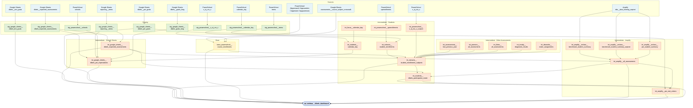

# DIBELS Dashboard Data Model

Reference document for `rpt_tableau__dibels_dashboard` — the Tableau extract
that powers the DIBELS benchmark and progress monitoring dashboard.

## What is DIBELS?

DIBELS 8 (Dynamic Indicators of Basic Early Literacy Skills) is a literacy
assessment created by the University of Oregon and administered through Amplify
mCLASS. KIPP TAF uses it to assess literacy knowledge and growth for students in
grades K–8.

Reference:
[DIBELS at the University of Oregon](https://dibels.uoregon.edu/about-dibels)

## Assessment types

### Benchmark (BM)

Three administrations per year: **BOY** (Beginning of Year), **MOY** (Middle of
Year), and **EOY** (End of Year). These are point-in-time snapshots that track
literacy growth across administrations within a year and across years.

### Progress Monitoring (PM)

Shorter, more frequent assessments administered during two windows:

- **BOY→MOY** — between the BOY and MOY benchmark administrations
- **MOY→EOY** — between the MOY and EOY benchmark administrations

PM is primarily administered to students who scored **Below Benchmark** or
**Well Below Benchmark** on the composite score of the preceding benchmark.
Other students may take PM, but only the probe-eligible population (Below/Well
Below composite) is tracked for growth reporting.

PM was first implemented in AY 2023–2024. The testing strategy and supporting
data model have evolved each year since.

## Current data model (AY 2023–2026)

Lineage diagram for `rpt_tableau__dibels_dashboard`:


```mermaid
flowchart TD
    %% ── Sources ───────────────────────────────────────────────────────────────
    subgraph SRC ["Sources"]
        direction TB
        src_amp["Amplify\ndds__data_farming_unpivot"]
        src_gs_exp["Google Sheets\ndibels__expected_assessments"]
        src_gs_bm["Google Sheets\ndibels__bm_goals"]
        src_gs_pm["Google Sheets\ndibels__pm_goals"]
        src_gs_long["Google Sheets\ndibels__goals_long"]
        src_gs_terms["Google Sheets\nreporting__terms"]
        src_gs_xwalk["Google Sheets\nassessments__course_subject_crosswalk"]
        src_ps_districts["PowerSchool\n(kippnewark / kippcamden\n/ kippmiami / kipppaterson)"]
        src_ps_spenroll["PowerSchool\nspenrollments"]
        src_ps_terms["PowerSchool\nterms"]
        src_ps_schools["PowerSchool\nschools"]
        src_ps_cal["PowerSchool\ncalendar_day"]
        src_ps_nj_crs["PowerSchool\ns_nj_crs_x"]
        src_ps_nj_stu["PowerSchool\ns_nj_stu_x"]
    end

    %% ── Staging ───────────────────────────────────────────────────────────────
    subgraph STG ["Staging"]
        direction TB
        stg_exp["stg_google_sheets__\ndibels_expected_assessments"]
        stg_bm["stg_google_sheets__\ndibels_bm_goals"]
        stg_pm["stg_google_sheets__\ndibels_pm_goals"]
        stg_long["stg_google_sheets__\ndibels_goals_long"]
        stg_terms["stg_google_sheets__\nreporting__terms"]
        stg_ps_terms["stg_powerschool__terms"]
        stg_schools["stg_powerschool__schools"]
        stg_cal["stg_powerschool__calendar_day"]
        stg_nj_crs["stg_powerschool__s_nj_crs_x"]
    end

    %% ── Base ──────────────────────────────────────────────────────────────────
    subgraph BASE ["Base"]
        base_ce["base_powerschool__\ncourse_enrollments"]
    end

    %% ── Intermediate — Amplify / mClass ──────────────────────────────────────
    subgraph INT_AMP ["Intermediate · Amplify"]
        direction TB
        int_bm_sum["int_amplify__mclass__\nbenchmark_student_summary"]
        int_bm_unpivot["int_amplify__mclass__\nbenchmark_student_summary_unpivot"]
        int_pm_sum["int_amplify__mclass__\npm_student_summary"]
        int_all["int_amplify__all_assessments"]
        int_pm_crit["int_amplify__pm_met_criteria"]
    end

    %% ── Intermediate — Google Sheets ─────────────────────────────────────────
    subgraph INT_GS ["Intermediate · Google Sheets"]
        int_gs_exp["int_google_sheets__\ndibels_expected_assessments"]
        int_gs_pm_exp["int_google_sheets__\ndibels_pm_expectations"]
    end

    %% ── Intermediate — Students / Enrollments ────────────────────────────────
    subgraph INT_STU ["Intermediate · Students"]
        direction TB
        int_spenroll["int_powerschool__spenrollments"]
        int_nj_stu["int_powerschool__\ns_nj_stu_x_unpivot"]
        int_enroll["int_extracts__\nstudent_enrollments"]
        int_enroll_subj["int_extracts__\nstudent_enrollments_subjects"]
        int_dibels_roster["int_students__\ndibels_participation_roster"]
        int_cal["int_students__\ncalendar_day"]
        int_focus_cal["int_focus__calendar_day"]
    end

    %% ── Intermediate — Other assessments (feed enrollment_subjects) ──────────
    subgraph INT_OTHER ["Intermediate · Other Assessments"]
        direction TB
        int_fast["int_assessments__\nfast_previous_year"]
        int_pearson["int_pearson__\nall_assessments"]
        int_fldoe["int_fldoe__\nall_assessments"]
        int_iready["int_iready__\ndiagnostic_results"]
        int_deanslist["int_deanslist__\nroster_assignments"]
    end

    %% ── Final report ─────────────────────────────────────────────────────────
    RPT(["rpt_tableau__dibels_dashboard"])

    %% ── Edges: Sources → Staging ─────────────────────────────────────────────
    src_gs_exp   --> stg_exp
    src_gs_bm    --> stg_bm
    src_gs_pm    --> stg_pm
    src_gs_long  --> stg_long
    src_gs_terms --> stg_terms
    src_ps_spenroll --> int_spenroll
    src_ps_terms --> stg_ps_terms
    src_ps_schools --> stg_schools
    src_ps_cal   --> stg_cal
    src_ps_nj_crs --> stg_nj_crs
    src_ps_nj_stu --> int_nj_stu

    %% ── Edges: Sources / Staging → Base ──────────────────────────────────────
    src_ps_districts --> base_ce
    src_gs_xwalk     --> base_ce
    stg_nj_crs       --> base_ce

    %% ── Edges: Sources → Amplify Intermediate ────────────────────────────────
    src_amp --> int_bm_sum
    src_amp --> int_bm_unpivot
    src_amp --> int_pm_sum

    %% ── Edges: Amplify Intermediate → int_amplify__all_assessments ───────────
    int_bm_sum    --> int_all
    int_bm_unpivot --> int_all
    int_pm_sum    --> int_all
    int_gs_exp    --> int_all

    %% ── Edges: Staging → Google Sheets Intermediate ──────────────────────────
    stg_exp   --> int_gs_exp
    stg_terms --> int_gs_exp

    stg_exp      --> int_gs_pm_exp
    stg_terms    --> int_gs_pm_exp
    stg_schools  --> int_gs_pm_exp
    stg_cal      --> int_cal
    int_focus_cal --> int_cal
    int_cal      --> int_gs_pm_exp
    stg_long     --> int_gs_pm_exp

    %% ── Edges: Student enrollment chain ──────────────────────────────────────
    int_spenroll --> int_enroll
    stg_ps_terms --> int_enroll

    int_enroll      --> int_enroll_subj
    base_ce         --> int_enroll_subj
    int_nj_stu      --> int_enroll_subj
    int_fast        --> int_enroll_subj
    int_pearson     --> int_enroll_subj
    int_fldoe       --> int_enroll_subj
    int_iready      --> int_enroll_subj
    int_deanslist   --> int_enroll_subj

    %% ── Edges: DIBELS participation roster ───────────────────────────────────
    int_enroll_subj --> int_dibels_roster
    int_gs_exp      --> int_dibels_roster
    int_all         --> int_dibels_roster

    %% ── Edges: PM met criteria ───────────────────────────────────────────────
    stg_pm          --> int_pm_crit
    int_all         --> int_pm_crit
    int_dibels_roster --> int_pm_crit

    %% ── Edges: → Final report ────────────────────────────────────────────────
    int_enroll_subj  --> RPT
    int_gs_exp       --> RPT
    stg_bm           --> RPT
    int_gs_pm_exp    --> RPT
    stg_pm           --> RPT
    base_ce          --> RPT
    int_all          --> RPT
    int_dibels_roster --> RPT
    int_pm_crit      --> RPT

    %% ── Styling ───────────────────────────────────────────────────────────────
    classDef source    fill:#e8f4f8,stroke:#5b9bd5,color:#000
    classDef staging   fill:#e2f0d9,stroke:#70ad47,color:#000
    classDef base      fill:#fff2cc,stroke:#ffc000,color:#000
    classDef intmodel  fill:#fce4d6,stroke:#ed7d31,color:#000
    classDef report    fill:#d9e1f2,stroke:#4472c4,color:#000,font-weight:bold

    class src_amp,src_gs_exp,src_gs_bm,src_gs_pm,src_gs_long,src_gs_terms,src_gs_xwalk,src_ps_districts,src_ps_spenroll,src_ps_terms,src_ps_schools,src_ps_cal,src_ps_nj_crs,src_ps_nj_stu source
    class stg_exp,stg_bm,stg_pm,stg_long,stg_terms,stg_ps_terms,stg_schools,stg_cal,stg_nj_crs staging
    class base_ce base
    class int_bm_sum,int_bm_unpivot,int_pm_sum,int_all,int_pm_crit,int_gs_exp,int_gs_pm_exp,int_spenroll,int_nj_stu,int_enroll,int_enroll_subj,int_dibels_roster,int_cal,int_focus_cal,int_fast,int_pearson,int_fldoe,int_iready,int_deanslist intmodel
    class RPT report
```

### Layer summary

| Layer        | Count | Purpose                                                                   |
| ------------ | ----- | ------------------------------------------------------------------------- |
| Sources      | 14    | Raw Google Sheets, Amplify DDS, and district PowerSchool tables           |
| Staging      | 9     | Light cleaning and type-casting of source data                            |
| Base         | 1     | Union of 4 district `course_enrollments` tables                           |
| Intermediate | 17    | Business logic — enrollment, DIBELS roster, assessment joins, PM criteria |
| Report       | 1     | Final Tableau extract with both Benchmark and PM branches                 |

### Key data flows

**Benchmark branch** — Amplify mClass benchmark summaries (BOY/MOY/EOY) are
joined to the student enrollment/subject roster and filtered against
`int_google_sheets__dibels_expected_assessments` to determine which students
were expected to test. School- and region-level goal aggregates come from
`stg_google_sheets__dibels_bm_goals`.

**PM branch** — Amplify PM summaries are joined to custom goal thresholds from
`stg_google_sheets__dibels_pm_goals` and evaluated in
`int_amplify__pm_met_criteria` to produce met/not-met flags per round. The
criteria logic is AND/OR per round: some rounds require all tracked measures to
be met; others require a specific combination (e.g., measure A OR measure B). PM
eligibility is determined by the preceding benchmark composite score (Below/Well
Below = probe-eligible).

Both the Benchmark and PM branches land in `rpt_tableau__dibels_dashboard` via a
`UNION ALL`.

### Configuration: `stg_google_sheets__dibels_expected_assessments`

This Google Sheet is the primary configuration table for the DIBELS model. It
defines which assessment rounds exist, which measures are expected per round,
and how PM goal logic should be applied. Three fields control behavior:

**`assessment_include`** — scaffold gate. A `NULL` value means the row is active
and will be used as a scaffold for student-level joins. `FALSE` excludes the
entire row from the model. Benchmark administrations (BOY, MOY, EOY) are never
excluded. PM rounds may be retroactively excluded — for example, if a round was
cancelled mid-year — by setting this field to `FALSE`.

**`pm_goal_include`** — goal display gate, independent of `assessment_include`.
A measure can be tested in a round (`assessment_include = NULL`) but excluded
from goal calculation (`pm_goal_include = FALSE`). This handles cases where a
measure was not administered consistently across all rounds of a PM season. For
goal trajectory to be calculated correctly, all rounds must exist in the data;
`pm_goal_include` suppresses the goal display for rounds where the measure
wasn't consistently given, without removing those rows from the scaffold.

Example: in the BOY→MOY season, a measure is tested in rounds 1–4, but another
measure is only given in rounds 2 and 4. The second measure still needs rows for
all four rounds to support the trajectory calculation, but only rounds 2 and 4
have `pm_goal_include = NULL` — rounds 1 and 3 are set to `FALSE` so no goal is
shown.

**`pm_goal_criteria`** — mastery logic for multi-measure PM rounds:

| Value                     | Meaning                                                                                                   |
| ------------------------- | --------------------------------------------------------------------------------------------------------- |
| `NULL`                    | BM rows — field is PM-only; BM rows (`BOY`/`MOY`/`EOY`) are always blank here                             |
| `OR`                      | Mastery on any one of the tested measures = round mastery                                                 |
| `AND`                     | Mastery on all tested measures = round mastery                                                            |
| Combined (e.g., `AND/OR`) | Two measures both met OR a third measure met — group-level logic applied at the `measure_name_code` grain |

In `int_amplify__pm_met_criteria`, this is implemented via `min()` (AND — all
must be 1) and `max()` (OR/NULL — any must be 1) window functions partitioned by
student / round.

!!! note "`pm_goal_include` scaffolding is K-2-only; SY26-27 is all `AND`" The
rounds-1-4-but-goal-only-2-and-4 example above is the K-2 in-house
collective-average pipeline specifically — confirmed against real AY2025 data
(Camden/Newark/Paterson grade K, `PSF`, `BOY→MOY`: rounds 1-3
`pm_goal_include = null`, round 4 not tested but still scaffolded,
`pm_goal_include = false`). **The scaffold belongs to the internal model, not to
a grade band.** Academics now runs the internal method across K-8, so every
internal grade is scaffolded. Through SY25-26 the scaffold was K-2-only, because
3-8 was the only band on aimline.

    **The aimline model has no use for the scaffold, but its source sheet
    carries it anyway.** Amplify supplies a goal per measure per round as
    actually tested, so there is no trajectory to keep continuous. That is a
    statement about what aimline *needs*, not about what the by-levels sheet
    *contains* — the SY25-26 by-levels rows were generated by duplicating the
    16-column sheet's PM rows per cohort, so they carry the internal model's
    `pm_goal_include = false` scaffold rows verbatim (roughly one row in five).
    An aimline model that drops the column without filtering on it therefore
    asserts an expectation for measures the round does not test. Filter
    `pm_goal_include is null`; do not assume it is null already. Separately,

`pm_goal_criteria = 'AND'` for every row this year, every grade — T&L confirmed
all K-8 rounds require every tested standard, not a mix of AND/OR.

!!! note "AY 2026–2027: two new sheet-authored columns" The source sheet gained
two columns ahead of the SY26-27 rollover, both inserted next to `subject_area`:

    - **`assessment_type`** (`Benchmark` / `PM`) — previously derived in the
      staging model from `admin_season`; now authored directly on the sheet so
      the classification doesn't depend on a rule only the SQL knows.
    - **`measure_standard_level`** (`Below` / `Well Below`) — the cohort a PM
      row applies to. Blank on every Benchmark row (Benchmark tests all
      students regardless of cohort). For SY25-26, used to validate the new
      model against real historical data: every existing PM row was split into
      a `Below` and a `Well Below` copy, since T&L's PM rounds document shows
      both cohorts tested on identical measures that year with no
      differentiation. See the `dibels-dashboard` skill for the generator
      scripts and the disambiguation gotchas hit while building them
      (a Benchmark-vs-PM-round code collision in years before grade-band
      tagging existed, and a network-wide `month_round` label that had quietly
      drifted from each region's real calendar).

    Both sheets are now live sources, side by side rather than one replacing
    the other. The original range ("Expected Assessments V1", 16 columns, single
    underscore) still backs
    `stg_google_sheets__dibels_expected_assessments` and feeds the internal
    method. The wider tab ("Expected Assessments", named range
    `src_google_sheets__dibels__expected_assessments_by_levels`, double
    underscore) backs
    `stg_google_sheets__dibels__expected_assessments_by_levels` and feeds
    aimline. Benchmark rows were stripped from the by-levels range — Benchmark
    will never be by levels, and emitting it from both sheets doubled every
    Benchmark row downstream.

### Source of truth: `int_amplify__all_assessments`

The single model any team member should use to pull DIBELS scores. It surfaces
only scores that T&L considers valid for reporting — no consumer needs to
understand historical assessment strategy to use it safely.

#### How validity filtering works

Every branch of the internal UNION inner-joins to
`int_google_sheets__dibels_expected_assessments` on
`academic_year + region + grade + admin_season + measure_standard` with two
additional filters:

- **`assessment_include is null`** — excludes any row the data team has
  explicitly cancelled (e.g., a mid-year PM round cancellation)
- **`pm_goal_include is null`** — for PM, excludes scaffold-only rows that exist
  for trajectory math but don't represent real tested rounds

If a score exists in Amplify but no matching row exists in the expected
assessments config, it is silently excluded. This is intentional — new measures
or grades only appear once the data team adds them to the config.

#### Internal structure

**Restructured for SY26-27.** The Benchmark half moved out to
`int_amplify__benchmark_student_summary`, and the PM half became two branches,
one per data model. `model_type` (`BM` / `Internal` / `Aimline`) tells them
apart, and any consumer counting PM must filter it or it double-counts.

| Half          | Source                                                                     | Scope           |
| ------------- | -------------------------------------------------------------------------- | --------------- |
| Benchmark     | `int_amplify__benchmark_student_summary`                                   | all years       |
| PM - internal | `int_amplify__mclass__pm_student_summary` + the 16-column expectation gate | all PM years    |
| PM - aimline  | `int_amplify__mclass__pm_student_summary_aimline` + the by-levels gate     | SY25-26 forward |

The Benchmark half is now a plain select from its own model, which computes the
composites, both aggregated level columns, `benchmark_goal_season`,
`overall_probe_eligible` and `actual_row_count` itself. Only four columns are
added here: `illuminate_subject` as a constant, plus typed nulls for
`probe_number`, `total_number_of_probes` and `score_change`, which are PM-only.
Verified identical to the pre-split output on all 38 columns, every year.

Both PM branches start from eligibility rather than from scores. Each reads
`int_amplify__benchmark_student_summary` at `rn_pm_eligibility = 1` (one row per
benchmark administration), inner-joins its own expectation gate for the rounds
and measures the student is expected on, then inner-joins the scores.

**This model carries scored rows only, as it always has.** An expected round
with no score does not become a row here. An intermediate version LEFT joined
the scores so that "expected but not tested" was a row; that was reverted. Not
Tested is the participation roster's job, and the roster already answers it
without help: it reads the gate directly, counts the measures expected for a
(year, region, grade, season, round) as `expected_row_count`, and compares that
to `actual_row_count` from this model. The dashboard's PM branch does the same
thing at measure granularity, driving off the gate's `expected_measure_standard`
and LEFT joining this model, so an unscored measure still gets a named row
there. Two places already manufacture the absence; a third would only let them
disagree.

Two consequences worth knowing before reading any count:

- The PM branches do not match the pre-split PM row count, because they drop
  scores from students who were never PM-eligible. Measured on AY2025, the old
  model carried 8,253 such rows — 8,170 for 3,024 students whose composite was
  At/Above Benchmark, and 83 for 28 students with no benchmark row at all. Those
  students were already invisible downstream (the participation roster and the
  dashboard each re-derive eligibility, and both return zero rows for them), so
  the filter consolidates the gate from three places to one rather than changing
  a reported number.
- `max_score` partitions on
  `academic_year, student_number, model_type, round_number, expected_measure_standard`
  and orders by `measure_standard_score desc, client_date desc` — the best score
  for a measure in a round, later probe winning a same-day tie. `academic_year`
  is load-bearing: round numbers restart every year, so without it a student's
  AY2026 round 1 competes with their AY2025 round 1 for the same measure and one
  real score is dropped. `model_type` keeps the two methods from ranking against
  each other.

#### The bug the split fixed: one dedup step over a union of two grains

Worth reading before touching any `row_number()` in this chain, because the
defect was invisible for years and produced no error.

Before the split, `assessments_scores` unioned all three branches — mCLASS
Benchmark, DDS Benchmark, and PM — into one CTE. A single `max_score` then
ranked that whole union, and the final `SELECT` split it back apart by
`assessment_type`. One dedup step, two different kinds of row.

Its sort key was `measure_standard_level_int desc`. That is a sensible rule for
Benchmark, where the column holds 1-4 and "keep the highest level for this slot"
is what you want. **The PM branch writes `null as measure_standard_level_int`**
— PM has no level — so the same key arrived meaningless on every PM row and the
pick among a student's probes was whatever BigQuery reached first. The partition
had the same problem: `surrogate_key` means the benchmark summary's key on one
side and the PM model's key on the other.

It deduped PM at all only by accident.
`int_amplify__mclass__pm_student_summary`'s surrogate key omits `probe_number`
and `client_date`, so it collides across a student's probes — 67,984 AY2025 rows
against 33,917 distinct keys. Partitioning by a colliding key is what put
multiple probes in one partition for an arbitrary sort to choose from.

Measured consequences on AY2025, all in one direction:

| Effect                                             | Rows  |
| -------------------------------------------------- | ----- |
| Round-measure slots holding more than one probe    | 1,352 |
| Reported score lower than the student's best       | 634   |
| `met_measure_standard_goal` flipped not-met to met | 139   |
| `met_admin_benchmark_goal` flipped not-met to met  | 85    |

Average understatement was 10.25 points, and every single flip went not-met to
met — meaning students were told they missed a goal they had actually hit, and
that propagated up through `met_measure_name_code_goal` to the round-level
met/not-met on the dashboard.

#### And separately, prod's PM completion gate never fires

Every progress-monitoring row in the prod participation roster carries
`completed_test_round = false` — all 39,981 of them across `BOY->MOY` and
`MOY->EOY`, with not one `true`. Only the Benchmark seasons have true rows. So
in prod an `AND` round can never be credited, whatever the student scored:
`met_pm_round_overall_criteria` gates on a column that is false everywhere, and
the only 1s prod reports come through the null (OR) branch, which skips the
gate.

The refactored roster fixes it, producing 15,078 true Internal PM rows on the
same year. That makes the `AND` gate fire for the first time, so PM round
attainment will rise against prod — a corrected number, not a regression, and
worth telling T&L before they compare the two.

**The rule to take from it: a dedup step belongs to exactly one grain.** If a
CTE unions grains and then ranks, one side's sort key is meaningless on the
other and nothing fails. Dedup before the union, or split the model. Extracting
the Benchmark half is what gave PM its own `max_score` and made a PM-meaningful
sort key possible at all.

#### Miami's id offset applies to both PM models

`int_amplify__mclass__pm_student_summary` resolves the student id through the
`focus_student_number` macro, which adds 8,400,000,000 to a kippmiami id for
`academic_year <= 2025` — the Focus migration mapping.
`int_amplify__mclass__pm_student_summary_aimline` now applies it too. It did
not, and the table below is what that cost.
`int_amplify__benchmark_student_summary` keys on the network number, so every
Miami PM row fails that join in the aimline branch and Miami reports zero.

| Region   | Internal rows / students | Aimline rows / students |
| -------- | ------------------------ | ----------------------- |
| Camden   | 8,686 / 1,111            | 8,686 / 1,111           |
| Newark   | 23,502 / 2,983           | 23,502 / 2,983          |
| Paterson | 3,358 / 382              | 3,358 / 382             |
| Miami    | 961 / 420                | 0 / 0                   |

Measured on AY2025. The three NJ regions match exactly; Miami's 961 rows for 420
students are the whole of what was previously logged here as an unexplained gap
between the two methods.

The two sources are indistinguishable by counts — both carry 67,984 AY2025 rows,
7,861 students, 8 measures, and identical per-region totals including Miami's
5,503 rows for 978 students. Only comparing id SETS exposes it: the same 978
Miami students appear on one side of a full outer join and again on the other.

The macro is applied in the model's `enriched` CTE, reading the crosswalk's
`location_dagster_code_location` directly rather than the `_dbt_source_project`
alias derived in the same `SELECT`, since BigQuery has no lateral column
aliases. It cannot go earlier: the full outer join between the two SFTP files
matches on their shared raw id, so offsetting before that join breaks the merge.
With it in place all four regions match between the two methods, and Benchmark
is unchanged.

The macro is year-scoped and the call should stay regardless. It offsets only
`year <= 2025`, so from AY2026 Miami's raw id already is the network number and
the call is a no-op — unconfirmed, because AY2026 has no tested PM rows in
either method yet. Re-check once SY26-27 scores land rather than assuming, and
do not remove the call because the current year does not need it.

#### Every consumer must name its `model_type`

`int_amplify__all_assessments` changed grain: it emits one row per data method
(`BM` / `Internal` / `Aimline`). A consumer that does not filter `model_type`
either double-counts or is correct only by accident, and it fails silently — no
error, no failing test, just multiplied rows.

Three consumers needed fixing, measured on AY2025:

| Consumer                              | Had                       | Effect                                      |
| ------------------------------------- | ------------------------- | ------------------------------------------- |
| `rpt_tableau__dibels_dashboard` PM    | nothing                   | 4× — 2× on the score join, 2× on the roster |
| `int_amplify__pm_met_criteria`        | nothing                   | 72,970 rows from 17,004 distinct score keys |
| `rpt_gsheets__dibels_pm_goal_setting` | `period in ('BOY','MOY')` | none yet, one coincidence away              |

There is no partial version of the bug. The PM score attach has exactly two rows
per (year, season, round, measure, student) on **all** 36,507 groups, and the
roster two per (year, grade, season, round, student) on **all** 24,594 — so an
unscoped join doubles everywhere or not at all.

The remaining consumers are safe, but each for a reason it does not state: an
`assessment_type` filter (the marts, `bm_goals_calculations`), a
`measure_standard = 'Composite'` filter that PM rows never satisfy (`mtss_rti`,
`kippmiami_payout_roster`, `student_enrollments_subjects`,
`dibels_benchmark_weekly`), or benchmark seasons never equalling PM seasons
(`BOY` against `BOY->MOY`, which is what protects the dashboard's own BM
branch). None of that is careless — they all predate `model_type` — but when you
touch one, state the scope rather than trust the coincidence.

#### A student's two grade columns can disagree, and that is not fixable

On a PM row, `assessment_grade` comes from the score side (the grade the probe
was administered at) and `assessment_grade_int` comes from the benchmark side
(the grade the student was benchmarked at). A student who changes grade level
mid-year has both, and they differ. Measured on AY2025: one student, four rows,
`assessment_grade = '4'` against `assessment_grade_int = 3`.

**This is known, it is a property of the data, and neither column is wrong.**
The student really did sit their benchmark at one grade and their progress
monitoring at another. Do not "fix" it by sourcing both columns from one side:

- Both from the score side matches the pre-split model, but the row would then
  claim grade 4 while carrying the round windows and expected measures that came
  from grade 3's gate row.
- Both from the benchmark side keeps the row coherent with its expectations, but
  discards the grade the probe was actually sat at.

**The dashboard is unaffected. The participation roster is not.** These two
consumers join the grade differently, and an earlier version of this section
said the mismatch "settles at the reporting layer" without making the
distinction — that was too broad.

`rpt_tableau__dibels_dashboard`'s PM branch drives off the student's enrollment
record: it joins `int_extracts__student_enrollments_subjects` to
`int_google_sheets__dibels_pm_expectations` on `s.grade_level = e.grade`, so the
**enrolled** grade decides which expectations the student is held to. The score
is then attached with a LEFT JOIN on year, season, round, measure and student
number — with no grade predicate at all. So whichever grade the PM row carries,
the score still lands on the enrolled-grade expectation row, and the two grade
columns never reach the dashboard's grade logic.

`int_students__dibels_participation_roster` does put the grade in the score
join, as `s.grade_level = a.assessment_grade_int`. A PM row keyed to the
benchmark grade therefore fails to match a student enrolled at the probe grade,
and `actual_row_count` reads 0 where the pre-split model read the real count.
Measured on AY2025: one row, Newark grade 4, BOY→MOY round 2, prod 2 against 0.
`completed_test_round` is `false` on both sides there, so no reported outcome
moves — but the count is understated, and a round where every measure landed at
the other grade is the shape that produces it.

The remaining consequence is internal: these rows key to a different grade than
the pre-split model did, so a prod-versus-branch row comparison will always show
them as branch-only. That is expected. Confirm the count is still tiny before
treating it as a finding.

#### Computed fields

| Field                                               | Logic                                                                                                  |
| --------------------------------------------------- | ------------------------------------------------------------------------------------------------------ |
| `overall_probe_eligible`                            | `'Yes'` if composite at BOY (for BOY period) or MOY (for MOY period) was Below or Well Below Benchmark |
| `boy_composite` / `moy_composite` / `eoy_composite` | Pivoted composite levels — available on every row for cross-window lookups                             |
| `benchmark_goal_season`                             | Next BM season this score contributes goals toward (`BOY` → `MOY`, `MOY` → `EOY`)                      |
| `aggregated_measure_standard_level`                 | Two-bucket: `At/Above` vs `Below/Well Below` (used in Foundation goal reporting)                       |
| `foundation_measure_standard_level`                 | Three-bucket: `At/Above`, `Below`, `Well Below` (used in Foundation goal rate join)                    |

#### Measures by grade (AY 2024–2025)

Which measures appear in `int_amplify__all_assessments` is controlled by
`stg_google_sheets__dibels_expected_assessments`, not hardcoded in the model.
The configuration below reflects AY 2024–2025 and may change year-to-year.

**Benchmark** — consistent across BOY, MOY, and EOY for all grades:

- **K** — Composite, Letter Names (LNF), Phonemic Awareness (PSF), Letter Sounds
  (NWF-CLS), Decoding (NWF-WRC), Word Reading (WRF)
- **Grade 1** — Composite, Letter Names (LNF), Phonemic Awareness (PSF), Letter
  Sounds (NWF-CLS), Decoding (NWF-WRC), Word Reading (WRF), Reading Fluency
  (ORF), Reading Accuracy (ORF-Accu)
- **Grades 2–3** — Composite, Letter Sounds (NWF-CLS), Decoding (NWF-WRC), Word
  Reading (WRF), Reading Fluency (ORF), Reading Accuracy (ORF-Accu), Reading
  Comprehension (Maze)
- **Grades 4–8** — Composite, Reading Fluency (ORF), Reading Accuracy
  (ORF-Accu), Reading Comprehension (Maze)

Early literacy measures (LNF, PSF) exit after grade 1. NWF and WRF exit after
grade 3. ORF, ORF-Accu, and Maze run through grade 8.

**Progress Monitoring** — no Composite; varies by grade and season:

BOY→MOY:

- **K–1** — Letter Sounds (NWF-CLS), Decoding (NWF-WRC), Phonemic Awareness
  (PSF)
- **Grade 2** — Letter Sounds (NWF-CLS), Decoding (NWF-WRC), Reading Accuracy
  (ORF-Accu), Reading Comprehension (Maze), Word Reading (WRF)
- **Grade 3** — Letter Sounds (NWF-CLS), Decoding (NWF-WRC), Reading Accuracy
  (ORF-Accu), Reading Fluency (ORF), Reading Comprehension (Maze), Word Reading
  (WRF)
- **Grades 4–5** — Reading Accuracy (ORF-Accu), Reading Fluency (ORF), Reading
  Comprehension (Maze), Word Reading (WRF)
- **Grades 6–8** — Reading Accuracy (ORF-Accu), Reading Fluency (ORF), Reading
  Comprehension (Maze)

MOY→EOY:

- **K** — Letter Sounds (NWF-CLS), Decoding (NWF-WRC), Reading Accuracy
  (ORF-Accu), Word Reading (WRF)
- **Grade 1** — Letter Sounds (NWF-CLS), Decoding (NWF-WRC), Reading Accuracy
  (ORF-Accu), Reading Fluency (ORF), Word Reading (WRF)
- **Grades 2–3** — Letter Sounds (NWF-CLS), Decoding (NWF-WRC), Reading Accuracy
  (ORF-Accu), Reading Fluency (ORF), Reading Comprehension (Maze), Word Reading
  (WRF)
- **Grades 4–5** — Reading Accuracy (ORF-Accu), Reading Fluency (ORF), Reading
  Comprehension (Maze), Word Reading (WRF)
- **Grades 6–8** — Reading Accuracy (ORF-Accu), Reading Fluency (ORF), Reading
  Comprehension (Maze)

!!! note "AY 2026–2027: PM measures will change" With cohort-differentiated
testing (Well Below vs. Below may test different measures) and the aimline
migration, the PM measure set is expected to change. The schema now has a field
for this (`measure_standard_level`, see the note above) — for SY25-26 both
cohorts test identical measures, so this table's grade-by-grade breakdown still
applies to both `Below` and `Well Below` rows unchanged; a future year where
cohorts genuinely diverge would need this table split by cohort too. See
[#3834](https://github.com/TEAMSchools/teamster/issues/3834).

#### Assessment strategy history

**Benchmark**:

| Period       | Scope                                                                                        |
| ------------ | -------------------------------------------------------------------------------------------- |
| AY 2021–2023 | K–2 only (primary years of BM implementation)                                                |
| AY 2023–2024 | K–4 added; grades 3–4 coverage inconsistent across regions                                   |
| AY 2023–2024 | MS grades added but also inconsistent                                                        |
| AY 2024–2025 | K–8 implemented; grades 7–8 tested on Amplify DDS (separate platform — see DDS branch above) |
| AY 2025–2026 | First year all K–8 BM data on the same platform (mCLASS); DDS branch is SY24-only from here  |

**Progress Monitoring**:

| Period       | Scope                                                        |
| ------------ | ------------------------------------------------------------ |
| AY 2024–2025 | Camden and Newark only; K–2 only                             |
| AY 2025–2026 | K–8 for both NJ and FL; Paterson included for the first time |
| AY 2026–2027 | K–8 all regions; internal and aimline PM run in parallel     |

#### AY 2026–2027 changes

Aimline is **not** a cutover. Academics asked for both PM data models for the
year — the internal method applied to K-8, and aimline applied to K-8 — so the
two run side by side and are mixed downstream, rather than one replacing the
other.

**The two chains are separate end to end — they share no model.** Each reads its
own Google Sheets range through its own gate:

| Chain                | Range                          | Gate                                                        | PM expectations                             |
| -------------------- | ------------------------------ | ----------------------------------------------------------- | ------------------------------------------- |
| Internal + Benchmark | 16-column Expected Assessments | `int_google_sheets__dibels_expected_assessments`            | `int_google_sheets__dibels_pm_expectations` |
| Aimline              | 18-column by-levels            | `int_google_sheets__dibels__expected_assessments_by_levels` | none — the gate is the whole chain          |

An intermediate design unioned both ranges into one gate behind a `data_model`
discriminator (`internal` / `aimline` / `Benchmark`). It was abandoned. The
discriminator carried exactly the hazard it was meant to manage — a consumer
that forgot to filter it matched every score twice — and it changed the internal
gate's column set for no benefit to the internal chain. Splitting at the source
removes the column and the hazard together, and leaves the internal gate
byte-identical to what its consumers already expected. If you find a
`data_model` reference in an older note, it describes a design that never
shipped.

The calculations have little in common, which is why nothing is shared: internal
spreads a cohort's required growth across a round from school-day counts,
aimline compares a per-student aimline value supplied by Amplify.
`rpt_gsheets__dibels_pm_goal_setting` therefore needed no change at all — it
joins `pm_expectations`, which is internal by construction.

**Benchmark lives on the internal chain only.** The by-levels range carries no
Benchmark rows and never will. Benchmark tests every student against one set of
expectations, so it has no cohort split — and while it was briefly emitted from
both ranges, it doubled every dashboard Benchmark row and inflated participation
expected counts from 4-8 to 8-16, with CI catching none of it.

`int_amplify__all_assessments` retains both BM and PM output — it is the single
safe read point for all valid assessment scores and must stay that way. What
changed is its shape: three UNION branches became one Benchmark select plus two
PM branches, told apart by a new `model_type` column (`BM` / `Internal` /
`Aimline`). Any consumer that counts PM rows must filter `model_type`, or every
eligible student is counted once per method.

The Benchmark half now lives in its own model,
`int_amplify__benchmark_student_summary` — see the section below. Its output is
identical to what `all_assessments` produced for Benchmark rows before the
split, on all 38 columns, every year, including the DDS branch that preserves
SY24 7–8 grade benchmark history.

!!! note "Deprecation approach" Per team convention, deprecated models in this
refactor are **deactivated** (`config: enabled: false` in properties YAML)
rather than deleted. This preserves them as reference implementations for
similar future work.

### Benchmark half: `int_amplify__benchmark_student_summary`

New for SY26-27. Holds everything `int_amplify__all_assessments` used to compute
for Benchmark rows, so that both PM branches can read benchmark eligibility from
one place instead of each re-deriving it.

Pipeline:

| CTE                       | What it does                                                                                                                           |
| ------------------------- | -------------------------------------------------------------------------------------------------------------------------------------- |
| `data_farming`            | SY24 grades 7–8 from DDS, with `_dbt_source_project` synthesized from `region`                                                         |
| `assessments_scores`      | Two UNION branches (mCLASS + unpivot, and DDS), both inner-joined to the 16-column gate at `assessment_type = 'Benchmark'`             |
| `composite_only`          | Just the Composite rows                                                                                                                |
| `composite_by_window`     | Pivots Composite level to `boy` / `moy` / `eoy` per student-year                                                                       |
| `probe_eligible_tag`      | Joins those three back onto every row; `No data` where absent                                                                          |
| `custom_composite_labels` | The aggregated level columns, `benchmark_goal_season`, `overall_probe_eligible`, `overall_aimline_composite_level`, `actual_row_count` |

Two columns exist purely to serve the PM branches downstream:

- **`overall_probe_eligible`** — the internal method's gate. Resolves to this
  row's own window: `boy_probe_eligible` on a BOY row, `moy_probe_eligible` on
  MOY, null on EOY (EOY opens no PM season). `'Yes'` when that window's
  composite was Below or Well Below Benchmark.
- **`overall_aimline_composite_level`** — the aimline method's gate, and the
  reason a null is not acceptable here. It inner-joins to
  `measure_standard_level` on the by-levels gate, and a null joins to nothing,
  so a student with no benchmark row gets the literal `'No data'` rather than
  null. `'No data'` and `At/Above Benchmark` both match no by-levels row, which
  is the intended outcome: neither is aimline-eligible.

Then `rn_pm_eligibility`:

```sql
row_number() over (
    partition by academic_year, student_number, `period`, assessment_grade_int
    order by (measure_standard = 'Composite') desc, measure_standard
) as rn_pm_eligibility,
```

This is what the PM branches filter to `= 1` to get **one row per student per
benchmark administration** — the model's own grain is one row per measure, which
would fan every PM round out by the measure count.

`assessment_grade_int` is in the partition on purpose. A student can be assessed
at two grades inside one benchmark window (a mid-window grade change), and each
sitting is its own administration with its own expectations; the PM consumers
join assessed grade to enrolled grade, so both sittings must survive.

The `order by` prefers the Composite row when there is one, but does not require
it: `row_number()` always assigns 1 within a partition, so a student-period with
no Composite row still yields exactly one row (312 such student-periods in
AY2025, all retained).

### Benchmark goal pipeline: `stg_google_sheets__dibels_foundation_goals` → `stg_google_sheets__dibels_bm_goals`

#### What Foundation goals are

KIPP Foundation sets annual benchmark growth targets for MOY and EOY. The
targets are expressed as a **percentage of students who should be At/Above
Benchmark** by that administration, broken out by region, grade level, and
benchmark band (`At/Above` vs. `Well Below`). The T&L team receives these from
Foundation and shares them with the data team, who hand-enters them into the
Google Sheet that becomes `stg_google_sheets__dibels_foundation_goals`.

Grain: one row per
`academic_year × region × grade_level × period × grade_goal_type`.

The hand-entry step is error-prone. The source document from Foundation is not
in a machine-readable format, and transcription mistakes are difficult to catch
until the downstream calculations look wrong.

#### How the goals are calculated: `rpt_gsheets__dibels_bm_goals_calculations`

After each benchmark window (BOY or MOY),
`rpt_gsheets__dibels_bm_goals_calculations` joins the current year's benchmark
composite scores (`int_amplify__all_assessments`) to the Foundation goal rates
(`stg_google_sheets__dibels_foundation_goals`) and computes, per school and
region:

- **Actual counts** — students At/Above and Below/Well Below by grade and
  period, computed at both school and region granularity
- **Expected count** — `ceiling(total_enrolled × grade_goal_rate) + 5` — the
  number of At/Above students the school needs to meet the Foundation target
  plus the T&L planning buffer
- **Students to move** (gap) — `(expected − actual_at_above) × 1.5` — how many
  currently-Below/Well Below students need to reach At/Above to close the gap,
  inflated by 1.5× to build headroom for students who start PM but don't
  complete it. A negative value means the school already exceeds the Foundation
  target.

The `+ 5` and `× 1.5` values are **T&L-set planning buffers** — added at T&L's
request to build in margin above the Foundation floor. Neither is derived from
the Foundation targets themselves. Both should be reconfirmed with T&L at the
start of each academic year before the BOY goals calculation is run (see Annual
rollover procedure below).

**Academics calls both of them "pads".** "Pad" is their word for a planning
buffer, not for a mathematical operation — the `+ 5` and the `× 1.5` are two
pads, and a period with both applied is "double padded". Reading "pad" as
addition sends you looking for a second `+` that does not exist.

!!! note "Padding change, K-8, from SY26-27: MOY drops to single padding" T&L's
request reads: _double padded from BOY to MOY, which we should continue to do;
MOY to EOY should just be single padding across K-8, keep the 1.5 pad._
Implemented on `rpt_gsheets__dibels_bm_goals_calculations` as a period-dependent
`+ 5`:

    ```sql
    ceiling(n_admin_season_school_gl_all * grade_goal)
    + if(period = 'BOY', 5, 0) as n_admin_season_school_gl_at_above_expected,
    ```

    BOY keeps both pads. MOY keeps the `× 1.5` gap multiplier and loses the
    `+ 5`. **This lands on BM goals, not PM goals** — the request was
    misattributed to the PM pipeline at first, and the way to tell is to compare
    prod's `rpt_gsheets__` output against the manually-edited snapshot sheet:
    academics had already hand-edited the BM goals sheet to the new padding, so
    the sheet and the model disagreeing is the evidence of which pipeline the
    request touches. Verification is blocked until Foundation goals arrive
    (9/14) — the model returns zero rows without them, so the change is code-
    complete and data-pending, not verified.

!!! note "Population split: All / MLL / SPED as separate columns" Goals are now
compared against actuals **by student population**, so
`stg_google_sheets__dibels_bm_goals` gained per-population columns rather than
per-population rows — the grain is unchanged and a consumer reads the column for
the population it wants. `All` and `SPED` carry real values; `MLL` is null for
SY25-26 and populated from SY26-27, pending real values from academics. A new
sheet template was built to hold the wider shape, and AY2024 and AY2025 were
migrated into it from the frozen prod snapshot rather than recomputed — a
recompute drifted (41 keys missing, 67 rows with different gaps), because the
frozen sheet is the record of what the goals _were_, not what today's data would
produce.

!!! warning "Open question: `grade_goal_type` and `max(grade_goal)`"
`stg_google_sheets__dibels_foundation_goals` contains two goal types:
`'At/Above'` and `'Well Below'`, each with its own `grade_goal` rate. The model
collapses them via `max(grade_goal)`, but for some MS grades the Well Below rate
is _higher_ than the At/Above rate — meaning `max()` picks the Well Below rate
and uses it to compute the expected At/Above student count. Whether this is
intentional needs confirmation with T&L before the next BOY goals run. Tracked
in issue [#3834](https://github.com/TEAMSchools/teamster/issues/3834).

#### The snapshot freeze: copy-paste → `stg_google_sheets__dibels_bm_goals`

The output of `rpt_gsheets__dibels_bm_goals_calculations` is **manually
copy-pasted** into a separate Google Sheet, which is the source for
`stg_google_sheets__dibels_bm_goals`. That staged table is what
`rpt_tableau__dibels_dashboard` joins in the Benchmark branch.

The manual step exists deliberately: enrollment corrections and score
adjustments continue after a benchmark window closes, and if the goals were
calculated live from `rpt_gsheets__dibels_bm_goals_calculations`, they would
shift retroactively every time the underlying data changed. The copy-paste
freezes the calculation as of the moment the goals were set, making them stable
for the remainder of the year.

!!! warning "Error risk at two points" The pipeline has two manual steps where
mistakes are hard to catch: (1) hand-entry of Foundation rate targets into
`stg_google_sheets__dibels_foundation_goals`, and (2) the copy-paste from the
calculations extract into the goals sheet. A wrong cell in step 1 silently
produces wrong expected counts; a missed row or column in step 2 produces NULL
goals on the dashboard with no error.

#### Process improvement opportunity

The copy-paste freeze could be replaced with a **Dagster-managed BigQuery
append**: after each benchmark window closes, a one-time asset run would
`INSERT INTO` a permanent BigQuery table the output of
`rpt_gsheets__dibels_bm_goals_calculations` for that year and period. The table
would be partitioned by `academic_year + period` and written once — never
updated. `stg_google_sheets__dibels_bm_goals` would then be replaced by a
`sources-bigquery.yml` entry pointing to that table, eliminating the Google
Sheet intermediary and the copy-paste risk entirely.

The hand-entry problem for Foundation goal rates could be reduced by requesting
the data from Foundation in a CSV or structured format and uploading directly,
rather than transcribing from a document.

### PM expectations scaffold: `int_google_sheets__dibels_pm_expectations`

This intermediate model auto-generates the PM goal calculation scaffold by
joining the three configuration sources together. It replaced an older model,
`stg_amplify__dibels_pm_expectations`, which was a manually-maintained Google
Sheet requiring the data team to enumerate every expected round × measure ×
region × grade combination by hand each year. The current model derives that
same grid automatically from two already-required inputs: the expected
assessments config and the reporting terms calendar.

**What it produces** (one row per
`academic_year × region × grade × admin_season × round_number × measure`):

- All round and measure metadata from
  `int_google_sheets__dibels_expected_assessments` (`round_number`,
  `min_pm_round`, `max_pm_round`, `pm_goal_include`, `pm_goal_criteria`,
  `expected_measure_standard`, etc.)
- Term window dates (`start_date`, `end_date`, `code`) from
  `stg_google_sheets__reporting__terms`
- School day counts (`pm_round_days`, `pm_days`) computed from
  `int_students__calendar_day` — counting in-session days within each
  `LIT`/`PLIT` window by region
- `benchmark_goal` (`grade_level_standard`) from
  `stg_google_sheets__dibels_goals_long`, joined on measure × grade × matching
  PM season

This enriched scaffold is what `rpt_gsheets__dibels_pm_goal_setting` joins to
when computing per-round growth targets — it provides everything needed for the
`pm_round_days / pm_days` proportioning math without any additional manual data
entry.

**Calendar source — Miami is Focus-only from AY 2026.** Day counting reads
`int_students__calendar_day` (PowerSchool for the NJ regions, Focus for Miami's
Focus-covered years), not `stg_powerschool__calendar_day`. The frozen
PowerSchool archive still serves a rolled-forward Miami calendar through
2027-06-29 with 48 phantom in-session days against Focus's real AY 2026 calendar
— 23 in July 2026, 7 on Aug 3–11 before Focus's real Aug 12 start, and 18 on Jun
4–29 after its real Jun 3 end. Because the Aug 3–11 block coincides with
`PLIT1`'s start anchor, the PowerSchool path yields Miami boundaries that are
wrong without looking wrong. The switch was verified as a no-op on current data
— the two sources are day-for-day identical for all three NJ regions in both SY
25-26 and SY 26-27, and `pm_round_days` changed for no region or year.

The **schools** side is now SIS-neutral too. It reads
`int_students__school_directory`, which carries region and a reportability gate
for both SIS branches, so all of Miami's schools are admitted rather than the 2
that `stg_powerschool__schools.state_excludefromreporting = 0` used to allow.
Two filters ride along: `school_level_alt != 'HS'` (DIBELS is K-8, and a high
school contributing in-session days inflates `pm_round_days`) and
`school_source != 'finalsite'` (a Finalsite row is next year's recruiting, not a
year students attended, so it has no calendar to count). The join is keyed on
`academic_year` as well as school, which is what keeps a school from
contributing days to a year it did not enroll students in — that, not a
hardcoded cutover year, is what handles Miami's PowerSchool-to-Focus boundary.

**The round window no longer comes from a second `reporting__terms` join.**
`start_date` / `end_date` / `code` pass through from
`int_google_sheets__dibels_expected_assessments`, which resolves the window
against each grade's own band. Re-joining `reporting__terms` here matched every
band at once, which both fanned each row out (measured at 9x for AY2025, 7,110
rows for 790 real keys) and let an arbitrary band's dates win. The round regex
is anchored `^P?LIT(\d+)$`; `right(code, 1)` collapsed Miami's `LIT10` and
`LIT11` onto rounds 0 and 1.

**AY 2026–2027 — the model is internal-only, and aimline gets a sibling.** The
earlier plan had this model serving K-2 while 3-8 moved to aimline, with
school-day counting and `PLIT` deprecated for 3-8. That is not what shipped.
Academics runs both methods across K-8, so `pm_round_days`, `pm_days`,
`benchmark_goal` and the `PLIT` rows feeding them apply to every grade the
internal method covers, which is all of them. `PLIT` is not K-2-scoped and never
became so.

The model reads the 16-column chain and nothing else — no discriminator, no
cohort column, the same column set it always had — so
`rpt_gsheets__dibels_pm_goal_setting` needed no edit.

#### The aimline chain: `int_google_sheets__dibels__expected_assessments_by_levels`

Aimline's gate over the 18-column by-levels range, the sibling of
`int_google_sheets__dibels_expected_assessments`. PM only; the by-levels range
carries no Benchmark rows.

It differs from the internal gate in two ways beyond the source. First,
`measure_standard_level` is in the grain **and** in the `min_pm_round` /
`max_pm_round` partition — when a round is expected of one cohort and not the
other, the two cohorts' round ranges differ, and a shared partition would give
both the wider range. Second, its terms unnest is a `cross join`, not a
`left join`: every row in this source is a PM round and every PM terms row
carries a grade band, so there is no null-band Benchmark row to preserve.

The aimline chain stops at the gate. It has **no `pm_expectations` sibling**,
because there is nothing for one to add. The internal method needs a second
model to spread a cohort's required growth across a round from school-day counts
— `pm_round_days`, `pm_days`, the school directory and the calendar. Amplify
supplies an aimline goal per student, so none of that applies, and academics
confirmed aimline needs no day count at all. Once the `dibels_goals_long` join
moved up into the gate, a downstream `pm_expectations_aimline` was a filtered
projection of its parent and nothing more; it was written, then deleted before
it shipped.

What the gate carries for aimline's benefit, and why:

- **`measure_standard_level`** is in the grain. The source declares an
  expectation per cohort and the two are allowed to differ, so a consumer must
  match a student to their own cohort or a `Below Benchmark` student is counted
  as failing to participate in a round they were correctly absent from. In
  SY25-26 the cohorts do not differ anywhere in the sheet (see the by-levels
  caveat above), so the column discriminates nothing yet — it is there so the
  day academics splits a round, nothing downstream needs restructuring.
- **`benchmark_goal`** is needed even though Amplify supplies the goal. The
  aimline answers "is the student on pace"; the Benchmark goal answers "are they
  at grade level yet". The two together are what separate _On Track and Meeting
  Aimline_ from _Meeting Aimline, Off-Track_.
- **The window** is needed because a score outside it is what makes a student
  Not Tested.
- **`assessment_include` and `pm_goal_include` pass through unfiltered**, as on
  the internal gate — consumers filter. `pm_goal_include` in particular is
  load-bearing for aimline: it marks the internal method's scaffold rows, and
  the by-levels sheet carries them because its rows were duplicated from the
  internal sheet. An aimline consumer must filter `pm_goal_include is null`
  rather than assume the column is already null. See the `pm_goal_include` note
  in the Configuration section.

### PM goal pipeline: `rpt_gsheets__dibels_pm_goal_setting` → `stg_google_sheets__dibels_pm_goals`

This pipeline is the PM equivalent of the BM goals pipeline described above —
same copy-paste freeze pattern, same motivation, different source calculation
and snapshot timing.

#### History

In AY 2024–2025, the Literacy Team leader hand-calculated per-round PM goals
using the same collective-average methodology. In AY 2025–2026 the data team
automated her process via `rpt_gsheets__dibels_pm_goal_setting`. The methodology
did not change — only the calculation moved into dbt.

#### How it works, in plain terms

A student is progress-monitored because their last benchmark composite said they
are behind. The internal method asks one question of every PM score: **is this
student closing the gap fast enough to reach grade level by the next
benchmark?**

**Nobody sets the goal — it is derived from the cohort.** Take the students who
scored Below or Well Below Benchmark on the previous composite, average their
benchmark scores per measure, and that average is where the cohort starts. The
distance from there to the padded grade-level target is the growth the cohort
owes, and each round takes a share of it proportional to its school days. So
every round carries a running level: "by round 3 you should be here."

**Who decides what** is worth being precise about, because a reader looking at a
goal will reasonably ask who chose it:

| Owner | Decides                                                                                       | Where it lives                                           |
| ----- | --------------------------------------------------------------------------------------------- | -------------------------------------------------------- |
| T&L   | Which rounds exist, their dates, which measures each round tests, and which cohort tests them | Expected Assessments sheet, `reporting__terms`           |
| Us    | The numbers — starting point, growth owed, per-round targets                                  | `rpt_gsheets__dibels_pm_goal_setting`, frozen to a sheet |

Evaluation then asks three nested questions, each narrower than the last, and
one gate:

1. **Per measure** — did the score reach this round's running level?
2. **Per skill** — some skills are two measures. ORF is fluency _and_ accuracy;
   NWF is letter sounds _and_ decoding. The skill counts as met only if both
   are.
3. **Per round** — did the student meet every skill the round tested?
4. **Participation** — even with good scores, skipping a measure the round
   expected means the round does not count.

Running alongside all of that is a **separate verdict on a different question**:
`met_admin_benchmark_goal` asks not "on pace" but "already there" — did the
score reach the actual grade-level benchmark. It never feeds the round rollup.
So each measure carries two independent verdicts, and only the first is rolled
up.

**Why the goal is frozen.** Because it is derived from the cohort, it moves as
scores arrive and it differs year to year — a lower-scoring cohort produces a
lower starting average and therefore a lower bar. Copy-pasting the calculated
rows into a sheet is what stops the year's goals drifting once set, which is
also why the goal-setting model reads `current_academic_year` only and keeps no
history.

**Why aimline is structurally different, not just differently-sourced.** This is
one line per cohort: every Below or Well Below student at a grade and measure is
held to the same target. Amplify's aimline is one line per student, drawn from
that student's own starting score. A student can be on pace against the cohort
while off their own aimline, and neither number is wrong — they answer different
questions. Do not treat a gap between the two methods as a reconciliation
defect.

#### Where `benchmark_goal` comes from

`benchmark_goal` is not a KTAF number. It is Amplify's official DIBELS
grade-level standard for a (grade, measure standard, admin), and both PM chains
reach it from the same sheet:

```text
src_google_sheets__dibels__goals_long          Amplify's published standards
  └─ grade_level_standard, per grade / measure_standard / admin_season
stg_google_sheets__dibels_goals_long
  └─ adds matching_pm_season (MOY → BOY→MOY, EOY → MOY→EOY) and grade_level
int_google_sheets__dibels_pm_expectations      internal chain
  └─ g.grade_level_standard as benchmark_goal
rpt_gsheets__dibels_pm_goal_setting
  └─ e.benchmark_goal + 3        ← the padding, applied once, here
frozen sheet → stg_google_sheets__dibels_pm_goals
int_amplify__pm_met_criteria
  └─ met_admin_benchmark_goal = score ≥ benchmark_goal
```

The `matching_pm_season` mapping is what makes "on pace" mean anything: a
BOY→MOY round is measured against the **MOY** standard — the next benchmark's
bar, not the one the student just sat. A join that looks off by one season is
correct.

The aimline chain reaches the same sheet through
`int_google_sheets__dibels__expected_assessments_by_levels`, but joins the other
direction (`e.matching_bm_season = g.admin_season` rather than
`e.admin_season = g.matching_pm_season`). The two are equivalent on AY2025 — 378
combinations compared, zero disagreements, the 10 null cases coinciding — but
they are different expressions, so a hand-edit to `matching_bm_season` on the
by-levels sheet could make the two methods pull different goals for the same
student with nothing failing.

!!! warning "A null benchmark goal is correct data, and it reads as failing"
Amplify publishes no standard for a measure at a grade where that measure is not
given — NWF is not a grade-4 measure, WRF is not a grade-4/5 measure, ORF
Accuracy is not a Kinder measure. The blank is right, but the LEFT join turns it
into null and `if(score >= null, 1, 0)` returns **0**, so the student reads as
not at grade level rather than as having no standard. On AY2025 the live-round
cases are entirely Miami (G0 ORF Accuracy, G4–5 WRF) — 15 rows in the internal
gate, 30 in the by-levels gate once doubled across cohorts — plus 28 on grade-4
NWF scaffold rows that consumers filter out anyway. The frozen goals sheet
carries none, so the internal method never sees one; an aimline consumer reading
the by-levels gate directly would, and AY2026 is clean so this year's data would
not reveal it.

#### What the calculation produces

`rpt_gsheets__dibels_pm_goal_setting` averages each MEASURE's benchmark score —
not the composite, which only gates eligibility — across probe-eligible
(Below/Well Below) students, and works out, per region × grade × measure ×
round:

- **`pm_round_days`** — School days before plus during a round, used to
  proportion the round's share of total PM growth.
- **`pm_days`** — Total school days across the full PM admin season (BOY→MOY or
  MOY→EOY).
- **`benchmark_goal`** — Amplify's published word goal for the measure by end of
  admin, padded by **+3 words** and rounded to the nearest tenth.
- **`starting_words`** — Average score for Below/Well Below students on the
  given measure at the start of the PM season, rounded to the nearest integer.
  Named `starting_words` in the model, not `average_starting_words`.
- **`required_growth_words`** — `benchmark_goal − starting_words` (the +3
  padding is already embedded in `benchmark_goal`), rounded to the nearest
  integer. Total words a student must grow by end of admin to meet the padded
  Amplify goal.
- **`daily_growth_rate`** — `required_growth_words / pm_days`, rounded to 2
  decimal places. Words per school day a student must gain to reach the
  end-of-admin (EOA) goal.
- **`round_growth_words_goal`** — Round 1:
  `(pm_round_days × required_growth_words / pm_days) + starting_words`. Round
  2+: same formula without adding `starting_words` (the starting baseline is not
  re-added in subsequent rounds).
- **`cumulative_growth_words`** — Running cumulative target by round, and the
  actual threshold a score is compared against in
  `int_amplify__pm_met_criteria`. The season's LAST round is set to
  `benchmark_goal` outright rather than an accumulated sum, so the trajectory
  lands exactly on the grade-level target.
- **`benchmark_goal`**, **`pm_goal_include`**, **`pm_goal_criteria`** — passed
  through from `int_google_sheets__dibels_pm_expectations`.

#### Worked example: how a trajectory is actually built

Newark, grade 1, Decoding (NWF-WRC), BOY→MOY on AY2025. The cohort's average BOY
benchmark score was 3, the padded grade-level standard is 17, so 14 words are
owed across 70 in-session school days:

| Round | `pm_round_days` | `round_growth_words_goal` | `cumulative_growth_words` | `pm_goal_include` |
| ----- | --------------- | ------------------------- | ------------------------- | ----------------- |
| 1     | 28              | **9**                     | 9                         | `false`           |
| 2     | 19              | 4                         | 13                        | `false`           |
| 3     | 6               | 1                         | 14                        | `null`            |
| 4     | 17              | 3                         | **17**                    | `null`            |

Three things to read off it.

**Round 1 is a level, every later round is an increment.** `28 / 70 × 14 ≈ 6`,
yet round 1 shows 9 — because the season's first round adds `starting_words` on
top of its share. That is deliberate: a score is an absolute number of words, so
the thing it is compared against has to be absolute too. Seeding round 1 with
"where they started plus what they grew" makes the first cumulative value a
level, and every later round adds its share, so **every** round's cumulative
stays a level a raw score can be held against. Without the seed the running
total would measure growth-since-the-benchmark and could never be compared to a
score.

**The last round lands exactly on the standard.** Round 4's cumulative is 17,
not an accumulated approximation, because `cumulative_growth_words` sets the
season's final round to `benchmark_goal` outright.

**The scaffold rows carry the trajectory across untested rounds.** Decoding was
not tested in rounds 1 and 2 here — both are `pm_goal_include = false` — but
they still hold school days and growth, so the running sum reaches round 3
already at 14. Filter scaffold rows out of the _trajectory_ and the cumulative
restarts from nothing; filter them out when _evaluating a student_, which is
what `pm_goal_include is null` is for.

Note also that `round_growth_words_goal` is never compared against anything.
`met_measure_standard_goal` uses `cumulative_growth_words`. The per-round figure
exists to make a trajectory readable, so a dashboard showing "words needed this
round" is explaining, not scoring.

#### The snapshot freeze: copy-paste → `stg_google_sheets__dibels_pm_goals`

Just like the BM pipeline, the output is manually copy-pasted into a Google
Sheet to freeze it before downstream corrections can shift the numbers. The
freeze happens **twice per year**:

- **After BOY testing** (all regions complete) — for the BOY→MOY PM season
- **After MOY testing** (all regions complete) — for the MOY→EOY PM season

`int_amplify__pm_met_criteria` then uses `stg_google_sheets__dibels_pm_goals` as
its goal spine: inner-joining on
`academic_year + region + grade + admin_season + round_number + measure_standard`,
filtering to `pm_goal_include is null` (active goal rows), and comparing each
student's score to `cumulative_growth_words` to set `met_measure_standard_goal`.
The AND/OR round criteria logic runs on top of that.

!!! warning "Entire pipeline deprecated in AY 2026–2027" With aimline providing
per-student goals, `rpt_gsheets__dibels_pm_goal_setting`,
`stg_google_sheets__dibels_pm_goals`, and `int_amplify__pm_met_criteria`'s
current score-comparison logic are all replaced. See the deprecation list in
issue [#3834](https://github.com/TEAMSchools/teamster/issues/3834).

### Reference table: `stg_google_sheets__dibels_goals_long`

A digitized version of the first page of the
[DIBELS 8 Official Goals document](https://dibels.uoregon.edu/sites/default/files/2021-06/DIBELS8thEditionGoals.pdf)
(University of Oregon, 2021). The source sheet maps each measure × grade ×
benchmark administration season to four score thresholds:

| Column                 | Meaning                                                     |
| ---------------------- | ----------------------------------------------------------- |
| `Grade_Level_Standard` | Minimum score to be classified as "At Benchmark" (the norm) |
| `Above`                | Threshold above which a student is "Above Benchmark"        |
| `Below`                | Upper boundary of the "Below Benchmark" band                |
| `Well_Below`           | Upper boundary of the "Well Below Benchmark" band           |

The staging model adds two computed columns:

- **`matching_pm_season`** — maps the BM admin season to the PM window that
  follows it (`MOY` → `BOY→MOY`, `EOY` → `MOY→EOY`). BOY produces NULL because
  there is no PM window before it.
- **`grade_level`** — integer grade; kindergarten mapped from `'K'` to `0`.

**Current use**: `int_google_sheets__dibels_pm_expectations` left joins to this
table on `measure_standard + grade + admin_season` to pull
`grade_level_standard` as `benchmark_goal`. That value was used to derive PM
goals from a collective average of probe-eligible students (Below/Well Below
composite).

**Likely deprecated in AY 2026–2027**: the Amplify aimline file provides a
per-student personalized goal, making the collective-average approach obsolete.
Once `int_amplify__mclass__pm_student_summary` is replaced by the aimline
source, `int_google_sheets__dibels_pm_expectations` will no longer need this
join, and this table can be retired.

### Assessment calendar: `stg_google_sheets__reporting__terms`

A multi-domain Google Sheet (one row per term × region × school) that defines
the date windows for all KIPP TAF reporting periods. The DIBELS model filters to
`type = 'LIT'` rows, which contain three kinds of entries:

- **Benchmark windows** (`code = BOY / MOY / EOY`) — administration start/end
  dates by region.
- **PM round windows** (`code = LIT1`, `LIT2`, … ) — start/end dates for each
  round within a PM season (`BOY→MOY`, `MOY→EOY`), by region.
- **Pre-round windows** (`code = PLIT1`, `PLIT2`, … ) — date ranges covering the
  days _before_ each PM round within the same season window. Added starting AY
  2025–2026.

The `PLIT` rows exist because the collective-average PM goal calculation in
`rpt_gsheets__dibels_pm_goal_setting` apportions each round's goal
proportionally to school days:
`round_goal = (pm_round_days / pm_days) × required_growth`. `pm_round_days` for
round N counts the school days in both the `LITN` window (during the round) and
the `PLITN` window (before the round), giving a longer "elapsed time"
denominator that produces a more accurate daily growth rate.

**How to generate `PLIT` start/end dates (derived and verified, SY26-27)**:
`PLITn.start` = the first in-session day strictly after round `n-1`'s end date
(or the season's own Benchmark start date, for `PLIT1` specifically — there's no
previous round to compute from); `PLITn.end` = the last in-session day strictly
before round `n`'s start date. Verified against 7 real AY2025 boundaries across
Camden, Newark, and Paterson before trusting it — see the `dibels-dashboard`
skill for the full derivation, the PD-day investigation that initially looked
relevant but turned out not to be (the real historical process doesn't reliably
exclude PD days either), and one open edge case: the season boundary (`BOY→MOY`
into `MOY→EOY`) shows an unexplained 1-day overlap in real data that isn't
replicated in new rows.

**`PLIT` is not deprecated in AY 2026–2027 — it is the internal model's
mechanism, and it now covers K-8.** `PLIT` feeds the in-house,
collective-average PM goal pipeline, so wherever the internal method runs,
`pm_round_days` / `pm_days` apply. Because academics runs internal across K-8
for AY 2026–2027, grades 3-8 need their own `PLIT` rows for the first time —
through SY25-26 `PLIT` was K-2-only, since 3-8 was on aimline alone. As of AY
2025-2026, `PLIT` rows also carry a `Grade Band` value (e.g. `0,1,2`) that
`stg_google_sheets__dibels_expected_assessments`' PM rows unnest against to
generate one row per grade. Grades 3-8 are getting the same `Grade Band`
treatment split into two bands (`3,4` and `5,6,7,8` in the common case) rather
than a new code prefix, since their round dates don't need K-2's separate
pre-round accounting — see _Annual rollover procedure_ below.

**Grade bands are region-specific — never assume a uniform K-8 split, and never
assume last year's split still holds.** SY25-26: Paterson had no grade 4 and no
grade 8, so its bands were `0,1,2` / `3` / `5,6,7`, not the `0,1,2` / `3,4` /
`5,6,7,8` the other three regions used. **That changed for SY26-27** — Paterson
enrolled 120 grade-4 and 60 grade-8 students, so it now uses the same `3,4` /
`5,6,7,8` bands as Newark and Camden, matching the T&L doc (which gives Newark
and Paterson one shared grid with no per-region split). Confirm actual
grade-level enrollment per region, every year, before generating rows — don't
copy one region's band definition onto another, or one year's band definition
onto the next.

These dates must be manually entered by the data team after receiving the
testing calendar from Teaching & Learning. Like
`stg_google_sheets__dibels_expected_assessments`, this sheet has two separate
update steps:

- **Benchmark dates** can be added at any time — the benchmark schedule is fixed
  and does not require T&L approval to enter.
- **PM round dates** must wait for T&L sign-off on the PM plan for the year,
  since round counts and timing can change.

`int_google_sheets__dibels_expected_assessments` joins to this table to attach
start/end dates to each expected assessment row.
`int_google_sheets__dibels_pm_expectations` uses it to compute the number of
school days in each PM round and season (`pm_round_days`, `pm_days`), which feed
the Tableau dashboard.

!!! warning "Missing LIT rows block date resolution" If
`stg_google_sheets__reporting__terms` does not yet have LIT rows for a new
academic year, downstream models that join to it will produce rows with NULL
dates — no error, just missing window information.

### Historical fixture: `stg_google_sheets__dibels_df_student_xwalk`

This table is a **one-time workaround for AY 2023–2024 (SY24) only** and must
not be removed.

**Background**: In SY24, grades 7–8 took the benchmark assessment for the first
time. At that point, Amplify operated two separate systems: mCLASS (used for
grades K–6) and Data Farming System / DDS (used for grades 7–8). The DDS export
file did not include enrollment region or testing season — information that
every other part of the DIBELS model requires.

**What the table provides**: A hand-maintained crosswalk that maps
`student_number + admin_season → region, grade_level` for the 7/8-grade cohort
in SY24. `int_amplify__dds__data_farming_unpivot` inner joins to it to supply
region and grade for those rows before they enter
`int_amplify__all_assessments`.

**Why it must stay**: Without it, the SY24 7/8-grade benchmark rows would be
missing from the dashboard. The DDS path has a code comment ("7/8 benchmark
scores SY24 only") that confirms the scope is limited. After SY24, grades 7–8
returned to the standard mCLASS system, so no new rows will ever be needed in
this sheet.

### Participation roster: `int_students__dibels_participation_roster`

This model builds a per-student × per-assessment-round participation record by
crossing the enrollment roster against the expected assessment schedule, then
left-joining to actual scores to determine whether each student completed each
round.

#### Structure: three-branch UNION ALL

**Branch 1 — Benchmark**: All enrolled ELA students (K–8, `enroll_status` in
0/2/3) whose enrollment window overlaps a scheduled Benchmark round (BOY/MOY/EOY
from `int_google_sheets__dibels_expected_assessments` where
`assessment_include is null`). Left-joined to `int_amplify__all_assessments` for
actual score rows. `completed_test_round` is `TRUE` under two conditions (either
is sufficient):

- All expected probe rows arrived: `expected_row_count = actual_row_count`
- A non-"No data" composite score exists for the season (fallback for students
  who tested but where not every individual probe row was captured)

**Branch 2 — BOY→MOY PM**: Students where the BOY composite was "Below
Benchmark" or "Well Below Benchmark" (`boy_probe_eligible = 'Yes'`), crossed
against active BOY→MOY rounds. `completed_test_round` is stricter here:
`expected_row_count = actual_row_count` only — there is no composite fallback
for PM.

**Branch 3 — MOY→EOY PM**: Same pattern using `moy_probe_eligible = 'Yes'`
against MOY→EOY rounds.

The final `where rn = 1` deduplicates students whose enrollment date ranges
produce multiple matches against the same assessment window.

#### Grain and purpose

One row per `academic_year + student_number + admin_season + round_number`. This
model is the "did they test" spine. `int_amplify__pm_met_criteria` inner-joins
to it to attach `completed_test_round` / `completed_test_round_int` to each
student-goal row, keeping goal-met and test-completed as separate trackable
fields downstream.

!!! note "Legacy grain: `completed_test_round` in uniqueness key"
`completed_test_round` is part of the uniqueness test grain because an earlier
version of this model also produced rows for assessment windows where the
student was **not enrolled** — which could yield both a TRUE and a FALSE row for
the same student × round combination. The current model filters enrollment dates
correctly, but the dual-row case may still occur at the edges. This is a
candidate for simplification in a future cleanup pass.

#### AY 2026–2027 considerations

The BM branch is unaffected by the aimline migration. The PM branches require
redesign: the aimline file does not provide a reliable completion signal because
T&L picks which standards to test per cohort (Well Below vs. Below students may
be assigned different measures within the same round and grade). The current
`expected_row_count = actual_row_count` check assumes a fixed expected probe
count per student, which no longer holds when expected probes vary by cohort.
`int_google_sheets__dibels_pm_expectations` may be used to derive the correct
expected count per student based on their benchmark band, but the approach needs
design before the first PM round of AY 2026–2027.

---

### PM goal evaluation: `int_amplify__pm_met_criteria`

This model determines, for each probe-eligible student in each PM round, whether
they met their goal — evaluated at three levels of granularity — and produces a
single overall pass/fail flag per student per round.

#### Three-CTE pipeline

**`met_standard_goal`** — The base join layer. Joins the PM goals spine
(`stg_google_sheets__dibels_pm_goals`, filtered to `pm_goal_include is null`) to
actual PM scores from `int_amplify__all_assessments` (type `'PM'`,
`overall_probe_eligible = 'Yes'`), then to the participation roster for
completion status. Two binary goal flags per student × measure standard:

- `met_measure_standard_goal = 1` if score ≥ `cumulative_growth_words` (the
  per-round cumulative growth target)
- `met_admin_benchmark_goal = 1` if score ≥ `benchmark_goal` (the absolute
  benchmark threshold for the season, regardless of PM round)

The two answer different questions — on pace versus at grade level — so a
student can meet the growth goal for several rounds while still below the
standard. They converge in the season's LAST round by construction, because
`rpt_gsheets__dibels_pm_goal_setting` sets `cumulative_growth_words` to
`benchmark_goal` outright when `is_max_round`. Seeing the two flags agree in a
final round is expected, not a bug.

**`met_measure_code_goal`** — Collapses across measure standards within a
`measure_name_code` group. NWF (Nonsense Word Fluency), for example, has two
standards always tested together — `met_measure_name_code_goal = 1` only when
every standard under the code is met. This prevents partial NWF credit from
satisfying an OR gate at the round level.

**`met_round_criteria`** — Applies the AND/OR logic from `pm_goal_criteria`
across all measure codes for the student in that round:

- `AND`: `min(met_measure_name_code_goal)` — every code must be met
- else: `max(met_measure_name_code_goal)` — meeting any one code is enough

"else" means **null**, which is the only other value the column ever holds —
null _is_ the OR criteria. See `pm_goal_criteria` — AND/OR round logic below for
the counts by year.

#### Final flag: `met_pm_round_overall_criteria`

The most conservative overall flag:

| `pm_goal_criteria` | `met_pm_round_criteria` | `completed_test_round` | Result |
| ------------------ | ----------------------- | ---------------------- | ------ |
| `'AND'`            | 1                       | `TRUE`                 | 1      |
| `NULL`             | 1                       | any                    | 1      |
| either             | 0                       | any                    | 0      |

`'AND'` and `NULL` are the only values the column holds in any year, so those
two branches are exhaustive — the `case`'s `else` is unreachable rather than a
missing `'OR'` branch.

#### Labelled twins: the three `*_status` columns

`met_pm_round_overall_criteria` is a 0/1 flag whose 0 carries two meanings —
"did not meet" and "could not be evaluated" — so the model also emits
`pm_round_status`, which separates them into `Met`, `Not Met` and
`Round Incomplete`. Two sibling columns label the other two flags for symmetry:
`measure_standard_goal_status` and `admin_benchmark_goal_status`, each `Met` or
`Not Met`. They exist so the dashboard's goal-type selector can pick a column
rather than convert a flag, which keeps the judgment in SQL and out of a
workbook calculation.

`Round Incomplete` is narrower than "the round was unfinished", because a
missing measure only matters where it could still have changed the answer. Under
`AND` one failed measure settles the round however much is missing; under the
null (OR) criteria one passing measure does. So the label keys on
`met_pm_round_criteria`, not on `met_pm_round_overall_criteria` — keying on the
latter would sweep in every incomplete round that had already failed a measure
it did sit, and overstate `Round Incomplete` roughly fourfold. On AY2025 it is
375 rows of 35,524.

`Round Incomplete` applies only to the round-level column. A measure standard
that has a row was scored, so its own verdict is never indeterminate;
incompleteness is a property of a set of measures, which is why the two twins
have no third value. On all 374 `AND` `Round Incomplete` rows the standard twin
reads `Met` — necessarily, since a passing `min()` across codes forces every
standard to 1 — so the two views state different true things about the same row
rather than contradicting each other.

The fourth state, `Not Tested`, cannot come from this model: it holds scored
rows only, so a student expected to test and not tested has no row here at all.
`rpt_tableau__dibels_dashboard` drives from the expectation gate instead and
coalesces the resulting null to `Not Tested` — 26,352 PM rows on AY2025. That
leaves null on those three columns meaning one thing only: a Benchmark row.
Three of the 26,352 have a score but no evaluation, from an eligibility mismatch
between the score row and the composite row, and are labelled `Not Tested` along
with the rest.

#### Why completion gates AND but not OR

`completed_test_round` exists because a round's met/not-met cannot be computed
at all for a student who did not finish it — and whether that is true depends on
the criteria:

- **`AND` needs every measure.** A student who skipped one has an
  _indeterminate_ result: there is no way to know whether they would have met
  the missing measure, so the round cannot be credited.
- **NULL (OR) needs any measure.** One passing measure settles the round. What
  the student skipped cannot change the answer, so completeness is irrelevant.

Both cases occur, and the asymmetry is visible in the data. On AY2025, among
students whose round criteria passed but who did not complete the round: 374
`AND` rows score 0, and 222 NULL rows score 1.

Two things follow. The gate is a logical necessity under `AND`, not conservatism
bolted on — so do not "simplify" it away. And those 374 rows are not failures;
they are **unmeasurable**. `met_pm_round_overall_criteria` cannot say so,
because 0 means both "did not meet" and "could not be evaluated", which is why
`pm_round_status` exists alongside it and labels them `Round Incomplete`. With
`AND` network-wide from SY26-27 that population can only grow, which is also why
the aimline reporting categories keep _Not Tested_ separate from _Below_ rather
than folding one into the other.

The NULL case does **not** require `completed_test_round` — this is intentional.
`pm_goal_criteria` controls the AND/OR pass logic across measures that were
**expected** to be tested in a given round. When it is NULL, the round has no
formal multi-measure completion requirement: if a student scored on a valid
measure, that score counts without gating on whether they finished every probe.
This matters because `int_amplify__pm_met_criteria` only surfaces assessments
that appear in `stg_google_sheets__dibels_expected_assessments` — unexpected
probes are already excluded upstream — so NULL rounds are genuinely
criteria-free, not data-entry gaps.

#### AY 2026–2027 refactor

The three-CTE structure and AND/OR aggregation logic stay. The changes:

- Goal spine: `stg_google_sheets__dibels_pm_goals` →
  `int_google_sheets__dibels_expected_assessments` (for `pm_goal_criteria`) +
  aimline file (for per-student `aimline_status`)
- `cumulative_growth_words` score comparison → `aimline_status = 'At or Above'`
  check
- `met_admin_benchmark_goal` — score ≥ `benchmark_goal` (the Amplify
  end-of-admin target padded by +3 words from the PM goals sheet). In AY
  2026–2027 it will compare against the aimline `goal` field directly.

  The **goal** is season-level: `benchmark_goal` is the same number in every
  round of the season, unlike `cumulative_growth_words`, which climbs. The
  **flag** is not — it is a plain row-level comparison recomputed each round,
  with no window function and no `max()` across rounds, so it returns to 0 when
  a later score dips back below the standard. On AY2025, 2,499 of 18,715 student
  × measure × seasons met the benchmark in some round and not in another, and
  595 met it in an earlier round and then not in a later one.

  Per-round is the intended behavior, so read the column as "at grade level in
  this round" rather than "has reached grade level yet". The phrase _north star_
  invites the latched reading and the column does not carry it — a student
  clearing the standard in round 2 says nothing about their round 3 row.

---

### Final extract: `rpt_tableau__dibels_dashboard`

The model is a two-branch `UNION ALL` — one row per enrolled student × expected
measure standard per administration round. Both branches share the same
enrollment spine and the same output column list (fields not applicable to a
branch are set to `null`).

#### Enrollment spine

Both branches start from `int_extracts__student_enrollments_subjects` filtered
to:

- `iready_subject = 'Reading'` — Reading ELA students only
- `enroll_status in (0, 2, 3)` — active enrollment
- `not is_self_contained`, `not is_out_of_district`

#### BM branch

| Join                | Model                                            | Type  | Effect if no match                                     |
| ------------------- | ------------------------------------------------ | ----- | ------------------------------------------------------ |
| Expected schedule   | `int_google_sheets__dibels_expected_assessments` | INNER | Student × measure must be in the active BM schedule    |
| Foundation goals    | `stg_google_sheets__dibels_bm_goals`             | LEFT  | All goal count columns are NULL (goals not yet frozen) |
| ELA course schedule | `base_powerschool__course_enrollments`           | LEFT  | Teacher / section columns are NULL                     |
| Actual scores       | `int_amplify__all_assessments`                   | LEFT  | Score columns are NULL (student did not test)          |
| Completion flags    | `int_students__dibels_participation_roster`      | LEFT  | Completion columns are NULL                            |

All PM goal fields (`average_starting_words`, `pm_round_days`, `benchmark_goal`,
etc.) and all `met_*` flags are hardcoded `null` in BM rows.

#### PM branch

| Join                 | Model                                               | Type  | Effect if no match                                                                          |
| -------------------- | --------------------------------------------------- | ----- | ------------------------------------------------------------------------------------------- |
| Expected PM schedule | `int_google_sheets__dibels_pm_expectations`         | INNER | Student × measure × round must be in the active PM schedule                                 |
| PM goals spine       | `stg_google_sheets__dibels_pm_goals`                | INNER | Student is **excluded** — no goals row means no PM row                                      |
| Probe eligibility    | `int_amplify__all_assessments` (composite)          | INNER | Student is **excluded** — must have a composite score with `overall_probe_eligible = 'Yes'` |
| ELA course schedule  | `base_powerschool__course_enrollments`              | LEFT  | Teacher / section columns are NULL                                                          |
| Actual PM scores     | `int_amplify__all_assessments` (by round + measure) | LEFT  | Score columns are NULL (student did not test that round)                                    |
| Completion flags     | `int_students__dibels_participation_roster`         | LEFT  | Completion columns are NULL                                                                 |
| Met-goal flags       | `int_amplify__pm_met_criteria`                      | LEFT  | Met-goal flags are NULL                                                                     |

All Foundation BM goal count columns (`n_admin_season_*`) and
`aggregated_measure_standard_level` / `foundation_measure_standard_level` are
`null` in PM rows.

The two INNER joins on the PM branch mean a student only appears in PM rows if
they are (a) probe-eligible with a composite benchmark score **and** (b) have a
corresponding row in the frozen PM goals sheet. This is stricter than the BM
branch, where the Foundation goals join is LEFT and does not filter students
out.

---

## Annual rollover procedure

Two Google Sheets must be updated at the start of each academic year before the
data model will produce rows for that year:

- **`stg_google_sheets__dibels_expected_assessments`** — defines which
  assessment rounds exist, which measures are expected, and PM goal logic
- **`stg_google_sheets__reporting__terms`** — defines the date windows (start /
  end) for each benchmark administration and each PM round

Both sheets have a BM step that can be done immediately and a PM step that
requires T&L sign-off. These steps have different dependencies and can be done
at different times.

### Step 1 — Replicate Benchmark rows (no approval required)

**In `stg_google_sheets__dibels_expected_assessments`**: copy all BM rows (admin
seasons `BOY`, `MOY`, `EOY`) from the prior year and update the `academic_year`
field. The benchmark schedule and measures do not change year-over-year.

**In `stg_google_sheets__reporting__terms`**: add `LIT`-type rows for the BOY,
MOY, and EOY windows with the new academic year's dates. Benchmark dates are
typically known early and do not require T&L input.

### Step 1b — Confirm planning buffer values with T&L (before BOY calculation)

Before running the BOY goals calculation, confirm with Teaching & Learning
whether the two planning buffer values in
`rpt_gsheets__dibels_bm_goals_calculations` should remain the same or change for
the new year:

- **`+ 5`** — added to `ceiling(total × grade_goal)` to produce the expected
  At/Above student count; builds margin above the Foundation floor
- **`× 1.5`** — multiplies the raw gap to produce the intervention target; adds
  headroom for students who start PM but don't complete it

These values are hardcoded in the SQL. If T&L wants different values, the model
must be updated before the BOY snapshot is copy-pasted into
`stg_google_sheets__dibels_bm_goals`.

!!! note "AY 2026–2027: confirm PM buffer equivalents" The aimline migration
introduces per-student goals from Amplify, but T&L may still want planning
buffers applied to PM goal counts or intervention targets. Confirm with T&L what
(if any) padding should be applied in the new PM model before the first PM round
of AY 2026–2027 begins.

### Step 2 — Add PM rows (requires Teaching & Learning sign-off)

These cannot be added until the Teaching & Learning team confirms the PM plan
for the year. T&L delivers **one document per state** (NJ and FL), each
containing:

- Round numbers by PM season (`BOY→MOY`, `MOY→EOY`)
- Date range for each round
- Which measures are expected per region and grade level
- **Starting AY 2026–2027**: which student cohort tests which measures — "Well
  Below Benchmark" students may be assigned different measures than "Below
  Benchmark" students within the same round and grade

Once received, the data team enters the information in both sheets:

- **`stg_google_sheets__dibels_expected_assessments`**: add PM rows with the
  confirmed round numbers, measures, test codes, `pm_goal_include`, and
  `pm_goal_criteria` for each round.
- **`stg_google_sheets__reporting__terms`**: add `LIT`-type rows for each PM
  round with the confirmed start/end dates, by region.

This step must wait for Teaching & Learning guidance regardless of how early in
the year it is attempted. Plan for this dependency when scheduling the rollover.

!!! warning "PM rows block the PM data model" Until Step 2 is complete in both
sheets, the PM data model will produce no rows for the new year — no error, just
missing data.

### Step 2b — Add `PLIT` rows for every band the internal model covers

`PLIT` rows are what the in-house PM goal calculation counts school days against
(the collective-average growth-rate math — see _Assessment calendar_ above).
Roll them over alongside the `LIT` rows from Step 2, using the boundary rule
documented there, **for every grade band running the internal method**.

For AY 2026–2027 that is K-8, so grades 3-8 need `PLIT` rows too. Through
SY25-26 only K-2 did, because 3-8 was on aimline, which supplies goals per
student and needs no day count. A band running aimline alone needs only `LIT`
rows for round dates.

`duplicate_reporting_terms_grade_band.py --codes plit` copies an existing band's
`PLIT` rows to other bands, which works while every band shares a calendar.

`PLIT` date-range generation is now documented, derived, and scripted — see
_Assessment calendar_ above and the `dibels-dashboard` skill's "`PLIT` boundary
rule" section for the rule, its verification, and the one open edge case (the
`BOY→MOY`-into-`MOY→EOY` season boundary shows an unexplained 1-day overlap in
real AY2025 data that new rows don't replicate).

### Mid-year round cancellations

If a PM round is cancelled after the academic year has started, set
`assessment_include = FALSE` on every row for that round in
`stg_google_sheets__dibels_expected_assessments`. This removes the round from
all downstream scaffolds without deleting the rows — preserving the record that
the round was planned. The change takes effect on the next dbt run after the
sheet is updated.

Benchmark rows (BOY, MOY, EOY) should never be cancelled via this field.

#### Current two-step problem (AY 2023–2026)

Under the collective-average PM goal pipeline, cancelling a round requires a
**second manual step**: the Google Sheet that backs
`stg_google_sheets__dibels_pm_goals` must also be edited to remove or suppress
the cancelled round's goal rows. If only `dibels_expected_assessments` is
updated, the frozen goals sheet still contains goal rows for that round, and
`int_amplify__pm_met_criteria` will continue to use them (because it inner-joins
on `pm_goal_include is null` from the goals sheet, not from the expected
assessments sheet).

These two sheets must therefore stay in sync manually after any mid-year
cancellation — a coordination burden with real risk of inconsistency.

#### AY 2026–2027: partial improvement via aimline

The aimline migration eliminates `stg_google_sheets__dibels_pm_goals` entirely.
After that change, cancelling a round only requires setting
`assessment_include = FALSE` in `stg_google_sheets__dibels_expected_assessments`
— a single-step operation. The `int_amplify__pm_met_criteria` refactor will
source round metadata exclusively from
`int_google_sheets__dibels_expected_assessments`, making the expected
assessments sheet the sole cancellation control.

If PM goals are eventually migrated to a BigQuery-append model (see process
improvements in issue
[#3834](https://github.com/TEAMSchools/teamster/issues/3834)), any
already-frozen goal rows for a cancelled round would need to be suppressed via a
separate override table or a targeted BQ write — not yet designed.

!!! note "Cohort-differentiated measures: schema gap closed, routing still open"
The schema gap is closed — `measure_standard_level` (`Below` / `Well Below`) now
exists on the Expected Assessments sheet (see the note earlier in this doc), and
SY25-26 rows are backfilled with it. What's still open: the PM intermediate
model does not yet route a student to their cohort's specific measures using
this field — that model-side work is required before the first PM round of AY
2026–2027 that actually differentiates measures by cohort (SY25-26 itself
doesn't, so this hasn't blocked anything yet).

## Upcoming changes: AY 2026–2027 PM migration

Starting AY 2026–2027 the **Amplify aimline file**
(`stg_amplify__mclass__sftp__pm_student_summary_aimline`) becomes a second PM
data model. It does **not** replace the custom goal calculation. Academics asked
for both this year, each applied to K-8, and results mix downstream. Read this
section as "what aimline adds", not "what aimline replaces" — the deprecation
table below was written when a cutover was expected and is now a statement about
a later year, not this one.

### What the aimline file provides

| Field                                          | Replaces                                                   |
| ---------------------------------------------- | ---------------------------------------------------------- |
| `goal`                                         | Per-student end-of-period goal (was: PM goals sheet)       |
| `aimline_status` (`'At or Above'` / `'Below'`) | Score-vs-goal comparison in `int_amplify__pm_met_criteria` |
| `aimline_value_by_date`                        | Expected score by probe date (new — no prior equivalent)   |
| `measure_standard_score_change`                | Manual score delta calculation (was: `score_change`)       |

The file covers all regions via the location crosswalk join in the kipptaf
staging model. It provides probe-level detail (one row per student / measure /
probe attempt within a PM period).

`measure_standard_score_change` is on the raw file but is **not** projected by
`int_amplify__mclass__pm_student_summary_aimline`, so the aimline PM branch of
`int_amplify__all_assessments` emits `cast(null as numeric) as score_change`.
The cast is required, not cosmetic: a bare `null` infers as `INT64` in BigQuery
and collides with the internal branch's `NUMERIC` at the same position.

Two things about that model are easy to get wrong:

- **It must emit `region` in the city form** — `Newark`, `Camden`, `Miami`,
  `Paterson` — derived as
  `initcap(regexp_extract(location_dagster_code_location, r'kipp(\w+)'))`. The
  crosswalk's `location_region` is the long-form entity name
  (`TEAM Academy Charter School`), which joins to nothing downstream. Emitting
  it produced 35,546 aimline rows where every single one was untested, with no
  error: the gate join simply never matched.
- **It has no grade floor.** An earlier version filtered
  `assessment_grade_int >= 3`, back when aimline was expected to be a 3-8 pilot.
  Aimline runs K-8.

### What stays the same

- **PM eligibility** is not provided by Amplify — still derived from benchmark
  composite (Below/Well Below) on our side
- **Round assignment** (`round_number`) still driven by
  `stg_google_sheets__dibels_expected_assessments`; `probe_number` from the
  aimline file is not used for reporting
- **`int_amplify__pm_met_criteria`** stays but is refactored:
  `met_measure_standard_goal` is derived from `aimline_status` instead of score
  comparisons; the AND/OR round criteria logic across measures is retained
- **Testing seasons** (BOY→MOY, MOY→EOY) remain the same; only the testing
  cadence within each season changes
- **`matching_season`** is emitted by both PM intermediate models as
  `if(pm_period = 'BOY->MOY', 'MOY', 'EOY')` — the benchmark season the round
  aims at. Distinct from `period`, which on a PM row is the PM season itself
  (`BOY->MOY`), because that is what the participation roster joins
  `admin_season` to.

### Models once slated for deprecation — none of them this year

Nothing in the internal chain is deprecated for AY 2026–2027. Every model below
is live and required, because the internal method runs K-8 alongside aimline.
The table is kept as a record of what becomes deprecatable **if and when**
academics retires the internal method, which they have not.

| Model                                     | Would be replaced by                                                | Status for AY 2026–2027                                        |
| ----------------------------------------- | ------------------------------------------------------------------- | -------------------------------------------------------------- |
| `stg_google_sheets__dibels_pm_goals`      | Per-student goals and status from aimline                           | Live. Internal PM goals still freeze through this snapshot.    |
| `int_amplify__mclass__pm_student_summary` | The aimline source                                                  | Live.                                                          |
| `rpt_gsheets__dibels_pm_goal_setting`     | Per-student aimline in place of the collective-average calculation  | Live, and unchanged by the split.                              |
| `PLIT` rows in `reporting__terms`         | Nothing — pre-round day counting is the internal method's mechanism | Live for **every** grade band, K-8, not K-2 only. See Step 2b. |

### `pm_goal_criteria` — AND/OR round logic

`pm_goal_criteria` is a column in the source Google Sheet
(`src_google_sheets__dibels__expected_assessments`), passes through
`stg_google_sheets__dibels_expected_assessments` via `select *`, and is
explicitly selected in `int_google_sheets__dibels_expected_assessments`. The
refactored `int_amplify__pm_met_criteria` will source it from there, making
`stg_google_sheets__dibels_pm_goals` fully deprecatable.

**The OR criteria is spelled NULL.** The column never holds the string `'OR'` in
any year — null is the OR, and
`case pm_goal_criteria when 'AND' then min() else max() end` routes it to
`max()`. So the `else` branch is not dead legacy; it is what more than half of
AY2025 does.

| Year | `AND` | null | Live rows                                               |
| ---- | ----- | ---- | ------------------------------------------------------- |
| 2024 | 20    | 142  | 0 — every AY2024 PM row is off via `assessment_include` |
| 2025 | 254   | 536  | 222 `AND`, 367 null                                     |
| 2026 | 883   | 0    | 883 — the first fully-`AND` year                        |

Academics used the OR to let a student pass a round by meeting one complete
_set_ of measures, or a single measure, rather than all of them. The code says
exactly that: `max()` runs over `met_measure_name_code_goal`, which is already
the AND-within-a-code — both NWF standards, both ORF standards. A set had to be
complete; only one set had to pass. From SY26-27 a student must meet every
measure, which is why every row is `AND` and none is null.

That also makes `met_pm_round_overall_criteria`'s `case` complete rather than
missing a branch: `'AND'` and null are the only two values that exist.

### PM status system — Bright Spots (AY 2026–2027)

T&L has defined a **5-tier PM status** to replace the binary `aimline_status`
provided by Amplify. Status is computed per student per round and varies across
three dimensions:

| Dimension       | Values               |
| --------------- | -------------------- |
| PM period       | MOY, EOY             |
| Grade band      | GK–5, G6–8           |
| Benchmark group | At/Above, Well Below |

The five tiers from best to worst:

| Tier        | Meaning                                 |
| ----------- | --------------------------------------- |
| Bright Spot | Score significantly exceeds the PM goal |
| On Track    | Score at or near the PM goal            |
| In Range    | Score slightly below the PM goal        |
| Off Track   | Score significantly below the PM goal   |
| Not Tested  | No score recorded for the round         |

#### Status thresholds

Status is computed from `gap_to_goal = score - goal` (goal from the aimline
file).

**GK–5 — At/Above students:**

| Tier        | `gap_to_goal`          |
| ----------- | ---------------------- |
| Bright Spot | ≥ +5                   |
| On Track    | +1 to +4               |
| In Range    | −1 to −5               |
| Off Track   | more than 5 below goal |

**G6–8 — At/Above students** (tighter bands; exact thresholds pending T&L
confirmation — see [Open questions](#open-questions-as-of-may-2026)):

| Tier        | `gap_to_goal`          |
| ----------- | ---------------------- |
| Bright Spot | ≥ +5                   |
| On Track    | +1 to +3               |
| In Range    | −1 to −4               |
| Off Track   | more than 5 below goal |

!!! note "Well Below thresholds — direction needs clarification" T&L's document
defines Well Below students with status bands that appear directionally inverted
relative to At/Above: "On Track" is 1–4 points _below_ the goal; "Off Track" is
more than 5 points _above_ the goal. The intended interpretation must be
confirmed with T&L before implementation. See
[Open questions](#open-questions-as-of-may-2026).

#### Data model requirements

| New field         | Derivation                                                            | Model                          |
| ----------------- | --------------------------------------------------------------------- | ------------------------------ |
| `gap_to_goal`     | `score - goal` (goal from aimline file)                               | `int_amplify__pm_met_criteria` |
| `grade_band`      | `CASE WHEN assessment_grade_int <= 5 THEN 'GK-5' ELSE 'G6-8' END`     | Same                           |
| `pm_cohort_group` | Derived from prior BM composite band — not provided by Amplify        | Same                           |
| `pm_status`       | 5-tier CASE on `gap_to_goal`, `grade_band`, `pm_cohort_group`         | Same                           |
| `is_sped`         | Student join (PowerSchool) — only if SPED goals branch is implemented | TBD                            |

All five fields must be surfaced in `rpt_tableau__dibels_dashboard`.

#### SPED goals (nice to have)

T&L's document includes a separate SPED goals branch with the same 4-tier status
structure. Implementing requires: (a) a SPED-specific PM goals data source
(currently unknown), (b) a staging model for that source, and (c) an `is_sped`
flag derived from PowerSchool. This is **not in scope** for the initial AY
2026–2027 migration.

### Open questions (as of May 2026)

- **PM measure routing by cohort — now live, not just theoretical.**
  `measure_standard_level` exists on the sheet and is backfilled, and SY26-27's
  real Expected Assessments rows (NJ regions, built and verified) genuinely
  differentiate measures by cohort round to round — but
  `int_google_sheets__dibels_pm_expectations` / the PM intermediate model still
  don't route a student to their cohort's specific measures using this field.
  This is now a real gap blocking correct SY26-27 reporting, not a future-year
  hypothetical
- **Miami's SY26-27 rows not built** — NJ (Newark, Paterson, Camden) is done in
  both `reporting__terms` and Expected Assessments; Miami's `PLIT` boundary
  rule, PD days, and cohort mechanics are all unverified against real data (see
  the `dibels-dashboard` skill)
- **`PLIT` season-boundary overlap, still unexplained** — real AY2025 data shows
  the `MOY→EOY` season's first `PLIT` row starting one day before the prior
  season's last round officially ends, across all three NJ regions; ruled out a
  PD-day cause and a since-changed-date cause (checked Sheets edit history —
  none exists), but never got a real explanation
- **PM completion signal redesign** — the
  `expected_row_count = actual_row_count` check in
  `int_students__dibels_participation_roster` needs a new approach for
  cohort-differentiated testing; `int_google_sheets__ dibels_pm_expectations` is
  a candidate for deriving the correct expected probe count per student by
  benchmark band
- **`probe_eligible_tag` deduplication** — `int_amplify__all_assessments` uses
  `select distinct` with a `-- TODO` comment noting the original row-number
  deduplication approach failed; needs a correct fix before the aimline
  migration adds new PM rows that may hit the same edge cases
- **`grade_goal_type` / `max(grade_goal)`** — Foundation provides both
  `'At/Above'` and `'Well Below'` goal rates; `max(grade_goal)` picks the wrong
  rate for MS grades where Well Below > At/Above; confirm intended behavior with
  T&L before next BOY goals run
- **Well Below PM status direction** — T&L's Bright Spots document shows Well
  Below student status tiers with direction inverted relative to At/Above: "On
  Track" is 1–4 points _below_ the goal; "Off Track" is more than 5 points
  _above_ the goal; intended interpretation must be confirmed with T&L before
  implementing the `pm_status` CASE logic in `int_amplify__pm_met_criteria`
- **SPED PM goals data source** — T&L's Bright Spots document includes a
  SPED-specific status branch (marked "nice to have"); implementing requires a
  SPED PM goals source not currently in the model — confirm whether one exists
  and what format it takes
- **G6–8 Bright Spots exact thresholds** — T&L's document shows different On
  Track / In Range thresholds for G6–8 (approximately On Track: +1 to +3, In
  Range: −1 to −4); exact values need T&L confirmation before implementing the
  `pm_status` CASE logic

### Planned improvements

- **BM historical goals** — `rpt_gsheets__dibels_bm_goals_calculations` is
  current-year-only; prior-year goal counts exist only in the frozen
  `stg_google_sheets__dibels_bm_goals` snapshot. A Dagster-managed BigQuery
  append will replace the copy-paste freeze and build historical data going
  forward (tracked in
  [#3834](https://github.com/TEAMSchools/teamster/issues/3834))

Tracking issue: [#3834](https://github.com/TEAMSchools/teamster/issues/3834)
