# Gradebook Audit Data Model

Reference document for `rpt_tableau__gradebook_audit` — the Tableau extract that
powers the gradebook audit dashboard used by school leaders to monitor teacher
gradebook compliance with KIPP TAF grading policy.

!!! tip "Claude Code skill available" The `gradebook-audit` skill in
`.claude/skills/gradebook-audit/` provides guided procedures for common tasks:
annual flags rollover, adding/removing a flag, adding a region, and debugging a
flag that isn't firing. Invoke it by describing what you need to do with the
gradebook audit.

## What is the gradebook audit?

KIPP TAF schools require teachers to maintain PowerSchool gradebooks that follow
the network's grading policy. The gradebook audit dashboard gives school leaders
and instructional coaches a weekly view of compliance across every section,
flagging deviations from policy so they can be addressed before the end of the
quarter.

The audit operates at multiple grains simultaneously:

- **Assignment-student** — did this specific student receive a valid score on
  this assignment?
- **Class-category** — has this teacher posted the required number of
  assignments in this category this week? Are scores being entered on time?
- **Student-course** — does this student's category grade meet policy thresholds
  (grade inflation, effort/formative/summative missing)?
- **End-of-quarter (EOQ)** — during a window around the last in-session day of
  each quarter, are comments, conduct codes, and final grades correctly entered?

### Dashboard coverage (AY 2025-2026)

| Region   | School level | Coverage depth                              | Notes                                               |
| -------- | ------------ | ------------------------------------------- | --------------------------------------------------- |
| Camden   | MS, HS       | Full audit (all applicable flags)           |                                                     |
| Camden   | ES           | EOQ comments only (`qt_es_comment_missing`) | ES schools do not enter assignments in PS gradebook |
| Newark   | MS, HS       | Full audit (all applicable flags)           |                                                     |
| Newark   | ES           | EOQ comments only (`qt_es_comment_missing`) | ES schools do not enter assignments in PS gradebook |
| Miami    | ES, MS       | Full audit (all applicable flags)           | **Removing AY 2026-2027** - moving to Focus         |
| Paterson | n/a          | Not on dashboard this year                  | **Adding AY 2026-2027**                             |

## Grading policy overview

KIPP TAF teachers use four assignment categories in PowerSchool:

| Code | Name              | Policy: max score per assignment | Policy: quarterly total                  | Policy: missing score           |
| ---- | ----------------- | -------------------------------- | ---------------------------------------- | ------------------------------- |
| `W`  | Work Habits       | 10 pts                           | n/a                                      | 5 (non-HS) / 0 (HS)             |
| `H`  | Homework          | 10 pts                           | n/a                                      | 5 (non-HS) / 0 (HS)             |
| `F`  | Formative Mastery | 10 pts                           | n/a                                      | 5 (non-HS) / 0 (HS)             |
| `S`  | Summative Mastery | No per-assignment max            | 200 pts (Camden/Newark); 100 pts (Miami) | 0 (HS); min 50% of max (non-HS) |

Summative scores for MS must fall on the conversion chart:
`50, 55, 58, 60, 65, 68, 70, 75, 78, 80, 85, 88, 90, 95, 100`.

Summative scores for HS (non-AP) must fall on the conversion chart:
`50, 55, 58, 60, 65, 68, 70, 75, 78, 80, 85, 88, 93, 97, 100`. AP courses are
excluded from conversion chart enforcement.

## Current data model

Lineage diagram for `rpt_tableau__gradebook_audit`:

```mermaid
flowchart TD
    %% ── Sources ──────────────────────────────────────────────────────────────
    subgraph SRC ["Sources"]
        direction TB
        src_ps_sec["PowerSchool\nsections / courses"]
        src_ps_cc["PowerSchool\ncourse_enrollments"]
        src_ps_ga["PowerSchool\ngradebook_assignments\n+ scores"]
        src_ps_grades["PowerSchool\nfinal_grades\n+ stored_grades"]
        src_ps_terms["PowerSchool\nterms / calendar_week"]
        src_ps_sch["PowerSchool\nschools"]
        src_gs_flags["Google Sheets\ngradebook_flags"]
        src_gs_exp["Google Sheets\ngradebook_expectations\n_assignments"]
        src_gs_exc["Google Sheets\ngradebook_exceptions"]
    end

    %% ── Staging / Base ───────────────────────────────────────────────────────
    subgraph STG ["Staging & Base"]
        direction TB
        stg_flags["stg_google_sheets__\ngradebook_flags"]
        stg_exp["stg_google_sheets__\ngradebook_expectations\n_assignments"]
        stg_exc["stg_google_sheets__\ngradebook_exceptions"]
        base_sec["base_powerschool__\nsections"]
        base_ce["base_powerschool__\ncourse_enrollments"]
        base_fg["base_powerschool__\nfinal_grades"]
        stg_sg["stg_powerschool__\nstoredgrades"]
    end

    %% ── Intermediate – Upstream ──────────────────────────────────────────────
    subgraph INT_UP ["Intermediate · Upstream"]
        direction TB
        int_terms["int_powerschool__terms\n+ calendar_week"]
        int_catgr["int_powerschool__\ncategory_grades"]
        int_ga["int_powerschool__\ngradebook_assignments"]
        int_gas["int_powerschool__\ngradebook_assignments_scores"]
        int_enroll["int_extracts__\nstudent_enrollments"]
        int_staff["int_people__staff_roster"]
        int_lead["int_people__\nleadership_crosswalk"]
    end

    %% ── Intermediate – Audit Scaffolds ───────────────────────────────────────
    subgraph INT_SCAF ["Intermediate · Audit Scaffolds"]
        direction TB
        int_tscaf["int_tableau__\ngradebook_audit_teacher_scaffold"]
        int_sscaf["int_tableau__\ngradebook_audit_student_scaffold"]
    end

    %% ── Intermediate – Audit Rollups ─────────────────────────────────────────
    subgraph INT_ROLL ["Intermediate · Audit Rollups"]
        direction TB
        int_at["int_tableau__\ngradebook_audit_assignments_teacher"]
        int_as["int_tableau__\ngradebook_audit_assignments_student"]
        int_ct["int_tableau__\ngradebook_audit_categories_teacher"]
    end

    %% ── Flag Assembly + Final ─────────────────────────────────────────────────
    int_flags["int_tableau__\ngradebook_audit_flags"]
    RPT(["rpt_tableau__gradebook_audit"])

    %% ── Edges: Sources → Staging/Base ────────────────────────────────────────
    src_gs_flags --> stg_flags
    src_gs_exp   --> stg_exp
    src_gs_exc   --> stg_exc
    src_ps_sec   --> base_sec
    src_ps_cc    --> base_ce
    src_ps_grades --> base_fg
    src_ps_grades --> stg_sg

    %% ── Edges: Sources → Upstream Intermediates ──────────────────────────────
    src_ps_terms --> int_terms
    src_ps_sch   --> int_terms
    src_ps_grades --> int_catgr
    src_ps_ga    --> int_ga
    src_ps_ga    --> int_gas

    %% ── Edges: → Teacher Scaffold ────────────────────────────────────────────
    base_sec   --> int_tscaf
    int_terms  --> int_tscaf
    int_staff  --> int_tscaf
    int_lead   --> int_tscaf
    stg_exp    --> int_tscaf
    stg_exc    --> int_tscaf

    %% ── Edges: → Student Scaffold ────────────────────────────────────────────
    int_enroll --> int_sscaf
    base_ce    --> int_sscaf
    base_fg    --> int_sscaf
    stg_sg     --> int_sscaf
    int_tscaf  --> int_sscaf
    int_catgr  --> int_sscaf
    stg_exp    --> int_sscaf
    stg_exc    --> int_sscaf

    %% ── Edges: → Rollups ─────────────────────────────────────────────────────
    int_tscaf --> int_at
    int_ga    --> int_at
    int_gas   --> int_at
    stg_exc   --> int_at

    int_sscaf --> int_as
    int_gas   --> int_as

    int_tscaf --> int_ct
    int_ga    --> int_ct
    int_gas   --> int_ct
    stg_exc   --> int_ct

    %% ── Edges: → Flag Assembly ───────────────────────────────────────────────
    int_as    --> int_flags
    int_at    --> int_flags
    int_ct    --> int_flags
    int_sscaf --> int_flags
    stg_flags --> int_flags
    stg_exc   --> int_flags

    %% ── Edges: → Final ───────────────────────────────────────────────────────
    int_flags --> RPT

    %% ── Styling ───────────────────────────────────────────────────────────────
    classDef source   fill:#e8f4f8,stroke:#5b9bd5,color:#000
    classDef staging  fill:#e2f0d9,stroke:#70ad47,color:#000
    classDef intmodel fill:#fce4d6,stroke:#ed7d31,color:#000
    classDef report   fill:#d9e1f2,stroke:#4472c4,color:#000,font-weight:bold

    class src_ps_sec,src_ps_cc,src_ps_ga,src_ps_grades,src_ps_terms,src_ps_sch,src_gs_flags,src_gs_exp,src_gs_exc source
    class stg_flags,stg_exp,stg_exc,base_sec,base_ce,base_fg,stg_sg staging
    class int_terms,int_catgr,int_ga,int_gas,int_enroll,int_staff,int_lead,int_tscaf,int_sscaf,int_at,int_as,int_ct,int_flags intmodel
    class RPT report
```



### Layer summary

| Layer                  | Count | Purpose                                                                                      |
| ---------------------- | ----- | -------------------------------------------------------------------------------------------- |
| Sources                | 9     | PowerSchool gradebook, enrollment, and calendar data; three Google Sheets config tables      |
| Staging & Base         | 7     | Light cleaning of config sheets; union of district PowerSchool tables                        |
| Upstream intermediates | 7     | Gradebook assignments/scores, enrollment, terms, staff/leadership — shared with other models |
| Audit scaffolds        | 2     | Time spine (section × week × category) and student roster with EOQ flag columns              |
| Audit rollups          | 3     | Assignment and category metrics at teacher and student grain                                 |
| Flag assembly          | 1     | UNION ALL + UNPIVOT of all flag sources; applies allowlist and suppressions                  |
| Report                 | 1     | Final 5-branch UNION joining teacher aggregates to student flag rows                         |

### Key data flows

**Teacher/section stream** — tracks what teachers have posted: how many
assignments per category per week, whether max scores are correct, whether the
class is keeping up with grading. Teacher-scoped; no individual student
identifiers. Flows through `int_tableau__gradebook_audit_teacher_scaffold` →
`int_powerschool__gradebook_assignments_scores` →
`int_tableau__gradebook_audit_assignments_teacher` and
`int_tableau__gradebook_audit_categories_teacher`.

**Student stream** — tracks what each individual student has received: whether
scores are valid, whether missing assignments are coded correctly, and whether
EOQ requirements are satisfied. Flows through
`int_tableau__gradebook_audit_student_scaffold` →
`int_powerschool__gradebook_assignments_scores` →
`int_tableau__gradebook_audit_assignments_student`.

Both streams converge in `int_tableau__gradebook_audit_flags`, where boolean
flag columns are unpivoted to rows and filtered through the configuration
allowlist and suppression tables. The final extract joins teacher-aggregated
flag rows to individual student flag rows via a LEFT JOIN — teacher-level flags
(class-category, class-category-assignment) appear with `null` student fields
unless a student-level row also fired that flag.

---

## Configuration: `stg_google_sheets__gradebook_flags`

The flag allowlist. A flag only appears in the dashboard if a matching row
exists in this table — making it the primary on/off switch for every audit
check.

**Grain**: one row per
`academic_year × region × school_level × code × audit_flag_name`.

| Column            | Purpose                                                                              |
| ----------------- | ------------------------------------------------------------------------------------ |
| `code_type`       | `'Quarter'` (EOQ flags) or `'Gradebook Category'` (weekly flags)                     |
| `code`            | Quarter (`Q3`, `Q4`) or category code (`W`, `H`, `F`, `S`)                           |
| `audit_category`  | Human-readable grouping shown in Tableau (e.g., `'Missing Score'`, `'Conduct Code'`) |
| `audit_flag_name` | Snake-case name matching the boolean column in the source model                      |
| `cte_grouping`    | Which UNION branch in `int_tableau__gradebook_audit_flags` this row targets          |
| `grade_level`     | Set only for conduct code flags that require a grade-level-specific join             |
| `alt_code`        | Computed in staging; maps student-category flags to their category code for joining  |

Activating a new flag for a region requires adding a row here. Deactivating a
flag removes or disables its row. There is no validation that `audit_flag_name`
values in this sheet match the column names in the SQL — a typo silently
excludes all rows for that flag without raising an error.

---

## Configuration: `stg_google_sheets__gradebook_expectations_assignments`

Defines the minimum number of assignments a teacher is expected to have posted
per category by each week of each quarter.

**Grain**: one row per
`academic_year × region × school_level × quarter × week_number × assignment_category_code`
(after staging unpivot).

The source sheet stores expectations in a wide format — one column per category
code (`W`, `H`, `F`, `S`) — with rows for each region / school level / quarter /
week combination. Staging unpivots to one row per category (dropping nulls,
meaning that category is not expected that week in that context) and computes:

- `assignment_category_term` — `code || right(quarter, 1)`, e.g. `W3` for Work
  Habits in Q3
- `assignment_category_name` — full name from code (`W` → `'Work Habits'`, etc.)

`int_tableau__gradebook_audit_teacher_scaffold` inner-joins to this table to
expand each section × week to one row per category. If a region / school level /
week combination has no rows here, the teacher category scaffold produces no
rows for that context — the audit is silent rather than erroring.

---

## Configuration: `stg_google_sheets__gradebook_exceptions`

The suppression table. Used in 15+ LEFT JOINs across five intermediate models to
permanently or temporarily exclude specific rows from the audit output.

**Grain**: no natural grain — each row is an override instruction addressed to a
specific model and CTE, identified by `view_name` + `cte`.

**How suppression works**: every consuming CTE does a LEFT JOIN to this table,
then adds `WHERE e.include_row IS NULL`. A row where `include_row` is non-null
causes the matched data rows to be dropped from that CTE's output. When the LEFT
JOIN finds no matching exception row, `include_row` is null and the data row
passes through.

**Call sites** — `view_name` and `cte` together identify where in the code a row
applies:

| `view_name`                 | `cte`                     | Where used                                         | Effect                                                          |
| --------------------------- | ------------------------- | -------------------------------------------------- | --------------------------------------------------------------- |
| `teacher_scaffold`          | `sections`                | `int_tableau__gradebook_audit_teacher_scaffold`    | Removes an entire section from the audit                        |
| `teacher_scaffold`          | `null`                    | `int_tableau__gradebook_audit_teacher_scaffold`    | Removes section-weeks from the final scaffold output            |
| `teacher_category_scaffold` | `final`                   | `int_tableau__gradebook_audit_teacher_scaffold`    | Removes a gradebook category from the teacher category scaffold |
| `assignments_teacher`       | `null`                    | `int_tableau__gradebook_audit_assignments_teacher` | Suppresses assignment rollup counts for a course                |
| `categories_teacher`        | `null`                    | `int_tableau__gradebook_audit_categories_teacher`  | Removes category-level rows                                     |
| `categories_teacher`        | `assignment_score_rollup` | `int_tableau__gradebook_audit_categories_teacher`  | Excludes students from `n_expected` / `n_expected_scored`       |
| `audit_flags`               | `student_unpivot`         | `int_tableau__gradebook_audit_flags`               | Suppresses specific student-assignment flags                    |
| `audit_flags`               | `teacher_unpivot_cca`     | `int_tableau__gradebook_audit_flags`               | Suppresses teacher assignment flags                             |
| `audit_flags`               | `teacher_unpivot_cc`      | `int_tableau__gradebook_audit_flags`               | Suppresses teacher category flags                               |
| `audit_flags`               | `eoq_items`               | `int_tableau__gradebook_audit_flags`               | Suppresses EOQ student flags (non-conduct)                      |
| `audit_flags`               | `eoq_items_conduct_code`  | `int_tableau__gradebook_audit_flags`               | Suppresses conduct code flags                                   |
| `audit_flags`               | `student_course_category` | `int_tableau__gradebook_audit_flags`               | Suppresses student-category flags                               |

**Permanent vs. temporary suppression** is controlled by
`is_quarter_end_date_range`:

| Value   | Suppression applies when    |
| ------- | --------------------------- |
| `NULL`  | Always (permanent)          |
| `TRUE`  | Only during the EOQ window  |
| `FALSE` | Only outside the EOQ window |

!!! warning "Silent failures" A typo in `view_name` or `cte` means the exception
is never matched and silently has no effect. There is no validation that these
values correspond to actual call sites in the SQL.

---

## Scaffold layer

### `int_tableau__gradebook_audit_teacher_scaffold`

The time spine for the audit. One row per active section × calendar week ×
scaffold variant for the current academic year. Feeds directly into
`int_tableau__gradebook_audit_student_scaffold` — changes here cascade
immediately to the student scaffold.

**Why two scaffold variants**: some audit flags apply at the section level (e.g.
a teacher hasn't set up their gradebook at all), while others apply at the
section × gradebook category level (e.g. too few homework grades in a given
category). The `scaffold_name` field distinguishes the two variants downstream —
flags referencing `scaffold_name = 'teacher_scaffold'` are section-level only;
flags referencing `scaffold_name = 'teacher_category_scaffold'` are per
category.

**The four gradebook categories** (carried only in `teacher_category_scaffold`
rows): Work Habits, Homework, Formative Mastery, Summative Mastery.

**Scope**: `current_academic_year` only; Q3 and Q4 only (Q1/Q2 excluded — see
[Q1/Q2 removal](#recent-change-q1q2-removal-may-2026)); sections with zero
enrolled students excluded (`sections_no_of_students != 0`).

**Source table temporal scope**:

| Source                             | Scope         |
| ---------------------------------- | ------------- |
| `base_powerschool__sections`       | Multi-year    |
| `int_powerschool__terms`           | Multi-year    |
| `int_powerschool__calendar_week`   | Multi-year    |
| `int_people__staff_roster`         | Year-agnostic |
| `stg_powerschool__schools`         | Year-agnostic |
| `int_people__leadership_crosswalk` | Year-agnostic |

The model's `current_academic_year` WHERE filter in the `sections` CTE is what
limits output to a single year regardless of source scope.

**CTE chain**:

1. `sections` — active sections from `base_powerschool__sections` joined to
   `int_people__staff_roster` for `teacher_tableau_username`; filters to
   `current_academic_year` and excludes zero-student sections; applies
   section-level exceptions (see exceptions below).
2. `term_weeks` — joins `int_powerschool__terms` to
   `int_powerschool__calendar_week` on `yearid + schoolid + quarter`; joins
   `stg_powerschool__schools` for the school abbreviation; joins
   `int_people__leadership_crosswalk` for HoS and school leader names; computes
   `quarter_end_date_insession` (last in-session day of the quarter via window
   `max(week_end_date)`).
3. `school_level_mod` — crosses sections and term weeks; computes
   `is_quarter_end_date_range`, `region_school_level`, and `section_or_period`
   (HS uses `external_expression`; others use `section_number`); applies
   scaffold-level exceptions.
4. `final` — UNION ALL of the two scaffold variants:
   - `teacher_scaffold` — bare section × week row; category columns are `null`
   - `teacher_category_scaffold` — inner-joined to
     `stg_google_sheets__gradebook_expectations_assignments` on
     `region + school_level + academic_year + quarter + week_number`; carries
     category columns; applies category exceptions (see below)

**Global exception rules** (from `stg_google_sheets__gradebook_exceptions`):

- **Exception type 1 — remove an entire section**
  (`view_name = 'teacher_scaffold'`, `cte = 'sections'`): applied in the
  `sections` CTE. Two sub-variants: by `course_number` only (any school), or by
  `course_number
  - school_id`(specific school). Removes the section from both scaffold variants since`teacher_category_scaffold`is built on top of`school_level_mod`.

- **Exception type 2 — remove a gradebook category from a section**
  (`view_name = 'teacher_category_scaffold'`, `cte = 'final'`): applied in the
  `teacher_category_scaffold` branch of `final`. Three sub-variants: by
  `course_number` (any region), by `course_number + region`, or by
  `credit_type + region + school_level`. Removes category rows from the
  scaffold; flags for that category will not fire for those sections.

**`is_quarter_end_date_range`** — boolean computed against `current_date`;
controls when EOQ-only flags fire and which exception rows apply:

| Context                      | `TRUE` when `current_date` is...                                 |
| ---------------------------- | ---------------------------------------------------------------- |
| Miami (all levels)           | 9 days before through 28 days after `quarter_end_date_insession` |
| HS, Q3                       | 9 days after through 20 days after `quarter_end_date_insession`  |
| HS, Q3 (outside above range) | Never (`FALSE`)                                                  |
| All others                   | 5 days before through 14 days after `quarter_end_date_insession` |

!!! note "KIPP Sumner Elementary grade 5" Grade 5 sections at KIPP Sumner
Elementary are treated as MS (`school_level_alt = 'MS'`) rather than ES. This
override is applied in the `sections` CTE and propagates through
`region_school_level` and all downstream school-level filters.

### `int_tableau__gradebook_audit_student_scaffold`

Adds enrolled students to the teacher scaffold. Mirrors the two-branch structure
of `int_tableau__gradebook_audit_teacher_scaffold` at the student grain —
`student_scaffold` produces quarter-level flags, and `student_category_scaffold`
produces flags tied to a specific gradebook category. Because this model is
built on top of the teacher scaffold, any section or category exception applied
there is automatically inherited here.

**Why two branches**: same reason as the teacher scaffold — some flags are
section-level only (e.g., a student's quarter grade is above 100), while others
require the category dimension (e.g., a student's W% is suspiciously inflated).
The `scaffold_name` field identifies which branch a row belongs to:
`'student_scaffold'` or `'student_category_scaffold'`.

**Scope**: `current_academic_year`, `enroll_status = 0`, not out-of-district,
`rn_year = 1` (deduplicated enrollment), `sections_no_of_students != 0` (applied
on the `base_powerschool__course_enrollments` JOIN — same filter as the teacher
scaffold, independently enforced). Inherits all section and category exclusions
from `int_tableau__gradebook_audit_teacher_scaffold` via INNER JOIN — no
additional section-level exception joins are needed here.

**Source table temporal scope**:

| Source                                          | Scope             |
| ----------------------------------------------- | ----------------- |
| `int_extracts__student_enrollments`             | Multi-year        |
| `base_powerschool__course_enrollments`          | Multi-year        |
| `int_powerschool__category_grades`              | Multi-year        |
| `base_powerschool__final_grades`                | Current year only |
| `stg_powerschool__storedgrades`                 | Multi-year        |
| `int_tableau__gradebook_audit_teacher_scaffold` | Current year only |

!!! note "Scope is determined by the teacher scaffold join" The join to
`int_tableau__gradebook_audit_teacher_scaffold` enforces `current_academic_year`
scope regardless of what the multi-year sources contain.
`base_powerschool__final_grades` adds an additional
`termbin_start_date <= current_date` filter.

**`student_scaffold`** — one row per student × section × quarter × week. Joins
`int_extracts__student_enrollments` to `base_powerschool__course_enrollments` to
`int_tableau__gradebook_audit_teacher_scaffold` (teacher scaffold variant).
Pulls quarter course grades via the `quarter_course_grades` CTE (see note
below). Computes boolean columns that are later unpivoted in
`int_tableau__gradebook_audit_flags`:

!!! note "quarter_course_grades CTE — summer refresh toggle" The
`quarter_course_grades` CTE UNIONs two sources:

    - `'current_year'` — from `base_powerschool__final_grades` (current year
      only), filtered to `termbin_start_date <= current_date`
    - `'last_year'` — from `stg_powerschool__storedgrades` for
      `current_academic_year - 1`, `storecode_type = 'Q'`, non-transfer grades

    The JOIN to `quarter_course_grades` filters to `grades_type = 'current_year'`
    during the school year. After PowerSchool rolls over in summer (before new
    quarter grades exist), flip the filter to `grades_type = 'last_year'` to keep
    the dashboard operational with stored prior-year grades. Flip back to
    `'current_year'` when new-year data is ready. The `category_grades` CTE
    uses a parallel seasonal toggle (`yearid = current_academic_year - 1991`
    vs `- 1990`).

| Column                                 | Fires when                                                                              |
| -------------------------------------- | --------------------------------------------------------------------------------------- |
| `qt_student_is_ada_80_plus_gpa_less_2` | Non-ES (Camden/Newark/Miami-MS); ADA >= 80% and quarter GPA < 2.0                       |
| `qt_percent_grade_greater_100`         | Camden and Miami (ES/MS/HS) only; quarter course percent grade > 100                    |
| `qt_grade_70_comment_missing`          | Non-ES; EOQ window; grade < 70; comment is null                                         |
| `qt_comment_missing`                   | MiamiES; EOQ window; comment is null                                                    |
| `qt_es_comment_missing`                | CamdenES or NewarkES; EOQ window; credit type in (HR, MATH, ENG, RHET); comment is null |
| `qt_g1_g8_conduct_code_missing`        | Miami G1-G8; EOQ window; non-HR course; conduct is null                                 |
| `qt_g1_g8_conduct_code_incorrect`      | Miami G1-G8; EOQ window; non-HR course; conduct not in (A, B, C, D, E, F)               |
| `qt_kg_conduct_code_missing`           | MiamiES KG; EOQ window; HR course; conduct is null                                      |
| `qt_kg_conduct_code_incorrect`         | MiamiES KG; EOQ window; HR course; conduct not in (E, G, S, M)                          |
| `qt_kg_conduct_code_not_hr`            | MiamiES KG; EOQ window; non-HR course; conduct is not null                              |

!!! note "Authoritative flag scope" The SQL conditions above define when a
boolean column is set to `true`. Whether a flag is ultimately shown in the
dashboard depends on whether a matching row exists in
`stg_google_sheets__gradebook_flags` — that sheet is the authoritative source
for which flags apply to which region/school_level combinations.

**`student_category_scaffold`** — one row per student × section × quarter × week
× category. Same enrollment joins, but uses the teacher category scaffold
variant. Pulls `category_quarter_percent_grade` and
`category_quarter_average_all_courses` from `int_powerschool__category_grades`.
Computes category-level boolean columns:

| Column                       | Fires when                                                                        |
| ---------------------------- | --------------------------------------------------------------------------------- |
| `w_grade_inflation`          | Non-ES; student's W% differs from class-wide W average by >= 30 percentage points |
| `qt_effort_grade_missing`    | Miami (ES and MS); W category; EOQ window; category grade is null                 |
| `qt_formative_grade_missing` | MiamiES only; F category; EOQ window; category grade is null                      |
| `qt_summative_grade_missing` | MiamiES only; S category; non-ENG/MATH; EOQ window; category grade is null        |

---

## Assignment and category rollup layer

### `int_powerschool__gradebook_assignments_scores`

One row per student × assignment. Generates every assignment a student should
have a score for based on enrollment dates — including assignments in exempt
courses or gradebook categories, which are filtered out downstream.

**Key business logic**: PowerSchool automatically assigns all section
assignments to every student who has ever enrolled in that section, regardless
of when they enrolled. The INNER JOIN to `base_powerschool__course_enrollments`
on `duedate between cc_dateenrolled and cc_dateleft` is what scopes each
assignment to only the students whose enrollment was active when the assignment
was due. The LEFT JOIN to `stg_powerschool__assignmentscore` means a student row
exists even when no score has been entered — `score_entered` will be null in
that case.

**Source table temporal scope**: all sources are multi-year
(`int_powerschool__gradebook_assignments`,
`base_powerschool__course_enrollments`, `stg_powerschool__schools`,
`stg_powerschool__assignmentscore`).

**Key computed columns** used by downstream flag logic:

| Column                            | Definition                                                                 |
| --------------------------------- | -------------------------------------------------------------------------- |
| `is_expected`                     | True if not exempt and `iscountedinfinalgrade = 1`                         |
| `is_expected_null`                | `is_expected` and `score_entered is null` (blank score field)              |
| `is_expected_zero`                | `is_expected` and `score_entered = 0`                                      |
| `is_expected_missing`             | `is_expected` and `is_missing = 1`                                         |
| `is_expected_late`                | `is_expected` and `is_late = 1`                                            |
| `is_expected_scored`              | `is_expected` and `score_entered is not null`                              |
| `is_academic_dishonesty`          | HS; `score_entered = 0` and not marked missing                             |
| `is_expected_academic_dishonesty` | `is_expected` and HS; `score_entered = 0` and not marked missing           |
| `score_entered`                   | `scorepoints` for POINTS; `actualscoreentered` cast to numeric for PERCENT |
| `half_total_point_value`          | `totalpointvalue / 2` (used for the min-50%-of-max missing score checks)   |

!!! note "KIPP Sumner G5 school_level override" The same override from the
teacher scaffold is hardcoded here: school 179905, grade 5, AY 2025 is treated
as `'MS'` rather than `'ES'`. This is what allows the same HS-vs-non-HS flag
conditions to apply consistently to those students across both models.

Feeds `int_tableau__gradebook_audit_assignments_student` (student-level flags)
and `int_tableau__gradebook_audit_assignments_teacher` (teacher-level flags).

### `int_tableau__gradebook_audit_assignments_student`

One row per student × assignment × week. Joins
`int_tableau__gradebook_audit_student_scaffold` (`student_category_scaffold`
variant) to `int_powerschool__gradebook_assignments_scores` on
`sections_dcid + students_dcid + category_code + duedate within week`.

**Exception handling**: inherits all section and category exceptions from
`int_tableau__gradebook_audit_teacher_scaffold` and
`int_tableau__gradebook_audit_student_scaffold` via the scaffold join. This view
applies its own assignment-level filters in the JOIN condition:
`iscountedinfinalgrade = 1` and `scoretype in ('POINTS', 'PERCENT')`.
Assignments that fail these criteria are excluded entirely rather than producing
a flag.

**Source temporal scope**: `int_powerschool__gradebook_assignments_scores` is
multi-year; scope is inherited from the student scaffold join.

**Per-student per-assignment flags** (`cte_grouping = 'assignment_student'`):

| Flag                                             | Fires when                                                   |
| ------------------------------------------------ | ------------------------------------------------------------ |
| `assign_null_score`                              | `is_expected_null = 1` (score field is blank)                |
| `assign_score_above_max`                         | `score_entered > totalpointvalue`                            |
| `assign_w_score_less_5`                          | W; not missing; `score_entered < 5`                          |
| `assign_h_score_less_5`                          | H; not missing; `score_entered < 5`                          |
| `assign_f_score_less_5`                          | F; not missing; `score_entered < 5`                          |
| `assign_w_missing_score_not_5`                   | W; non-HS; marked missing; `score_entered != 5`              |
| `assign_h_missing_score_not_5`                   | H; non-HS; marked missing; `score_entered != 5`              |
| `assign_f_missing_score_not_5`                   | F; non-HS; marked missing; `score_entered != 5`              |
| `assign_w_missing_score_not_0`                   | W; HS; marked missing; `score_entered != 0`                  |
| `assign_h_missing_score_not_0`                   | H; HS; marked missing; `score_entered != 0`                  |
| `assign_f_missing_score_not_0`                   | F; HS; marked missing; `score_entered != 0`                  |
| `assign_s_missing_score_not_0`                   | S; HS; marked missing; `score_entered != 0`                  |
| `assign_s_score_less_50p`                        | S; non-HS; `score_entered < half_total_point_value`          |
| `assign_s_hs_score_less_50p`                     | S; HS; not missing; `score_entered < half_total_point_value` |
| `assign_s_ms_score_not_conversion_chart_options` | S; MS; not exempt; not null; score not on MS chart           |
| `assign_s_hs_score_not_conversion_chart_options` | S; HS; not AP; not exempt; not null; score not on HS chart   |

### `int_tableau__gradebook_audit_assignments_teacher`

One row per section × assignment × week. Joins the teacher category scaffold
(`teacher_category_scaffold` variant) to
`int_powerschool__gradebook_assignments` on
`sections_dcid + category_name + duedate within week window`, then to
`int_powerschool__gradebook_assignments_scores` aggregated by
`assignmentsectionid`.

**Source temporal scope**: all direct sources are multi-year
(`int_powerschool__gradebook_assignments`,
`int_powerschool__gradebook_assignments_scores`); scope is current-year-only via
the teacher scaffold join.

**Exception handling** — own exception join to
`stg_google_sheets__gradebook_exceptions` (`view_name = 'assignments_teacher'`,
`cte is null`, keyed by `course_number` and `is_quarter_end_date_range`). When
an exception row matches, all aggregate rollup columns are set to `null`:
`n_students`, `n_late`, `n_exempt`, `n_missing`, `n_academic_dishonesty`,
`n_null`, `n_is_null_missing`, `n_is_null_not_missing`, `n_expected`,
`n_expected_scored`, and
`teacher_avg_score_for_assign_per_class_section_and_assign_id`. The
`is_quarter_end_date_range` key in the exceptions sheet controls whether the
suppression applies inside or outside the EOQ window — a common use is to
suppress aggregate counts for a course during non-EOQ weeks. The max-score flags
(`w/h/f_assign_max_score_not_10`, `s_max_score_greater_100`) are computed
outside the exception and always fire regardless.

**Class-level max-score flags**:

| Flag                        | Fires when                                     |
| --------------------------- | ---------------------------------------------- |
| `w_assign_max_score_not_10` | W assignment; `totalpointvalue != 10`          |
| `h_assign_max_score_not_10` | H assignment (non-ES); `totalpointvalue != 10` |
| `f_assign_max_score_not_10` | F assignment; `totalpointvalue != 10`          |
| `s_max_score_greater_100`   | Miami S assignment; `totalpointvalue > 100`    |

**Aggregates passed downstream**:

- `n_students`, `n_late`, `n_exempt`, `n_missing`, `n_null`,
  `n_academic_dishonesty`, `n_is_null_missing`, `n_is_null_not_missing`,
  `n_expected`, `n_expected_scored`
- `teacher_avg_score_for_assign_per_class_section_and_assign_id`
- `sum_totalpointvalue_section_quarter_category` (window sum over
  `quarter + sectionid + category`)
- `teacher_running_total_assign_by_cat` (window count ordered by
  `week_number_quarter`, cumulative per category per section)

### `int_tableau__gradebook_audit_categories_teacher`

One row per section × category × week (after `GROUP BY` in the `final` CTE).
Joins the teacher category scaffold to `int_powerschool__gradebook_assignments`
and `int_powerschool__gradebook_assignments_scores`, then aggregates to category
level to produce category-wide compliance flags.

**Source temporal scope**: `int_powerschool__gradebook_assignments` and
`int_powerschool__gradebook_assignments_scores` are multi-year; scope is
current-year-only via the teacher scaffold join.

**Exception handling** — two independent exception joins:

- **`assignment_score_rollup` CTE exception**
  (`view_name = 'categories_teacher'`, `cte = 'assignment_score_rollup'`, keyed
  by `credit_type + region + school_level`): applied as a WHERE filter inside
  the CTE, excluding matching students from the `n_expected` /
  `n_expected_scored` counts before they are windowed in the `assignments` CTE.
  Used to exclude specific student groups from the percent-graded denominator.

- **Final-level exception** (`view_name = 'categories_teacher'`, `cte is null`,
  keyed by `course_number + is_quarter_end_date_range`): applied as a WHERE
  filter on the final output, removing the entire row. Unlike the
  `assignments_teacher` exception (which nulls specific columns), this removes
  the category row completely so no flags fire for that course at all. The
  `is_quarter_end_date_range` key controls whether the suppression applies
  inside or outside the EOQ window.

**Per-category per-section flags**:

| Flag                              | Fires when                                             |
| --------------------------------- | ------------------------------------------------------ |
| `w_expected_assign_count_not_met` | W; `teacher_running_total_assign_by_cat < expectation` |
| `h_expected_assign_count_not_met` | H; same                                                |
| `f_expected_assign_count_not_met` | F; same                                                |
| `s_expected_assign_count_not_met` | S; same                                                |
| `w_percent_graded_min_not_met`    | W; `percent_graded_for_quarter_week_class < 0.70`      |
| `h_percent_graded_min_not_met`    | H; same                                                |
| `f_percent_graded_min_not_met`    | F; same                                                |
| `s_percent_graded_min_not_met`    | S; same                                                |
| `qt_teacher_s_total_greater_200`  | S; non-MiamiES; `sum_totalpointvalue > 200`            |
| `qt_teacher_s_total_less_200`     | S; non-MiamiES; `sum_totalpointvalue < 200`            |
| `qt_teacher_s_total_greater_100`  | S; MiamiES; `sum_totalpointvalue > 100`                |
| `qt_teacher_s_total_less_100`     | S; MiamiES; `sum_totalpointvalue < 100`                |

`percent_graded_for_quarter_week_class` is computed as
`total_expected_scored / total_expected` — the share of expected assignments
that have a score entered for the week. The 70% minimum applies to all four
categories.

---

## Flag assembly: `int_tableau__gradebook_audit_flags`

Six-branch `UNION ALL` that converts boolean flag columns to rows, applies the
active-flag allowlist, and applies suppressions. This is the single source for
`rpt_tableau__gradebook_audit`.

### Design principle: `cte_grouping` determines what columns a row carries

Each flag in `stg_google_sheets__gradebook_flags` has a `cte_grouping` value
that encodes the grain of information that flag needs. The UNION ALL schema is
wide enough to hold every grain, but each branch only populates the columns
meaningful for its grouping — everything else is `null`. Tableau uses
`cte_grouping` to determine which fields to display for a given flag.

The five groupings and what they carry:

| `cte_grouping`              | Carries                                             | Nulls out                              |
| --------------------------- | --------------------------------------------------- | -------------------------------------- |
| `assignment_student`        | Student + section + assignment + teacher aggregates | Category-level agg columns             |
| `student_course`            | Student + section (quarter grain)                   | Category, assignment, teacher agg cols |
| `student_course_category`   | Student + section + category                        | Assignment, teacher agg columns        |
| `class_category_assignment` | Section + assignment + teacher agg counts           | Student columns                        |
| `class_category`            | Section + category-level agg columns                | Student columns, per-assignment counts |

### Pattern per CTE

```sql
<source_model> UNPIVOT (audit_flag_value FOR audit_flag_name IN (...flags...))
INNER JOIN stg_google_sheets__gradebook_flags   -- allowlist: only rows where flag is active
LEFT JOIN stg_google_sheets__gradebook_exceptions  -- suppression (one or more joins)
WHERE e.include_row IS NULL
```

### CTE inventory

| CTE                       | Source                                             | `cte_grouping`              | Flags |
| ------------------------- | -------------------------------------------------- | --------------------------- | ----- |
| `student_unpivot`         | `int_tableau__gradebook_audit_assignments_student` | `assignment_student`        | 16    |
| `teacher_unpivot_cca`     | `int_tableau__gradebook_audit_assignments_teacher` | `class_category_assignment` | 4     |
| `teacher_unpivot_cc`      | `int_tableau__gradebook_audit_categories_teacher`  | `class_category`            | 12    |
| `eoq_items`               | `int_tableau__gradebook_audit_student_scaffold`    | `student_course`, `student` | 7     |
| `eoq_items_conduct_code`  | `int_tableau__gradebook_audit_student_scaffold`    | `student_course`            | 5     |
| `student_course_category` | `int_tableau__gradebook_audit_student_scaffold`    | `student_course_category`   | 4     |

### CTE-specific notes

**`student_unpivot`** — the `assignment_student` branch also LEFT JOINs
`int_tableau__gradebook_audit_assignments_teacher` (matched on
`region + schoolid + quarter + week_number_quarter + sectionid + assignmentid`)
to bring the teacher-level aggregate counts (`n_students`, `n_late`,
`n_missing`, `n_null`, etc.) alongside each per-student flag. This lets Tableau
show both the individual student's flag and the class-wide context in the same
row.

Three exception joins: (1) by
`course_number + audit_flag_name + is_quarter_end_date_range`, (2) by
`course_number + gradebook_category + audit_flag_name + is_quarter_end_date_range`,
(3) permanent by `credit_type + gradebook_category`.

**`teacher_unpivot_cca`** — two exception joins: (1) permanent by
`credit_type + school_level`, (2) temporary by
`course_number + audit_flag_name + is_quarter_end_date_range`.

**`teacher_unpivot_cc`** — one exception join: permanent by
`credit_type + gradebook_category`.

**`eoq_items`** — joins the flags sheet on `quarter` as `code`; filters to
`audit_category != 'Conduct Code'`. One exception join: permanent by
`credit_type + audit_flag_name`.

**`eoq_items_conduct_code`** — split from `eoq_items` because conduct code flags
are grade-level-specific. The flags sheet join includes `grade_level` (KG vs.
G1-G8 have different valid codes). WHERE-filtered to `school_level = 'ES'` only.
Two exception joins: (1) permanent by `credit_type + audit_flag_name`, (2)
permanent by `course_number + audit_flag_name` (when `credit_type is null`).

**`student_course_category`** — joins the flags sheet on
`assignment_category_code` as `alt_code` (not `code`, which holds the quarter
value for student-grain flags). One exception join: temporary by
`course_number + audit_flag_name + is_quarter_end_date_range`.

---

## Final extract: `rpt_tableau__gradebook_audit`

**Design intent**: Every possible flag slot — whether or not a flag actually
fired — must appear as a row so Tableau can compute a teacher health score
(active errors / total possible checks). `teacher_aggs` produces that full set.
The LEFT JOIN to `valid_flags` attaches student data and sets `flag_value = 1`
when a flag fired; unmatched slots get `coalesce(v.flag_value, 0) = 0`. A fully
compliant teacher appears with all-zero flags — contributing to the denominator
without inflating their error count.

!!! note "FYI Flags — excluded from the Tableau health score" Five flags are
informational only ("FYI Flags"). They are present in the extract but excluded
from the gradebook completion rate in Tableau via a calculated field on
`[Audit Flag Name]`:

    - `qt_student_is_ada_80_plus_gpa_less_2`
    - `w_grade_inflation`
    - `qt_teacher_s_total_less_200`
    - `assign_s_hs_score_not_conversion_chart_options`
    - `assign_s_ms_score_not_conversion_chart_options`

    These rows exist in the extract (with `flag_value = 0` or `1`) but do not
    count against a teacher's completion rate in the workbook. Any future change
    to this list must be made in Tableau — there is no corresponding filter in
    the dbt model.

**Gradebook score formula** (Tableau LOD calculated field):

```text
1 - {FIXED [Academic Year],[School],[Quarter],[Audit Qt Week #],[Teacher Name]:
         AVG(IF [Exclude From GPA] = '0' AND NOT [Excluded Audit Flag Names]
             THEN [Audit Flag Value] END)}
```

The `FIXED` expression locks the average to the grain of year × school × quarter
× week × teacher, so the score is consistent regardless of what the dashboard
view is filtered to. Two conditions gate which rows contribute:

- `[Exclude From GPA] = '0'` — only GPA-counting courses; electives and non-GPA
  sections are excluded from the denominator
- `NOT [Excluded Audit Flag Names]` — FYI Flags (listed above) are excluded

Subtracting from `1` converts an error rate to a compliance rate: `1.0` = fully
compliant, `0.0` = every applicable flag fired.

**Two input CTEs** from `int_tableau__gradebook_audit_flags`:

- `teacher_aggs` — groups every row (including non-fired flags) by all
  non-metric fields; uses `max(audit_flag_value)` to produce one 0/1 per flag
  per section × week. Computes `is_current_week` (true if `current_date` falls
  within `week_start_monday` ... `week_end_sunday`).
- `valid_flags` — filters `audit_flag_value = 1`; carries student-level
  demographic and grade fields for rows where a flag actually fired.

**Five-branch UNION ALL**: each branch is `teacher_aggs LEFT JOIN valid_flags`
(`teacher_aggs` is the preserved left side). The join key varies by flag type to
avoid fan-out:

| Branch | `cte_grouping` / `code_type`                                                      | Includes `teacher_assign_id` in join? | Includes `assignment_category_term`? |
| ------ | --------------------------------------------------------------------------------- | ------------------------------------- | ------------------------------------ |
| 1      | `code_type = 'Gradebook Category'` + `cte_grouping = 'assignment_student'`        | Yes                                   | Yes                                  |
| 2      | `cte_grouping = 'student_course_category'`                                        | No                                    | Yes                                  |
| 3      | `code_type = 'Quarter'` + `cte_grouping != 'student_course_category'`             | No                                    | No                                   |
| 4      | `code_type = 'Gradebook Category'` + `cte_grouping = 'class_category_assignment'` | Yes                                   | Yes                                  |
| 5      | `code_type = 'Gradebook Category'` + `cte_grouping = 'class_category'`            | No                                    | Yes                                  |

All branches filter
`audit_start_date <= current_date('{{ var("local_timezone") }}')` and
`not is_current_week`. The current week is always excluded — grading is still in
progress.

Teacher-level flags (branches 4 and 5) have `null` student demographic fields in
`teacher_aggs`. Student values arrive only via the `valid_flags` LEFT JOIN when
individual students also triggered the flag.

---

## Start-of-year procedure

At the start of each academic year, configuration sheets must be updated before
the audit will produce data for the new year.

### Step 1 — Update `stg_google_sheets__gradebook_expectations_assignments`

Add rows for the new `academic_year` for every region / school level / quarter /
week combination. Expected assignment counts may change year to year — confirm
required counts with Teaching & Learning before copying prior-year values.

### Step 2 — Update `stg_google_sheets__gradebook_flags`

Add rows for the new `academic_year`. The process is:

1. **Generate the new rows** by running the query below against the current prod
   staging table. It copies all prior-year rows for active regions, bumps
   `academic_year` to the new year, and excludes any flags that were deprecated
   for the new year. It also generates Paterson rows from the Newark template.
   The query output can be pasted directly into the Google Sheet as
   tab-separated values.

2. **Verify with T&L** that no flags should be added or removed before pasting.

3. **Paste** the output into the sheet starting at the first empty row.

```sql
-- Generate AY 2026 flag rows (adjust the academic_year values each rollover)
SELECT * FROM (

  -- Camden and Newark: copy prior year, bump academic_year
  -- Column order matches the sheet: academic_year, region, school_level,
  -- grade_level, code_type, code, audit_category, audit_flag_name, cte_grouping
  SELECT
    2026 AS academic_year,
    region,
    school_level,
    grade_level,
    code_type,
    code,
    audit_category,
    audit_flag_name,
    cte_grouping,
  FROM `teamster-332318.kipptaf_google_sheets.stg_google_sheets__gradebook_flags`
  WHERE region IN ('Newark', 'Camden')
    AND academic_year = 2025
    AND audit_flag_name NOT IN (
      -- list any flags being deprecated for the new year here
      'w_grade_inflation',
      'assign_s_hs_score_not_conversion_chart_options',
      'assign_s_ms_score_not_conversion_chart_options',
      'qt_teacher_s_total_greater_200',
      'qt_teacher_s_total_less_200',
      'qt_student_is_ada_80_plus_gpa_less_2'
    )

  UNION ALL

  -- Paterson MS: mirror Newark MS
  SELECT
    2026 AS academic_year,
    'Paterson' AS region,
    school_level,
    grade_level,
    code_type,
    code,
    audit_category,
    audit_flag_name,
    cte_grouping,
  FROM `teamster-332318.kipptaf_google_sheets.stg_google_sheets__gradebook_flags`
  WHERE region = 'Newark'
    AND school_level = 'MS'
    AND academic_year = 2025
    AND audit_flag_name NOT IN (
      'w_grade_inflation',
      'assign_s_hs_score_not_conversion_chart_options',
      'assign_s_ms_score_not_conversion_chart_options',
      'qt_teacher_s_total_greater_200',
      'qt_teacher_s_total_less_200',
      'qt_student_is_ada_80_plus_gpa_less_2'
    )

  UNION ALL

  -- Paterson ES: EOQ comments only (Q3 and Q4)
  SELECT
    2026 AS academic_year,
    'Paterson' AS region,
    'ES' AS school_level,
    grade_level,
    code_type,
    code,
    audit_category,
    audit_flag_name,
    cte_grouping,
  FROM `teamster-332318.kipptaf_google_sheets.stg_google_sheets__gradebook_flags`
  WHERE region = 'Newark'
    AND school_level = 'ES'
    AND academic_year = 2025
    AND code IN ('Q3', 'Q4')

)
ORDER BY region, school_level, code_type, code, audit_flag_name
```

The `grade_level` column will be blank for all rows unless grade-level-specific
flags (e.g., conduct code flags) are active. That is expected.

### Step 3 — Review `stg_google_sheets__gradebook_exceptions`

Review prior-year permanent exceptions (`is_quarter_end_date_range IS NULL`) to
determine if they should carry forward. Update the `academic_year` field on
exceptions that should persist. Exceptions scoped to the prior year will
silently have no effect once the scaffold advances to the new year.

!!! warning "Empty sheets block the audit" If
`stg_google_sheets__gradebook_expectations_assignments` or
`stg_google_sheets__gradebook_flags` have no rows for the new academic year, the
teacher category scaffold produces no rows (inner join on both) and the entire
audit is empty — no error, just no data.

---

## Recent change: Q1/Q2 removal (May 2026)

Q1 and Q2 were removed from `int_tableau__gradebook_audit_teacher_scaffold` by
adding `t.term not in ('Q1', 'Q2')` to the `term_weeks` CTE. This was not a
policy change — the audit policy for Q1 and Q2 was unchanged — but a volume
reduction to address Tableau Server refresh failures. The audit now covers Q3
and Q4 only for the current academic year.

Tracking issue: [#3908](https://github.com/TEAMSchools/teamster/issues/3908)

---

## Upcoming changes and open questions

See [GitHub issue #3908](https://github.com/TEAMSchools/teamster/issues/3908)
for planned AY 2026-2027 work (Add Paterson, Remove Miami ES/MS) and open
questions.
