# Marts data models

<!-- generated by scripts/generate_marts_reference.py; do not edit by hand -->

The `kipptaf` marts are dimensional models (fact and dimension tables) consumed
by Cube and Tableau. They follow a **strict-chain snowflake** design: each fact
table holds foreign keys to its _direct_ parents only, and deeper context is
reached by chaining one dimension to its parent dimension
(`fct_student_attendance_daily` → `dim_student_enrollments` → `dim_students`).

Each section below shows one fact table and the snowflake chain reachable from
it, followed by the fact's own foreign keys. **Conformed dimensions —
`dim_dates`, `dim_terms`, `dim_locations`, and `dim_regions` — are omitted from
the diagrams** to reduce clutter (they are referenced throughout and would
otherwise appear in nearly every graph); each fact's foreign-key table below its
diagram still lists them.

> **Reading the diagrams.** Boxes are tables (`fct_*` facts, `dim_*`
> dimensions). An edge `child }o--|| parent : "fk_column"` reads "many rows of
> _child_ reference one row of _parent_ via _fk_column_." A fact with several
> edges to the same dimension (e.g. `submitter_staff_key` and
> `assignee_staff_key` both to `dim_staff`) is showing role-qualified foreign
> keys.

## fct_assessment_scores_enrollment_scoped

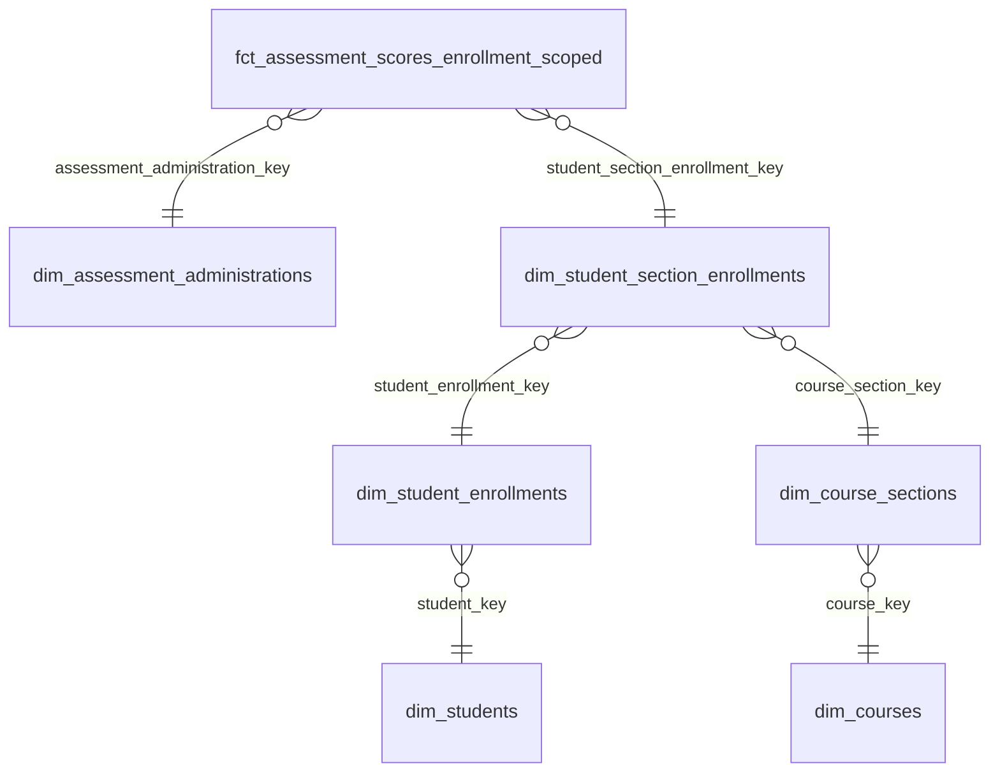
```mermaid
erDiagram
  fct_assessment_scores_enrollment_scoped }o--|| dim_assessment_administrations : "assessment_administration_key"
  fct_assessment_scores_enrollment_scoped }o--|| dim_student_section_enrollments : "student_section_enrollment_key"
  dim_student_section_enrollments }o--|| dim_student_enrollments : "student_enrollment_key"
  dim_student_section_enrollments }o--|| dim_course_sections : "course_section_key"
  dim_student_enrollments }o--|| dim_students : "student_key"
  dim_course_sections }o--|| dim_courses : "course_key"
```

### Foreign keys

| FK column                        | References                        |
| -------------------------------- | --------------------------------- |
| `assessment_administration_key`  | `dim_assessment_administrations`  |
| `student_section_enrollment_key` | `dim_student_section_enrollments` |
| `test_date_key`                  | `dim_dates`                       |

## fct_assessment_scores_student_scoped

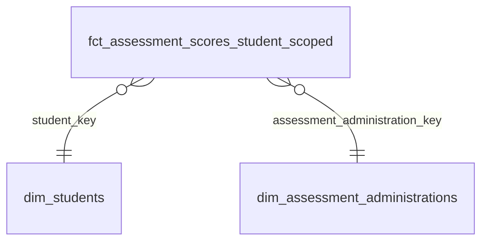
```mermaid
erDiagram
  fct_assessment_scores_student_scoped }o--|| dim_students : "student_key"
  fct_assessment_scores_student_scoped }o--|| dim_assessment_administrations : "assessment_administration_key"
```

### Foreign keys

| FK column                       | References                       |
| ------------------------------- | -------------------------------- |
| `assessment_administration_key` | `dim_assessment_administrations` |
| `student_key`                   | `dim_students`                   |
| `test_date_key`                 | `dim_dates`                      |

## fct_behavioral_consequences

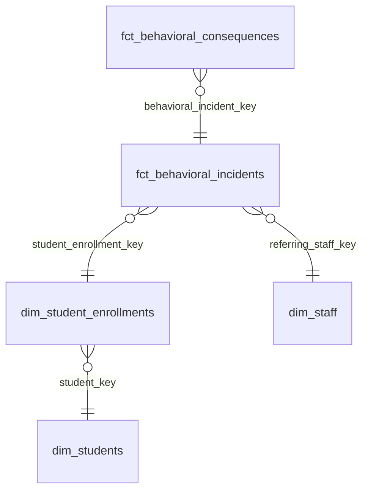
```mermaid
erDiagram
  fct_behavioral_consequences }o--|| fct_behavioral_incidents : "behavioral_incident_key"
  fct_behavioral_incidents }o--|| dim_student_enrollments : "student_enrollment_key"
  fct_behavioral_incidents }o--|| dim_staff : "referring_staff_key"
  dim_student_enrollments }o--|| dim_students : "student_key"
```

### Foreign keys

| FK column                 | References                 |
| ------------------------- | -------------------------- |
| `behavioral_incident_key` | `fct_behavioral_incidents` |
| `end_date_key`            | `dim_dates`                |
| `start_date_key`          | `dim_dates`                |

## fct_behavioral_incidents

```mermaid
erDiagram
  fct_behavioral_incidents }o--|| dim_student_enrollments : "student_enrollment_key"
  fct_behavioral_incidents }o--|| dim_staff : "referring_staff_key"
  dim_student_enrollments }o--|| dim_students : "student_key"
```

### Foreign keys

| FK column                | References                |
| ------------------------ | ------------------------- |
| `close_date_key`         | `dim_dates`               |
| `creation_date_key`      | `dim_dates`               |
| `location_key`           | `dim_locations`           |
| `referring_staff_key`    | `dim_staff`               |
| `return_date_key`        | `dim_dates`               |
| `student_enrollment_key` | `dim_student_enrollments` |

## fct_family_communications

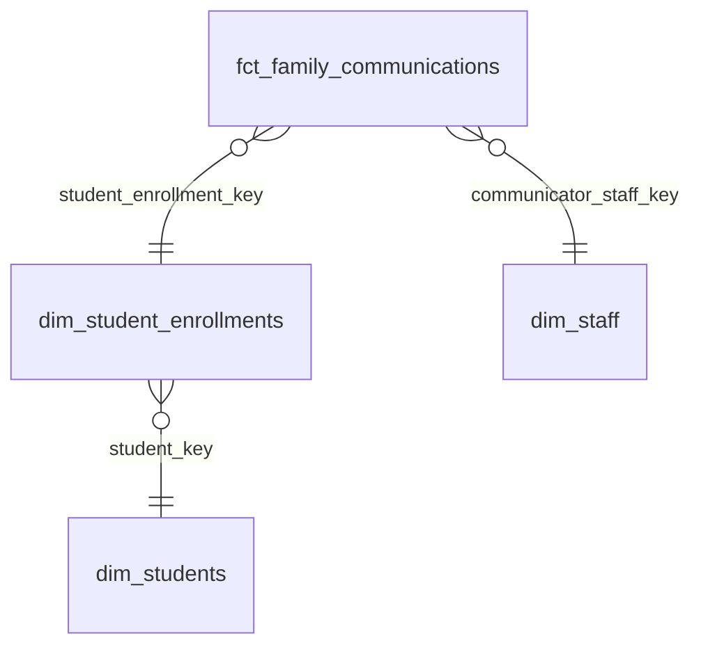
```mermaid
erDiagram
  fct_family_communications }o--|| dim_student_enrollments : "student_enrollment_key"
  fct_family_communications }o--|| dim_staff : "communicator_staff_key"
  dim_student_enrollments }o--|| dim_students : "student_key"
```

### Foreign keys

| FK column                | References                |
| ------------------------ | ------------------------- |
| `communicator_staff_key` | `dim_staff`               |
| `date_key`               | `dim_dates`               |
| `student_enrollment_key` | `dim_student_enrollments` |

## fct_grades_assignments

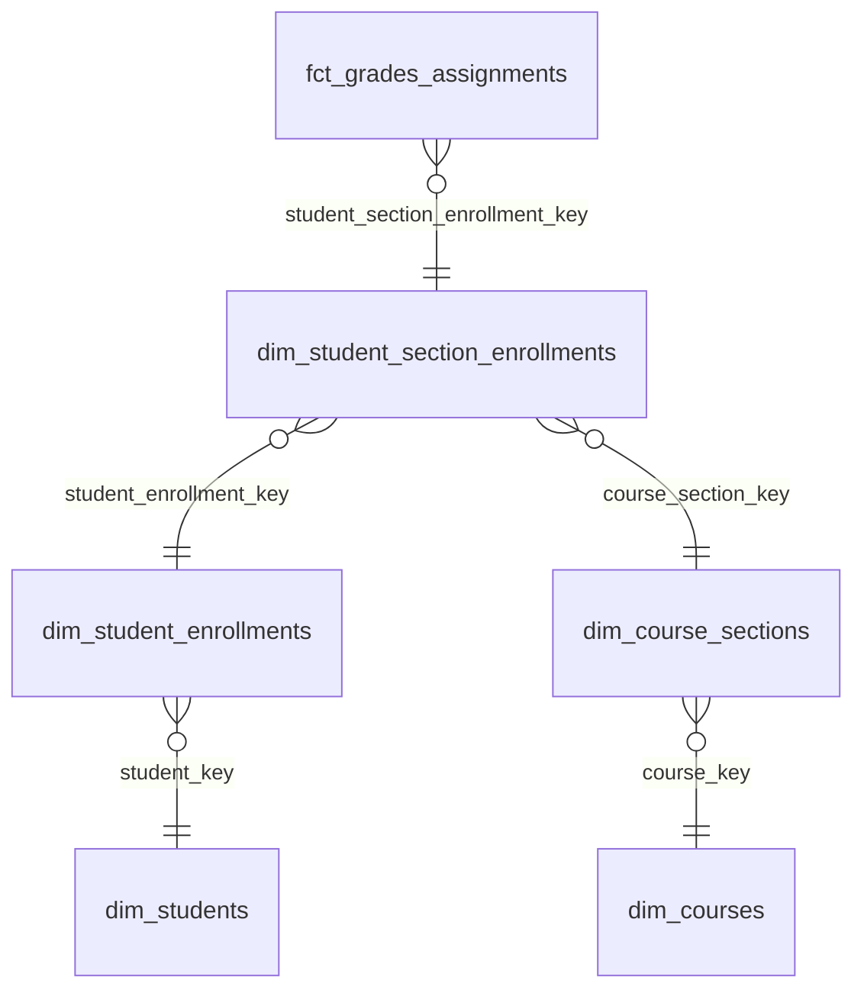
```mermaid
erDiagram
  fct_grades_assignments }o--|| dim_student_section_enrollments : "student_section_enrollment_key"
  dim_student_section_enrollments }o--|| dim_student_enrollments : "student_enrollment_key"
  dim_student_section_enrollments }o--|| dim_course_sections : "course_section_key"
  dim_student_enrollments }o--|| dim_students : "student_key"
  dim_course_sections }o--|| dim_courses : "course_key"
```

### Foreign keys

| FK column                        | References                        |
| -------------------------------- | --------------------------------- |
| `due_date_key`                   | `dim_dates`                       |
| `student_section_enrollment_key` | `dim_student_section_enrollments` |
| `term_key`                       | `dim_terms`                       |

## fct_grades_category

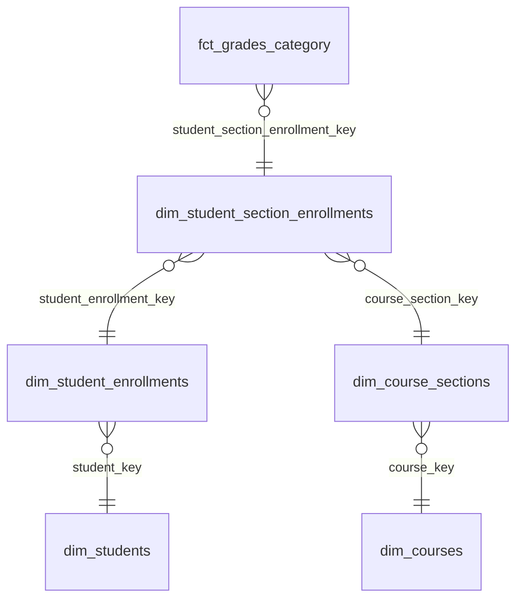
```mermaid
erDiagram
  fct_grades_category }o--|| dim_student_section_enrollments : "student_section_enrollment_key"
  dim_student_section_enrollments }o--|| dim_student_enrollments : "student_enrollment_key"
  dim_student_section_enrollments }o--|| dim_course_sections : "course_section_key"
  dim_student_enrollments }o--|| dim_students : "student_key"
  dim_course_sections }o--|| dim_courses : "course_key"
```

### Foreign keys

| FK column                        | References                        |
| -------------------------------- | --------------------------------- |
| `student_section_enrollment_key` | `dim_student_section_enrollments` |
| `term_key`                       | `dim_terms`                       |

## fct_grades_gpa

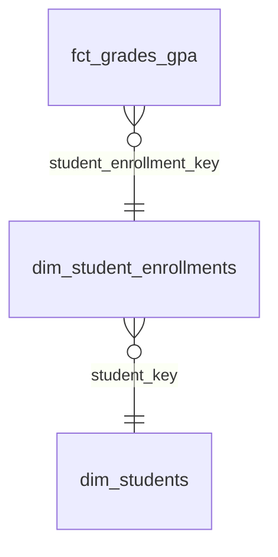
```mermaid
erDiagram
  fct_grades_gpa }o--|| dim_student_enrollments : "student_enrollment_key"
  dim_student_enrollments }o--|| dim_students : "student_key"
```

### Foreign keys

| FK column                | References                |
| ------------------------ | ------------------------- |
| `student_enrollment_key` | `dim_student_enrollments` |
| `term_key`               | `dim_terms`               |

## fct_grades_term

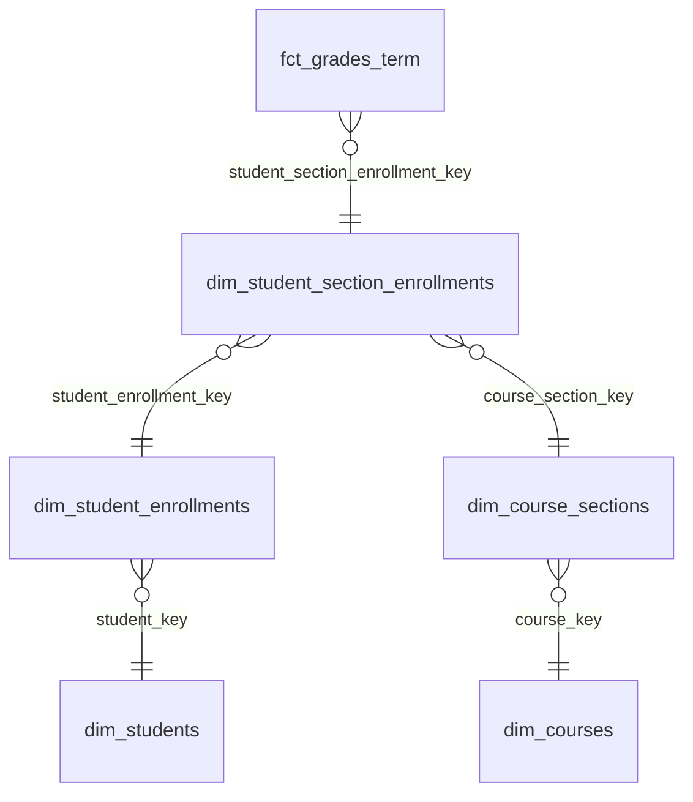
```mermaid
erDiagram
  fct_grades_term }o--|| dim_student_section_enrollments : "student_section_enrollment_key"
  dim_student_section_enrollments }o--|| dim_student_enrollments : "student_enrollment_key"
  dim_student_section_enrollments }o--|| dim_course_sections : "course_section_key"
  dim_student_enrollments }o--|| dim_students : "student_key"
  dim_course_sections }o--|| dim_courses : "course_key"
```

### Foreign keys

| FK column                        | References                        |
| -------------------------------- | --------------------------------- |
| `student_section_enrollment_key` | `dim_student_section_enrollments` |
| `term_end_date_key`              | `dim_dates`                       |
| `term_key`                       | `dim_terms`                       |
| `term_start_date_key`            | `dim_dates`                       |

## fct_job_candidate_applications

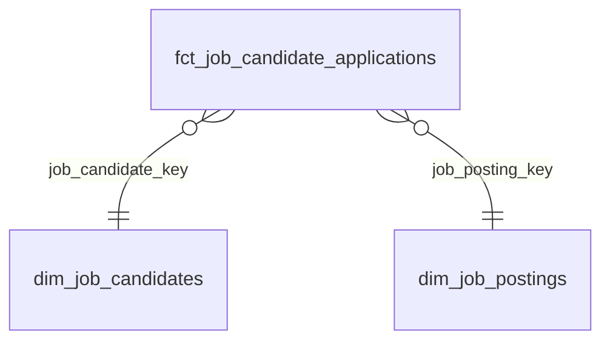
```mermaid
erDiagram
  fct_job_candidate_applications }o--|| dim_job_candidates : "job_candidate_key"
  fct_job_candidate_applications }o--|| dim_job_postings : "job_posting_key"
```

### Foreign keys

| FK column                  | References           |
| -------------------------- | -------------------- |
| `created_date_key`         | `dim_dates`          |
| `job_candidate_key`        | `dim_job_candidates` |
| `job_posting_key`          | `dim_job_postings`   |
| `shared_with_location_key` | `dim_locations`      |

## fct_staff_attrition

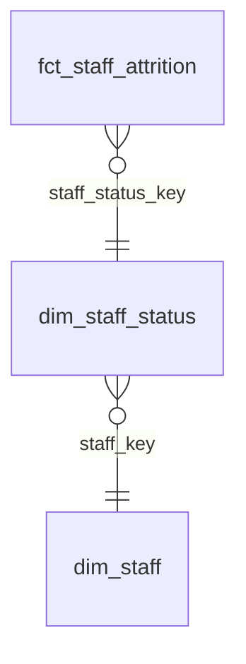
```mermaid
erDiagram
  fct_staff_attrition }o--|| dim_staff_status : "staff_status_key"
  dim_staff_status }o--|| dim_staff : "staff_key"
```

### Foreign keys

| FK column          | References         |
| ------------------ | ------------------ |
| `staff_status_key` | `dim_staff_status` |

## fct_staff_benefits_enrollments

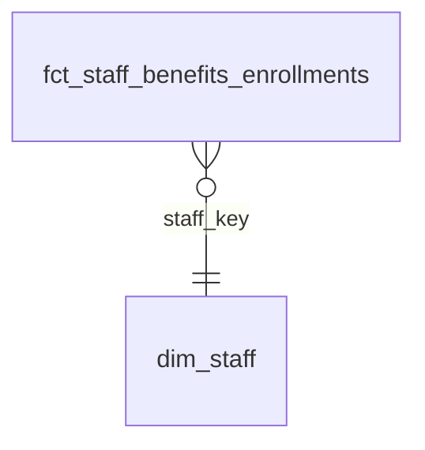
```mermaid
erDiagram
  fct_staff_benefits_enrollments }o--|| dim_staff : "staff_key"
```

### Foreign keys

| FK column   | References  |
| ----------- | ----------- |
| `staff_key` | `dim_staff` |

## fct_staff_membership_enrollments

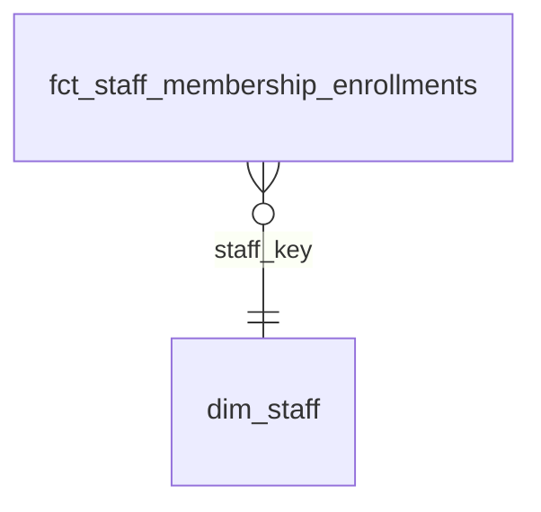
```mermaid
erDiagram
  fct_staff_membership_enrollments }o--|| dim_staff : "staff_key"
```

### Foreign keys

| FK column   | References  |
| ----------- | ----------- |
| `staff_key` | `dim_staff` |

## fct_staff_observation_goals

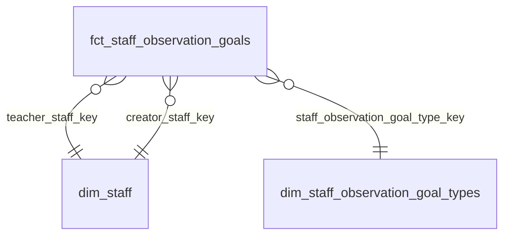
```mermaid
erDiagram
  fct_staff_observation_goals }o--|| dim_staff : "teacher_staff_key"
  fct_staff_observation_goals }o--|| dim_staff_observation_goal_types : "staff_observation_goal_type_key"
  fct_staff_observation_goals }o--|| dim_staff : "creator_staff_key"
```

### Foreign keys

| FK column                         | References                         |
| --------------------------------- | ---------------------------------- |
| `creator_staff_key`               | `dim_staff`                        |
| `staff_observation_goal_type_key` | `dim_staff_observation_goal_types` |
| `teacher_staff_key`               | `dim_staff`                        |

## fct_staff_observation_scores

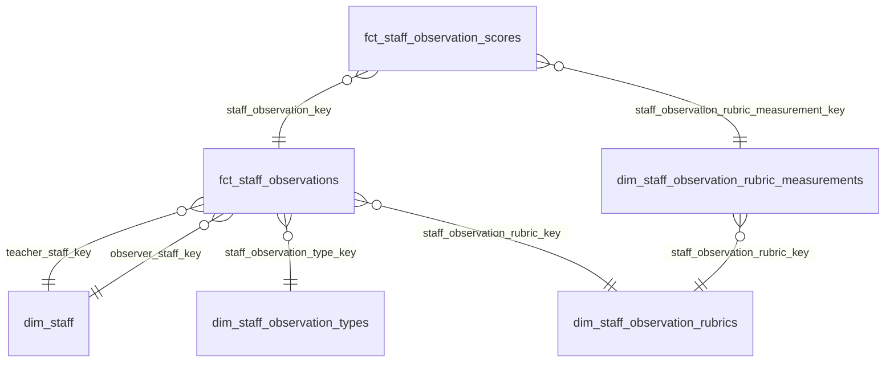
```mermaid
erDiagram
  fct_staff_observation_scores }o--|| fct_staff_observations : "staff_observation_key"
  fct_staff_observation_scores }o--|| dim_staff_observation_rubric_measurements : "staff_observation_rubric_measurement_key"
  fct_staff_observations }o--|| dim_staff : "teacher_staff_key"
  fct_staff_observations }o--|| dim_staff_observation_types : "staff_observation_type_key"
  fct_staff_observations }o--|| dim_staff_observation_rubrics : "staff_observation_rubric_key"
  fct_staff_observations }o--|| dim_staff : "observer_staff_key"
  dim_staff_observation_rubric_measurements }o--|| dim_staff_observation_rubrics : "staff_observation_rubric_key"
```

### Foreign keys

| FK column                                  | References                                  |
| ------------------------------------------ | ------------------------------------------- |
| `staff_observation_key`                    | `fct_staff_observations`                    |
| `staff_observation_rubric_measurement_key` | `dim_staff_observation_rubric_measurements` |

## fct_staff_observations

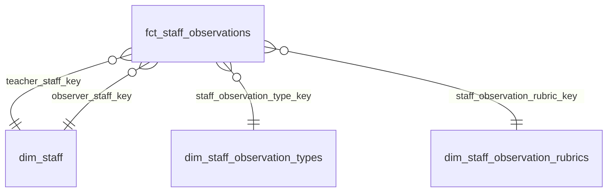
```mermaid
erDiagram
  fct_staff_observations }o--|| dim_staff : "teacher_staff_key"
  fct_staff_observations }o--|| dim_staff_observation_types : "staff_observation_type_key"
  fct_staff_observations }o--|| dim_staff_observation_rubrics : "staff_observation_rubric_key"
  fct_staff_observations }o--|| dim_staff : "observer_staff_key"
```

### Foreign keys

| FK column                      | References                      |
| ------------------------------ | ------------------------------- |
| `location_key`                 | `dim_locations`                 |
| `observed_date_key`            | `dim_dates`                     |
| `observer_staff_key`           | `dim_staff`                     |
| `staff_observation_rubric_key` | `dim_staff_observation_rubrics` |
| `staff_observation_type_key`   | `dim_staff_observation_types`   |
| `teacher_staff_key`            | `dim_staff`                     |
| `term_key`                     | `dim_terms`                     |

## fct_student_attendance_daily

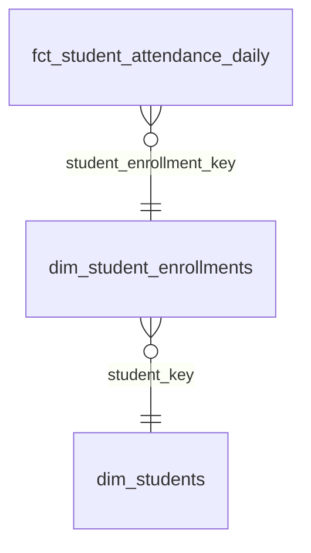
```mermaid
erDiagram
  fct_student_attendance_daily }o--|| dim_student_enrollments : "student_enrollment_key"
  dim_student_enrollments }o--|| dim_students : "student_key"
```

### Foreign keys

| FK column                | References                |
| ------------------------ | ------------------------- |
| `date_key`               | `dim_dates`               |
| `student_enrollment_key` | `dim_student_enrollments` |
| `term_key`               | `dim_terms`               |

## fct_student_attendance_interventions

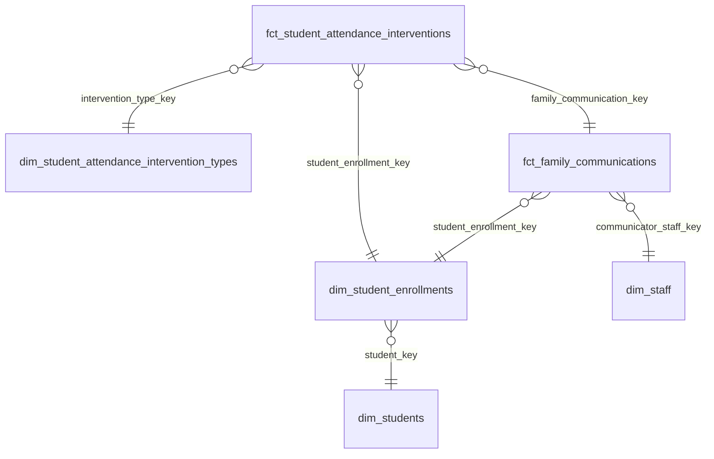
```mermaid
erDiagram
  fct_student_attendance_interventions }o--|| dim_student_enrollments : "student_enrollment_key"
  fct_student_attendance_interventions }o--|| dim_student_attendance_intervention_types : "intervention_type_key"
  fct_student_attendance_interventions }o--|| fct_family_communications : "family_communication_key"
  dim_student_enrollments }o--|| dim_students : "student_key"
  fct_family_communications }o--|| dim_student_enrollments : "student_enrollment_key"
  fct_family_communications }o--|| dim_staff : "communicator_staff_key"
```

### Foreign keys

| FK column                  | References                                  |
| -------------------------- | ------------------------------------------- |
| `date_key`                 | `dim_dates`                                 |
| `family_communication_key` | `fct_family_communications`                 |
| `intervention_type_key`    | `dim_student_attendance_intervention_types` |
| `student_enrollment_key`   | `dim_student_enrollments`                   |

## fct_student_attendance_streaks

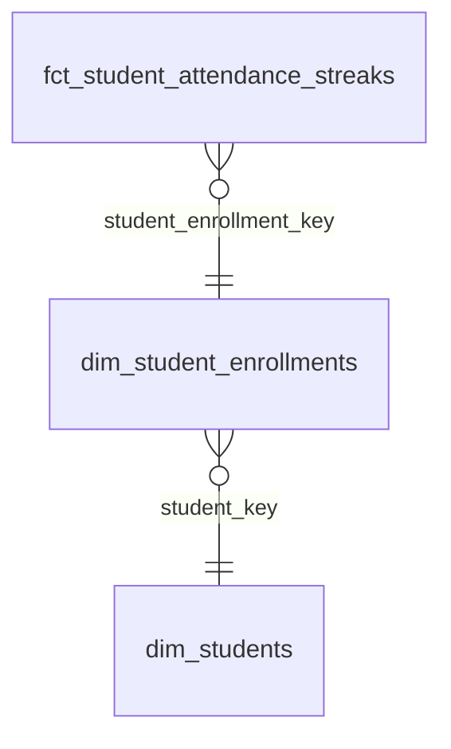
```mermaid
erDiagram
  fct_student_attendance_streaks }o--|| dim_student_enrollments : "student_enrollment_key"
  dim_student_enrollments }o--|| dim_students : "student_key"
```

### Foreign keys

| FK column                | References                |
| ------------------------ | ------------------------- |
| `streak_end_date_key`    | `dim_dates`               |
| `streak_start_date_key`  | `dim_dates`               |
| `student_enrollment_key` | `dim_student_enrollments` |

## fct_student_enrollment_daily

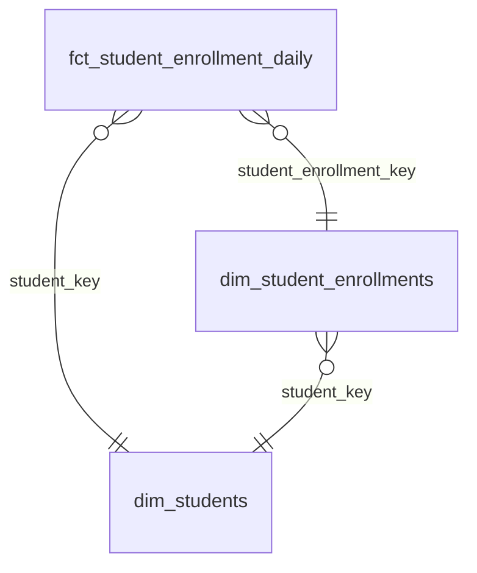
```mermaid
erDiagram
  fct_student_enrollment_daily }o--|| dim_student_enrollments : "student_enrollment_key"
  fct_student_enrollment_daily }o--|| dim_students : "student_key"
  dim_student_enrollments }o--|| dim_students : "student_key"
```

### Foreign keys

| FK column                | References                |
| ------------------------ | ------------------------- |
| `date_key`               | `dim_dates`               |
| `location_key`           | `dim_locations`           |
| `student_enrollment_key` | `dim_student_enrollments` |
| `student_key`            | `dim_students`            |

## fct_support_tickets

```mermaid
erDiagram
  fct_support_tickets }o--|| dim_staff : "submitter_staff_key"
  fct_support_tickets }o--|| dim_staff : "assignee_staff_key"
  fct_support_tickets }o--|| dim_staff : "original_assignee_staff_key"
```

### Foreign keys

| FK column                     | References      |
| ----------------------------- | --------------- |
| `assignee_staff_key`          | `dim_staff`     |
| `created_date_key`            | `dim_dates`     |
| `location_key`                | `dim_locations` |
| `original_assignee_staff_key` | `dim_staff`     |
| `solved_date_key`             | `dim_dates`     |
| `submitter_staff_key`         | `dim_staff`     |

## fct_survey_responses

```mermaid
erDiagram
  fct_survey_responses }o--|| fct_survey_submissions : "survey_submission_key"
  fct_survey_responses }o--|| dim_survey_questions : "survey_question_key"
  fct_survey_submissions }o--|| dim_survey_administrations : "survey_administration_key"
  fct_survey_submissions }o--|| dim_staff : "staff_key"
  fct_survey_submissions }o--|| dim_student_enrollments : "student_enrollment_key"
  fct_survey_submissions }o--|| dim_student_contact_persons : "student_contact_person_key"
  fct_survey_submissions }o--|| dim_staff : "subject_staff_key"
  dim_survey_administrations }o--|| dim_surveys : "survey_key"
  dim_student_enrollments }o--|| dim_students : "student_key"
```

### Foreign keys

| FK column               | References               |
| ----------------------- | ------------------------ |
| `survey_question_key`   | `dim_survey_questions`   |
| `survey_submission_key` | `fct_survey_submissions` |

## fct_survey_submissions

```mermaid
erDiagram
  fct_survey_submissions }o--|| dim_survey_administrations : "survey_administration_key"
  fct_survey_submissions }o--|| dim_staff : "staff_key"
  fct_survey_submissions }o--|| dim_student_enrollments : "student_enrollment_key"
  fct_survey_submissions }o--|| dim_student_contact_persons : "student_contact_person_key"
  fct_survey_submissions }o--|| dim_staff : "subject_staff_key"
  dim_survey_administrations }o--|| dim_surveys : "survey_key"
  dim_student_enrollments }o--|| dim_students : "student_key"
```

### Foreign keys

| FK column                    | References                    |
| ---------------------------- | ----------------------------- |
| `date_submitted_key`         | `dim_dates`                   |
| `staff_key`                  | `dim_staff`                   |
| `student_contact_person_key` | `dim_student_contact_persons` |
| `student_enrollment_key`     | `dim_student_enrollments`     |
| `subject_staff_key`          | `dim_staff`                   |
| `survey_administration_key`  | `dim_survey_administrations`  |

## fct_work_assignment_additional_earnings

```mermaid
erDiagram
  fct_work_assignment_additional_earnings }o--|| dim_staff_work_assignments : "work_assignment_key"
  dim_staff_work_assignments }o--|| dim_staff : "staff_key"
  dim_staff_work_assignments }o--|| dim_staff : "time_approver_staff_key"
```

### Foreign keys

| FK column                  | References                   |
| -------------------------- | ---------------------------- |
| `effective_end_date_key`   | `dim_dates`                  |
| `effective_start_date_key` | `dim_dates`                  |
| `work_assignment_key`      | `dim_staff_work_assignments` |

## fct_work_assignment_compensation

```mermaid
erDiagram
  fct_work_assignment_compensation }o--|| dim_staff_work_assignments : "work_assignment_key"
  dim_staff_work_assignments }o--|| dim_staff : "staff_key"
  dim_staff_work_assignments }o--|| dim_staff : "time_approver_staff_key"
```

### Foreign keys

| FK column                  | References                   |
| -------------------------- | ---------------------------- |
| `effective_end_date_key`   | `dim_dates`                  |
| `effective_start_date_key` | `dim_dates`                  |
| `work_assignment_key`      | `dim_staff_work_assignments` |
