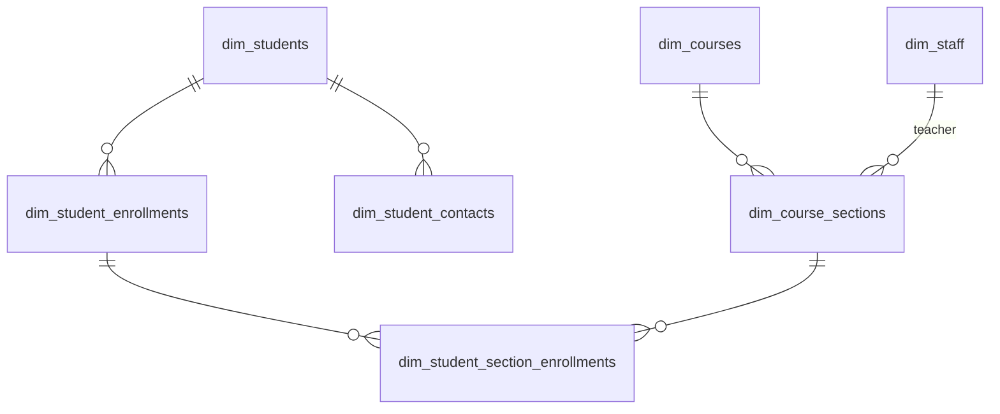
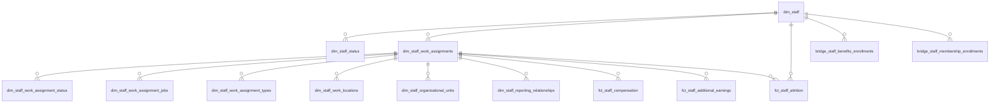
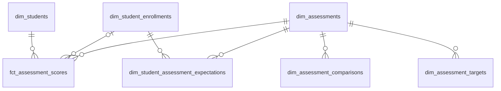
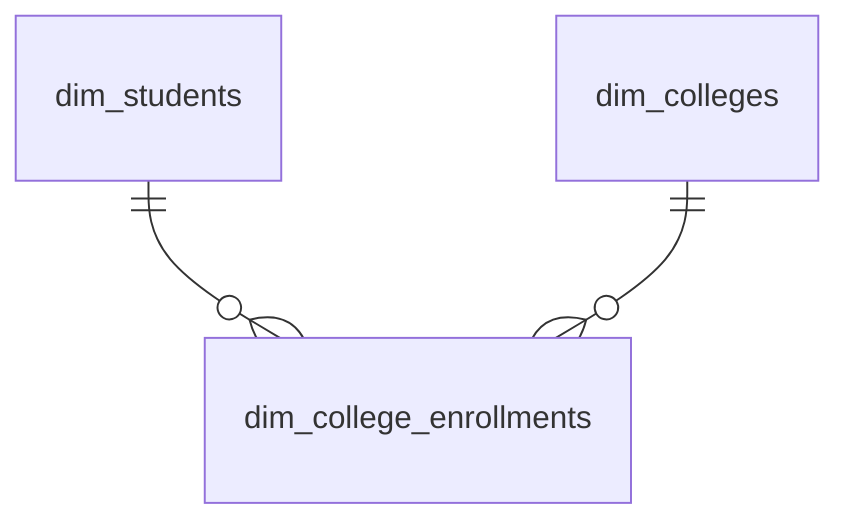
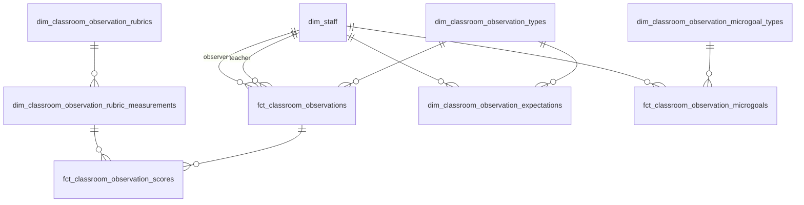
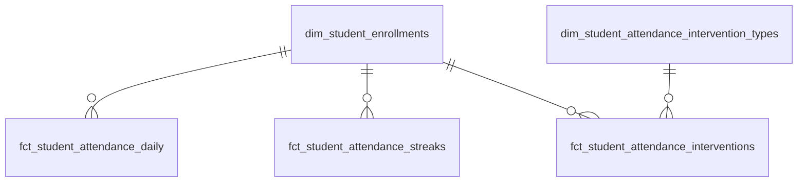
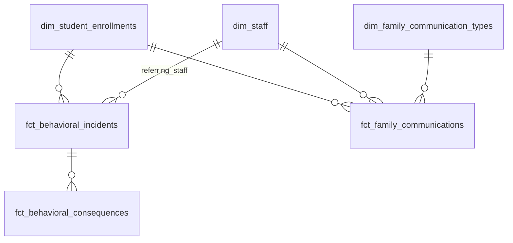
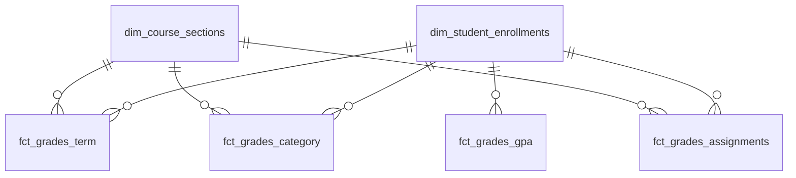
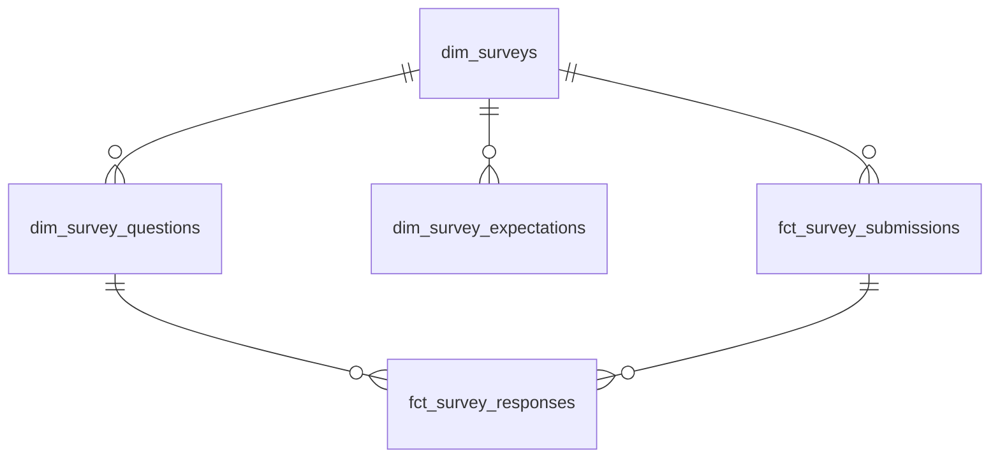
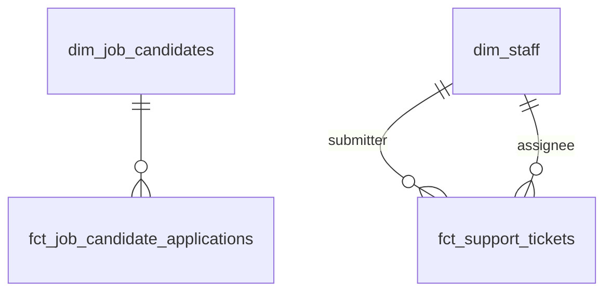

# Star Schema Data Mart Design

## Summary

A conformed star schema data mart for the kipptaf dbt project, following the
**Kimball dimensional modeling methodology**. Designed to be mapped onto a Cube
semantic layer and consumed by all reporting. This mart replaces the role of the
existing `models/extracts/` folder over time — Cube handles analytics consumers
(Tableau, Google Sheets, DeansList, ad-hoc), while thin dbt extract models on
top of the mart handle system integration feeds (Clever, PowerSchool autocomm,
ADP, IDauto, etc.) where format requirements don't belong in a semantic layer.
Dagster assets query the mart/Cube and deliver files to target systems.

## Scope

- Design and build the complete star schema in `models/marts/` with
  `dimensions/`, `facts/`, and `bridges/` subdirectories.
- Does NOT include: Cube semantic layer configuration, rewiring existing
  extracts, or retiring existing models. Those are future projects that consume
  this deliverable.

## Glossary

Key concepts used throughout this design. All terms follow the Kimball
dimensional modeling methodology.

| Concept                    | Plain English                                                                                                                                                                           | Example                                                                                                                                                                                                                         |
| -------------------------- | --------------------------------------------------------------------------------------------------------------------------------------------------------------------------------------- | ------------------------------------------------------------------------------------------------------------------------------------------------------------------------------------------------------------------------------- |
| **Dimension (dim)**        | A table of descriptive attributes — the "who, what, where, when" that give context to events. Think of it as a lookup table on steroids.                                                | `dim_students` describes each student (name, grade, demographics). When you filter a report by "Grade 8" or "Newark," you're filtering on dimensions.                                                                           |
| **Fact (fct)**             | A table of measurable events or transactions — the "what happened." Each row records something that occurred at a specific grain.                                                       | `fct_student_attendance_daily` records one row per student per day with present/absent/tardy. `fct_assessment_scores` records each test result with scale scores and proficiency levels.                                        |
| **Factless fact table**    | A fact table with no numeric measures — it just records that something happened (or should have happened). You count rows instead of summing measures.                                  | `fct_student_attendance_interventions` records that a student crossed an absence threshold and whether the required communication was completed. No dollar amounts or scores — you count rows to track intervention compliance. |
| **Bridge table**           | A table that resolves many-to-many relationships — when one entity connects to multiple values in a dimension. Without it, you'd get duplicate counts.                                  | A staff member enrolled in multiple benefit plans. The bridge table has one row per staff x plan combination, preventing overcounting.                                                                                          |
| **Star schema**            | A fact table at the center, joined to dimension tables around it like points of a star. Simple, fast, and optimized for analytical queries.                                             | `fct_student_attendance_daily` at center, joined to `dim_student_enrollments`, `dim_dates`, `dim_locations`, `dim_school_calendars`.                                                                                            |
| **Role-playing dimension** | A single dimension table joined to a fact multiple times, once for each "role" a date/person plays. Instead of duplicating the dimension, you create aliased joins.                     | `fct_behavioral_consequences` joins to `dim_dates` twice — once as `start_date` and once as `end_date`. Same date table, two different meanings.                                                                                |
| **SCD Type 1 (overwrite)** | When an attribute changes, just overwrite the old value. No history kept.                                                                                                               | `dim_students` — if a student's name is corrected, the old name is gone. You only need the current state.                                                                                                                       |
| **SCD Type 2 (versioned)** | When an attribute changes, keep the old row and add a new one with effective dates. History is preserved.                                                                               | `dim_staff_work_assignment_jobs` — when job title or job code changes, a new row is created with `effective_date_start/end` so you can see what the assignment's role was at any point in time.                                 |
| **Conformed dimension**    | A dimension shared across multiple fact tables with consistent keys and attributes, so you can query across business processes.                                                         | `dim_staff` is used by compensation, observations, tickets, and communications — same staff key everywhere.                                                                                                                     |
| **Expectation dimension**  | A dimension that scaffolds what _should_ happen — which assessments a student should take, which observations a teacher should receive. Compared against facts for completion tracking. | `dim_student_assessment_expectations` defines one row per student_enrollment x assessment x administration_window. LEFT JOIN to `fct_assessment_scores` to find gaps.                                                           |

## Conventions

### Column Naming

All mart models use generic, standard terminology — no source system field names
or KIPP-specific language. Mapping from source-specific names happens in
staging/intermediate layers. The
[Ed-Fi Unified Data Model](https://edfi.atlassian.net/wiki/spaces/EFDS/overview)
is a reference for entity and attribute nomenclature where applicable.

| Source-Specific                          | Mart Column Name           |
| ---------------------------------------- | -------------------------- |
| `student_number` (PowerSchool)           | `local_student_identifier` |
| `home_business_unit_name` (ADP)          | `legal_entity`             |
| `_dbt_source_relation` region extraction | `region`                   |

### dbt Conventions

All models follow existing dbt project conventions documented in
`src/dbt/CLAUDE.md` and `src/dbt/kipptaf/CLAUDE.md`:

- `contract: enforced: true` (inherited from `dbt_project.yml` directory config)
- Uniqueness tests on all models
- No `SELECT *` in final SELECT of mart models
- Column ordering per ST06 rule
- `current_date('{{ var("local_timezone") }}')` for timezone-aware dates
- `union_dataset_join_clause()` macro for cross-region joins
- Surrogate keys via `dbt_utils.generate_surrogate_key()`

### Date Keys

Date keys are raw DATE types — not integer surrogates. `dim_dates` carries a
`date_timestamp` column (TIMESTAMP cast) for Cube, which requires timestamps for
date dimension joins. Fact and dimension tables join to `dim_dates` on the DATE
key directly.

### Source Layer Relationship

Google Sheets and other reference/scaffold sources (expected assessments,
academic goals, PM goals, reporting terms, etc.) remain at the staging and
intermediate layers and flow into mart dimensions through the normal dbt DAG.
The mart is a new consumption layer — it does not replace or refactor the
upstream models that feed it. Existing intermediate and extract models keep
their current sources.

## Architectural Decisions

| Decision                     | Choice                                                                                                                                                                               | Rationale                                                                                                                                      |
| ---------------------------- | ------------------------------------------------------------------------------------------------------------------------------------------------------------------------------------ | ---------------------------------------------------------------------------------------------------------------------------------------------- |
| Methodology                  | Kimball dimensional modeling                                                                                                                                                         | Industry standard for analytical data warehouses; star schemas optimized for query performance and user comprehension                          |
| Multi-region handling        | `dim_regions` as its own normalized dimension                                                                                                                                        | Clean FK on all facts; supports region-specific logic in Cube                                                                                  |
| Business logic split         | Balanced — dbt handles structural logic and stable business rules; Cube handles presentation logic and consumer-specific shaping                                                     | Pragmatic boundary between warehouse and semantic layer                                                                                        |
| System integration feeds     | Thin dbt extracts on top of mart + Dagster for delivery                                                                                                                              | Cube stays purely analytical; format-specific shaping doesn't belong in semantic layer                                                         |
| Time/calendar                | Role-playing `dim_dates` + `dim_terms` + `dim_school_calendars`                                                                                                                      | Ad-hoc date filtering is a primary concern; every meaningful date on a fact gets a first-class dimension relationship                          |
| `dim_terms` scope            | Generalized beyond academic terms                                                                                                                                                    | Covers academic terms, performance management rounds, survey windows, assessment admin windows, fiscal periods                                 |
| `dim_school_calendars` scope | Serves attendance validity AND assessment calculations                                                                                                                               | School-day counts drive DIBELS progress monitoring goal calculations (expected words mastered by date at school level)                         |
| SCDs                         | Hybrid — Type 2 where point-in-time history matters, Type 1 for stable/static dims                                                                                                   | Keeps complexity where it adds analytical value                                                                                                |
| Student fact FK routing      | All student-context facts FK to `dim_student_enrollments`, not `dim_students` directly                                                                                               | Enrollment scopes every fact to a specific school and year                                                                                     |
| Staff compensation FK        | `fct_staff_compensation` and `fct_staff_additional_earnings` FK to `dim_staff_work_assignments`                                                                                      | Compensation is per-position, not per-person                                                                                                   |
| Attrition + termination      | Single `fct_staff_attrition` fact (employee x academic_year x attrition_type, recalculated each run); `fct_staff_terminations` dropped                                               | Termination data only meaningful within attrition context; no standalone consumers                                                             |
| Expectation scaffolds        | Dimensions (`dim_*_expectations`) for assessments, observations, surveys                                                                                                             | Define what _should_ happen; compared against facts for completion tracking                                                                    |
| Expectation inputs           | `dim_student_section_enrollments` is a key input to building `dim_student_assessment_expectations`                                                                                   | Section enrollment determines subject, which determines expected assessments                                                                   |
| Survey completion            | `fct_survey_submissions` (completion-level) as parent of `fct_survey_responses` (question-level)                                                                                     | Enables completion tracking without requiring question-level detail                                                                            |
| Date keys                    | Raw DATE type; `dim_dates` carries a `date_timestamp` column for Cube                                                                                                                | Avoids surrogate key overhead; resolves Cube timestamp type requirements                                                                       |
| Talent acquisition isolation | SmartRecruiters and ADP/Seat Tracker have no joinable ID                                                                                                                             | No connection to `dim_staff_work_assignments` or `dim_staffing_positions` in current state                                                     |
| Assessment facts             | Single unified `fct_assessment_scores` with nullable columns for assessment-family-specific fields                                                                                   | Simpler cross-assessment analysis; Cube handles conditional column exposure                                                                    |
| Assessment fact FK           | Dual FK — `student_key` (always populated) and nullable `student_enrollment_key` (populated for enrollment-scoped assessments)                                                       | Some assessments (SAT, AP) are student-scoped, not enrollment-scoped                                                                           |
| Assessment targets           | Single `dim_assessment_targets` with `target_type` discriminator                                                                                                                     | Accommodates vendor-defined benchmarks (DIBELS levels, iReady growth), KIPP-defined internal goals, and any other target category in one model |
| Gradebook facts              | Full hierarchy — term grades, category grades, assignments                                                                                                                           | Assignments are important even though current extract usage is limited                                                                         |
| GPA                          | Pre-calculated `fct_grades_gpa` fact                                                                                                                                                 | Cumulative/weighted/unweighted logic too complex for Cube calculation                                                                          |
| Attendance                   | Separate facts by business process                                                                                                                                                   | Daily attendance, streaks, and interventions have different grains                                                                             |
| Staff domain decomposition   | Derived from the ADP API Pydantic schema (`Worker` → `WorkAssignment` → nested objects); structs stay as columns, arrays and high-churn structs get their own effective-dated models | Matches the source data structure; empirical change frequency analysis (BigQuery) confirms which attributes need independent versioning        |
| Staff assignment SCD         | `dim_staff_work_assignments` is Type 1; high-churn attributes factored to Type 2 child models                                                                                        | Assignment status (48%), compensation (48%), job title (19%), worker type (20%), location (10%) change too frequently to version on the parent |
| Course domain                | Normalized — course catalog separate from sections                                                                                                                                   | Clean separation of catalog vs instance                                                                                                        |
| Observations                 | Own domain separate from performance management                                                                                                                                      | Classroom observations are a distinct business process; PM round mapping and tier calculation are Cube concerns                                |
| Compensation                 | Fact, not dimension                                                                                                                                                                  | Compensation changes are measurable events (dollar amounts, rates) rather than descriptive attributes                                          |
| Mart directory structure     | `marts/dimensions/`, `marts/facts/`, `marts/bridges/`                                                                                                                                | Mirrors how Cube thinks; star schema role is the organizing principle                                                                          |
| Build order                  | Conformed dimensions first, then domain facts                                                                                                                                        | Facts depend on conformed dims; clear dependency ordering                                                                                      |

## Model Inventory

### Conformed Dimensions

| Model                  | SCD    | Grain                                                                                         | Key Sources                                                                                                                     |
| ---------------------- | ------ | --------------------------------------------------------------------------------------------- | ------------------------------------------------------------------------------------------------------------------------------- |
| `dim_dates`            | Static | one row per calendar date (2000-01-01 to 9999-12-31)                                          | Generated — day of week, month, quarter, year, is_weekday, academic_year, fiscal_year, date_timestamp (TIMESTAMP cast for Cube) |
| `dim_terms`            | Type 1 | one row per named period x region (region nullable for org-wide periods like fiscal quarters) | Google Sheets reporting terms, performance management rounds, survey windows, assessment admin windows, fiscal periods          |
| `dim_regions`          | Type 1 | one row per region                                                                            | Newark, Camden, Miami, Paterson — state, timezone, regulatory context                                                           |
| `dim_locations`        | Type 1 | one row per school/office                                                                     | Location crosswalk — region, grade band, campus, school IDs, abbreviation                                                       |
| `dim_school_calendars` | Type 1 | one row per date x school                                                                     | PowerSchool calendar day — is_in_session, is_membership_day. FK to `dim_dates` and `dim_locations`                              |

### Student Domain

| Model                             | SCD    | Grain                                                                                            | Key Sources                                                                                                                                          |
| --------------------------------- | ------ | ------------------------------------------------------------------------------------------------ | ---------------------------------------------------------------------------------------------------------------------------------------------------- |
| `dim_students`                    | Type 1 | one row per student                                                                              | PowerSchool — local_student_identifier, state_student_identifier, name, birth_date, gender, race/ethnicity, is_gifted, has_iep, is_ell, lunch_status |
| `dim_student_enrollments`         | Type 1 | one row per student x school x year (each enrollment is a distinct record with entry/exit dates) | PowerSchool enrollments — grade_level, graduation_year, school_level, enroll_status, is_retained_year                                                |
| `dim_student_contacts`            | Type 1 | one row per student x contact person                                                             | PowerSchool student contacts — contact_name, relationship, phone, email, is_emergency, is_primary, contact_priority                                  |
| `dim_student_section_enrollments` | Type 1 | one row per student x section                                                                    | PowerSchool — FK to `dim_student_enrollments`, `dim_course_sections`, `dim_terms`. Roster membership.                                                |

**Foreign keys on `dim_student_enrollments`:**

- `student_key` -> `dim_students`
- `location_key` -> `dim_locations`
- `region_key` -> `dim_regions`
- `entry_date_key` -> `dim_dates` (role-playing)
- `exit_date_key` -> `dim_dates` (role-playing)

### Staff Domain

The staff domain decomposition follows the ADP Workforce Now API Pydantic schema
(`Worker` → `WorkAssignment` → nested objects). The `Worker` is the top-level
entity extracted daily from the API; history is constructed from daily snapshot
diffs by hashing the full payload and retaining rows where the hash changes.

At the **worker level**, person attributes are Type 1 on `dim_staff`, while
`workerStatus` gets its own effective-dated model to track employment status
over time.

At the **work assignment level**, `dim_staff_work_assignments` is **Type 1**
(current state only). Nested objects that change frequently or have their own
multiplicity are factored into effective-dated child models. This decomposition
is justified by empirical change frequency analysis across 4,675 work
assignments in BigQuery:

| Attribute group             | Assignments with changes | Treatment                                                        |
| --------------------------- | ------------------------ | ---------------------------------------------------------------- |
| `assignmentStatus`          | 2,260 (48%)              | Own model (Type 2)                                               |
| `baseRemuneration`          | 2,262 (48%)              | Own model (Type 2)                                               |
| `workerTypeCode` + benefits | 922 (20%)                | Own model (Type 2)                                               |
| `jobTitle` / `jobCode`      | 899 (19%)                | Own model (Type 2)                                               |
| `homeWorkLocation`          | 485 (10%)                | Own model (Type 2)                                               |
| `workerTimeProfile`         | 1,376 (artifact)         | Type 1 on assignment (one-time backfill, no point-in-time value) |
| All other scalars/structs   | 0–440                    | Type 1 on assignment                                             |

#### Worker-level models

| Model              | SCD    | Grain                                 | Key Sources                                                                                                                |
| ------------------ | ------ | ------------------------------------- | -------------------------------------------------------------------------------------------------------------------------- |
| `dim_staff`        | Type 1 | one row per person                    | ADP `Worker.person` (names, demographics, addresses, communication), `Worker.workerDates`, `Worker.customFieldGroup`, LDAP |
| `dim_staff_status` | Type 2 | one row per worker x status x version | ADP `Worker.workerStatus` — status_code (Active, Terminated). Effective-dated from daily snapshot diffs.                   |

#### Work assignment models

| Model                                 | SCD    | Grain                                                 | Key Sources                                                                                                                                                                                                                           |
| ------------------------------------- | ------ | ----------------------------------------------------- | ------------------------------------------------------------------------------------------------------------------------------------------------------------------------------------------------------------------------------------- |
| `dim_staff_work_assignments`          | Type 1 | one row per assignment                                | ADP `WorkAssignment` scalars + static structs — positionID, flags (primary, management, voluntary), FTE, payroll fields, dates (hire, start, seniority, termination), workerTimeProfile, wageLawCoverage, payCycleCode, standardHours |
| `dim_staff_work_assignment_status`    | Type 2 | one row per assignment x status x version             | ADP `WorkAssignment.assignmentStatus` — status_code, reason_code, effective_date                                                                                                                                                      |
| `dim_staff_work_assignment_jobs`      | Type 2 | one row per assignment x job x version                | ADP `WorkAssignment.jobTitle` + `WorkAssignment.jobCode` — these always change together (899 items). Effective-dated.                                                                                                                 |
| `dim_staff_work_assignment_types`     | Type 2 | one row per assignment x worker type x version        | ADP `WorkAssignment.workerTypeCode` + `WorkAssignment.workerGroups[]` (benefits_eligibility_class). 77% of eligibility changes co-occur with type changes. Effective-dated.                                                           |
| `dim_staff_work_locations`            | Type 2 | one row per assignment x location x version           | ADP `WorkAssignment.homeWorkLocation` — name_code, address. Effective-dated. Answers "which school was this person at on date X?"                                                                                                     |
| `dim_staff_organizational_units`      | Type 2 | one row per assignment x org unit x version           | ADP `WorkAssignment.homeOrganizationalUnits[]` + `assignedOrganizationalUnits[]` — business_unit, department, cost_number. `assignment_type` column (home/assigned). Effective-dated.                                                 |
| `dim_staff_reporting_relationships`   | Type 2 | one row per assignment x manager x version            | ADP `WorkAssignment.reportsTo[]` — manager identifier, name, position. Effective-dated.                                                                                                                                               |
| `fct_staff_compensation`              | Type 2 | one row per assignment x compensation x version       | ADP `WorkAssignment.baseRemuneration` — annual/hourly/daily/period rates, effective_date. FK to `dim_staff_work_assignments`, `dim_dates`.                                                                                            |
| `fct_staff_additional_earnings`       | Type 2 | one row per assignment x earning type x version       | ADP `WorkAssignment.additionalRemunerations[]` — supplemental pay (stipends, bonuses). FK to `dim_staff_work_assignments`, `dim_dates`.                                                                                               |
| `fct_staff_attrition`                 | Type 1 | one row per employee x academic_year x attrition_type | `int_people__staff_roster_history` — is_attrition, termination_reason, termination_effective_date, snapshot_date. Three methodology rows (foundation, nj_compliance, recruitment). FK to `dim_staff`, `dim_staff_work_assignments`.   |
| `bridge_staff_benefits_enrollments`   | Type 1 | one row per staff x benefit plan x enrollment period  | ADP SFTP pension and benefits — plan_type, plan_name, coverage_level, enrollment_start_date, enrollment_end_date. FK to `dim_staff`.                                                                                                  |
| `bridge_staff_membership_enrollments` | Type 1 | one row per staff x program x enrollment period       | ADP SFTP employee memberships — program_name (leader development, teacher development), enrollment_start_date, enrollment_end_date. FK to `dim_staff`.                                                                                |

**Dropped from work assignment:**

- `WorkAssignment.assignedWorkLocations[]` — 148/4,675 items populated, never
  differs from homeWorkLocation, never changes. No signal.
- `WorkAssignment.occupationalClassifications[]` — 7% populated, unused by any
  downstream model.

**Foreign keys on `dim_staff_work_assignments`:**

- `staff_key` -> `dim_staff`

All Type 2 child models FK back to `dim_staff_work_assignments` via
`work_assignment_key`. They carry their own `effective_date_start` /
`effective_date_end` / `is_current_record` columns.

**`fct_staff_attrition` detail:**

A fact table capturing each staff member's attrition status at the close of each
academic year, across three measurement methodologies. Replaces both prototype
`fct_staff_attrition` and `fct_staff_terminations`.

| Column                       | Type             | Notes                                                                                                    |
| ---------------------------- | ---------------- | -------------------------------------------------------------------------------------------------------- |
| `staff_attrition_key`        | string           | Surrogate PK: `employee_number + academic_year + attrition_type`                                         |
| `staff_key`                  | string           | FK to `dim_staff`                                                                                        |
| `work_assignment_key`        | string           | FK to `dim_staff_work_assignments`                                                                       |
| `academic_year`              | int64            |                                                                                                          |
| `attrition_type`             | string           | `foundation`, `nj_compliance`, `recruitment`                                                             |
| `snapshot_date`              | date             | Window close per methodology (4/30 / 6/30 / 8/31) for retained; termination effective date for attritors |
| `is_attrition`               | boolean          | `TRUE` = attrited, `FALSE` = retained                                                                    |
| `termination_reason`         | string, nullable | Excludes `Import Created Action` and `Upgrade Created Action` artifacts                                  |
| `termination_effective_date` | date, nullable   |                                                                                                          |

Attrition methodology window definitions:

| `attrition_type` | Cohort window               | Return check date     | Retained `snapshot_date` |
| ---------------- | --------------------------- | --------------------- | ------------------------ |
| `foundation`     | 9/1 – 4/30 of academic year | 9/1 of following year | 4/30                     |
| `nj_compliance`  | 7/1 – 6/30 of academic year | 7/1 of following year | 6/30                     |
| `recruitment`    | 9/1 – 8/31 of academic year | 9/1 of following year | 8/31                     |

A person is in a methodology's cohort only if they had an active (non-Pre-Start,
non-Terminated, non-Deceased) assignment during that window. Interns whose
assignment status reason is `Internship Ended` are excluded from all cohorts.

### Course Domain

| Model                 | SCD    | Grain                         | Key Sources                                                                                              |
| --------------------- | ------ | ----------------------------- | -------------------------------------------------------------------------------------------------------- |
| `dim_courses`         | Type 1 | one row per course in catalog | PowerSchool courses — course_number, course_name, discipline, credit_hours                               |
| `dim_course_sections` | Type 1 | one row per section x term    | PowerSchool sections — section_number, teacher (FK -> `dim_staff`), location_key, term_key, period, room |

### Assessment Domain

| Model                                 | SCD    | Grain                                                               | Key Sources                                                                                                                                                                                                                                                                                                                                                    |
| ------------------------------------- | ------ | ------------------------------------------------------------------- | -------------------------------------------------------------------------------------------------------------------------------------------------------------------------------------------------------------------------------------------------------------------------------------------------------------------------------------------------------------- |
| `dim_assessments`                     | Type 1 | one row per assessment definition                                   | Assessment metadata — assessment_type (SAT, PSAT, AP, iReady, STAR, DIBELS, FAST, NJSLA, internal), subject, scope, grade_level_tested                                                                                                                                                                                                                         |
| `dim_assessment_comparisons`          | Type 1 | one row per assessment x year x region                              | Google Sheets state test comparison — external benchmarks (city, state, neighborhood schools percent proficient, total students). Answers "how do we compare?"                                                                                                                                                                                                 |
| `dim_assessment_targets`              | Type 1 | one row per assessment x year x target_type x school x grade        | Assessment targets with `target_type` discriminator — vendor-defined benchmarks (DIBELS benchmark levels, iReady growth targets), KIPP-defined internal goals (grade/school/region/organization goals), and any other target category. Answers "are we hitting our targets?"                                                                                   |
| `dim_student_assessment_expectations` | Type 1 | one row per student_enrollment x assessment x administration_window | Scaffolded from business rules — which assessments a student should take based on grade, school, year. FK to `dim_student_enrollments`, `dim_assessments`, `dim_terms`. `dim_student_section_enrollments` is a key input (section → subject → expected assessments).                                                                                           |
| `fct_assessment_scores`               | Type 1 | one row per student x assessment x administration                   | Unified across assessment families — scale_score, percent_correct, proficiency_level, growth_percentile, nullable assessment-specific fields. FK to `dim_students` (always), `dim_student_enrollments` (nullable, for enrollment-scoped assessments), `dim_assessments`, `dim_dates` (test_date as role-playing), `dim_terms`, `dim_regions`, `dim_locations`. |

### College Domain

| Model                     | SCD    | Grain                                | Key Sources                                                                                                                                 |
| ------------------------- | ------ | ------------------------------------ | ------------------------------------------------------------------------------------------------------------------------------------------- |
| `dim_colleges`            | Type 1 | one row per institution              | NSC — college_name, type (2yr/4yr), selectivity, state                                                                                      |
| `dim_college_enrollments` | Type 1 | one row per student x college x term | NSC — enrollment_status, degree_pursued. FK to `dim_students`, `dim_colleges`, `dim_dates` (enrollment_date as role-playing), `dim_regions` |

### Classroom Observation & Professional Development Domain

| Model                                           | SCD    | Grain                                        | Key Sources                                                                                                                                                                         |
| ----------------------------------------------- | ------ | -------------------------------------------- | ----------------------------------------------------------------------------------------------------------------------------------------------------------------------------------- |
| `dim_classroom_observation_rubrics`             | Type 1 | one row per rubric definition                | SchoolMint Grow — rubric_name, measurement groups                                                                                                                                   |
| `dim_classroom_observation_rubric_measurements` | Type 1 | one row per measurement item per rubric      | SchoolMint Grow — measurement_name, strand_name. FK to `dim_classroom_observation_rubrics`                                                                                          |
| `dim_classroom_observation_types`               | Type 1 | one row per observation type                 | SchoolMint Grow — type name (walkthrough, O3, formal evaluation), scope, frequency expectations                                                                                     |
| `dim_classroom_observation_microgoal_types`     | Type 1 | one row per goal in 4-level taxonomy         | SchoolMint Grow generic tags — goal_type -> bucket -> strand -> goal                                                                                                                |
| `dim_classroom_observation_expectations`        | Type 1 | one row per staff x observation_type x term  | Scaffolded from business rules — which observations a staff member should receive based on role, location, term. FK to `dim_staff`, `dim_classroom_observation_types`, `dim_terms`. |
| `fct_classroom_observations`                    | Type 1 | one row per observation event                | SchoolMint Grow — overall_score, glows, grows. FK to `dim_staff` (teacher, observer as role-playing), `dim_classroom_observation_types`, `dim_locations`, `dim_dates`, `dim_terms`  |
| `fct_classroom_observation_scores`              | Type 1 | one row per measurement item per observation | SchoolMint Grow — measurement score, comments. FK to `fct_classroom_observations`, `dim_classroom_observation_rubric_measurements`                                                  |
| `fct_classroom_observation_microgoals`          | Type 1 | one row per teacher x goal assignment        | SchoolMint Grow assignments — assignment_date, creator. FK to `dim_staff`, `dim_classroom_observation_microgoal_types`, `dim_terms`                                                 |

**Note:** PM round mapping and tier calculation (PM1/PM2/PM3, overall tier 1-4)
are Cube concerns, not mart models.

### Student Attendance Domain

| Model                                       | SCD    | Grain                                                   | Key Sources                                                                                                                                                                                                            |
| ------------------------------------------- | ------ | ------------------------------------------------------- | ---------------------------------------------------------------------------------------------------------------------------------------------------------------------------------------------------------------------- |
| `dim_student_attendance_intervention_types` | Type 1 | one row per intervention type definition                | Scaffolded — absence threshold, region, commlog reason. Used for completeness tracking.                                                                                                                                |
| `fct_student_attendance_daily`              | Type 1 | one row per student x date                              | PowerSchool — attendance_code, excused/unexcused, present/absent/tardy/early_dismissal. FK to `dim_student_enrollments`, `dim_dates`, `dim_locations`, `dim_regions`, `dim_terms`, `dim_school_calendars`              |
| `fct_student_attendance_streaks`            | Type 1 | one row per student x streak                            | Derived — streak_start_date, streak_end_date, streak_length, streak_type. A derived business object not in the source data. FK to `dim_student_enrollments`, `dim_dates` (start, end as role-playing), `dim_locations` |
| `fct_student_attendance_interventions`      | Type 1 | one row per student x intervention type x academic year | Derived from threshold scaffold + DeansList comm log — intervention status (complete/missing). FK to `dim_student_enrollments`, `dim_student_attendance_intervention_types`, `dim_staff`, `dim_dates`                  |

### Behavioral & Communications Domain

| Model                            | SCD    | Grain                                        | Key Sources                                                                                                                                                                                                         |
| -------------------------------- | ------ | -------------------------------------------- | ------------------------------------------------------------------------------------------------------------------------------------------------------------------------------------------------------------------- |
| `dim_family_communication_types` | Type 1 | one row per communication type definition    | DeansList — method, topic/reason categories. Used for scaffolding.                                                                                                                                                  |
| `fct_behavioral_incidents`       | Type 1 | one row per student x incident               | DeansList — incident_type. FK to `dim_student_enrollments`, `dim_staff` (referring_staff as role-playing), `dim_dates`, `dim_locations`, `dim_regions`                                                              |
| `fct_behavioral_consequences`    | Type 1 | one row per student x incident x consequence | DeansList — consequence_type, duration, is_served. FK to `dim_student_enrollments`, `fct_behavioral_incidents` (incident_key), `dim_dates` (start, end as role-playing), `dim_locations`, `dim_regions`             |
| `fct_family_communications`      | Type 1 | one row per communication event              | DeansList comm log — method, topic, reason, status, outcome. General-purpose, not attendance-specific. FK to `dim_student_enrollments`, `dim_staff`, `dim_family_communication_types`, `dim_dates`, `dim_locations` |

### Gradebook Domain

| Model                    | SCD    | Grain                                          | Key Sources                                                                                                                                                                                                      |
| ------------------------ | ------ | ---------------------------------------------- | ---------------------------------------------------------------------------------------------------------------------------------------------------------------------------------------------------------------- |
| `fct_grades_term`        | Type 1 | one row per student x course x term            | PowerSchool — percent_grade, letter_grade, citizenship_grade. FK to `dim_student_enrollments`, `dim_course_sections`, `dim_terms`, `dim_regions`, `dim_dates`                                                    |
| `fct_grades_category`    | Type 1 | one row per student x course x term x category | PowerSchool — category_name, category_weight, percent_grade. FK to `dim_student_enrollments`, `dim_course_sections`, `dim_terms`, `dim_regions`                                                                  |
| `fct_grades_assignments` | Type 1 | one row per student x assignment               | PowerSchool — assignment_name, score, points_possible, is_missing, is_late, category. FK to `dim_student_enrollments`, `dim_course_sections`, `dim_terms`, `dim_regions`, `dim_dates` (due_date as role-playing) |
| `fct_grades_gpa`         | Type 1 | one row per student x term                     | Pre-calculated — cumulative_gpa, term_gpa, weighted/unweighted variants, credit_hours_earned, credit_hours_attempted. FK to `dim_student_enrollments`, `dim_terms`, `dim_regions`, `dim_locations`               |

### Survey Domain

| Model                     | SCD    | Grain                                            | Key Sources                                                                                                                                                                                                             |
| ------------------------- | ------ | ------------------------------------------------ | ----------------------------------------------------------------------------------------------------------------------------------------------------------------------------------------------------------------------- |
| `dim_surveys`             | Type 1 | one row per survey definition                    | Survey metadata — survey_name, survey_type, subject area. FK to `dim_terms` (survey window)                                                                                                                             |
| `dim_survey_questions`    | Type 1 | one row per survey x question                    | Alchemer — question_text, question_type, ordering, response_options. FK to `dim_surveys`. Source: `stg_alchemer__survey_question` + question crosswalk.                                                                 |
| `dim_survey_expectations` | Type 1 | one row per respondent x survey x term           | Scaffolded from business rules — which surveys a staff member or student should complete based on role, location, term. FK to `dim_staff` or `dim_student_enrollments` (respondent varies), `dim_surveys`, `dim_terms`. |
| `fct_survey_submissions`  | Type 1 | one row per respondent x survey x administration | Survey completion record. FK to `dim_surveys`, `dim_dates`, `dim_regions`, `dim_locations`. Respondent FK varies (staff or student_enrollment).                                                                         |
| `fct_survey_responses`    | Type 1 | one row per submission x question                | Response detail — response_value, response_text. FK to `fct_survey_submissions`, `dim_survey_questions`.                                                                                                                |

**Note:** Single unified model is the target; domain separation (staff vs.
student surveys) may be needed during implementation if response structures
diverge too much.

### Talent Acquisition Domain

| Model                            | SCD    | Grain                            | Key Sources                                                                                 |
| -------------------------------- | ------ | -------------------------------- | ------------------------------------------------------------------------------------------- |
| `dim_job_candidates`             | Type 1 | one row per candidate            | SmartRecruiters — candidate profile, contact info                                           |
| `fct_job_candidate_applications` | Type 1 | one row per applicant x position | SmartRecruiters — application status, stage, dates. FK to `dim_job_candidates`, `dim_dates` |

**Known limitation:** No unique identifier or matchable field exists between
SmartRecruiters (candidates) and ADP (staff) or AppSheet Seat Tracker
(positions). `dim_job_candidates` and `fct_job_candidate_applications` are an
isolated domain with no FK to `dim_staff_work_assignments` or
`dim_staffing_positions`. This is acknowledged as a future-state aspiration, not
current reality.

### Staffing Model Domain

| Model                    | SCD    | Grain                                   | Key Sources                                                                                                                                                                                                              |
| ------------------------ | ------ | --------------------------------------- | ------------------------------------------------------------------------------------------------------------------------------------------------------------------------------------------------------------------------ |
| `dim_staffing_positions` | Type 2 | one row per budgeted position x version | AppSheet seat tracker (via dbt snapshot) — department, job_title, location, entity, grade_band, staffing_status, plan_status, is_mid_year_hire. FK to `dim_locations`, `dim_staff` (teammate, recruiter as role-playing) |

Standalone dimension — no FK relationships to other mart domains currently. See
Talent Acquisition known limitation above.

### IT Support Domain

| Model                 | SCD    | Grain              | Key Sources                                                                                                                                                                                                                                              |
| --------------------- | ------ | ------------------ | -------------------------------------------------------------------------------------------------------------------------------------------------------------------------------------------------------------------------------------------------------- |
| `fct_support_tickets` | Type 1 | one row per ticket | Zendesk — ticket status, subject, category, tech_tier, resolution_time, reply_count, business_hours_to_solve. FK to `dim_staff` (submitter, assignee, original_assignee as role-playing), `dim_dates` (created, solved as role-playing), `dim_locations` |

## Model Summary

| Domain                      | Dimensions | Facts  | Bridges | Models |
| --------------------------- | ---------- | ------ | ------- | ------ |
| Conformed                   | 5          | 0      | 0       | 5      |
| Student                     | 4          | 0      | 0       | 4      |
| Staff                       | 9          | 3      | 2       | 14     |
| Course                      | 2          | 0      | 0       | 2      |
| Assessment                  | 4          | 1      | 0       | 5      |
| College                     | 2          | 0      | 0       | 2      |
| Classroom Observation & PD  | 5          | 3      | 0       | 8      |
| Student Attendance          | 1          | 3      | 0       | 4      |
| Behavioral & Communications | 1          | 3      | 0       | 4      |
| Gradebook                   | 0          | 4      | 0       | 4      |
| Survey                      | 3          | 2      | 0       | 5      |
| Talent Acquisition          | 1          | 1      | 0       | 2      |
| Staffing Model              | 1          | 0      | 0       | 1      |
| IT Support                  | 0          | 1      | 0       | 1      |
| **Total**                   | **38**     | **21** | **2**   | **61** |

## Role-Playing Date Keys

Every fact carries one or more foreign keys to `dim_dates`. Each key represents
a different date role — the same date table joined multiple times with different
aliases, so you can filter or group by any date independently. In Cube, each
role-playing key is defined as a separate join to `dim_dates` with an alias,
enabling full drill/filter/group capability on any date role.

Examples:

- `fct_student_attendance_daily`: `date_key`
- `fct_behavioral_consequences`: `start_date_key`, `end_date_key`
- `dim_student_enrollments`: `entry_date_key`, `exit_date_key`
- `fct_classroom_observations`: `observation_date_key`

## Slowly Changing Dimension Strategy

| SCD Type                | Applied To                                                                                                                                                                                                                                                                                                                                                                                                                                                                                                                                         | Behavior                                                                                                                     |
| ----------------------- | -------------------------------------------------------------------------------------------------------------------------------------------------------------------------------------------------------------------------------------------------------------------------------------------------------------------------------------------------------------------------------------------------------------------------------------------------------------------------------------------------------------------------------------------------- | ---------------------------------------------------------------------------------------------------------------------------- |
| Type 1 (overwrite)      | Most dimensions and facts — `dim_students`, `dim_student_enrollments`, `dim_student_contacts`, `dim_student_section_enrollments`, `dim_staff`, `dim_staff_work_assignments`, `dim_regions`, `dim_locations`, `dim_school_calendars`, `dim_courses`, `dim_course_sections`, `dim_assessments`, `dim_assessment_comparisons`, `dim_assessment_targets`, `dim_student_assessment_expectations`, `dim_colleges`, `dim_college_enrollments`, `dim_terms`, all classroom observation dims, all expectation dims, all survey dims, all facts, all bridges | Current state only; corrections overwrite                                                                                    |
| Type 2 (versioned rows) | `dim_staff_status`, `dim_staff_work_assignment_status`, `dim_staff_work_assignment_jobs`, `dim_staff_work_assignment_types`, `dim_staff_work_locations`, `dim_staff_organizational_units`, `dim_staff_reporting_relationships`, `fct_staff_compensation`, `fct_staff_additional_earnings`, `dim_staffing_positions`                                                                                                                                                                                                                                | Versioned with `effective_date_start`, `effective_date_end`, `is_current_record`; facts link to version active at event time |

## Open Review Items

### Requires domain expert validation

1. **Behavioral domain relationships** — the design models
   `fct_behavioral_incidents` and `fct_behavioral_consequences` as a
   parent-child fact relationship (consequences carry `incident_key` FK).
   Confirm with a domain expert that this accurately represents the DeansList
   data model.

2. **College/post-secondary domain** — the design includes `dim_colleges` and
   `dim_college_enrollments` based on NSC data. Confirm with a domain expert
   that this captures the full scope of post-secondary tracking needs
   (matriculation, persistence, degree completion, career outcomes).

### Requires further clarification

3. **College-related assessment expectations** — participation in AP, ACT, and
   SAT assessments differs from grade-level assessments where enrollment
   determines expectations. Needs further clarification on how to model elective
   participation in `dim_student_assessment_expectations`. Not blocking.

4. **`dim_locations` + academic_year** — school grade bands (ES/MS/HS) can
   change year over year as schools transition (e.g., 5th grade moving from MS
   to ES for certain schools/regions). Current `dim_locations` is Type 1 with
   static grade band. Pending feedback on whether historical school grade levels
   matter to analysis or if current year is sufficient.

### Monitor during implementation

- **`fct_assessment_scores` dual FK** — carries both `student_key` (always
  populated) and nullable `student_enrollment_key` (populated for
  enrollment-scoped assessments like iReady, DIBELS, FAST). Student-scoped
  assessments (SAT, AP, NJSLA) populate only `student_key`. Monitor for friction
  during implementation.
- **Survey respondent polymorphism** — `dim_survey_expectations`,
  `fct_survey_submissions`, and `fct_survey_responses` have respondent FKs that
  vary between `dim_staff` and `dim_student_enrollments`. May need domain
  separation if this creates join complexity in Cube.
- **Expectation scaffold complexity** — `dim_classroom_observation_expectations`
  and `dim_survey_expectations` business rules (different dates, types, regions,
  every year) may be complex to encode. Monitor during implementation.
- **Talent acquisition isolation** — no joinable ID between SmartRecruiters and
  ADP/Seat Tracker. Future-state aspiration.
- **Bridge table candidates** — students with multiple race/ethnicity codes,
  staff with multiple group memberships, students with multiple special program
  flags. Determine which need bridge tables as the data is explored.
- **Survey response structure** — single `fct_survey_responses` may need domain
  separation if staff and student survey structures diverge too much.
- **Attendance interventions domain placement** — currently in Student
  Attendance Domain but the actions are DeansList communications (Behavioral &
  Communications Domain). Revisit if the split causes friction.
- **Chronic absenteeism** — `fct_student_attendance_daily` (ADA derivable in
  Cube) + `fct_student_attendance_interventions` (threshold tracking) cover
  known requirements. Foundation is adding detailed CA tracking — monitor
  whether the current facts are sufficient or if additional structure is needed.
- **Cumulative GPA granularity** — `fct_grades_gpa` at student x term grain
  provides checkpoint history. Within-term GPA tracking currently lives in dbt
  snapshots + topline layer. Second pass to determine if the mart needs a
  finer-grained model beyond term endpoints.

## Future Domains

Acknowledged for future expansion — second pass after the fundamental domains
are covered:

- **Student Recruitment and Enrollment (SRE)** — enrollment pipeline/funnel
  tracking and Finalsite website/CMS analytics (includes the pattern for
  creating historical data where the source has none)
- **Certification tracking** — staff teaching certifications/licenses
- **Grant timesheet tracking** — time tracking for grant-funded positions

## Appendix: Entity Relationship Diagrams

Diagrams split by domain for readability. Conformed dimensions (`dim_dates`,
`dim_terms`, `dim_regions`, `dim_locations`, `dim_school_calendars`) are shared
across most domains and omitted.

### Student & Course

### Staff

### Assessment

### College

### Classroom Observation & Professional Development

### Student Attendance

### Behavioral & Communications

### Gradebook

### Survey

### Talent Acquisition, Staffing & IT Support

