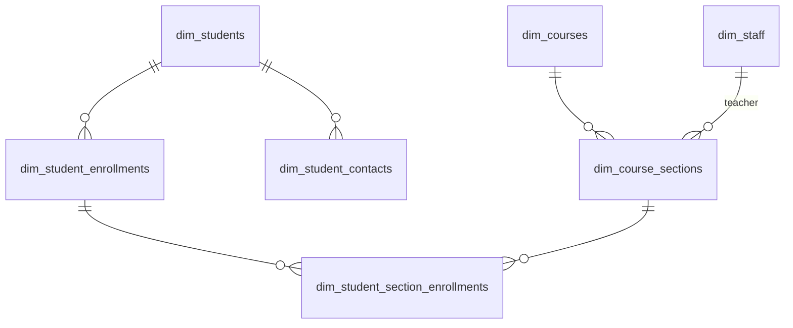
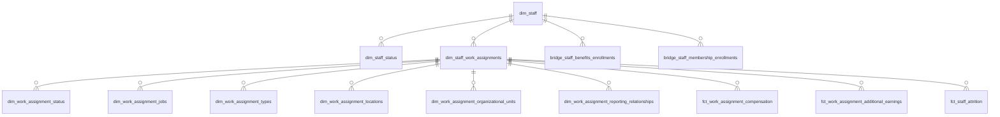
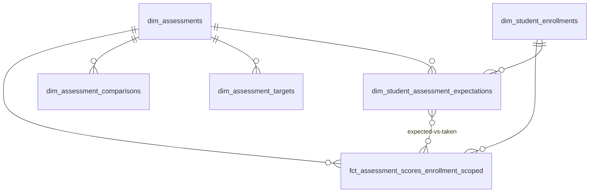
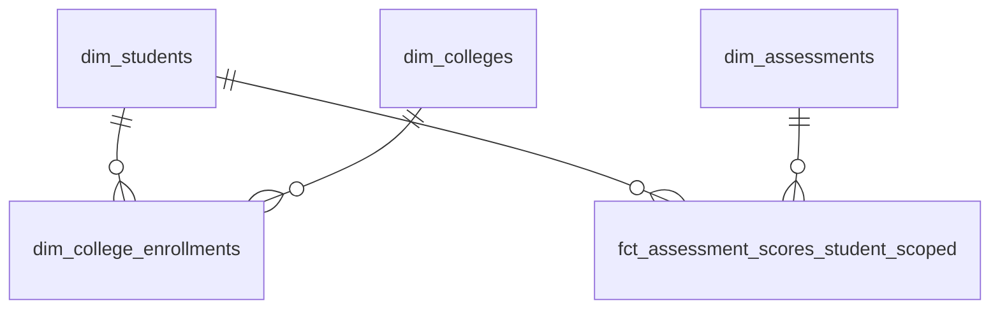
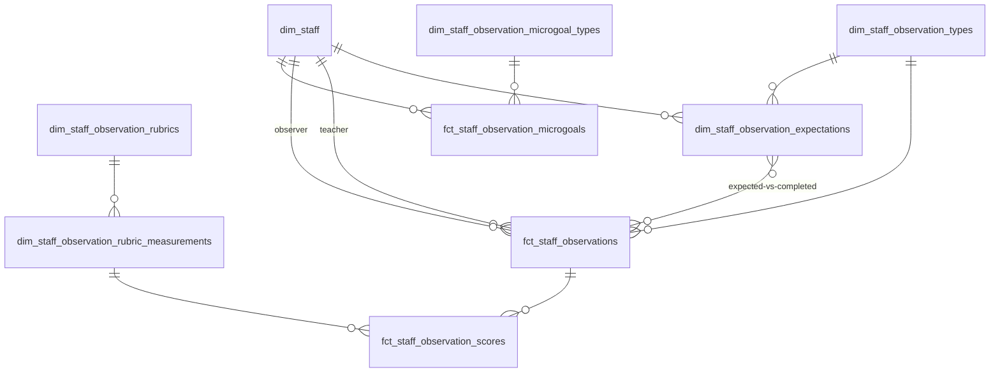
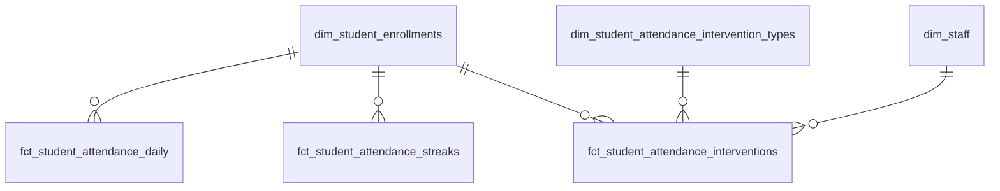
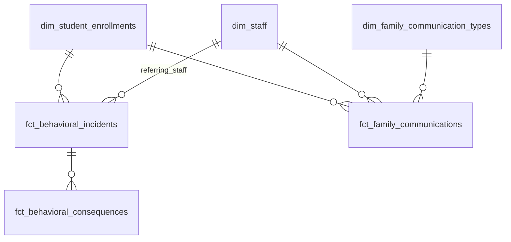
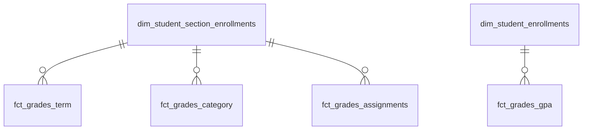
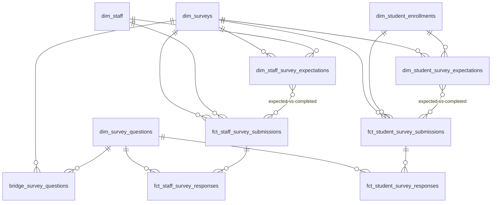
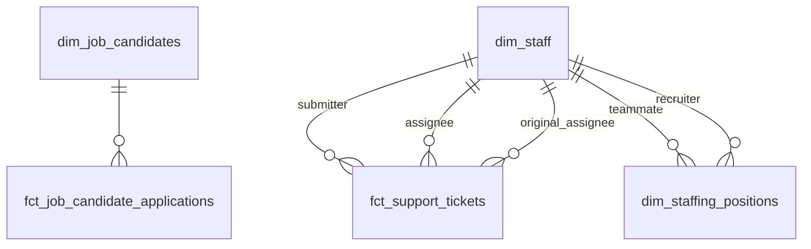

# Star Schema Data Mart Design

## Summary

A conformed star schema data mart for the kipptaf dbt project, following the
**Kimball dimensional modeling methodology**. Designed to be mapped onto a Cube
semantic layer and consumed by all reporting. This mart replaces the role of the
existing `models/extracts/` folder over time — Cube handles analytics consumers
(Tableau, Google Sheets, DeansList, ad-hoc), while thin dbt extract models on
top of the mart handle system integration feeds (Clever, PowerSchool autocomm,
ADP, IDauto, etc.) where format requirements don't belong in a semantic layer.
Dagster assets query the mart/Cube and deliver files to target systems.

## Scope

- Design and build the complete star schema in `models/marts/` with
  `dimensions/`, `facts/`, and `bridges/` subdirectories.
- Does NOT include: Cube semantic layer configuration, rewiring existing
  extracts, or retiring existing models. Those are future projects that consume
  this deliverable.

## Glossary

Key concepts used throughout this design. All terms follow the Kimball
dimensional modeling methodology.

| Concept                    | Plain English                                                                           | Example                                                                                                                     |
| -------------------------- | --------------------------------------------------------------------------------------- | --------------------------------------------------------------------------------------------------------------------------- |
| **Dimension (dim)**        | Descriptive attributes ("who, what, where, when") that provide context for events.      | `dim_students` — one row per student with name, grade, demographics.                                                        |
| **Fact (fct)**             | Measurable events or transactions; each row records something that happened at a grain. | `fct_student_attendance_daily` — one row per student per day with present/absent/tardy.                                     |
| **Factless fact table**    | A fact with no numeric measures — counted rather than summed.                           | `fct_student_attendance_interventions` — one row per student × intervention × year with completion status.                  |
| **Bridge table**           | Resolves many-to-many relationships so joins don't overcount.                           | `bridge_staff_benefits_enrollments` — one row per staff × benefit plan.                                                     |
| **Star schema**            | A central fact table joined to its dimensions.                                          | `fct_student_attendance_daily` joined to `dim_student_enrollments` + `dim_dates`.                                           |
| **Role-playing dimension** | One dimension joined multiple times with different aliases, each a different role.      | `fct_behavioral_consequences` joins `dim_dates` as both `start_date` and `end_date`.                                        |
| **SCD Type 1 (overwrite)** | Changes overwrite prior values; no history kept.                                        | `dim_students` — a corrected name replaces the old one.                                                                     |
| **SCD Type 2 (versioned)** | Each change adds a new row with effective dates; history preserved.                     | `dim_work_assignment_jobs` — a job title change adds a new row with its own effective dates.                                |
| **Conformed dimension**    | Shared across multiple facts with consistent keys; enables cross-process queries.       | `dim_staff` — same key used by compensation, observations, tickets, and communications.                                     |
| **Expectation dimension**  | Scaffolds what _should_ happen; compared against facts for completion tracking.         | `dim_student_assessment_expectations` — one row per student_enrollment × assessment × window; LEFT JOIN facts to find gaps. |

## Conventions

### Column Naming

All mart models use generic, standard terminology — no source system field names
or KIPP-specific language. Mapping from source-specific names happens in
staging/intermediate layers. The
[Ed-Fi Unified Data Model](https://edfi.atlassian.net/wiki/spaces/EFDS/overview)
is a reference for entity and attribute nomenclature where applicable.

| Source-Specific                          | Mart Column Name           |
| ---------------------------------------- | -------------------------- |
| `student_number` (PowerSchool)           | `local_student_identifier` |
| `home_business_unit_name` (ADP)          | `legal_entity`             |
| `_dbt_source_relation` region extraction | `region`                   |

### dbt Conventions

All models follow existing dbt project conventions documented in
`src/dbt/CLAUDE.md` and `src/dbt/kipptaf/CLAUDE.md`:

- `contract: enforced: true` (inherited from `dbt_project.yml` directory config)
- Uniqueness tests on all models
- No `SELECT *` in final SELECT of mart models
- Column ordering per ST06 rule
- `current_date('{{ var("local_timezone") }}')` for timezone-aware dates
- `union_dataset_join_clause()` macro for cross-region joins
- Surrogate keys via `dbt_utils.generate_surrogate_key()`

### Date Keys

Date keys are raw DATE types — not integer surrogates. `dim_dates` carries a
`date_timestamp` column (TIMESTAMP cast) for Cube, which requires timestamps for
date dimension joins. Fact and dimension tables join to `dim_dates` on the DATE
key directly.

### Source Layer Relationship

Google Sheets and other reference/scaffold sources (expected assessments,
academic goals, PM goals, reporting terms, etc.) remain at the staging and
intermediate layers and flow into mart dimensions through the normal dbt DAG.
The mart is a new consumption layer — it does not replace or refactor the
upstream models that feed it. Existing intermediate and extract models keep
their current sources.

### Grain-Split Naming (facts and dimensions)

Under the strict-chain traversal principle (see Architectural Decisions), a
single business process sometimes splits into multiple facts or dimensions
because its rows bind to different grains or populations. Two naming patterns
apply:

- **Grain suffix (`_<grain>_scoped`)** — same process, rows bind to different
  grains of the same entity hierarchy. Siblings share a common prefix; the
  suffix identifies the grain. Example:
  `fct_assessment_scores_enrollment_scoped` and
  `fct_assessment_scores_student_scoped` are both assessment administrations
  with scores; they differ only in whether the record binds to a student
  enrollment (iReady, STAR, DIBELS, FAST, NJSLA, internal) or to a student (SAT,
  PSAT, ACT, AP).
- **Population prefix (`<population>_<process>_`)** — substantively different
  populations with parallel processes (different schedules, question pools,
  business rules). Example: `fct_staff_survey_submissions` and
  `fct_student_survey_submissions` are not the same survey at different grains;
  they have different question pools, administration schedules, and respondent
  contexts.
- **Solo models** — don't preemptively add suffixes. Apply the convention only
  when a sibling actually exists. Adding `_enrollment_scoped` to a dim with no
  student-scoped counterpart is noise.

**Decision test:** If the two models could in principle be `UNION`-ed and mean
something coherent (same columns, same business meaning), it's a grain split —
use the suffix. If they are parallel processes that happen to share a shape,
it's a population split — use the prefix.

## Foundational Decisions

The three decisions below shape the entire mart. Everything in the Architectural
Decisions table that follows is an implementation consequence of these; read
this section first.

### Methodology: Kimball dimensional modeling

Facts at the center, conformed dimensions around them, SCD Type 1 or Type 2
based on whether point-in-time history matters. Star schema is the organizing
principle: every reporting question decomposes into a fact (the event or
measurement) joined to dimensions (the context). Kimball is the industry
standard for analytical warehouses, optimizes for query performance and user
comprehension, and maps directly onto the Cube semantic layer.

### Fact/dim traversal: strict chain (A+X)

Every fact and dimension FKs only to its finest-grain parent on each entity
chain. Broader context is reached via chain traversal rather than redundant FKs.
When rows of one business process bind to different grains (e.g.,
enrollment-scoped vs student-scoped assessments), the fact splits at the grain
boundary rather than carrying nullable FKs.

Two exemptions:

- **Conformed dims** (`dim_dates`, `dim_terms`, `dim_regions`, `dim_locations`,
  `dim_school_calendars`) may be joined directly from any fact. They are the
  universal aggregation/filter axes.
- **Role-playing (aliased) joins** to any dim — including non-conformed dims
  like `dim_staff` as teacher/observer or submitter/assignee — are permitted.
  The alias is the semantic label; Cube resolves these cleanly via explicit
  aliased joins.

This eliminates unlabeled diamond subgraphs — two different join paths from one
fact to the same destination dim — which Cube docs flag as ambiguous and which
force per-query join-path hints to resolve. The discipline matches Cube's
transitive-join model: chained dims are traversed automatically at query time,
so the mart stays canonical and the consumer stays simple.

### Business logic split: dbt structural, Cube presentation

The mart handles structural logic and stable business rules — canonical keys,
SCD versioning, grain-level facts, expectation scaffolds. Cube handles
presentation-layer shaping — flat result sets for consumers, calculated measures
across cubes, segments, hierarchies, per-consumer dimension exposure, access
controls, and pre-aggregations.

Practical consequence: the mart stays lean and canonical; consumer-specific
shape lives in Cube, not in a proliferation of extract models. The existing
`models/extracts/` folder is the pre-Cube state; this mart + Cube subsumes its
role over time, except for system integration feeds (Clever, PowerSchool
autocomm, ADP, IDauto) where format-specific shaping doesn't belong in a
semantic layer — those remain as thin dbt extracts on top of the mart, with
Dagster delivering the output files to target systems.

## Architectural Decisions

Implementation-level decisions that follow from the Foundational Decisions.

| Decision                     | Choice                                                                                                                                                                               | Rationale                                                                                                                                                    |
| ---------------------------- | ------------------------------------------------------------------------------------------------------------------------------------------------------------------------------------ | ------------------------------------------------------------------------------------------------------------------------------------------------------------ |
| Multi-region handling        | `dim_regions` as its own normalized dimension                                                                                                                                        | Clean FK on all facts; supports region-specific logic in Cube                                                                                                |
| System integration feeds     | Thin dbt extracts on top of mart + Dagster for delivery                                                                                                                              | Cube stays purely analytical; format-specific shaping doesn't belong in semantic layer                                                                       |
| Time/calendar                | Role-playing `dim_dates` + `dim_terms` + `dim_school_calendars`                                                                                                                      | Ad-hoc date filtering is a primary concern; every meaningful date on a fact gets a first-class dimension relationship                                        |
| `dim_terms` scope            | Generalized beyond academic terms                                                                                                                                                    | Covers academic terms, performance management rounds, survey windows, assessment admin windows, fiscal periods                                               |
| `dim_school_calendars` scope | Serves attendance validity AND assessment calculations                                                                                                                               | School-day counts drive DIBELS progress monitoring goal calculations (expected words mastered by date at school level)                                       |
| SCDs                         | Hybrid — Type 2 where point-in-time history matters, Type 1 for stable/static dims                                                                                                   | Keeps complexity where it adds analytical value                                                                                                              |
| Student fact FK routing      | Each student-context fact FKs to its finest-grain dim — gradebook facts to `dim_student_section_enrollments`; daily attendance, GPA, etc. to `dim_student_enrollments`               | Strict chain — broader context (`dim_students`, `dim_locations`) reached via traversal, not duplicated FK                                                    |
| Staff compensation FK        | `fct_work_assignment_compensation` and `fct_work_assignment_additional_earnings` FK to `dim_staff_work_assignments`                                                                  | Compensation is per-position, not per-person                                                                                                                 |
| Attrition + termination      | Single `fct_staff_attrition` fact (employee x academic_year x attrition_type, recalculated each run); `fct_staff_terminations` dropped. FK to `dim_staff_work_assignments` only.     | Attrition cohort by definition requires an active assignment during the measurement window; traverse to `dim_staff` via the chain                            |
| Expectation scaffolds        | Dimensions (`dim_*_expectations`) for assessments, observations, surveys                                                                                                             | Define what _should_ happen; compared against facts for completion tracking                                                                                  |
| Expectation inputs           | `dim_student_section_enrollments` is a key input to building `dim_student_assessment_expectations`                                                                                   | Section enrollment determines subject, which determines expected assessments                                                                                 |
| Survey completion            | Submission-level fact (respondent x survey x admin) parent of response-level fact (submission x question)                                                                            | Enables completion tracking without requiring question-level detail                                                                                          |
| Survey respondent split      | Population split by respondent — `fct_staff_survey_*` / `dim_staff_survey_expectations` vs `fct_student_survey_*` / `dim_student_survey_expectations`                                | Staff and student surveys have different question pools, schedules, and business rules; parallel processes, not same process at different grains             |
| Date keys                    | Raw DATE type; `dim_dates` carries a `date_timestamp` column for Cube                                                                                                                | Avoids surrogate key overhead; resolves Cube timestamp type requirements                                                                                     |
| Talent acquisition isolation | SmartRecruiters and ADP/Seat Tracker have no joinable ID                                                                                                                             | No connection to `dim_staff_work_assignments` or `dim_staffing_positions` in current state                                                                   |
| Assessment facts             | Split by grain — `fct_assessment_scores_enrollment_scoped` (iReady, STAR, DIBELS, FAST, NJSLA, internal) and `fct_assessment_scores_student_scoped` (SAT, PSAT, ACT, AP)             | Enrollment-scoped assessments bind to a student's school/year context; student-scoped (College Board, ACT) follow the student and have no enrollment context |
| Assessment targets           | Single `dim_assessment_targets` with `target_type` discriminator                                                                                                                     | Accommodates vendor-defined benchmarks (DIBELS levels, iReady growth), KIPP-defined internal goals, and any other target category in one model               |
| Gradebook facts              | Full hierarchy — term grades, category grades, assignments — FK to `dim_student_section_enrollments`                                                                                 | Section enrollment is the finest grain at which grades are assigned; traverse up the chain for enrollment and student context                                |
| GPA                          | Pre-calculated `fct_grades_gpa` fact at student_enrollment grain                                                                                                                     | GPA is a per-term summary across all sections, not section-bound; complex cumulative/weighted logic too complex for Cube calculation                         |
| Attendance                   | Separate facts by business process                                                                                                                                                   | Daily attendance, streaks, and interventions have different grains                                                                                           |
| Staff domain decomposition   | Derived from the ADP API Pydantic schema (`Worker` → `WorkAssignment` → nested objects); structs stay as columns, arrays and high-churn structs get their own effective-dated models | Matches the source data structure; empirical change frequency analysis (BigQuery) confirms which attributes need independent versioning                      |
| Staff assignment SCD         | `dim_staff_work_assignments` is Type 1; high-churn attributes factored to Type 2 child models                                                                                        | Assignment status (48%), compensation (48%), job title (19%), worker type (20%), location (10%) change too frequently to version on the parent               |
| Work assignment child naming | Work-assignment children drop the `staff_` prefix and include `work_assignment_` in the name                                                                                         | Unambiguous scoping — `dim_work_assignment_*` / `fct_work_assignment_*` clearly identifies models that version or measure assignment-level attributes        |
| Course domain                | Normalized — course catalog separate from sections                                                                                                                                   | Clean separation of catalog vs instance                                                                                                                      |
| Staff observations           | Own domain separate from performance management                                                                                                                                      | Staff observations (O3s, walkthroughs, formal evaluations) are a distinct business process; PM round mapping and tier calculation are Cube concerns          |
| Compensation                 | Fact, not dimension                                                                                                                                                                  | Compensation changes are measurable events (dollar amounts, rates) rather than descriptive attributes                                                        |
| Mart directory structure     | `marts/dimensions/`, `marts/facts/`, `marts/bridges/`                                                                                                                                | Mirrors how Cube thinks; star schema role is the organizing principle                                                                                        |
| Build order                  | Conformed dimensions first, then domain facts                                                                                                                                        | Facts depend on conformed dims; clear dependency ordering                                                                                                    |

## Model Inventory

### Conformed Dimensions

| Model                  | SCD    | Grain                                                                                         | Key Sources                                                                                                                     |
| ---------------------- | ------ | --------------------------------------------------------------------------------------------- | ------------------------------------------------------------------------------------------------------------------------------- |
| `dim_dates`            | Static | one row per calendar date (2000-01-01 to 9999-12-31)                                          | Generated — day of week, month, quarter, year, is_weekday, academic_year, fiscal_year, date_timestamp (TIMESTAMP cast for Cube) |
| `dim_terms`            | Type 1 | one row per named period x region (region nullable for org-wide periods like fiscal quarters) | Google Sheets reporting terms, performance management rounds, survey windows, assessment admin windows, fiscal periods          |
| `dim_regions`          | Type 1 | one row per region                                                                            | Newark, Camden, Miami, Paterson — state, timezone, regulatory context                                                           |
| `dim_locations`        | Type 1 | one row per school/office                                                                     | Location crosswalk — region, grade band, campus, school IDs, abbreviation                                                       |
| `dim_school_calendars` | Type 1 | one row per date x school                                                                     | PowerSchool calendar day — is_in_session, is_membership_day. FK to `dim_dates` and `dim_locations`                              |

### Student Domain

| Model                             | SCD    | Grain                                                                                            | Key Sources                                                                                                                                          |
| --------------------------------- | ------ | ------------------------------------------------------------------------------------------------ | ---------------------------------------------------------------------------------------------------------------------------------------------------- |
| `dim_students`                    | Type 1 | one row per student                                                                              | PowerSchool — local_student_identifier, state_student_identifier, name, birth_date, gender, race/ethnicity, is_gifted, has_iep, is_ell, lunch_status |
| `dim_student_enrollments`         | Type 1 | one row per student x school x year (each enrollment is a distinct record with entry/exit dates) | PowerSchool enrollments — grade_level, graduation_year, school_level, enroll_status, is_retained_year                                                |
| `dim_student_contacts`            | Type 1 | one row per student x contact person                                                             | PowerSchool student contacts — contact_name, relationship, phone, email, is_emergency, is_primary, contact_priority. FK to `dim_students`.           |
| `dim_student_section_enrollments` | Type 1 | one row per student x section                                                                    | PowerSchool — FK to `dim_student_enrollments`, `dim_course_sections`, `dim_terms`. Roster membership.                                                |

**Foreign keys on `dim_student_enrollments`:**

- `student_key` -> `dim_students`
- `location_key` -> `dim_locations`
- `region_key` -> `dim_regions`
- `entry_date_key` -> `dim_dates` (role-playing)
- `exit_date_key` -> `dim_dates` (role-playing)

### Staff Domain

The staff domain decomposition follows the ADP Workforce Now API Pydantic schema
(`Worker` → `WorkAssignment` → nested objects). The `Worker` is the top-level
entity extracted daily from the API.

At the **worker level**, person attributes are Type 1 on `dim_staff`, while
`workerStatus` gets its own effective-dated model to track employment status
over time.

At the **work assignment level**, `dim_staff_work_assignments` is **Type 1**
(current state only). Nested objects that change frequently or have their own
multiplicity are factored into effective-dated child models. These children use
the `dim_work_assignment_*` / `fct_work_assignment_*` naming convention —
dropping the `staff_` prefix but including `work_assignment_` — to clearly
identify assignment-level (not person-level) versioning. This decomposition is
justified by empirical change frequency analysis across 4,675 work assignments
in BigQuery:

| Attribute group             | Assignments with changes | Treatment                                                        |
| --------------------------- | ------------------------ | ---------------------------------------------------------------- |
| `assignmentStatus`          | 2,260 (48%)              | Own model (Type 2)                                               |
| `baseRemuneration`          | 2,262 (48%)              | Own model (Type 2)                                               |
| `workerTypeCode` + benefits | 922 (20%)                | Own model (Type 2)                                               |
| `jobTitle` / `jobCode`      | 899 (19%)                | Own model (Type 2)                                               |
| `homeWorkLocation`          | 485 (10%)                | Own model (Type 2)                                               |
| `workerTimeProfile`         | 1,376 (artifact)         | Type 1 on assignment (one-time backfill, no point-in-time value) |
| All other scalars/structs   | 0–440                    | Type 1 on assignment                                             |

#### Versioning mechanism

Type 2 models in this domain use one of two mechanisms. Some ADP nested objects
carry a native `effectiveDate`; others do not, and their history must be
constructed from daily payload-hash diffs. The difference is an implementation
detail — both produce `effective_date_start`, `effective_date_end`, and
`is_current_record` columns for the consumer — but determines which build logic
applies per model. Verified against production data (4,675 current work
assignments):

| Model                                         | Mechanism     | Source signal                                                                           |
| --------------------------------------------- | ------------- | --------------------------------------------------------------------------------------- |
| `dim_staff_status`                            | Derived       | `Worker.workerStatus` has no `effectiveDate` field in the ADP schema                    |
| `dim_work_assignment_status`                  | Source-native | `assignmentStatus.effectiveDate` populated on 99.9% of assignments                      |
| `dim_work_assignment_jobs`                    | Derived       | `jobCode.effectiveDate` field exists in schema but is never populated                   |
| `dim_work_assignment_types`                   | Derived       | `workerTypeCode.effectiveDate` and `workerGroups[].groupCode.effectiveDate` unpopulated |
| `dim_work_assignment_locations`               | Derived       | `homeWorkLocation.nameCode.effectiveDate` unpopulated                                   |
| `dim_work_assignment_organizational_units`    | Derived       | `homeOrganizationalUnits[].nameCode.effectiveDate` unpopulated                          |
| `dim_work_assignment_reporting_relationships` | Derived       | `ReportsToItem` has no `effectiveDate` field in the ADP schema                          |
| `fct_work_assignment_compensation`            | Source-native | `baseRemuneration.effectiveDate` populated on 99.7% of assignments                      |
| `fct_work_assignment_additional_earnings`     | Source-native | `additionalRemunerations[].effectiveDate` populated on 100% of earning items            |

**Source-native models** load rows directly on each new `effectiveDate` observed
in the source — no diff logic needed. **Derived models** construct
`effective_date_start/end` from daily payload-hash diffs at the relevant
sub-object grain, flagging the change point as the diff's first observation
date.

#### Worker-level models

| Model              | SCD              | Grain                                 | Key Sources                                                                                                                |
| ------------------ | ---------------- | ------------------------------------- | -------------------------------------------------------------------------------------------------------------------------- |
| `dim_staff`        | Type 1           | one row per person                    | ADP `Worker.person` (names, demographics, addresses, communication), `Worker.workerDates`, `Worker.customFieldGroup`, LDAP |
| `dim_staff_status` | Type 2 (derived) | one row per worker x status x version | ADP `Worker.workerStatus` — status_code (Active, Terminated). Effective-dated from daily payload-hash diffs.               |

#### Work assignment models

| Model                                         | SCD                    | Grain                                                 | Key Sources                                                                                                                                                                                                                           |
| --------------------------------------------- | ---------------------- | ----------------------------------------------------- | ------------------------------------------------------------------------------------------------------------------------------------------------------------------------------------------------------------------------------------- |
| `dim_staff_work_assignments`                  | Type 1                 | one row per assignment                                | ADP `WorkAssignment` scalars + static structs — positionID, flags (primary, management, voluntary), FTE, payroll fields, dates (hire, start, seniority, termination), workerTimeProfile, wageLawCoverage, payCycleCode, standardHours |
| `dim_work_assignment_status`                  | Type 2 (source-native) | one row per assignment x status x version             | ADP `WorkAssignment.assignmentStatus` — status_code, reason_code. Effective dates load from `assignmentStatus.effectiveDate`.                                                                                                         |
| `dim_work_assignment_jobs`                    | Type 2 (derived)       | one row per assignment x job x version                | ADP `WorkAssignment.jobTitle` + `WorkAssignment.jobCode` — these always change together (899 items). Effective dates derived from daily payload-hash diffs.                                                                           |
| `dim_work_assignment_types`                   | Type 2 (derived)       | one row per assignment x worker type x version        | ADP `WorkAssignment.workerTypeCode` + `WorkAssignment.workerGroups[]` (benefits_eligibility_class). 77% of eligibility changes co-occur with type changes. Effective dates derived from daily payload-hash diffs.                     |
| `dim_work_assignment_locations`               | Type 2 (derived)       | one row per assignment x location x version           | ADP `WorkAssignment.homeWorkLocation` — name_code, address. Effective dates derived from daily payload-hash diffs. Answers "which school was this person at on date X?"                                                               |
| `dim_work_assignment_organizational_units`    | Type 2 (derived)       | one row per assignment x org unit x version           | ADP `WorkAssignment.homeOrganizationalUnits[]` + `assignedOrganizationalUnits[]` — business_unit, department, cost_number. `assignment_type` column (home/assigned). Effective dates derived from daily payload-hash diffs.           |
| `dim_work_assignment_reporting_relationships` | Type 2 (derived)       | one row per assignment x manager x version            | ADP `WorkAssignment.reportsTo[]` — manager identifier, name, position. Effective dates derived from daily payload-hash diffs.                                                                                                         |
| `fct_work_assignment_compensation`            | Type 2 (source-native) | one row per assignment x compensation x version       | ADP `WorkAssignment.baseRemuneration` — annual/hourly/daily/period rates. Effective dates load from `baseRemuneration.effectiveDate`. FK to `dim_staff_work_assignments`, `dim_dates`.                                                |
| `fct_work_assignment_additional_earnings`     | Type 2 (source-native) | one row per assignment x earning type x version       | ADP `WorkAssignment.additionalRemunerations[]` — supplemental pay (stipends, bonuses). Effective dates load from `additionalRemunerations[].effectiveDate`. FK to `dim_staff_work_assignments`, `dim_dates`.                          |
| `fct_staff_attrition`                         | Type 1                 | one row per employee x academic_year x attrition_type | `int_people__staff_roster_history` — is_attrition, termination_reason, termination_effective_date, attrition_cutoff_date. Three methodology rows (foundation, nj_compliance, recruitment). FK to `dim_staff_work_assignments`.        |
| `bridge_staff_benefits_enrollments`           | Type 1                 | one row per staff x benefit plan x enrollment period  | ADP SFTP pension and benefits — plan_type, plan_name, coverage_level, enrollment_start_date, enrollment_end_date. FK to `dim_staff`.                                                                                                  |
| `bridge_staff_membership_enrollments`         | Type 1                 | one row per staff x program x enrollment period       | ADP SFTP employee memberships — program_name (leader development, teacher development), enrollment_start_date, enrollment_end_date. FK to `dim_staff`.                                                                                |

**Dropped from work assignment:**

- `WorkAssignment.assignedWorkLocations[]` — 148/4,675 items populated, never
  differs from homeWorkLocation, never changes. No signal.
- `WorkAssignment.occupationalClassifications[]` — 7% populated, unused by any
  downstream model.

**Foreign keys on `dim_staff_work_assignments`:**

- `staff_key` -> `dim_staff`

All Type 2 child models FK back to `dim_staff_work_assignments` via
`work_assignment_key`. They carry their own `effective_date_start` /
`effective_date_end` / `is_current_record` columns.

**`fct_staff_attrition` detail:**

A fact table capturing each staff member's attrition status at the close of each
academic year, across three measurement methodologies. Replaces both prototype
`fct_staff_attrition` and `fct_staff_terminations`. Under the strict-chain
traversal principle, the fact FKs only to `dim_staff_work_assignments`; person
attributes are reached by traversing up the chain to `dim_staff`.

| Column                       | Type             | Notes                                                                                                    |
| ---------------------------- | ---------------- | -------------------------------------------------------------------------------------------------------- |
| `staff_attrition_key`        | string           | Surrogate PK: `employee_number + academic_year + attrition_type`                                         |
| `work_assignment_key`        | string           | FK to `dim_staff_work_assignments`                                                                       |
| `academic_year`              | int64            |                                                                                                          |
| `attrition_type`             | string           | `foundation`, `nj_compliance`, `recruitment`                                                             |
| `attrition_cutoff_date`      | date             | Window close per methodology (4/30 / 6/30 / 8/31) for retained; termination effective date for attritors |
| `is_attrition`               | boolean          | `TRUE` = attrited, `FALSE` = retained                                                                    |
| `termination_reason`         | string, nullable | Excludes `Import Created Action` and `Upgrade Created Action` artifacts                                  |
| `termination_effective_date` | date, nullable   |                                                                                                          |

Attrition methodology window definitions:

| `attrition_type` | Cohort window               | Return check date     | Retained `attrition_cutoff_date` |
| ---------------- | --------------------------- | --------------------- | -------------------------------- |
| `foundation`     | 9/1 – 4/30 of academic year | 9/1 of following year | 4/30                             |
| `nj_compliance`  | 7/1 – 6/30 of academic year | 7/1 of following year | 6/30                             |
| `recruitment`    | 9/1 – 8/31 of academic year | 9/1 of following year | 8/31                             |

A person is in a methodology's cohort only if they had an active (non-Pre-Start,
non-Terminated, non-Deceased) assignment during that window. Interns whose
assignment status reason is `Internship Ended` are excluded from all cohorts.

### Course Domain

| Model                 | SCD    | Grain                         | Key Sources                                                                                              |
| --------------------- | ------ | ----------------------------- | -------------------------------------------------------------------------------------------------------- |
| `dim_courses`         | Type 1 | one row per course in catalog | PowerSchool courses — course_number, course_name, discipline, credit_hours                               |
| `dim_course_sections` | Type 1 | one row per section x term    | PowerSchool sections — section_number, teacher (FK -> `dim_staff`), location_key, term_key, period, room |

### Assessment Domain

| Model                                     | SCD    | Grain                                                               | Key Sources                                                                                                                                                                                                                                                                                                                                                                                |
| ----------------------------------------- | ------ | ------------------------------------------------------------------- | ------------------------------------------------------------------------------------------------------------------------------------------------------------------------------------------------------------------------------------------------------------------------------------------------------------------------------------------------------------------------------------------ |
| `dim_assessments`                         | Type 1 | one row per assessment definition                                   | Assessment metadata — assessment_type (SAT, PSAT, AP, iReady, STAR, DIBELS, FAST, NJSLA, internal), subject, scope, grade_level_tested                                                                                                                                                                                                                                                     |
| `dim_assessment_comparisons`              | Type 1 | one row per assessment x year x region                              | Google Sheets state test comparison — external benchmarks (city, state, neighborhood schools percent proficient, total students). FK to `dim_assessments`, `dim_regions`. Answers "how do we compare?"                                                                                                                                                                                     |
| `dim_assessment_targets`                  | Type 1 | one row per assessment x year x target_type x school x grade        | Assessment targets with `target_type` discriminator — vendor-defined benchmarks (DIBELS benchmark levels, iReady growth targets), KIPP-defined internal goals (grade/school/region/organization goals), and any other target category. FK to `dim_assessments`, `dim_locations`. Answers "are we hitting our targets?"                                                                     |
| `dim_student_assessment_expectations`     | Type 1 | one row per student_enrollment x assessment x administration_window | Scaffolded from business rules — which assessments a student should take based on grade, school, year. FK to `dim_student_enrollments`, `dim_assessments`, `dim_terms`. `dim_student_section_enrollments` is a key input (section → subject → expected assessments). Enrollment-scoped only; no sibling for student-scoped assessments (SAT/ACT are elective, AP deferred to second pass). |
| `fct_assessment_scores_enrollment_scoped` | Type 1 | one row per student_enrollment x assessment x administration        | Enrollment-scoped administrations — iReady, STAR, DIBELS, FAST, NJSLA, internal KIPP assessments. Columns: scale_score, percent_correct, proficiency_level, growth_percentile, nullable assessment-specific fields. FK to `dim_student_enrollments`, `dim_assessments`, `dim_dates` (test_date as role-playing), `dim_terms`.                                                              |

**Expected vs unexpected analytical pattern.** To identify which expected
assessments were taken (and which were missed), LEFT JOIN
`dim_student_assessment_expectations` to
`fct_assessment_scores_enrollment_scoped` on
`(student_enrollment_key, assessment_key, term_key)`. To identify
administrations that were _not_ explicitly expected, anti-join
`fct_assessment_scores_enrollment_scoped` against
`dim_student_assessment_expectations` on the same keys. Both paths live inside
the enrollment-scoped fact; no cross-grain gymnastics are required because the
student-scoped fact has no expectation scaffold.

The student-scoped counterpart (`fct_assessment_scores_student_scoped`) lives in
the College Domain.

### College Domain

| Model                                  | SCD    | Grain                                             | Key Sources                                                                                                                                                                                                                                                                                                    |
| -------------------------------------- | ------ | ------------------------------------------------- | -------------------------------------------------------------------------------------------------------------------------------------------------------------------------------------------------------------------------------------------------------------------------------------------------------------- |
| `dim_colleges`                         | Type 1 | one row per institution                           | NSC — college_name, type (2yr/4yr), selectivity, state                                                                                                                                                                                                                                                         |
| `dim_college_enrollments`              | Type 1 | one row per student x college x term              | NSC — enrollment_status, degree_pursued. FK to `dim_students`, `dim_colleges`, `dim_terms`, `dim_dates` (enrollment_date as role-playing), `dim_regions`                                                                                                                                                       |
| `fct_assessment_scores_student_scoped` | Type 1 | one row per student x assessment x administration | Student-scoped administrations that follow the student regardless of enrollment — SAT, PSAT, ACT, AP. Columns: scale_score, subscores, percent_correct, proficiency_level, nullable assessment-specific fields. FK to `dim_students`, `dim_assessments`, `dim_dates` (test_date as role-playing), `dim_terms`. |

**No expectation scaffold for student-scoped assessments.** SAT/ACT
participation is elective (X2 — no expectation dim). AP participation follows
from course enrollment (student in an AP course should take the AP exam) but
encoding this requires section → course → AP exam mapping data not currently
available; deferred to second pass (see Second Pass section).

### Staff Observation & Professional Development Domain

| Model                                       | SCD    | Grain                                        | Key Sources                                                                                                                                                                              |
| ------------------------------------------- | ------ | -------------------------------------------- | ---------------------------------------------------------------------------------------------------------------------------------------------------------------------------------------- |
| `dim_staff_observation_rubrics`             | Type 1 | one row per rubric definition                | SchoolMint Grow — rubric_name, measurement groups                                                                                                                                        |
| `dim_staff_observation_rubric_measurements` | Type 1 | one row per measurement item per rubric      | SchoolMint Grow — measurement_name, strand_name. FK to `dim_staff_observation_rubrics`                                                                                                   |
| `dim_staff_observation_types`               | Type 1 | one row per observation type                 | SchoolMint Grow — type name (walkthrough, O3, formal evaluation), scope, frequency expectations                                                                                          |
| `dim_staff_observation_microgoal_types`     | Type 1 | one row per goal in 4-level taxonomy         | SchoolMint Grow generic tags — goal_type -> bucket -> strand -> goal                                                                                                                     |
| `dim_staff_observation_expectations`        | Type 1 | one row per staff x observation_type x term  | Scaffolded from business rules — which observations a staff member should receive based on role, location, term. FK to `dim_staff`, `dim_staff_observation_types`, `dim_terms`.          |
| `fct_staff_observations`                    | Type 1 | one row per observation event                | SchoolMint Grow — overall_score, glows, grows. FK to `dim_staff` (teacher, observer as role-playing), `dim_staff_observation_types`, `dim_locations`, `dim_dates`, `dim_terms`           |
| `fct_staff_observation_scores`              | Type 1 | one row per measurement item per observation | SchoolMint Grow — measurement score, comments. FK to `fct_staff_observations`, `dim_staff_observation_rubric_measurements`                                                               |
| `fct_staff_observation_microgoals`          | Type 1 | one row per teacher x goal assignment        | SchoolMint Grow assignments — assignment_date. FK to `dim_staff` (teacher, creator as role-playing), `dim_staff_observation_microgoal_types`, `dim_terms`, `dim_dates` (assignment_date) |

**Note:** PM round mapping and tier calculation (PM1/PM2/PM3, overall tier 1-4)
are Cube concerns, not mart models.

### Student Attendance Domain

| Model                                       | SCD    | Grain                                                   | Key Sources                                                                                                                                                                                                                                                                                                                                  |
| ------------------------------------------- | ------ | ------------------------------------------------------- | -------------------------------------------------------------------------------------------------------------------------------------------------------------------------------------------------------------------------------------------------------------------------------------------------------------------------------------------- |
| `dim_student_attendance_intervention_types` | Type 1 | one row per intervention type definition                | Scaffolded — absence threshold, region, commlog reason. Used for completeness tracking.                                                                                                                                                                                                                                                      |
| `fct_student_attendance_daily`              | Type 1 | one row per student x date                              | PowerSchool — attendance_code, excused/unexcused, present/absent/tardy/early_dismissal. FK to `dim_student_enrollments`, `dim_dates`. `dim_school_calendars` attributes (`is_in_session`, `is_membership_day`) reached via compound join on `(date_key, location_key)` using the enrollment's location — avoids a diamond to `dim_locations` |
| `fct_student_attendance_streaks`            | Type 1 | one row per student x streak                            | Derived — streak_start_date, streak_end_date, streak_length, streak_type. A derived business object not in the source data. FK to `dim_student_enrollments`, `dim_dates` (start, end as role-playing)                                                                                                                                        |
| `fct_student_attendance_interventions`      | Type 1 | one row per student x intervention type x academic year | Derived from threshold scaffold + DeansList comm log — intervention status (complete/missing). FK to `dim_student_enrollments`, `dim_student_attendance_intervention_types`, `dim_staff`, `dim_dates`                                                                                                                                        |

### Behavioral & Communications Domain

| Model                            | SCD    | Grain                                        | Key Sources                                                                                                                                                                                                                                 |
| -------------------------------- | ------ | -------------------------------------------- | ------------------------------------------------------------------------------------------------------------------------------------------------------------------------------------------------------------------------------------------- |
| `dim_family_communication_types` | Type 1 | one row per communication type definition    | DeansList — method, topic/reason categories. Used for scaffolding.                                                                                                                                                                          |
| `fct_behavioral_incidents`       | Type 1 | one row per student x incident               | DeansList — incident_type. FK to `dim_student_enrollments`, `dim_staff` (referring_staff as role-playing), `dim_dates`                                                                                                                      |
| `fct_behavioral_consequences`    | Type 1 | one row per student x incident x consequence | DeansList — consequence_type, duration, is_served. FK to `fct_behavioral_incidents` (incident_key), `dim_dates` (start, end as role-playing). Student/location/region context traversed through the parent incident.                        |
| `fct_family_communications`      | Type 1 | one row per communication event              | DeansList comm log — method, topic, reason, status, outcome. General-purpose, not attendance-specific. Scope: enrolled-student recipients only. FK to `dim_student_enrollments`, `dim_staff`, `dim_family_communication_types`, `dim_dates` |

### Gradebook Domain

| Model                    | SCD    | Grain                                           | Key Sources                                                                                                                                                                                                                           |
| ------------------------ | ------ | ----------------------------------------------- | ------------------------------------------------------------------------------------------------------------------------------------------------------------------------------------------------------------------------------------- |
| `fct_grades_term`        | Type 1 | one row per student x section x term            | PowerSchool — percent_grade, letter_grade, citizenship_grade. FK to `dim_student_section_enrollments`, `dim_terms`, `dim_dates`                                                                                                       |
| `fct_grades_category`    | Type 1 | one row per student x section x term x category | PowerSchool — category_name, category_weight, percent_grade. FK to `dim_student_section_enrollments`, `dim_terms`                                                                                                                     |
| `fct_grades_assignments` | Type 1 | one row per student x assignment                | PowerSchool — assignment_name, score, points_possible, is_missing, is_late, category. FK to `dim_student_section_enrollments`, `dim_terms`, `dim_dates` (due_date as role-playing)                                                    |
| `fct_grades_gpa`         | Type 1 | one row per student x term                      | Pre-calculated — cumulative_gpa, term_gpa, weighted/unweighted variants, credit_hours_earned, credit_hours_attempted. FK to `dim_student_enrollments`, `dim_terms`. GPA is a per-term summary across all sections, not section-bound. |

### Survey Domain

Surveys split by respondent population. Staff and student surveys have different
question pools, administration schedules, and business rules — they are parallel
processes, not the same process at different grains. Each population has its own
expectation, submission, and response models, following the population-prefix
naming convention.

| Model                             | SCD    | Grain                                           | Key Sources                                                                                                                                                                                                               |
| --------------------------------- | ------ | ----------------------------------------------- | ------------------------------------------------------------------------------------------------------------------------------------------------------------------------------------------------------------------------- |
| `dim_surveys`                     | Type 1 | one row per survey definition                   | Survey metadata — survey_name, survey_type, respondent_population (staff/student), subject area. FK to `dim_terms` (survey window)                                                                                        |
| `dim_survey_questions`            | Type 1 | one row per question                            | Alchemer — question_text, question_type, response_options. No FK to `dim_surveys` — questions are pure reference data so they can be reused across surveys. Source: `stg_alchemer__survey_question` + question crosswalk. |
| `bridge_survey_questions`         | Type 1 | one row per survey x question                   | Pairs questions to surveys with survey-specific metadata — ordering, is_required, section. FK to `dim_surveys`, `dim_survey_questions`.                                                                                   |
| `dim_staff_survey_expectations`   | Type 1 | one row per staff x survey x term               | Scaffolded from business rules — which surveys a staff member should complete based on role, location, term. FK to `dim_staff`, `dim_surveys`, `dim_terms`.                                                               |
| `dim_student_survey_expectations` | Type 1 | one row per student_enrollment x survey x term  | Scaffolded from business rules — which surveys a student should complete based on grade, school, term. FK to `dim_student_enrollments`, `dim_surveys`, `dim_terms`.                                                       |
| `fct_staff_survey_submissions`    | Type 1 | one row per staff x survey x administration     | Staff survey completion record. FK to `dim_staff`, `dim_surveys`, `dim_dates`.                                                                                                                                            |
| `fct_student_survey_submissions`  | Type 1 | one row per student_enrollment x survey x admin | Student survey completion record. FK to `dim_student_enrollments`, `dim_surveys`, `dim_dates`.                                                                                                                            |
| `fct_staff_survey_responses`      | Type 1 | one row per staff submission x question         | Staff response detail — response_value, response_text. FK to `fct_staff_survey_submissions`, `dim_survey_questions`. Reach `dim_surveys` only via the submission.                                                         |
| `fct_student_survey_responses`    | Type 1 | one row per student submission x question       | Student response detail — response_value, response_text. FK to `fct_student_survey_submissions`, `dim_survey_questions`. Reach `dim_surveys` only via the submission.                                                     |

**Expectation ↔ submission pattern.** Mirrors the assessment pattern. LEFT JOIN
the population-specific expectation dim to the population-specific submission
fact on `(respondent_key, survey_key, term_key)` for expected-taken/missed;
anti-join the submission fact against the expectation dim for unexpected
submissions.

`dim_surveys` and `dim_survey_questions` remain shared across both populations
because survey definitions and questions are the same data objects regardless of
who responded; a `respondent_population` discriminator on `dim_surveys`
indicates which population it targets.

**Why `bridge_survey_questions` exists.** A question's text and type are
properties of the question itself, not of the survey it appears on — if survey A
and survey B both ask "How many years have you worked in education?", that's one
question used twice, not two questions with identical text. Hoisting the
survey-to-question pairing into a bridge keeps `dim_survey_questions` as pure
reference data and eliminates a diamond from the response facts: without this
split, a response had two paths to `dim_surveys` (via submission and via
question), and by construction the two always agreed — an unlabeled diamond that
Cube resolves non-deterministically. With the bridge, the response chain is
linear: response → submission → survey for survey context; response → question
for question context; bridge joins only when survey-question metadata (ordering,
required) is needed.

### Talent Acquisition Domain

| Model                            | SCD    | Grain                            | Key Sources                                                                                 |
| -------------------------------- | ------ | -------------------------------- | ------------------------------------------------------------------------------------------- |
| `dim_job_candidates`             | Type 1 | one row per candidate            | SmartRecruiters — candidate profile, contact info                                           |
| `fct_job_candidate_applications` | Type 1 | one row per applicant x position | SmartRecruiters — application status, stage, dates. FK to `dim_job_candidates`, `dim_dates` |

**Known limitation:** No unique identifier or matchable field exists between
SmartRecruiters (candidates) and ADP (staff) or AppSheet Seat Tracker
(positions). `dim_job_candidates` and `fct_job_candidate_applications` are an
isolated domain with no FK to `dim_staff_work_assignments` or
`dim_staffing_positions`. This is acknowledged as a future-state aspiration, not
current reality.

### Staffing Model Domain

| Model                    | SCD    | Grain                                   | Key Sources                                                                                                                                                                                                              |
| ------------------------ | ------ | --------------------------------------- | ------------------------------------------------------------------------------------------------------------------------------------------------------------------------------------------------------------------------ |
| `dim_staffing_positions` | Type 2 | one row per budgeted position x version | AppSheet seat tracker (via dbt snapshot) — department, job_title, location, entity, grade_band, staffing_status, plan_status, is_mid_year_hire. FK to `dim_locations`, `dim_staff` (teammate, recruiter as role-playing) |

Standalone dimension — no FK relationships to other mart domains currently. See
Talent Acquisition known limitation above.

### IT Support Domain

| Model                 | SCD    | Grain              | Key Sources                                                                                                                                                                                                                                                                           |
| --------------------- | ------ | ------------------ | ------------------------------------------------------------------------------------------------------------------------------------------------------------------------------------------------------------------------------------------------------------------------------------- |
| `fct_support_tickets` | Type 1 | one row per ticket | Zendesk — ticket status, subject, category, tech_tier, resolution_time, reply_count, business_hours_to_solve. Scope: staff-submitted only. FK to `dim_staff` (submitter, assignee, original_assignee as role-playing), `dim_dates` (created, solved as role-playing), `dim_locations` |

## Model Summary

| Domain                      | Dimensions | Facts  | Bridges | Models |
| --------------------------- | ---------- | ------ | ------- | ------ |
| Conformed                   | 5          | 0      | 0       | 5      |
| Student                     | 4          | 0      | 0       | 4      |
| Staff                       | 9          | 3      | 2       | 14     |
| Course                      | 2          | 0      | 0       | 2      |
| Assessment                  | 4          | 1      | 0       | 5      |
| College                     | 2          | 1      | 0       | 3      |
| Staff Observation & PD      | 5          | 3      | 0       | 8      |
| Student Attendance          | 1          | 3      | 0       | 4      |
| Behavioral & Communications | 1          | 3      | 0       | 4      |
| Gradebook                   | 0          | 4      | 0       | 4      |
| Survey                      | 4          | 4      | 1       | 9      |
| Talent Acquisition          | 1          | 1      | 0       | 2      |
| Staffing Model              | 1          | 0      | 0       | 1      |
| IT Support                  | 0          | 1      | 0       | 1      |
| **Total**                   | **39**     | **24** | **3**   | **66** |

## Role-Playing Date Keys

Every fact carries one or more foreign keys to `dim_dates`. Each key represents
a different date role — the same date table joined multiple times with different
aliases, so you can filter or group by any date independently. In Cube, each
role-playing key is defined as a separate join to `dim_dates` with an alias,
enabling full drill/filter/group capability on any date role.

Examples:

- `fct_student_attendance_daily`: `date_key`
- `fct_behavioral_consequences`: `start_date_key`, `end_date_key`
- `dim_student_enrollments`: `entry_date_key`, `exit_date_key`
- `fct_staff_observations`: `observation_date_key`

## Slowly Changing Dimension Strategy

| SCD Type                | Applied To                                                                                                                                                                                                                                                                                                                                                                                                                                                                                                                                                           | Behavior                                                                                                                                                                                                                                                                                                                                                                                                                  |
| ----------------------- | -------------------------------------------------------------------------------------------------------------------------------------------------------------------------------------------------------------------------------------------------------------------------------------------------------------------------------------------------------------------------------------------------------------------------------------------------------------------------------------------------------------------------------------------------------------------- | ------------------------------------------------------------------------------------------------------------------------------------------------------------------------------------------------------------------------------------------------------------------------------------------------------------------------------------------------------------------------------------------------------------------------- |
| Type 1 (overwrite)      | Most dimensions and facts — `dim_students`, `dim_student_enrollments`, `dim_student_contacts`, `dim_student_section_enrollments`, `dim_staff`, `dim_staff_work_assignments`, `dim_regions`, `dim_locations`, `dim_school_calendars`, `dim_courses`, `dim_course_sections`, `dim_assessments`, `dim_assessment_comparisons`, `dim_assessment_targets`, `dim_student_assessment_expectations`, `dim_colleges`, `dim_college_enrollments`, `dim_terms`, all staff observation dims, all expectation dims, `dim_surveys`, `dim_survey_questions`, all facts, all bridges | Current state only; corrections overwrite                                                                                                                                                                                                                                                                                                                                                                                 |
| Type 2 (versioned rows) | `dim_staff_status`, `dim_work_assignment_status`, `dim_work_assignment_jobs`, `dim_work_assignment_types`, `dim_work_assignment_locations`, `dim_work_assignment_organizational_units`, `dim_work_assignment_reporting_relationships`, `fct_work_assignment_compensation`, `fct_work_assignment_additional_earnings`, `dim_staffing_positions`                                                                                                                                                                                                                       | Versioned with `effective_date_start`, `effective_date_end`, `is_current_record`; facts link to version active at event time. Staff-domain Type 2 models use either source-native effective dates (`dim_work_assignment_status`, `fct_work_assignment_compensation`, `fct_work_assignment_additional_earnings`) or daily payload-hash diff derivation (the rest) — see the Staff Domain "Versioning mechanism" subsection |

## Open Review Items

### Monitor during implementation

- **Expectation scaffold complexity** — `dim_staff_observation_expectations`,
  `dim_staff_survey_expectations`, and `dim_student_survey_expectations`
  business rules (different dates, types, regions, every year) may be complex to
  encode.
- **Talent acquisition isolation** — no joinable ID between SmartRecruiters and
  ADP/Seat Tracker. Future-state aspiration.
- **Bridge table candidates** — students with multiple race/ethnicity codes,
  staff with multiple group memberships, students with multiple special program
  flags. Determine which need bridge tables as the data is explored.
- **Attendance interventions domain placement** — currently in Student
  Attendance Domain but the actions are DeansList communications (Behavioral &
  Communications Domain). Revisit if the split causes friction.
- **Chronic absenteeism** — `fct_student_attendance_daily` (ADA derivable in
  Cube) + `fct_student_attendance_interventions` (threshold tracking) cover
  known requirements. Foundation is adding detailed CA tracking — monitor
  whether the current facts are sufficient or if additional structure is needed.
- **Cumulative GPA granularity** — `fct_grades_gpa` at student x term grain
  provides checkpoint history. Within-term GPA tracking currently lives in dbt
  snapshots + topline layer. Second pass to determine if the mart needs a
  finer-grained model beyond term endpoints.

### Source-scope verifications (resolved)

These source-data scope questions were confirmed during brainstorming and have
been incorporated into the model inventory above:

- DeansList comm log — enrolled-student recipients only.
- Zendesk tickets — staff-submitted only.
- SchoolMint Grow — no external observers; all observed teachers are in ADP.
- Staff roster history — no staff missing from `dim_staff`.

## Second Pass

Deferred work — acknowledged scope beyond the first build, addressed after the
fundamental domains are stable.

### Deferred domains

- **Student Recruitment and Enrollment (SRE)** — enrollment pipeline/funnel
  tracking and Finalsite website/CMS analytics (includes the pattern for
  creating historical data where the source has none).
- **Certification tracking** — staff teaching certifications/licenses.
- **Grant timesheet tracking** — time tracking for grant-funded positions.

### Deferred modeling questions

- **Historical school grade levels as a source of truth.** School grade bands
  (ES/MS/HS) can change year over year as schools transition (e.g., 5th grade
  moving from MS to ES for specific schools/regions, independently of the
  school's own school level). STAT Dash, Gradebook Dash, and DIBELS all need
  this history. Requires a reference table with _both_ the school's School Level
  and the grade's School Level, versioned by academic year. The source of truth
  for this data does not currently exist; creating one is a dedicated
  second-pass effort. Until then, `dim_locations` remains Type 1 with static
  grade band.
- **AP assessment expectations.** Students enrolled in an AP course should take
  the corresponding AP exam, but encoding this rule requires a section → course
  → AP exam mapping that is not currently curated. Deferred until that mapping
  exists. SAT/ACT do not need an expectation dim (participation is elective).

## Appendix: Entity Relationship Diagrams

Diagrams split by domain for readability. Conformed dimensions (`dim_dates`,
`dim_terms`, `dim_regions`, `dim_locations`, `dim_school_calendars`) are omitted
from per-domain diagrams — they connect to nearly every fact as role-playing
aliases and would overwhelm the entity relationships each diagram is meant to
show.

### Student & Course

### Staff

### Assessment (enrollment-scoped)

### College

### Staff Observation & Professional Development

### Student Attendance

### Behavioral & Communications

### Gradebook

### Survey

### Talent Acquisition, Staffing & IT Support

## Appendix: Foreign Key Catalog

Complete catalog of every FK edge in the mart. Role-playing edges list their
alias. Conformed dimensions (`dim_dates`, `dim_terms`, `dim_regions`,
`dim_locations`, `dim_school_calendars`) appear here even though they are
omitted from the per-domain ERDs.

**Cardinality column values:**

- **many-to-one** — standard FK: multiple child rows may reference the same
  parent; the FK column is non-nullable.
- **many-to-one (nullable)** — same shape, but the FK column is nullable (the
  child may exist without a parent — e.g., a ticket without an assignee).
- **many-to-many (via bridge)** — the child model is a bridge table whose two
  FKs together resolve a many-to-many relationship between two dims.

### Conformed Dimensions

| From                   | To              | Role | Cardinality | Assertion                                                    |
| ---------------------- | --------------- | ---- | ----------- | ------------------------------------------------------------ |
| `dim_school_calendars` | `dim_dates`     |      | many-to-one | Each school-calendar entry is for exactly one date.          |
| `dim_school_calendars` | `dim_locations` |      | many-to-one | Each school-calendar entry is for exactly one school/office. |

### Student Domain

| From                              | To                        | Role         | Cardinality            | Assertion                                                                |
| --------------------------------- | ------------------------- | ------------ | ---------------------- | ------------------------------------------------------------------------ |
| `dim_student_enrollments`         | `dim_students`            |              | many-to-one            | Each enrollment belongs to exactly one student.                          |
| `dim_student_enrollments`         | `dim_locations`           |              | many-to-one            | Each enrollment is at exactly one school.                                |
| `dim_student_enrollments`         | `dim_regions`             |              | many-to-one            | Each enrollment is in exactly one region.                                |
| `dim_student_enrollments`         | `dim_dates`               | `entry_date` | many-to-one            | Each enrollment has exactly one entry date.                              |
| `dim_student_enrollments`         | `dim_dates`               | `exit_date`  | many-to-one (nullable) | Each enrollment has at most one exit date (future or null while active). |
| `dim_student_contacts`            | `dim_students`            |              | many-to-one            | Each contact belongs to exactly one student.                             |
| `dim_student_section_enrollments` | `dim_student_enrollments` |              | many-to-one            | Each section enrollment rolls up to exactly one student enrollment.      |
| `dim_student_section_enrollments` | `dim_course_sections`     |              | many-to-one            | Each section enrollment is for exactly one course section.               |
| `dim_student_section_enrollments` | `dim_terms`               |              | many-to-one            | Each section enrollment is in exactly one term.                          |

### Staff Domain

| From                                          | To                           | Role             | Cardinality               | Assertion                                                                                                                    |
| --------------------------------------------- | ---------------------------- | ---------------- | ------------------------- | ---------------------------------------------------------------------------------------------------------------------------- |
| `dim_staff_status`                            | `dim_staff`                  |                  | many-to-one               | Each status version is for exactly one person.                                                                               |
| `dim_staff_work_assignments`                  | `dim_staff`                  |                  | many-to-one               | Each work assignment belongs to exactly one person.                                                                          |
| `dim_work_assignment_status`                  | `dim_staff_work_assignments` |                  | many-to-one               | Each status version is for exactly one work assignment.                                                                      |
| `dim_work_assignment_jobs`                    | `dim_staff_work_assignments` |                  | many-to-one               | Each job version is for exactly one work assignment.                                                                         |
| `dim_work_assignment_types`                   | `dim_staff_work_assignments` |                  | many-to-one               | Each worker-type version is for exactly one work assignment.                                                                 |
| `dim_work_assignment_locations`               | `dim_staff_work_assignments` |                  | many-to-one               | Each location version is for exactly one work assignment.                                                                    |
| `dim_work_assignment_organizational_units`    | `dim_staff_work_assignments` |                  | many-to-one               | Each org-unit version is for exactly one work assignment.                                                                    |
| `dim_work_assignment_reporting_relationships` | `dim_staff_work_assignments` |                  | many-to-one               | Each reporting-relationship version is for exactly one work assignment.                                                      |
| `fct_work_assignment_compensation`            | `dim_staff_work_assignments` |                  | many-to-one               | Each compensation record is for exactly one work assignment.                                                                 |
| `fct_work_assignment_compensation`            | `dim_dates`                  | `effective_date` | many-to-one               | Each compensation record has an effective date.                                                                              |
| `fct_work_assignment_additional_earnings`     | `dim_staff_work_assignments` |                  | many-to-one               | Each additional-earnings record is for exactly one work assignment.                                                          |
| `fct_work_assignment_additional_earnings`     | `dim_dates`                  | `effective_date` | many-to-one               | Each additional-earnings record has an effective date.                                                                       |
| `fct_staff_attrition`                         | `dim_staff_work_assignments` |                  | many-to-one               | Each attrition row is attributed to exactly one work assignment that was active during the methodology's measurement window. |
| `bridge_staff_benefits_enrollments`           | `dim_staff`                  |                  | many-to-many (via bridge) | Resolves the many-to-many between staff and benefit plans.                                                                   |
| `bridge_staff_membership_enrollments`         | `dim_staff`                  |                  | many-to-many (via bridge) | Resolves the many-to-many between staff and programs (leader/teacher development).                                           |

### Course Domain

| From                  | To              | Role      | Cardinality | Assertion                                       |
| --------------------- | --------------- | --------- | ----------- | ----------------------------------------------- |
| `dim_course_sections` | `dim_courses`   |           | many-to-one | Each section instantiates exactly one course.   |
| `dim_course_sections` | `dim_staff`     | `teacher` | many-to-one | Each section has exactly one teacher of record. |
| `dim_course_sections` | `dim_locations` |           | many-to-one | Each section is taught at exactly one location. |
| `dim_course_sections` | `dim_terms`     |           | many-to-one | Each section is in exactly one term.            |

### Assessment Domain

| From                                      | To                        | Role        | Cardinality | Assertion                                                  |
| ----------------------------------------- | ------------------------- | ----------- | ----------- | ---------------------------------------------------------- |
| `dim_assessment_comparisons`              | `dim_assessments`         |             | many-to-one | Each comparison pertains to exactly one assessment.        |
| `dim_assessment_comparisons`              | `dim_regions`             |             | many-to-one | Each comparison is for exactly one region.                 |
| `dim_assessment_targets`                  | `dim_assessments`         |             | many-to-one | Each target is for exactly one assessment.                 |
| `dim_assessment_targets`                  | `dim_locations`           |             | many-to-one | Each target is for exactly one school.                     |
| `dim_student_assessment_expectations`     | `dim_student_enrollments` |             | many-to-one | Each expectation is for exactly one enrollment.            |
| `dim_student_assessment_expectations`     | `dim_assessments`         |             | many-to-one | Each expectation is for exactly one assessment.            |
| `dim_student_assessment_expectations`     | `dim_terms`               |             | many-to-one | Each expectation covers exactly one administration window. |
| `fct_assessment_scores_enrollment_scoped` | `dim_student_enrollments` |             | many-to-one | Each score is for exactly one enrollment.                  |
| `fct_assessment_scores_enrollment_scoped` | `dim_assessments`         |             | many-to-one | Each score is for exactly one assessment.                  |
| `fct_assessment_scores_enrollment_scoped` | `dim_dates`               | `test_date` | many-to-one | Each score has a test date.                                |
| `fct_assessment_scores_enrollment_scoped` | `dim_terms`               |             | many-to-one | Each score is in exactly one term (administration window). |

### College Domain

| From                                   | To                | Role              | Cardinality | Assertion                                                      |
| -------------------------------------- | ----------------- | ----------------- | ----------- | -------------------------------------------------------------- |
| `dim_college_enrollments`              | `dim_students`    |                   | many-to-one | Each college enrollment is for exactly one student.            |
| `dim_college_enrollments`              | `dim_colleges`    |                   | many-to-one | Each college enrollment is at exactly one institution.         |
| `dim_college_enrollments`              | `dim_terms`       |                   | many-to-one | Each college enrollment covers exactly one term.               |
| `dim_college_enrollments`              | `dim_dates`       | `enrollment_date` | many-to-one | Each college enrollment has an enrollment date.                |
| `dim_college_enrollments`              | `dim_regions`     |                   | many-to-one | Each college enrollment is attributed to one region of origin. |
| `fct_assessment_scores_student_scoped` | `dim_students`    |                   | many-to-one | Each score is for exactly one student.                         |
| `fct_assessment_scores_student_scoped` | `dim_assessments` |                   | many-to-one | Each score is for exactly one assessment.                      |
| `fct_assessment_scores_student_scoped` | `dim_dates`       | `test_date`       | many-to-one | Each score has a test date.                                    |
| `fct_assessment_scores_student_scoped` | `dim_terms`       |                   | many-to-one | Each score is in exactly one term.                             |

### Staff Observation & Professional Development Domain

| From                                        | To                                          | Role               | Cardinality | Assertion                                                              |
| ------------------------------------------- | ------------------------------------------- | ------------------ | ----------- | ---------------------------------------------------------------------- |
| `dim_staff_observation_rubric_measurements` | `dim_staff_observation_rubrics`             |                    | many-to-one | Each measurement belongs to exactly one rubric.                        |
| `dim_staff_observation_expectations`        | `dim_staff`                                 |                    | many-to-one | Each expectation is for exactly one staff member.                      |
| `dim_staff_observation_expectations`        | `dim_staff_observation_types`               |                    | many-to-one | Each expectation is for exactly one observation type.                  |
| `dim_staff_observation_expectations`        | `dim_terms`                                 |                    | many-to-one | Each expectation is for exactly one term.                              |
| `fct_staff_observations`                    | `dim_staff`                                 | `teacher`          | many-to-one | Each observation has exactly one teacher being observed.               |
| `fct_staff_observations`                    | `dim_staff`                                 | `observer`         | many-to-one | Each observation has exactly one observer.                             |
| `fct_staff_observations`                    | `dim_staff_observation_types`               |                    | many-to-one | Each observation has exactly one type.                                 |
| `fct_staff_observations`                    | `dim_locations`                             |                    | many-to-one | Each observation takes place at exactly one location.                  |
| `fct_staff_observations`                    | `dim_dates`                                 | `observation_date` | many-to-one | Each observation has a date.                                           |
| `fct_staff_observations`                    | `dim_terms`                                 |                    | many-to-one | Each observation is in exactly one term.                               |
| `fct_staff_observation_scores`              | `fct_staff_observations`                    |                    | many-to-one | Each score is one measurement-item outcome of exactly one observation. |
| `fct_staff_observation_scores`              | `dim_staff_observation_rubric_measurements` |                    | many-to-one | Each score corresponds to exactly one rubric measurement.              |
| `fct_staff_observation_microgoals`          | `dim_staff`                                 | `teacher`          | many-to-one | Each microgoal is assigned to exactly one teacher.                     |
| `fct_staff_observation_microgoals`          | `dim_staff`                                 | `creator`          | many-to-one | Each microgoal was created by exactly one staff member.                |
| `fct_staff_observation_microgoals`          | `dim_staff_observation_microgoal_types`     |                    | many-to-one | Each microgoal references exactly one goal type.                       |
| `fct_staff_observation_microgoals`          | `dim_terms`                                 |                    | many-to-one | Each microgoal is in exactly one term.                                 |
| `fct_staff_observation_microgoals`          | `dim_dates`                                 | `assignment_date`  | many-to-one | Each microgoal was assigned on a date.                                 |

### Student Attendance Domain

| From                                   | To                                          | Role         | Cardinality            | Assertion                                                                                                                   |
| -------------------------------------- | ------------------------------------------- | ------------ | ---------------------- | --------------------------------------------------------------------------------------------------------------------------- |
| `fct_student_attendance_daily`         | `dim_student_enrollments`                   |              | many-to-one            | Each attendance row is for exactly one enrollment.                                                                          |
| `fct_student_attendance_daily`         | `dim_dates`                                 |              | many-to-one            | Each attendance row is on exactly one date.                                                                                 |
| `fct_student_attendance_streaks`       | `dim_student_enrollments`                   |              | many-to-one            | Each streak is for exactly one enrollment.                                                                                  |
| `fct_student_attendance_streaks`       | `dim_dates`                                 | `start_date` | many-to-one            | Each streak has a start date.                                                                                               |
| `fct_student_attendance_streaks`       | `dim_dates`                                 | `end_date`   | many-to-one            | Each streak has an end date.                                                                                                |
| `fct_student_attendance_interventions` | `dim_student_enrollments`                   |              | many-to-one            | Each intervention row is for exactly one enrollment.                                                                        |
| `fct_student_attendance_interventions` | `dim_student_attendance_intervention_types` |              | many-to-one            | Each intervention row is of exactly one intervention type.                                                                  |
| `fct_student_attendance_interventions` | `dim_staff`                                 |              | many-to-one (nullable) | Each intervention row is associated with the staff member responsible for the required communication (nullable if missing). |
| `fct_student_attendance_interventions` | `dim_dates`                                 |              | many-to-one            | Each intervention row has an associated date (threshold-crossing date).                                                     |

### Behavioral & Communications Domain

| From                          | To                               | Role              | Cardinality | Assertion                                                      |
| ----------------------------- | -------------------------------- | ----------------- | ----------- | -------------------------------------------------------------- |
| `fct_behavioral_incidents`    | `dim_student_enrollments`        |                   | many-to-one | Each incident is for exactly one enrolled student.             |
| `fct_behavioral_incidents`    | `dim_staff`                      | `referring_staff` | many-to-one | Each incident has exactly one referring staff member.          |
| `fct_behavioral_incidents`    | `dim_dates`                      |                   | many-to-one | Each incident has a date.                                      |
| `fct_behavioral_consequences` | `fct_behavioral_incidents`       |                   | many-to-one | Each consequence is tied to exactly one incident.              |
| `fct_behavioral_consequences` | `dim_dates`                      | `start_date`      | many-to-one | Each consequence has a start date.                             |
| `fct_behavioral_consequences` | `dim_dates`                      | `end_date`        | many-to-one | Each consequence has an end date.                              |
| `fct_family_communications`   | `dim_student_enrollments`        |                   | many-to-one | Each family communication is for exactly one enrolled student. |
| `fct_family_communications`   | `dim_staff`                      |                   | many-to-one | Each family communication is sent by exactly one staff member. |
| `fct_family_communications`   | `dim_family_communication_types` |                   | many-to-one | Each family communication is of exactly one type.              |
| `fct_family_communications`   | `dim_dates`                      |                   | many-to-one | Each family communication has a date.                          |

### Gradebook Domain

| From                     | To                                | Role       | Cardinality | Assertion                                                    |
| ------------------------ | --------------------------------- | ---------- | ----------- | ------------------------------------------------------------ |
| `fct_grades_term`        | `dim_student_section_enrollments` |            | many-to-one | Each term grade is for exactly one section enrollment.       |
| `fct_grades_term`        | `dim_terms`                       |            | many-to-one | Each term grade is in exactly one term.                      |
| `fct_grades_term`        | `dim_dates`                       |            | many-to-one | Each term grade has an issued date.                          |
| `fct_grades_category`    | `dim_student_section_enrollments` |            | many-to-one | Each category grade is for exactly one section enrollment.   |
| `fct_grades_category`    | `dim_terms`                       |            | many-to-one | Each category grade is in exactly one term.                  |
| `fct_grades_assignments` | `dim_student_section_enrollments` |            | many-to-one | Each assignment score is for exactly one section enrollment. |
| `fct_grades_assignments` | `dim_terms`                       |            | many-to-one | Each assignment is in exactly one term.                      |
| `fct_grades_assignments` | `dim_dates`                       | `due_date` | many-to-one | Each assignment has a due date.                              |
| `fct_grades_gpa`         | `dim_student_enrollments`         |            | many-to-one | Each GPA record is for exactly one enrollment.               |
| `fct_grades_gpa`         | `dim_terms`                       |            | many-to-one | Each GPA record is as-of the close of exactly one term.      |

### Survey Domain

| From                              | To                               | Role | Cardinality               | Assertion                                               |
| --------------------------------- | -------------------------------- | ---- | ------------------------- | ------------------------------------------------------- |
| `dim_surveys`                     | `dim_terms`                      |      | many-to-one               | Each survey is administered in exactly one term window. |
| `bridge_survey_questions`         | `dim_surveys`                    |      | many-to-many (via bridge) | Each pairing references exactly one survey.             |
| `bridge_survey_questions`         | `dim_survey_questions`           |      | many-to-many (via bridge) | Each pairing references exactly one question.           |
| `dim_staff_survey_expectations`   | `dim_staff`                      |      | many-to-one               | Each expectation is for exactly one staff member.       |
| `dim_staff_survey_expectations`   | `dim_surveys`                    |      | many-to-one               | Each expectation is for exactly one survey.             |
| `dim_staff_survey_expectations`   | `dim_terms`                      |      | many-to-one               | Each expectation is for exactly one term.               |
| `dim_student_survey_expectations` | `dim_student_enrollments`        |      | many-to-one               | Each expectation is for exactly one enrollment.         |
| `dim_student_survey_expectations` | `dim_surveys`                    |      | many-to-one               | Each expectation is for exactly one survey.             |
| `dim_student_survey_expectations` | `dim_terms`                      |      | many-to-one               | Each expectation is for exactly one term.               |
| `fct_staff_survey_submissions`    | `dim_staff`                      |      | many-to-one               | Each submission is by exactly one staff member.         |
| `fct_staff_survey_submissions`    | `dim_surveys`                    |      | many-to-one               | Each submission is for exactly one survey.              |
| `fct_staff_survey_submissions`    | `dim_dates`                      |      | many-to-one               | Each submission has a submission date.                  |
| `fct_student_survey_submissions`  | `dim_student_enrollments`        |      | many-to-one               | Each submission is by exactly one enrolled student.     |
| `fct_student_survey_submissions`  | `dim_surveys`                    |      | many-to-one               | Each submission is for exactly one survey.              |
| `fct_student_survey_submissions`  | `dim_dates`                      |      | many-to-one               | Each submission has a submission date.                  |
| `fct_staff_survey_responses`      | `fct_staff_survey_submissions`   |      | many-to-one               | Each response is part of exactly one submission.        |
| `fct_staff_survey_responses`      | `dim_survey_questions`           |      | many-to-one               | Each response answers exactly one question.             |
| `fct_student_survey_responses`    | `fct_student_survey_submissions` |      | many-to-one               | Each response is part of exactly one submission.        |
| `fct_student_survey_responses`    | `dim_survey_questions`           |      | many-to-one               | Each response answers exactly one question.             |

### Talent Acquisition Domain

| From                             | To                   | Role | Cardinality | Assertion                                       |
| -------------------------------- | -------------------- | ---- | ----------- | ----------------------------------------------- |
| `fct_job_candidate_applications` | `dim_job_candidates` |      | many-to-one | Each application is from exactly one candidate. |
| `fct_job_candidate_applications` | `dim_dates`          |      | many-to-one | Each application has an application date.       |

### Staffing Model Domain

| From                     | To              | Role        | Cardinality            | Assertion                                                                |
| ------------------------ | --------------- | ----------- | ---------------------- | ------------------------------------------------------------------------ |
| `dim_staffing_positions` | `dim_locations` |             | many-to-one            | Each budgeted position is for exactly one location.                      |
| `dim_staffing_positions` | `dim_staff`     | `teammate`  | many-to-one (nullable) | Each filled position has exactly one teammate (nullable while unfilled). |
| `dim_staffing_positions` | `dim_staff`     | `recruiter` | many-to-one (nullable) | Each position has at most one recruiter (nullable).                      |

### IT Support Domain

| From                  | To              | Role                | Cardinality            | Assertion                                                                 |
| --------------------- | --------------- | ------------------- | ---------------------- | ------------------------------------------------------------------------- |
| `fct_support_tickets` | `dim_staff`     | `submitter`         | many-to-one            | Each ticket has exactly one submitter.                                    |
| `fct_support_tickets` | `dim_staff`     | `assignee`          | many-to-one (nullable) | Each ticket has at most one current assignee (nullable while unassigned). |
| `fct_support_tickets` | `dim_staff`     | `original_assignee` | many-to-one (nullable) | Each ticket has at most one original assignee (nullable).                 |
| `fct_support_tickets` | `dim_dates`     | `created`           | many-to-one            | Each ticket has a created date.                                           |
| `fct_support_tickets` | `dim_dates`     | `solved`            | many-to-one (nullable) | Each ticket has at most one solved date (nullable while unresolved).      |
| `fct_support_tickets` | `dim_locations` |                     | many-to-one            | Each ticket is attributed to exactly one location.                        |
